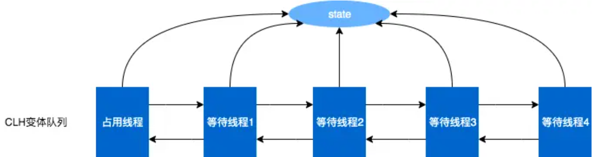
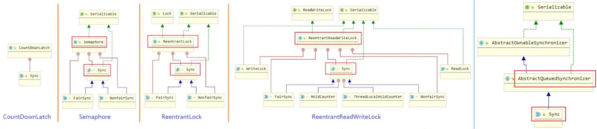

### 到处都有问这个的

#### AQS的原理是什么？

AQS（QueuedSynchronizer）是一个用于构建锁和同步容器的框架。它使用一个 int 成员变量表示同步状态，通过内置的 FIFO 队列来完成获取资源线程的排队工作。AQS 使用**CAS**对该同步状态进行原子操作实现对其值的修改。

AQS 内部维护了一个 CLH 队列来管理锁。当线程获取同步状态失败（锁）时，AQS 会将当前线程以及等待状态等信息构造成一个节点并将其加入同步队列，同时会阻塞当前线程。当同步状态释放时，则会把节点中的线程唤醒，使其再次尝试获取同步状态。

AQS定义了两种资源共享方式：独占锁和共享锁。独占锁是在同一时刻只有一个线程能获取到锁，如 ReentrantLock 采用独占模式。共享锁允许多个线程同时获取锁，多个线程可同时执行，如 Semaphore、CountDownLatch 等。

在 AQS 中，节点的状态不再仅仅是简单的布尔值，而是有更复杂的定义。并且，AQS 中的队列是双向链表，通过 Head、Tail 头尾两个节点来组成队列结构，通过 volatile 修饰保证可见性。Head 节点为已获取锁的节点，是一个虚拟节点，节点本身不持有具体的线程对象。获取不到同步状态，会将节点进行自旋获取锁，自旋一定次数失败后会将线程阻塞，相对于 CLH 队列性能较好。

这里的状态state在具体实现类中各有不同。比如：
Semapore中，表示剩余许可证的数量。
CountDownLatch中，表示还需要倒数的数量。
ReentrantLock中，表示锁的占有情况。

总结下来，AQS是基于 CLH 队列，使用volatile修饰共享变量state，线程通过CAS方式去改变state状态值，如果成功则获取锁成功，失败则进入等待队列，等待被唤醒的线程同步器框架。