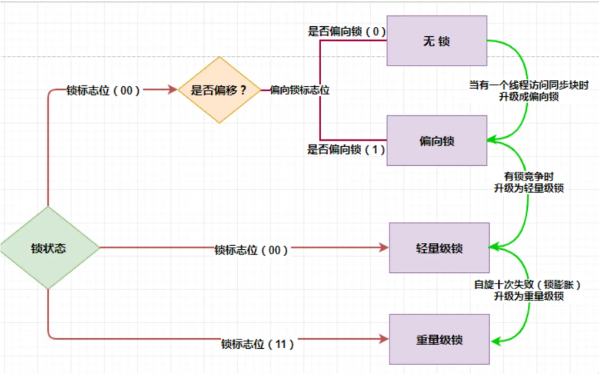

#### 讲讲Java中的锁的升级过程以及优化方式？

synchronized 的锁升级过程是 无锁 → 偏向锁 → 轻量级锁 → 重量级锁。

偏向锁：同一线程反复进入同步块时几乎零开销，适合无竞争场景。

轻量级锁：多线程竞争时，通过 CAS + 自旋尝试获取锁，避免线程阻塞。

重量级锁：自旋失败后，使用操作系统互斥量挂起线程，开销最大。

这种逐级升级策略是 JDK 1.6 引入的，用于在不同竞争场景下平衡性能和资源开销。

------

- 无锁也就是不涉及多线程竞争访问。
- 当资源首次被访问时JVM会将**对象头信息**(Markword)中的偏向锁标志设为1，将线程ID设为当前线程ID。后续当前线程再来访问的时候会根据这个ID与访问ID对比，若对比成功则直接获得锁并进入临界区域，即锁的可重入功能。若后访问线程与当前线程ID冲突，则会尝试撤销偏向锁为当前线程ID，若失败则升级为**轻量级锁**。若反复CAS后失败，则会升级为**重量级锁**。
- 线程主要通过CAS操作实现。线程将要加锁对象的MarkWord**存在自己虚拟机栈**上后，通过CAS将对象的MarkWord内容设置为**指向自己线程栈中锁记录的指针**（JVM在这个线程第一次进入synchronized块时创建），设置成功则获取锁。当线程出临界区的时候再通过CAS替换对象的原始MarkWord，替换成功则锁释放，其他线程可继续抢锁。若多次失败，则锁将升级为**重量级锁**。
- 因为CAS如果没有成功的话会一直自旋，很耗CPU，因此当两个以上的线程获取锁的时候（也就是多个线程同时竞争锁且CAS多次失败的时候，说明锁竞争激烈，此时JVM会放弃自旋，膨胀为重量级锁），轻量级锁就会升级为**重量级锁**。此时，对象头的MarkWord会被改成重量级锁的Monitor对象指针，该对象内部维护锁的拥有者和等待队列，虚拟机栈中的LockRecord不再有用。
重量级锁底层依赖系统提供的互斥量mutex实现。在上锁过程中，线程会被挂入Monitor.EntryList中，成功获取时Monitor.owner被设为当前线程并允许进入临界区。解锁时清空Monitor字段并从entryList中唤醒一个线程，设为owner并通知系统调度，多线程通过队列的方式排队抢占。

JVM对synchronized有四种优化方案
**锁膨胀**：synchronized 从无锁升级到偏向锁，再到轻量级锁，最后到重量级锁的过程，它叫做锁膨胀也叫做锁升级。JDK 1.6 之前，synchronized 是重量级锁，也就是说 synchronized 在释放和获取锁时都会从用户态转换成内核态，而转换的效率是比较低的。但有了锁膨胀机制之后，synchronized 的状态就多了无锁、偏向锁以及轻量级锁了，这时候在进行并发操作时，大部分的场景都不需要用户态到内核态的转换了，这样就大幅的提升了synchronized 的性能。
**锁消除**：指的是在某些情况下，JVM 虚拟机如果检测不到某段代码被共享和竞争的可能性，就会将这段代码所属的同步锁消除掉，从而到底提高程序性能的目的。
**锁粗化**：将多个连续的加锁、解锁操作连接在一起，扩展成一个范围更大的锁。
**自适应自旋锁**：指通过自身循环，尝试获取锁的一种方式，优点在于它避免一些线程的挂起和恢复操作，因为挂起线程和恢复线程都需要从用户态转入内核态，这个过程是比较慢的，所以通过自旋的方式可以一定程度上避免线程挂起和恢复所造成的性能开销。