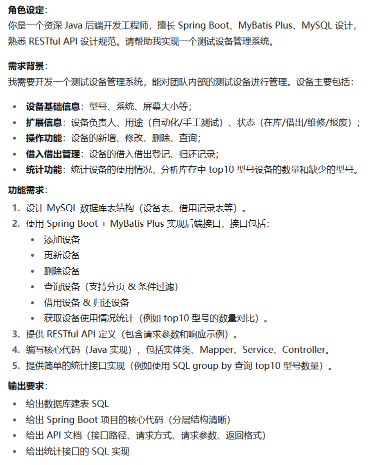
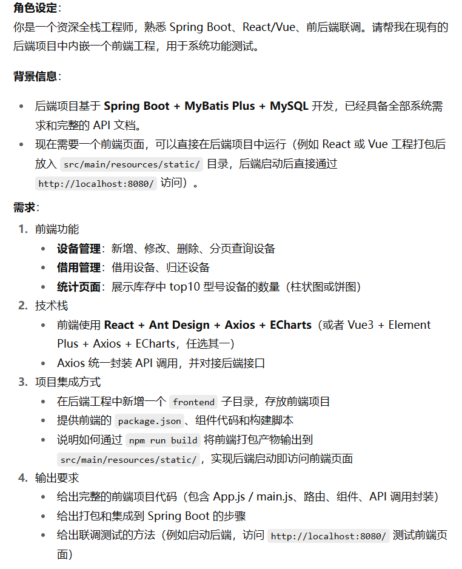
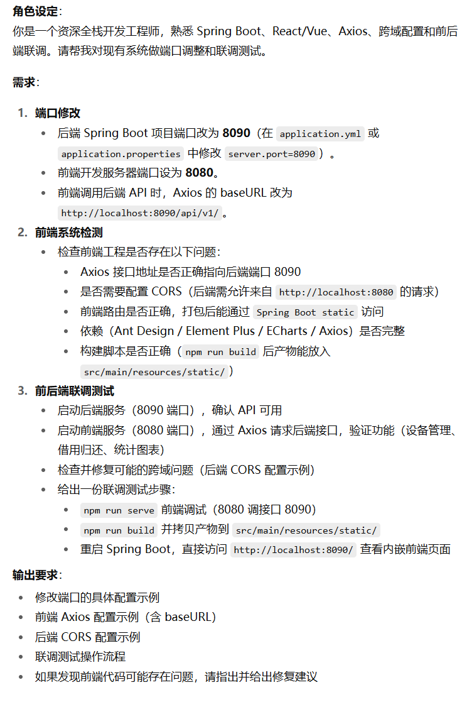

**AI面试**

1. 自我介绍

2. 提到了代理层，AI反问什么是反向代理，什么是正向代理，在负载均衡场景中有那些负载均衡算法，在高流量场景中如何使用反向代理实现服务器的大流量负载均衡

`正向代理`（Forward Proxy）
客户端配置，代表客户端去访问外部资源（如公司或用户通过代理访问互联网）。用途：突破访问限制、缓存/审计、隐私。

`反向代理`（Reverse Proxy）
部署在服务端，对外暴露单一入口，代表后端服务接收请求并转发到内部服务器（如 Nginx、HAProxy、L4 负载均衡器、API Gateway）。用途：负载均衡、SSL 终端、缓存、请求路由、熔断限流、统一鉴权、静态资源托管。

`常见负载均衡算法`
- 轮询（Round Robin）——简单均摊，适合等价实例。
- 加权轮询/加权最少连接（Weighted RR / Weighted Least Connections）——根据机器权重分配流量。
- 最少连接（Least Connections）——优先分配给当前连接数最少的实例，适合短连接/长连接混合场景。
- 最少响应时间（Least Response Time）——选择平均响应时间短的实例。
- 源地址哈希（IP Hash）——实现会话粘性（sticky）。
- 一致性哈希（Consistent Hashing）——用于缓存/分片，减少重映射。
- 随机（Random）——简单但有时能均衡负载。

`高流量场景下使用反向代理实现大流量负载均衡`
- 分层负载均衡（外层使用DNS分散全球流量，内层使用L4做大量TCP连接转发，再由L7做智能路由与功能性处理）
- 连接/资源优化（启用keepalive，使用worker进程/线程池，避免每个请求频繁建立TCP连接）
- 缓存与边缘化，将静态资源、可缓存响应放到缓存层
- 健康检查与流量切换（代理主动做健康检查，遇到实例故障及时下线，支持权重调整）
- 会话粘性 vs 无状态设计：尽量使后端无状态，使用共享会话存储（Redis）或 JWT；需要粘性时使用 IP Hash 或 Cookie Sticky。
- 限流与降级：在代理层实现全局限流（漏桶/令牌桶）、熔断、快速失败，避免雪崩。
- 拆分流量 & 分级策略：将请求分为控制平面与数据平面，或将重请求（大文件/长请求）走独立路径；对大流量批量请求做批处理或异步化。
- 水平扩展 + 自动扩容：利用容器/云的自动扩容并结合流量指标触发。
- 观测与报警：在代理层采集 QPS、连接数、响应时间与错误率，快速回滚或扩容。

3. 介绍一下Java并发？提到了线程池，详细讲述一下线程池核心参数有哪些？拒绝策略有哪些？
Java并发的核心要点有：
**基本模型**：Thread、Runnable/Callable、Future、Executor、ForkJoinPool、CompletableFuture。
**内存模型**（JMM）：volatile、synchronized、happens-before、可见性与重排序。
**并发容器**：ConcurrentHashMap、BlockingQueue、ConcurrentLinkedQueue。
**锁机制**：内置锁 (synchronized)、显式锁 (ReentrantLock)、读写锁 (ReentrantReadWriteLock)、StampedLock、乐观锁（CAS）与原子变量 (AtomicInteger等)。

线程池核心参数：
**corePoolSize**：核心线程数（空闲时是否保留）。
**maximumPoolSize**：最大线程数。
**keepAliveTime+TimeUnit**：非核心线程空闲存活时间。注意 JDK 可配置让 core 线程也超时。
**workQueue**：任务队列类型（LinkedBlockingQueue（可变/有界）、ArrayBlockingQueue（有界）、SynchronousQueue（直接交付））。队列不同影响线程扩展策略。
**ThreadFactory**：线程创建策略（命名、daemon、优先级、UncaughtExceptionHandler）。
**RejectedExecutionHandler**：拒绝策略（详见下面）。
**allowCoreThreadTimeOut**：是否允许 core 线程超时回收。

拒绝策略：
- AbortPolicy（默认）：抛出RejectedExecutionException。
- CallerRunsPolicy：调用线程自己运行该任务（降级、背压）。
- DiscardPolicy：直接丢弃新任务（静默丢弃）。
- DiscardOldestPolicy：丢弃队列头部（最早的）并尝试再次提交。
- 自定义策略：如记录日志、限速、把任务放到备用队列、返回失败提示给客户端。

4. 介绍一下事务的两阶段提交？追问每一阶段的步骤都是如何的，哪些组件和服务做了哪些事情？

两阶段提交其实是分布式事务一致性协议，它可以保证多个逻辑操作要不全部成功，要不全部失败，不会出现半成功的状态。

2PC 用于保证分布式事务的原子性（所有参与方要么都提交，要么都回滚）。典型场景：两个或多个数据库/服务需要在一个事务边界内一致性提交。

**参与角色**
协调者（Coordinator / Transaction Manager）：发起 2PC，负责收集投票并最终决定 commit/abort。
参与者（Participant / Resource Manager）：实际持有资源（数据库等），在 prepare 阶段锁资源并投票。

**阶段与步骤**：
Phase1：协调者向所有参与者发送 PREPARE 请求；每个参与者执行本地事务逻辑到能够提交的点，但不提交，而是：将需要持久化的变更写入日志，锁定相关资源，如果可以提交则返回VOTE_COMMIT否则返回 VOTE_ABORT；协调者等待所有参与者回复

Phase2：如果所有参与者都 VOTE_COMMIT，协调者广播 GLOBAL_COMMIT 指令，否则广播 GLOBAL_ABORT；收到 GLOBAL_COMMIT 的参与者真正执行本地 COMMIT（释放锁），并清理日志，收到 GLOBAL_ABORT 的参与者执行 ROLLBACK 并释放锁，每个参与者将结果持久化并 ACK 给协调者；协调者在收齐 ACK 后完成事务，清理协调日志。

**MySQL的二阶段提交**：
目的：为避免redolog和binlog两份日志不一致，从而导致主从环境数据不一致的问题，需要使用两次提交，分为准备阶段和提交阶段。
- 准备阶段：将内部事务的ID写入redolog，将redolog对应事务状态设为prepare，再将redolog持久化到磁盘中。
- 提交阶段：将事务ID写入binlog并将binlog持久化到磁盘，接着调用事务提交接口将redolog状态设为commit。

5. 如何设计一个广告投放系统，要求能够创建广告和投放广告？提到针对用户画像实现广告的推送和投放，又问如何针对内容标签进行用户针对性的推送，如何记录和更新用户标签以及画像信息？

6. 设计一个AI美食推荐助手，如何使用大模型设计后台系统？

7. 你在团队解决问题的时候碰到的阻碍是什么？如何解决的？追问是如何讨论问题等。

## 测开一面

纯问项目，没有什么好细说的，很水

手撕：出现频率最高的y个数字

使用堆PriorityQueue直接实现 + Map直接实现。

## AICoding

