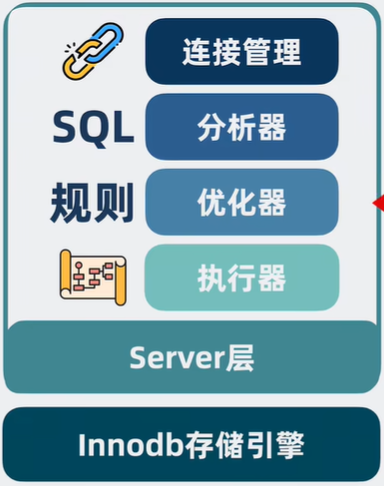
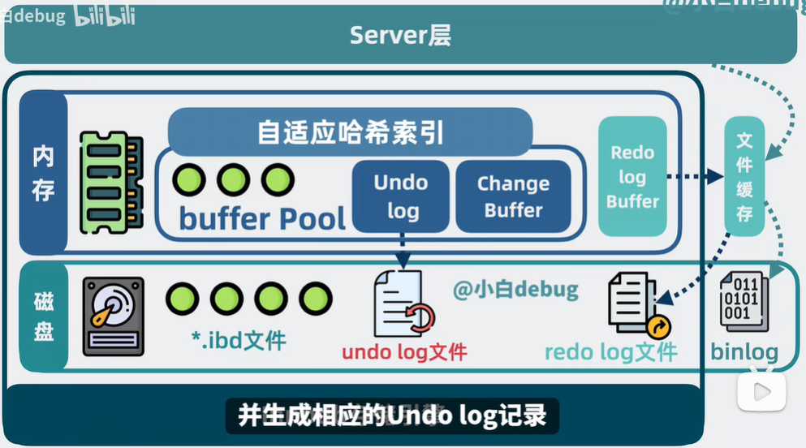
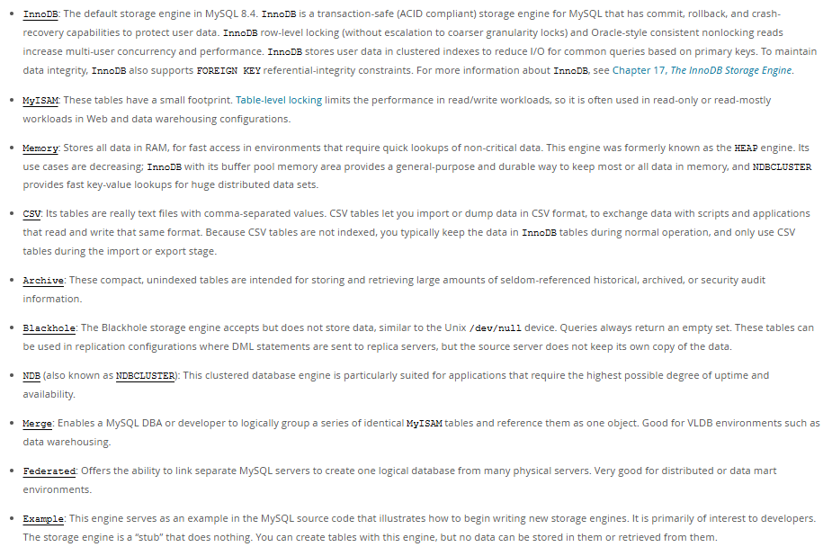
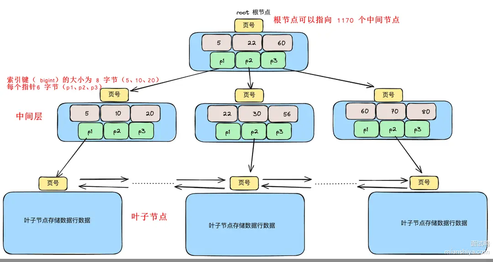
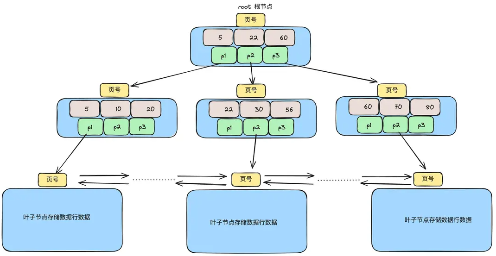
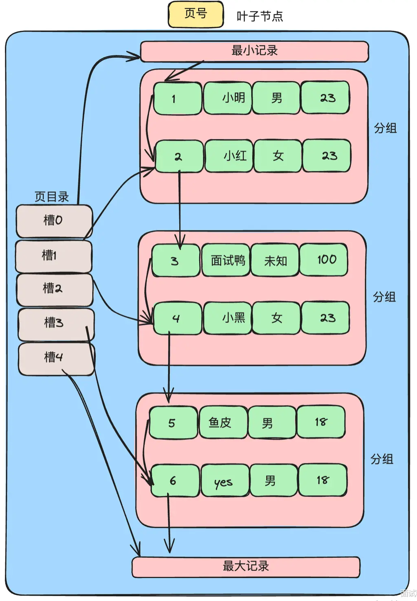

## MySQL学习总结

### Mysql框架

学习资料：https://relph1119.github.io/mysql-learning-notes/#/

### 知识点总结
#### Questions：
MySQL InnoDB 引擎中的聚簇索引和非聚簇索引有什么区别? **引擎，索引**

MySQL 的存储引擎有哪些？它们之间有什么区别？**引擎**

MySQL 的索引类型有哪些？ **索引**

MySQL 三层 B+ 树能存多少数据？ **引擎**

MySQL 索引的最左前缀匹配原则是什么？**索引**

为什么 MySQL 选择使用 B+ 树作为索引结构？**索引**

MySQL 中的回表是什么？**索引**

MySQL 中使用索引一定有效吗？如何排查索引效果？ **索引**

MySQL 在 MySQL 中建索引时需要注意哪些事项？**索引**

MySQL 中的索引数量是否越多越好？为什么？**索引**

如何使用 MySQL 的 EXPLAIN 语句进行查询分析？**细节**

MySQL 中如何进行 SQL 调优？**细节**

请详细描述 MySQL 的 B+ 树中查询数据的全过程 **细节**

MySQL 中 count(*)、count(1) 和 count(字段名) 有什么区别？**细节**

MySQL 中 varchar 和 char 有什么区别？**细节**

MySQL 是如何实现事务的？**事务**

MySQL 中的 MVCC 是什么？**事务**

MySQL 中的日志类型有哪些？binlog、redo log 和 undo log 的作用和区别是什么？**日志**

MySQL 中的事务隔离级别有哪些？**事务**

MySQL 默认的事务隔离级别是什么？为什么选择这个级别？**事务**

数据库的脏读、不可重复读和幻读分别是什么？**原理**

MySQL 中有哪些锁类型？**锁**

MySQL 事务的二阶段提交是什么？**锁**

MySQL 中如果发生死锁应该如何解决？**锁**

MySQL 中如何解决深度分页的问题？**并发**

什么是 MySQL 的主从同步机制？它是如何实现的？**并发**

如何处理 MySQL 的主从同步延迟？**并发**

——————————————————————————————————————

#### Points：
基于上面这些问题，大概能把MySQL分成以下几个内容要点：原理、引擎、索引、事务、日志、锁、并发控制，基于这些问题，我将说出对这些要点的总结与理解。

##### **存储引擎**
首先是引擎部分，MySQL中共提供了10个引擎（8.4版本），官网对它们的介绍是这样的：

其中最常见的有三大处理引擎，分别为 **InnoDB**，**MyISAM**，**MEMORY** 。

**InnoDB**：由Innobase Oy公司开发，2006年被甲骨文公司收购。它支持事务、行级锁（防止多个事务同时操作同一行数据）和外键（两表之间的关联约束）；它提供了高并发的性能，适用于高负载的OLTP应用（online transaction processing联机事务处理，特点是数据的频繁插入更新和查询）;数据以聚集索引的方式存储，提高检索效率。是基于B+树的存储引擎。

**MyISAM**：MySQL的默认数据库引擎（5.5版本之前）。不支持事务和外键，使用表级锁（防止多个事务同时操作同一张表的数据）；适合读取多、更新少的场景，如数据仓库；具有较高的读性能和较快的表级锁定。是基于B+树的存储引擎。

**MEMORY**：将数据存储在内存中，速度快，但数据会在服务器重启后丢失。

**NDB**：支持高可用性和数据分布，适合大规模分布式应用，提供行级锁和自动分区。

**ARCHIVE**：用于存储大量历史数据，支持高效插入和压缩，不支持索引，适合日志数据存储。

其中InnoDB的适用场景为 事务处理系统（如银行转账、电商订单处理等），高并发读写应用（在线票务预定、社交媒体平台等），数据可靠性要求高的适用场景（企业核心业务数据如客户信息财务数据等，因为可以利用redolog和undolog在系统故障后快速恢复数据）。

而MyISAM的适用场景则为 读密集型应用（新闻网站、博客系统），数据仓库和数据分析系统，嵌入式系统和移动应用（资源受限）。

##### **索引**

存储引擎负责数据的存储和管理方式，而索引则是能加速数据查询和检索的数据结构，其实现方式和性能可能会因为存储引擎不同而存在差异。

从**数据结构**的角度看，索引可分为：B+树索引、哈希索引、倒排索引 (Full text)、R-树索引 (多维空间树)、位图索引 (Bitmap)。
从**物理存储**的角度看，索引可分为：聚簇索引、非聚簇索引。
从**字段特性**的角度看，索引可分为：主键索引、唯一索引、普通索引（二级索引、辅助索引）和前缀索引。  
从**字段个数**的角度看，索引可分为：单列索引、联合索引。

让我们进一步分析基于数据结构的索引分类
**B+树索引** 通过树形结构存储数据,适用于范围查询(如BETWEEN)和精确查询(如=),支持有序数据的快速查找、排序和聚合操作。是MySQL默认的索引类型,常用于InnoDB和MyISAM引擎。
**哈希索引** 基于哈希表的结构,适用于等值查询(如=),查询速度非常快,但不支持范围查询(如>、<)。哈希索引不存储数据的顺序,常用于Memory引擎。
**倒排索引**(Full-Text) 用于全文搜索,将全文分词,通过存储词与文档的映射,支持模糊匹配和关键字搜索。特别适合用于大文本字段,如TEXT类型的列,用于查找包含特定词语的记录。
**R-树索引** 专为多维空间数据(如地理坐标)设计,适用于空间查询(例如,计算地理位置的最近距离、区域查询等)。常用于存储和查询地理信息系统(GIS)中的空间数据。

进一步分析基于InnoDB B+树索引分类
**聚簇索引** InnoDB中主键索引就是聚簇索引。它基于主键排序存储。之所以叫聚簇索引是因为索引的叶子节点存储完整数据行数据。
**非聚簇索引** 指的是InnoDB中非主健索引的索引,之所以称之为非聚簇是因为这个索引的叶子节点仅保存索引字段和主键的值。如果要查询完整的数据行中的数据,需要再从聚簇索引即主键索引中通过主键建查询,一个表可以有多个非聚簇索引。

进一步分析基于索引性质的分类
**普通索引** 一般指非主键索引且非唯一索引。
**主键索引** 表中的每一行数据都有唯一的主键。每个表只能有一个主键索引,且主键值不能为NULL。InnoDB中主键索引是聚簇索引结构实现的。
**联合索引** 由多个列组成的索引,适用于多列的查询条件,能够多提高包含多个条件的查询的性能。联合索引中的列是按照指定顾序排列的。
**唯一索引** 保证索引列中的值是唯一的,可以有效防止重复数据偶的插入。唯一索引允许NULL值,但一个列中可以有多个NULL1.
全文索引:用于全文搜索,支持对长文本字段(如TEXT类型)进行关键字查找,支持自然语言处理、模糊匹配等操作。适用于于需要对文本内容进行复杂搜索的场景。
**空间索引** 用于空间数据(如地图上的经纬度坐标等)查询。过通常使用R-树结构,适合多维数据的查询,如区域查询和最近距离查询,主要用于MyISAM和InnoDB存储引擎中的地理信息数据。

将其中`聚簇索引`和`非聚簇索引`单拎出来说，核心就是每个表只有一个聚簇索引且叶子节点存储的是完整的数据行，而非聚簇索引可以有多个且需要通过主键才能查询到完整的数据行，他们也都是通过B+树实现的。

让我们再深入理解一下mysql索引的使用。

表数据存储的过程中会按照主键顺序存储在磁盘上，行的物理顺序与主键逻辑顺序相同，因此聚簇索引会非常快，主键查询的效率也因此较高。若需要使用非聚簇索引查询所有数据，则需要通过`回表`，即先查到叶子节点的主键值，再利用主键查询到完整的数据行，其效率也就低于直接查询。

如果回表的使用已经是无法避免了，那就需优化索引结构、添加相应索引以及优化sql语句，减少回表次数才能提升查询的獒率，这我们就需要依`赖覆盖索`引、`索引下推`等技术了。

`索引覆盖`也就是在索引中就包含了我们需要查询的数据列,比如我想查询column2,此时有一个索引记录(column1,column2),那我们通过索引column1进行查询select column2 from table where column1='test',,这种情况就不需要回表进行查询了。

`索引下推`：因为存储引擎只能根据素引列的值来定位到对应的主键值,然后回表获取完整的记录行。如果查询条件中还有其他未在索引中使用的筛选条件,那么这些条件只能在回表获取完整行之后在服务器层进行判断。这就导致了很多不满足条件的记录也进行了回表操作,增加了回表的次数。索引下推则能在索引扫描的过程中将部分查询条件下推到索引层面（存储引擎层过滤）进行处理，即通过联合索引进行一次数据的过滤。

那么为什么MySQL选择使用B+树作为索引结构呢

首先，B+树有着`高效的查找性能`:
B+树是一种自平衡树,每个叶子节点到根节点的路径长度相同,B+树在插入和删除节点时会进行分裂和合并操作,以保持树的平衡,但它又会有一定的冗余节点,使得删除的时候树结构的变化小,更高效。查找、插入、删除等操作的时间复杂度为O(logn),能够保证在大数据量情况下也能有较快的响应时间。
其次，树的高度增长不会过快,使得查询`磁盘的1/0次数减少`:
B+树不像红黑树,数据越多树的高度增长就越快。它是多叉树,非叶子节点仅保存主键或素引值和页面指针,使得每一页能容纳更多的记录,因此内存中就能存放更多索引,容易命中缓存,使得查询磁盛的1/0次数减少。
最后`范围查询能力强`:
B+树特别适合范围查询。因为叶子节点通过链表链接,从根节点定位到叶子节点查找到范围的起点之后,只需要顺序扫描链表即可遍历后续的数据,非常高效。

MySQL索引的还有着`最左前缀匹配原则`。由于联合索引在B+树中的排列方式遵循着从左到右的顺序，组合索引能够从左到右依次高效匹配，跳过最左侧字段会导致无法使用索引。因此，在使用联合索引时，查询条件必须从索引的最左侧开始匹配，如果索引包含多个列，查询条件必须包含第一个列的条件，然后是第二个列。

接下来举一个实际一些的例子，从存储空间角度来看看B+树的存储形式

首先我们假设每个节点页的大小为`16kb`，每个数据记录的主键和数据大小为`1kb`，指针`6字节`，索引键`8字节`。
这样，每个中间节点可以指向 `16kb×1024÷(6+8)=1170` 个叶子节点。因此，如果B+树有两层则共有 `1170×16` 条记录，三层则有 `1170×1170×16` 条数据记录。

那么在MySQL中如何使用索引呢，又有什么要注意的呢？

1、首先不能盲目的建立索引,索引`并不是越多越好`,索引会占用空间,且每次修改的时可能都需要维护索引的数据,消耗资源。
2、对于字段的值有`大量重复`的不要建立索引。比如说:性别字段,在这种重复比例很大的数据行中,建立索引也不能提高检索速度。但是也不绝对,例如定时任务的场景,大部分任务都是成功,少部分任务状态是失败的,这时候通过失败状态去查询任务,实际上能过滤大部分成功的任务,效率还是可以的。
3、对于一些`长字段`不应该建立索引。比如text、longtext这种类型字不应该建立索引。因为占据的内存大,扫描的时候大量加载至内存中还耗时,使得提升的性能可能不明显,甚至可能还会降低整体的性能,因为别的缓存数据可能因为它被踢出内存,下次查询还需要从磁盘中获取。
4、当数据表的`修改频率远大于查询频率`时,应该好好考虑是否需要要建立索引。因为建立索引会减慢修改的效率,如果很少的查询较多的修改,则得不偿失。
5、对于需要`频繁作为条件查询`的字段`应该`建立索引。在where关键词后经常查询的字段,建立索引能提高查询的效率,如果有多个条件经
常一起查询,则可以考虑联合索引,减少索引数量。
6、对`经常在orderby、groupby、distinct后面的字段`建立索引。这些些操作通常需要对结果进行排序、分组或者去重,而索引可以帮助加快这些操作的速度。

当然在mysql中也存在着索引失效或者性能效果不佳的情况，可以通过EXPLAIN排查索引的效果。

最终是否用上索引是根据MySQL成本计算决定的,评估CPU和I/O成本最终选择用辅助索引还是全表扫描。有时候确实是全表扫描成本低所以没用上索引。但有时候由于一些统计数据的不准确,导致成本计算误判,而没用上索引。典型场景如下所示：

**1、使用了联合索引却不符合最左前缀**
对user表建立了一个联合索引为name_age_id的联合合索引，使用以下SQL查询
select * from user where age = 10 and id = 1;
这样的写法恰恰不满足最左前缀原则,索引就失效了。

**2、索引中使用了运算**
例如这个SQL select * from user where id+3=8。这样会导致全表扫描计算id的值再进行比较,使得索引失效。

**3、索引上使用了函数也会失效**
例如:select * from user where LOWER(name) like 'cong%;。这样也会导致索引失效,索引参与了函数处理,会导致去全表扫描。

**4、like的随意使用**
例如:select * from user where name like '%cong%';因为索引是从左到右来进行排序查找的,占位符直接放在了最左边开头,可能会导致直接全表扫描,这种情况就会导致索引失效。

**5、or的随意使用**
user当前只有一个索引 name
此时执行以下SQL:
select * from user where name= 'cong' or age = 18; 
这可能也会导致索引失效,因为age没有索引。

**6、随意的字段类型使用**
不小心将varchar类型的name条件匹配了int类型字段。SQL：
select * from user where name=1;
在代码中涉及隐式转换!等于 select * from user where CAST(name AS signed int)=1; 这就变成了第三条索引上使用了函数,导致索引失效。
除此之外还有隐式字符编码转换的问题,即联表查询的时候,如果不同表之间的关联字段字符编码不一致,也会导致隐式转换编码,等于变相用上了函数,使得索引失效。

**7、不同的参数也会导致索引失效**
这个就是"是否用上索引是根据MySQL成本计算决定的"。不同的参数MySQL评估成本不一致,有时候会选择使用索引,有时候会选择全表扫描,特别是在复杂查询(联表、子查询、需要回表等)的情况下。
比如根据商品从订单表查询,收集商品对应的所有买家的订单单信息。如果传入的商品id是个热点商品,占据这家店铺80%的销量,那么本次查询对订单表很可能是全表查询,如果是冷门商品,则很可可能是走索引查询。

**8、表中两个不同字段进行比较**
例如这样的SQL:select * from user where id>age;,将 id 跟 age字段做了比较,索引失效。
 
**9、使用了order by**
orderby后面跟的不是主键或者不是覆盖索引会导致不走索引。

索引也并不是越多越好。因为索引不论从时间还是空间上都是有一定成本的。

**从时间上**每次对表中的数据进行增删改(INSERT、UPDATE或DELETE)的时候,索引也必须被更新,这会增加写入操作的开销。例如删除了一个name记录,不仅主键索引上需要修改,如果name字段有索引,那么name索引也需要修改,所以索引越多需要修改的地方也就越多,时间开销就大了,并且B+树可能会有页分裂、合并等操作,时间开销就会更大。

还有一点需要注意:MySQL有个查询优化器,它需要分析当前的查询,选择最优的计划,这过程就需要考虑选择哪个索引的查询成本低。如果索引过多,那么会导致优化器耗费更多的时间在选择上,甚至至可能因为数据的不准确而选择了次优的索引。

**从空间上**每建立一个二级索引,都需要新建一个B+树,默认每个数据页都是16kb,如果数据量很大,索引又很多,占用的空间可不小。

那么，如何查看查询对索引的使用呢？

对于索引使用的查看，我们可以通过在查询前添加`EXPLAIN`命令可以查看MySQL选择的执行计划，了解是否使用索引，使用了哪个索引以及估算的行数等信息。

主要观察EXPLAIN结果以下几点:
`type`(访问类型):这个属性显示了查询使用的访问方法,例如ALL、index、range等。当查询使用索引时,这个属性通常会显示为index或range,表示查询使用了索引访问。如果这个值是ALL,则表示查询执行了全表扫描,没有使用索引。
`key`(使用的索引):这个属性显示了查询使用的索引,如果查询使用了索引,则会显示素引的名称。如果这个值是NULL,则表示查询没有使用索引。
`rows`(扫描的行数):这个属性显示了查询扫描的行数,需要评估下扫描量。

##### **细节**

上面简单探讨了存储引擎和索引的一些问题，下面对其中一些零碎的小细节进行探讨吧

比如explain做SQL分析时，有如下些主要属性：
`id`:查询的执行顺序的标识符,值越大优先级越高。简单查询的id通常为1,复杂查询(如包含子查询或UNION)的id会有多个。
`select_type`(重要):查询的类型,如SIMPLE(简单查询)、PRIMAARY(主查询)、SUBQUERY(子查询)等
table:查询的数据表。
`type`(重要):访问类型,如ALL(全表扫描)、index(索引扫描)、range(范围扫描)等。一般来说,性能从好到差的顺序是:const > eq_ref > ref > range > index > ALL。
`possible_keys`:可能用到的索引。
`key`(重要):实际用到的索引。
`key_len`:用到索引的长度。
`ref`:显示索引的哪一列被使用。
`rows`(重要):估计要扫描的行数,值越小越好。
`filtered`:显示查询条件过滤掉的行的百分比。一个高百分比表表示查询条件的选择性好。
`Extra`(重要):额外信息,如Using index(表示使用覆盖索引)、Using where(表示使用WHERE条件进行过滤)、Using temporary(表示使用临时表)、Using filesort(表示需要额外的排序步骤)。

其中`type`属性的详解如下：
`system`:表示查询的表只有一行(系统表)。这是一个特殊的情况,不常见1.
`const`:表示查询的表最多只有一行匹配结果。这通常发生在查询条件是主键或唯一索引,并且是常量比较
`eq_ref`:表示对于每个来自前一张表的行,MySQL仅访问一次这个表。这通常发生在连接查询中使用主键或唯一索引的情况下。
`ref`:MySQL使用非唯一索引扫描来查找行。查询条件使用的索引是是非唯一的(如普通索引)。
`range`:表示MySQL会扫描表的一部分,而不是全部行。范围扫描通第出现在使用索引的范围查询中(如
BETWEEN、>, <'>=,<=)。
`index`:表示MySQL扫描索引中的所有行,而不是表中的所有行。即使索引列的值覆盖查询,也需要扫描整个索引。
`all`(性能最差):表示MySQL需要扫描表中的所有行,即全表扫描,通常出现在没有索引的查询条件中。

B+树又是查询数据的呢？

首先，数据从根节点找起,根据比较数据健值与节点中存储的索引键值,确确定数据落在哪个区间,从而确定分支,从上到下最终定位到叶子节点。

定位到叶子节点后,因为一片叶子默认有16k大小,所以理论上可以存多条记录。叶子节点的实际构造如下图所示:

从上图可知,叶子节点有页目录结构,它其实就是一个索引,通过它可以快速找到记录。
页目录分为了多个槽,每个槽都指向对应一个分组内的最大记录,每个分组内都会包含若干条记录。
通过二分查询,利用槽就能直接定位到记录所在的组,从而就能获取到对应的记录。
若现在有5个槽,如果想查找主键为3的记录,此时的流程是:

1)通过二分得到槽的中间位置,`1ow=0`,`high=4`,`(0+4)/2=2`;
2)通过槽定位到第二个分组中的主键为4的记录,4大于3,`1ow=0`不变,`high=2`
3)继续二分`(0+2)/2=1`;槽1中主键2小于3,`1ow=1`,`high=2`
4)此时`high-1ow=1`,可以确定值在high即槽2中,但是槽2只能定位到主键为4的记录,又因为槽之间是挨着的,所以可以得到槽1的位置,从槽1入手拿到主键2的记录,然后因为记录是通过单向链表串起来的,往下遍历即可定位到主键3的记录。

以上就是利用二分查询的定位流程。通过槽可找到对应记录所在的组,或能直接定位到记录,或还需通过链表遍历找到对应的数居。
实际上,每个分组的记录数是有规定的,图中做了省略只画了两条,InncDB规定:
第一个分组只有一条记录;中间的分组4-8条记录;最后一个分组1-8条记录
因此不必担心遍历很长的链表导致性能问题。

那么mysql中的count(*),count(1)和count(字段名)又有什么区别呢？

从**功能**上看:
`count(*)`会统计表中所有行的数量,包括null值(不会忽略任何一行数据)。由于只是计算行数,不需要对具体的列进行处理,因count(*)此性能通常较高。
`count(1)`和`count(*)`几乎没差别,也会统计表中所有行的数量,包括null值。
`count(字段名)`会统计指定字段不为null的行数。这种写法会对指定的字段进行计数,只会统计字段值不为null的行。

从**效率**上看：
官网上说`count(1)`和`count(*)`效率是一致的。
`count(字段)`的查询就是全表扫描(如果对应的字段没有索引,如果有索引则用索引),正常情况下它还需要判断字段是否是否是null值,因慢。此理论上会比 `count(1)`和`count(*)`慢。
但是如果字段不为null,例如是主键,那么理论上也差不多,而且本质上它们的统计功能不一样,在需要统计null的时候,只能用`count(1)`和`count(*)`,不需要统计null的时候只能用count(字段段),所以也不用太纠结性能问题。

mysql中的varchar和char又有什么区别呢？

##### **事务**

什么是事务呢？

事务其实是一种逻辑单元，它包含了一组操作，这些操作要么全部成功，要么全部失败。
事务的四个特性，也就是`ACID`特性，即
**原子性**（Atomicity，事务中的所有操作要么全部成功，要么全部失败回滚。如果事务中的某个操作失败，整个事务会被撤销，就好像整个事务从未执行过一样）
**一致性**（Consistency，事务在执行前后，数据库必须从一个合法的状态转换到另一个合法的状态。这意味着事务不能违反数据库中定义的任何完整性约束）
**隔离性**（Isolation，多个事务并发执行时，它们之间相互隔离，一个事务的执行不能被其他事务干扰。每个事务都感觉不到系统中有其他事务在并发地执行）
**持久性**（Durability，一旦事务成功提交，其对数据库所做的更改就会永久保存，即使系统出现故障也不会丢失）。

那么，mysql又是如何实现事务的呢？

MySQL主要是通过:**锁**、**RedoLog**、**UndoLog**、**MVCC**来实现事务。

MySQL利用**锁**(行锁、间隙锁等等)机制,使用数据并发修改的控制,满足事务的隔离性。

**RedoLog**(重做日志),它会记录事务对数据库的所有修改,当MySCQL发生宕机或崩溃时,通过重放redolog就可以恢复数据,用来满足事务的持久性。

**UndoLog**(回滚日志),它会记录事务的反向操作,简单地说就是保存数据的历史版本,用于事务的回滚,使得事务执行失败之后可以恢复之前的样子。实现原子性和隔离性。

**MVCC**(多版本并发控制),满足了非锁定读的需求,提高了并发度,实现了读已提交和可重复读两种隔离级别,实现了事务的隔离性。

看到这里，肯定会有MVCC到底为什么能满足多版本并发控制，它的机制是什么，这种疑问

`MVCC` (Multi-Version Concurrency Control,多版本并发控制)是一种并发控制机制,允许多个事务同时读取和写入数据库,而无需互相等待,从而提高数据库的并发性能。

在MVCC中,数据库为每个事务创建一个数据快照。每当数据被修改时,MySQL不会立即覆盖原有数据,而是**生成新版本的记录**。每个记录都保留了对应的版本号或时间戳。
多版本之间串联起来就形成了一条版本链,这样不同时刻启动的事务可以无锁地获得不同版本的数据(普通读)。此时读(普通读)写操作不会阻塞。
写操作可以继续写,无非就是会创建新的数据版本(但只有在事务务提交后,新版本才会对其他事务可见。未提交的事务修改不会影响其他事务的读取),历史版本记录可供已经启动的事务读取。

既然事务是数据库的基本操作单元，那么在处理高并发操作时，不同单元之间是如何分割/隔离的呢？事务的状态又有哪些呢？

**1. 读未提交(READ UNCOMMITTED):**
这是最低的隔离级别,在该级别下,一个事务可以看到另一个个事务尚未提交的数据修改。这可能会导致**脏读**问题,即读取到其他事务未提交的数据。
**2. 读已提交(READ COMMITTED):**
在这个级别下,一个事务只能看到已经提交的其他事务所做的的修改。这可以避免脏读问题,但是可能会引发**不可重复读**问题,即在同一个事务中,相同的查询可能返回不同的结果。
**3.可重复读(REPEATABLE READ)**:
在这个级别下,确保在一个事务中的多个查询返回的结果是一致的。这可以避免不可重复读问题,但是可能会引发**幻读**问题,即在同一个事务中,多次查询可能返回不同数量的行(MySQL默认的隔离级别)。
**4. 串行化(SERIALIZABLE)**:
并发SQL事务在SERIALIZABLE隔离级别下的执行被保证是可串行元化的。可串行化执行被定义为:并发执行的SQL事务的操作,其效果与这些SQL事务按某种中顺序串行执行的效果相同。串行执行是指每个SQL事务在下一个SQL事务开始之前完成其全部操作来源SQL92定义这是最高的隔离级别,在这个级别下,保证事务间的操作结果相当于一个按顺序执行的单线程操作。这可以避免所有的并发问题,但是会**大大降低并发性能**。

一般互联网大厂会选择**读已提交**这个隔离级别。

接下来细说下脏读、不可重复读和幻读问题：

**1. 脏读(Dirty Read):**
一个事务读取到另一个事务未提交的数据。如果该未提交事务最终被回滚,那么第一个事务读取的数据就是不一致的(脏的)。# 也就是在进行读操作的时候有一个事务还没有提交事务，但读操作已经获取到了没提交的数据结果，因此若这个事务回滚或者其他操作，会导致读取数据不一致。
**2. 不可重复读(Non-repeatable Read):**
在同一事务中,读取同一数据两次,但由于其他事务的提交,读取的结果不同。例如,事务A读取了一行数据,事务B修改并提交了这行数据,导致事务A再次读取时得到不同的值。# 也就是
3)幻读(Phantom Read):
在同一事务中,执行相同的查询操作,返回的结果集由于其他事务的插入而发生变化。例如,事务
A查询符合某条件的记录,事务B插入了新记录并提交,导致事务A再次查询时看到不同的记录数
量。

——————————————————————————————————————

#### Answers：
