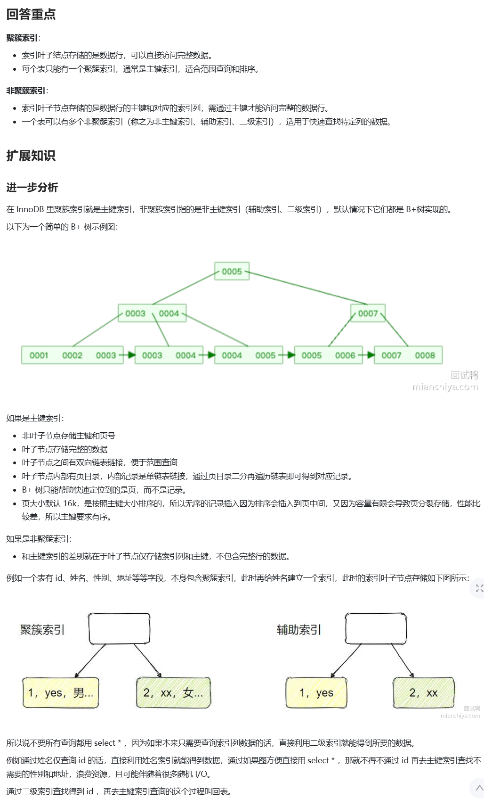
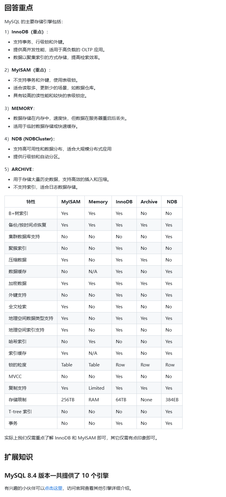
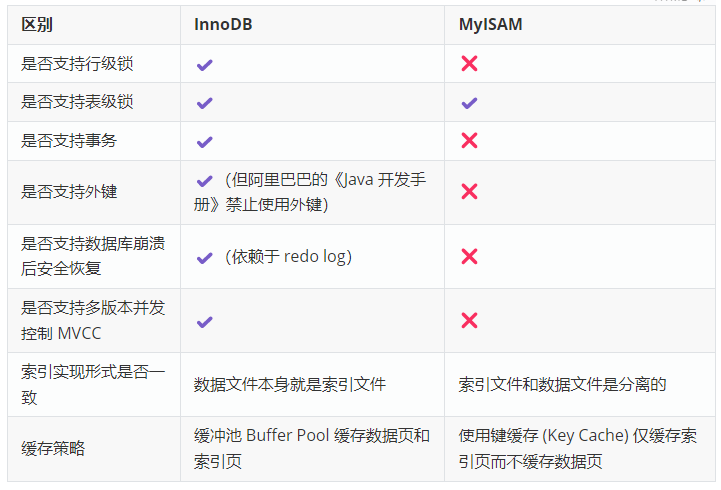
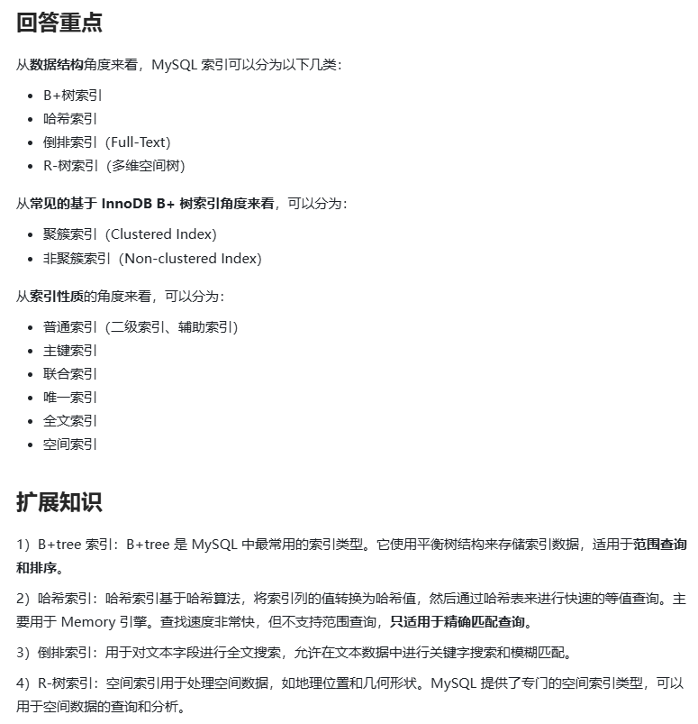

## Day1. mySql相关

#### 1、MySQL InnoDB 引擎中的聚簇索引和非聚簇索引有什么区别？

##### ## 思路整理：

聚簇索引中，叶子节点用于存储**索引值**，叶子节点则用来存储完整的**数据记录**。一个表只能有一个聚簇索引，一般为表的主键，用于范围查询和排序。

非聚簇索引中，非叶子节点也用于存储索引值，叶子节点则存储数据行的**主键**或对应的**索引列**，一个表可以有多个非聚簇索引（辅助、二级索引），主要用于快速定位查找的列。

##### ## 深入理解：
聚簇索引简单理解就是把索引和数据记录放在一起了,通过索引就可以直接找到数据行了,而非聚簇索
引,还需要通过回来找到相应的数据记录。

**Q:** 为什么聚簇索引查询速度快?

**A:** 在lnnoDB中，聚簇索引指的是按照每张表的主键构建的一种索引方式，它是将表数据按照主键
的顺序存储在磁盘上的一种方式。这种索引方式保证了行的物理理存储顺序与主键的逻辑顺序相同,因此查找聚簇索引的速度非常快。

**Q:** 没有创建主键怎么办?

**A: **其实数据库记录中除了我们自己定义的字段外，还会添加一些隐藏字段，比如dbrowid，如果我
们没有创建主键，会默认选择一个唯一索引作为聚簇索引，如果果唯一索引也没有，默认就选择隐藏主键db_row id作为聚簇索引。

**Q: ** 回表是什么意思?

**A:** 通常我们使用聚簇索就可以直接查找到数据记录，但是非聚簇索引由于它的叶子节点只存储主键
值和索引值，这种情况下我们使用非聚簇索引查询相应的数据记录，需要先查到对应的叶子节点的主键值,然后再用主键值进行一次查询才能获得我们需要的数据记己录,这个过程称为回表。

**Q:** 为什么主键查询效率快?

**A:** 从上面的回答可以看出，主键索引查询数据记录不需要回表，减少了查询步骤,相应也提升的查
询效率。

**Q:** 我们应该如何提升查询效率呢?

**A:** 前面我们说到回表会降低查询效率，所以我们应该通过优化索引结构，添加相应的索引以及优化
sql语句，减少回表的次数以提升查询的效率，同时我们也可以依赖覆盖索引、索引下推等技术。

**Q:** 既然你提到了索引下推，和索引覆盖，能否具体讲一下?

**A:** **索引覆盖**就是在索引中就包含了我们需要查询的数据据列，比如我想查询column2，此时有
个索引记录(column1,column2)，那我们通过索引column1进行查询 select column2 from
table where column1 = 'test'，上面的情况就是覆盖索引的例子，这种情况就不需要回表进行查询
了。

**索引下推**，首先我们需要了解，有储引擎只能根据索引列的值来定位到对应的主键值，然后回表获取完整的记录行。如果查询条件中还有其他未在索引中使用的筛选条件，那么这些条件只能在回表获取完整行之后在服务器层进行判断。这就就导致了很多不满足条件的记录也进行了回表操作，增加了回表的次数。为了减少回表次数，我们可以利用用索引下推技术在存储引擎层使用索引中的列来进行额外的筛选操作，而不仅仅是使用索引来定位记录的主键值。总结来说就是,索引下推就是联合索引在本身数据就有的情况下,直接通过联合索引再进行一次数据的过滤,而不是通过回表返回到server层进行数据的过滤。

#### 2、MySQL 的存储引擎有哪些？它们之间有什么区别？

##### ## 思路整理

InnoDB: 支持事务、行级锁和外键；提供高并发性能，适用于高负载的 OLTP 应用；数据以聚集索引的方式存储，提高检索效率。

MyISAM: 不支持事务和外键，使用表级锁；适合读取多、更新少的场景，如数据仓库；具有较高的读性能和较快的表级锁定。

MEMORY: 数据存储在内存中，速度快，但数据在服务器重启后丢失。

##### ## 深入理解

InnoDB具体适用场景: 事务处理系统，高井发读写应用，数据可靠性要求高的场景
MyISAM具体适用场景: 读密集型应用，数据仓库和数据分析系统，嵌入式系统和移动应用

**Q:** 刚才你提到了一些具体的适用场景,能否说一些例子并大概讲下原因?

**A:** InnoDB
1.事务处理系统(如银行转账、电商订单处理等场景，利用innoDB的事务处理能力保证数据的一致
性和完整性)
2.高井发读写应用(如在线票务预订、社交媒体平台等，利用innODB的行级锁机制能有效减少锁冲
突，提高并发处理能力)
3.数据可靠性要求高的场景(企业核心业务数据,如客)户信息、财务数据等,利用innoDB的redo
1og及undo log可以在系统故障后快速恢复数据)
MyISAM
1.读密集型应用(如新闻网站、博客系统等,这类应用通常以读取数据为主，MyISAM的表级锁在
并发读操作时不会产生过多的锁冲突,读取速度相对较快)
2.数据仓库和数据分析系统(在数据仓库中,数据通常是批里加载我和更新的，且分析过程中主要是进
行大里的读操作，MyISAM的全文索引功能在处理文本数据的搜索和分析时具有一定优势,能提
高查询效率)
3.嵌入式系统和移动应用(由于MyISAM相对简单，占用资源较久少，在一些资源受限的嵌入式系统和
移动应用中，如果对事务处理和并发控制要求不高，MyISAM可以作为一种轻量级的数据存储方
案。)

**Q:** 为什么MyISAM比InnoDB快?

**A:** 具体的有一下几点,
1.MyISAM只缓存了索引块，减少了缓存换入换出的频率(因为每次更新数据都需要更新缓存)
2.MyISAM的表结构非聚簇索引，而InnoDB是聚簇索引，InnoDB的二级索引需要找到id回表查一级
索引，而MyISAM所有的索引直接指向数据行的存储位置offset。
3.InnoDB还需要维护MVCC一致，虽然你的场景没有，但它还是需要去检查和维护，而Myisam表锁
牺牲了写性能,提高了读性能。

**Q:** 你上面提到了支持行级锁,那你了解行级锁锁的到底是什么么?

**A:** 其实行级锁根据锁的粒度还可以划分为记录锁(Record Lock)锁的是是索引记录,间隙锁(Gap
Lock)锁的是索引记录之间的间隙，临键锁(Next-Key Lock)是间隙锁和记录锁的组合，同时
锁索引记录和间隙，范围是左开右闭。

**Q:** 上面说了行级锁,你是否可以讲下InnoDB的锁机制??

**A:** 锁机制分类根据不同的划分类型可以归类为
1.按照锁的粒度,可分为全局锁、表级锁、行级锁、页级锁(innODB中没有)
2.按照锁的级别,可分为共享锁、排他锁
3.按照加锁的方式,可分为自动锁、显示锁
4.按照锁的使用方式,可分为乐观锁、悲观锁

**Q:** 你了解MyISAM的索引结构么,它存在什么问题?

**A:** 通过前面提到的MyISAM的特点,可以发现它的结构文件是三个个，分别是表结构、数据行、索
引，而InnoDB的文件是两个。所以我们可以了解到MyISAM的与InnoDB最大不同就是MyISAM采
用了数据与索引分离的存储方式，也就是说两者是相互独立的，也是因为如此，MyISAM的索引都
为非聚簇索引，同时也会导致MyISAM查询数据需要进行两次查询(先通过旁引查出数据所在的地
址,然后再查询真正的数据)。

#### 3、MySQL 的索引类型有哪些？

##### ## 思路整理

索引类型按照不同的方向进行划分

##### ## 深入理解

**B+树索引:** 通过树形结构存储数据，适用于范围查询和精确查询，支持有效数据的快速查找、排序和聚合操作，MySQL的默认索引类型，常用于InnoDB和MyISAM。

**哈希索引:** 基于哈希表的结构，适用与等值查询，但不支持范围查询，查询速度很快，同时不存储数据的顺序，常用于Memory引擎

**倒排索引:** 它将文档集合中的每个唯一单词（词条）映射到包含该单词的所有文档列表，倒排索引通过将单词作为索引的键，文档列表作为值，实现了从单词到文档的快速查找，而全文索引通常依赖倒排索引这种数据结构来实现

**R-树索引:** 为了多维空间数据（地理坐标）设计，适用于空间查询（计算最近距离，区域查询等）。常用于存储和查询地理信息系统（GIS）中的空间数据

**聚簇索引:** 索引的叶子节点存储完整数据记录

**非聚簇记录:** 索引的叶子节点存储了主键值和对应的索引字段

**普通索引:** 一般指非主键索引且非唯一索引（二级索引、辅助索引 ）

**主键索引:** 唯一且不能为NULL，每个表只能有一个，InnoDB中主键索引是聚簇索引结构实现的

**联合索引:** 多个列组成的索引，适用于多列的查询条件，也可以通过联合索引实现覆盖索引和索引下推技术

**唯一索引:** 唯一，允许为null，但一个列中可以有多个null，可以有效防止重复数据的插入

**全文索引:** 准确来说是一种索引技术，通常依赖倒排索引这种数据结构实现，针对文本数据的一种索引机制，能让用户对文本内容进行全面检索

**空间索引:** 具体来说是一个宽泛的概念，旨在为空间数据提供一种高效的组织和检索方式，R-树索引就是空间索引的具体实现方式。

**位图索引:** 一种在数据库管理中适用的特殊索引结构，特别适用于处理低基数（列中不同值的数量相对较少）的数据列（例如男女性别）。

**Q:** InnoDB为什么使用B+树实现索引？

**A:** 1. B+树是一棵平衡树，每个叶子节点到根节点的路径长度相同，查询效率高 2. 所有关键字都在叶子节点上，因此范围查询时只需要遍历一遍叶子节点即可。3.叶子节点都按照关键字的大小顺序存放，因此可以快速的根据关键字大小进行排序。4. 非叶子节点不存储实际数据，因此可以存储更多的索引数据 5. 非叶子节点适用指针链接叶子节点，因此可以快速的支持范围查询和倒序查询。6. 叶子节点之间通过双向链表链接，方便进行范围查询。所以可以总结得出，使用B+树有以下有几点，支持范围查询、支持排序、可以存储更多的索引数据、因为叶子节点大小固定，节点分裂和合并时，IO操作少，同时因为大小固定，还有利于磁盘预读，因为非叶子节点只存储指向子节点的指针，而不存储数据，所以可以缓存更多的索引数据，有利于缓存。

**Q:** B+树索引和Hash索引有什么区别？

**A:** 因为B+树索引将索引列的值按照大小排序存储，所以更适合于范围查询，而哈希索引是基于Hash表的结构，所以哈希索引更适合等值查询，但不适合范围查询和排序操作。2 . 如果B+树索引插入数据和删除数据时需要调整索引结构，可能涉及到页分裂和页合并等操作（无序插入），维护成本较高，而哈希索引在插入和删除数据只需要计算哈希值并插入或者删除相应的记录。 3. B+树索引在磁盘上是有序存储的，而哈希索引是无序存储的

**Q:** 唯一索引和主键索引的区别？

**A:** 两者都具有唯一性，但是主键索引不能为null，唯一索引可以，主键索引每表只能有一个，唯一索引可以创建多个，在innoDB中，主键索引就是聚簇索引，但唯一索引通常是非聚簇索引（除了特殊情况，就是在没有创建主键索引的情况下，MySQL会默认选择一个唯一的非空索引作为聚簇索引），同时主键索引一定不需要回表，但是唯一索引查询通常是需要回表的，主键可以被其他表引用为外键，而唯一索引不可以。

**Q:** MySQL如何保证唯一索引的唯一性？

**A:** 在支持事务的存储引擎中（例如InnoDB）中，事务机制和锁定协议帮助维护索引的唯一性，当一个事务正在修改索引列时，其他事务对相同键值的修改会被适当的阻塞，直到第一个事务提交或回滚，确保了数据的一致性和唯一性，并且在实际的写入数据到磁盘之前，MySQL也会执行约束检查，确保不会违反唯一性约束。相应的因为唯一索引保证了指定列的值唯一，会让唯一性索引查询比非唯一性查询根块，因为能够快速的匹配到唯一的记录，但是也是因为要保证索引列的唯一性，因此在插入的时候需要检查是否存在相同的索引值，会对插入性能产生一定的影响。
