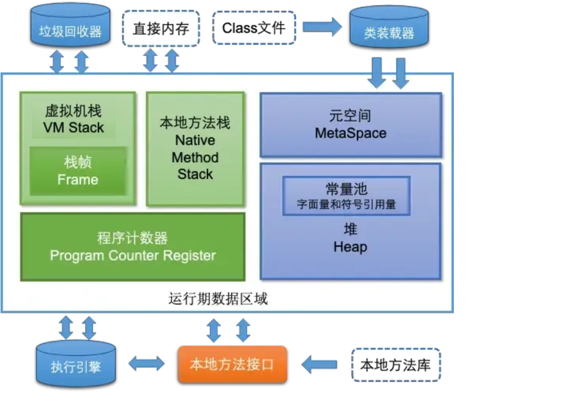
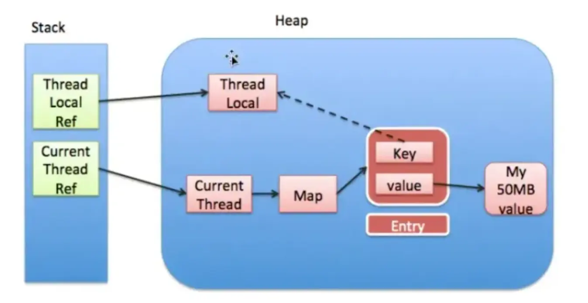
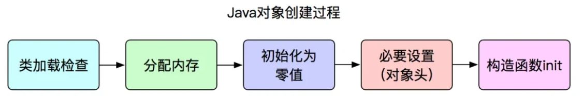
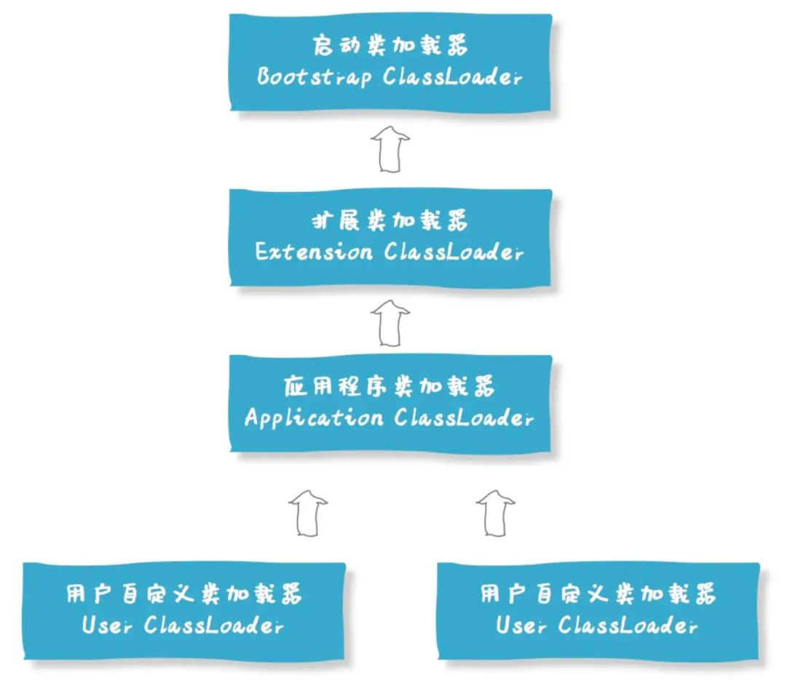
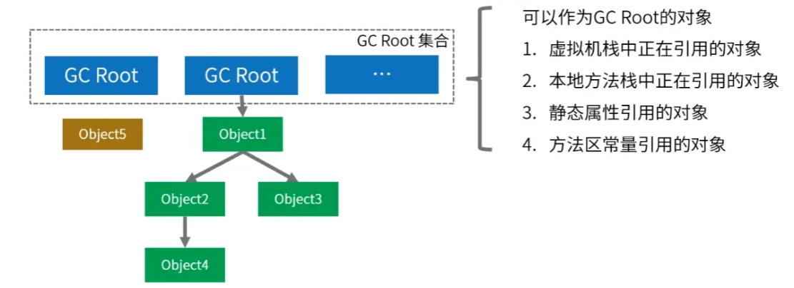
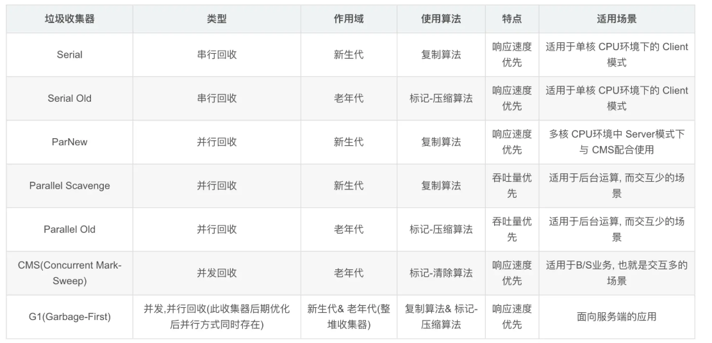
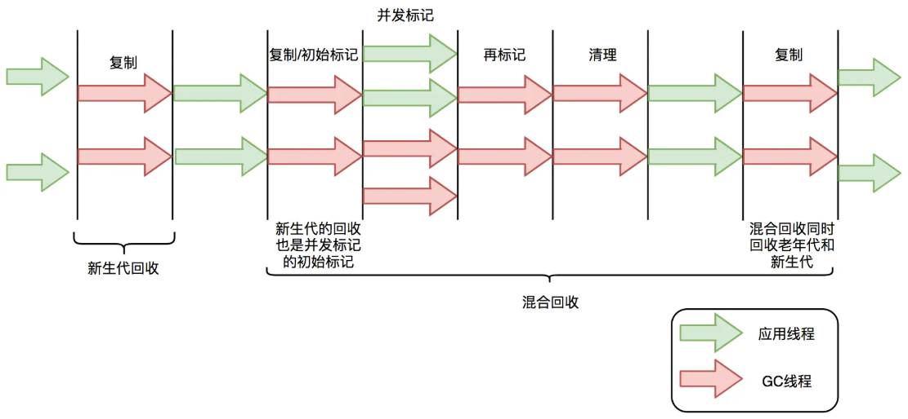

# 📚 JVM 相关学习与整理

> 👋 本文介绍 [JVM] 的相关知识、常见问题与总结。

## 📑 目录

- [📚 JVM 相关学习与整理](#-jvm-相关学习与整理)
  - [📑 目录](#-目录)
  - [🚀 JVM的内存模型介绍一下？](#-jvm的内存模型介绍一下)
      - [JVM主要分为五个部分：](#jvm主要分为五个部分)
      - [JVM内存模型中的堆和栈的区别？](#jvm内存模型中的堆和栈的区别)
      - [栈中存的是指针还是对象？](#栈中存的是指针还是对象)
      - [堆分为哪几个部分？](#堆分为哪几个部分)
      - [程序计数器的作用为什么是私有的？](#程序计数器的作用为什么是私有的)
      - [方法中的方法执行过程是什么样的？](#方法中的方法执行过程是什么样的)
      - [方法区内还有啥？](#方法区内还有啥)
      - [String保存在哪里？](#string保存在哪里)
      - [引用类型有哪些？有什么区别？](#引用类型有哪些有什么区别)
      - [弱引用使用场景和示例？](#弱引用使用场景和示例)
      - [内存泄漏和内存溢出的理解？](#内存泄漏和内存溢出的理解)
      - [JVM内存结构有哪几种溢出情况？](#jvm内存结构有哪几种溢出情况)
      - [JVM具体内存泄漏和内存溢出的例子？](#jvm具体内存泄漏和内存溢出的例子)
  - [🚀 类初始化和类加载](#-类初始化和类加载)
      - [创建对象的过程是什么样的？](#创建对象的过程是什么样的)
      - [对象的生命周期](#对象的生命周期)
      - [类加载器有哪些？](#类加载器有哪些)
      - [双亲委派模型的作用](#双亲委派模型的作用)
      - [类加载过程？](#类加载过程)
  - [🚀 讲讲JVM的垃圾回收机制？](#-讲讲jvm的垃圾回收机制)
      - [什么是Java的GC，如何触发GC?](#什么是java的gc如何触发gc)
      - [判断垃圾的方法有哪些？](#判断垃圾的方法有哪些)
      - [垃圾回收算法是什么？垃圾回收算法有哪些？](#垃圾回收算法是什么垃圾回收算法有哪些)
      - [垃圾回收器有哪些？](#垃圾回收器有哪些)
      - [垃圾回收算法哪些阶段会stop the world?](#垃圾回收算法哪些阶段会stop-the-world)
      - [minorGC, majorGC, fullGC的区别是什么？什么场景会触发fullGC？](#minorgc-majorgc-fullgc的区别是什么什么场景会触发fullgc)
      - [垃圾回收器CMS和G1的区别？](#垃圾回收器cms和g1的区别)
      - [CMS和G1的使用场景？](#cms和g1的使用场景)
      - [G1特点？](#g1特点)
      - [GC只会对堆进行GC吗？](#gc只会对堆进行gc吗)

## 🚀 JVM的内存模型介绍一下？



#### JVM主要分为五个部分：

1. 程序计数器：存当前线程所执行字节码的行号指令器，用于存储当前线程正在执行的JVM指令地址。
2. Java虚拟机栈：每个线程都有自己独立的虚拟机栈，每个方法执行时都会创建一个栈帧，用于存储局部变量表，操作数栈，动态链接，方法出口等信息。
3. 本地方法栈：为虚拟机使用的Native方法服务
4. Java堆：JVM最大的内存区域，被所有线程共享，用于存放对象实例。（划分为新生代和老生代，新生代分为Eden区和两个Survivor区）
5. 方法区(元空间)：使用本地内存，用于存储已被虚拟机加载的类信息，常量，静态变量等数据。

其他包括
运行时常量池——方法区的一部分，存放编译期胜场的各种字母量和符号引用，具有动态性
直接内存——一种堆外内存。

#### JVM内存模型中的堆和栈的区别？

**用途上看**：堆用于存储对象的实例，栈用于存储方法调用参数，方法返回地址，局部变量等临时参数

**生命周期看**：栈中数据有确定的生命周期，堆中对象生命周期不稳定，对象会在GC检测到其不再被引用时回收。

**存取速度看**：栈比堆快。

**存储空间看**：栈空间小且固定，操作系统管理。堆空间大且动态扩展，由JVM管理。

**可见性看**：栈为线程私有，堆对数据线程共享。

#### 栈中存的是指针还是对象？

栈中存储的是对象的引用，

#### 堆分为哪几个部分？

**新生代**：分为Eden Space和Survivor Space。Eden中存放大多数新创建对象，区域较小，其满时会触发Minor GC。Survivor中分为两个大小相等的S0和S1区域，Minor GC后存活下来的对象会移动到其中一个Survivor空间，轮流当中转站。

**老年代**：空间比新生代大，存储更多的长期存活对象。一次或多次Minor GC仍存活的对象存放在这，生命周期较长，Major GC发生频率相对低，执行时间比Minor GC长。

**元空间**：Java8开始永久代被元空间取代，存储类的元数据信息，如结构信息（字段方法等信息）。元空间不在堆中，而是使用本地内存。

**大对象区**：需要大量连续内存空间的对象，如大数组，直接分配在老年代以避免音频繁的年轻代晋升而导致的内存碎片化问题。

#### 程序计数器的作用为什么是私有的？

多线程运行时cpu会通过调动器组件分配时间片，为记录线程切换过程中下一条指令的状态，每个线程都有自己的程序计数器。

#### 方法中的方法执行过程是什么样的？

- 解析方法调用：根据方法符号引用找到实际的方法地址。
- 栈帧创建：调用前JVM为当前线程的Java虚拟机栈中为该方法分配一个新的栈帧，用于存储局部变量表、操作数栈、动态链接、方法出口等信息。
- 执行方法；执行字节码指令，涉及局部变量读写，操作数栈操作，跳转控制，对象创建，方法调用等。
- 返回处理：执行完毕后返回结果给调用者，并清理当前栈帧。

#### 方法区内还有啥？

**类信息**：包括类的结构信息、类的访问修饰符、父类与接口等信息。
**常量池**：存储类和接口中的常量，包括字面值常量、符号引用，以及运行时常量池。
**静态变量**：存储类的静态变量，这些变量在类初始化的时候被赋值。
**方法字节码**：存储类的方法字节码，即编译后的代码。
**符号引用**：存储类和方法的符号引用，是一种直接引用不同于直接引用的引用类型。
**运行时常量池**：存储着在类文件中的常量池数据，在类加载后在方法区生成该运行时常量池。
**常量池缓存**：用于提升类加载的效率，将常用的常量缓存起来方便使用。

#### String保存在哪里？

常量池中。若使用String s = new String("abc")，则若abc常量不存在，则在常量池中创建一个"abc"字符串常量，再在堆中创建一个实例对象。若"abc"字符串常量存在，则只在堆内存中创建一个实例对象。

#### 引用类型有哪些？有什么区别？

引用类型分为强软弱虚四种：

强引用：例如A a = new A()，永远不会被GC回收。用于常规对象保持，保证对象存活；
软引用：使用SoftReference描述，系统发生内存溢出前会回收。软引用适用于缓存等场景，内存不足时自动释放；
弱引用：使用WeakReference描述，下一层GC时会被回收。弱引用可破循环引用防内存泄漏及管理临时短周期对象；
虚引用：PhantomReference描述，发生GC时会被回收。虚引用能在对象回收时触发资源清理等额外操作。

#### 弱引用使用场景和示例？

- 缓存系统：使缓存项能在内存压力下自动释放，缓存大小不受控制会导致内存溢出，因此使用弱引用维护缓存。
- 对象池：管理暂时不使用的对象，对象不再强引用时可被GC。
- 避免内存泄漏：一个对象不应该被长期引用时，用弱引用防止其被意外保留。

```java
import Java.lang.ref.WeakReference;
import Java.util.HashMap;
import Java.util. Map;
public class CacheExample {
    private Map<String,WeakReference<MyHeavyObject>>> cache = new HashMap<>();
    public MyHeavyObject get(String key) {
        WeakReference<MyHeavyObject> ref = cache.get (keyу);
        if (ref != null) {
            return ref.get ();
        } else {
            MyHeavyObject obj = new MyHeavyObject ();
            cache.put (key, new WeakReference<<<obj));
            return obj;
        }
    }
    //假设 MyHeavyObject 是一个占用大量内存的对象
    private static class MyHeavyObject {
        private byte [] largeData = new byte [1024 * 1024* 10]; // 10MB data
    }
}
```

#### 内存泄漏和内存溢出的理解？

**内存泄漏**：该删的对象没删导致内存减少（常见原因有：静态集合未清理，事件监听未取消导致对象持续被引用，线程未停止）
**内存溢出**：JVM申请内存时内存不够用（常见原因有：大量对象创建，持久引用，递归调用）

#### JVM内存结构有哪几种溢出情况？

**堆内存溢出**：大对象分配或者内存泄漏

**栈溢出**：不断递归导致压栈

**元空间溢出**：系统代码非常多或引用第三方包非常多

**直接内存内存溢出**：程序申请的直接内存超出了系统允许的范围

#### JVM具体内存泄漏和内存溢出的例子？

- 静态属性导致内存泄漏：去掉static关键字
- 未关闭的资源：数据库连接、输入流、session对象的关闭
- 使用ThreadLocal：ThreadLocal提供了线程本地变量，保证访问到的变量属于当前线程，每个线程保存一个变量副本，相当于提供了一种线程隔离，绑定变量与线程从而实现线程安全性。



ThreadLocal 实现里每个 Thread 维护 ThreadLocalMap，以 ThreadLocal 弱引用为 key。若 ThreadLocal 无外部强引用，GC 时被回收会致 ThreadLocalMap 中出现 key 为 null 的 Entry，若线程不结束，其 value 因强引用链无法回收，造成内存泄漏。给出解决办法：用 remove 方法移除 value；避免用 set (null) 清除值；在 finally 块中调用 remove 方法，确保资源关闭，防止内存泄漏。

## 🚀 类初始化和类加载

#### 创建对象的过程是什么样的？



- 类加载检查：检查是否能在常量池中定位到符号引用，若未被加载过解析或初始化过，则执行相应类加载过程。
- 内存分配：为新生对象分配内存，把一块确定大小的内存从堆中划分出来。
- 初始化零值：将分配到的内存空间都初始化为0值，保证对象实例字段在Java代码中不赋初始值就可用直接使用，程序能访问到这些字段对应数据类型的值。
- 进行必要设置，如对象头：如对象是哪个类的实例，如何找到类元信息，对象哈希码，对象GC分代等。
- 执行init方法：JVM视角中对象已经产生，Java程序角度对象才刚开始，执行构造函数方法。

#### 对象的生命周期

- 创建：对象通过关键字new在堆内存中被实例化，构造函数被调用，对象内存空间被分配。
- 使用：对象被引用并执行相关操作，通过引用访问对象的属性和方法，程序运行过程中不断被使用。
- 销毁：对象不再被引用时，通过GC自动回收对象所占用空间，GC会适当的时候检测并回收不再被引用的对象，释放对象占用的内存空间，完成对象的销毁。

#### 类加载器有哪些？



- 启动类加载器：最顶层的类加载器，负责加载Java核心库，是JVM的一部分，启动类加载器无法被Java程序直接引用。
- 扩展类加载器：继承自ClassLoadder类，负责加载Java扩展目录下的jar包和类库。由启动类加载器加载，父加载器即为启动类加载器。
- 系统类加载器/应用程序类加载器：加载用户路径上指定类库，即平时编写Java程序默认使用的类加载器，父加载器即为扩展类加载器。
- 自定义类加载器：开发者根据需求定制类的加载方法，如从网络加载class文件，数据库甚至加密的文件中加载。

这些类加载器直接形成双亲委派模型，核心思想是当一个类加载器收到类加载请求时，不会自己去尝试加载，而是把这个请求委派给父类加载器区完成，每一层类加载器都是如此，因此所有加载请求最终都应该传送到顶层的启动类加载器中。

只有当复加载器反馈自己无法加载请求时，子加载器才会尝试自己加载。

#### 双亲委派模型的作用

- 保证类唯一性：避免不同加载器重复加载
- 保证安全性：只加载信任类路径中的类，防止不可信的假冒核心类
- 简化加载流程：减少了每个加载器需要处理的类的数量，简化类加载过程

#### 类加载过程？

- 加载：通过类的全限定名获取类的.class文件的二进制字节流，将二进制字节流所代表的静态存储结构，转化为方法区运行的数据结构，在内存中生成一个代表类的Java.lang.Class对象，作为方法区这个类的各种数据的访问入口
- 连接：验证（确保class文件中字节流信息符合当前虚拟机要求）、准备（为类中静态字段分配内存，并设置默认初始值）、解析（将虚拟机常量池的符号引用直接替换为直接引用）
- 初始化：执行类的构造器方法（编译器自动生成）
- 使用：实用类或者创建对象
- 卸载：类的所有实例被回收，或加载该类的ClassLoader被回收，或类对应的Java.Lang.Class对象没有任何地方被引用

## 🚀 讲讲JVM的垃圾回收机制？

#### 什么是Java的GC，如何触发GC?

垃圾回收是自动管理内存的一种机制，负责自动释放不再为程序引用的对象锁占用的内存，这种机制减少了内存泄漏和内存管理错误的可能性，可用通过多种方式触发，如：

- 内存不足时：JVM检测堆内存不足时，无法为新的对象分配内存
- 手动请求：开发者可用通过使用System.gc()或Runtime.getRuntime().gc()建议JVM进行垃圾回收，但不能保证立即执行
- JVM参数：启动Java应用时可用通过JVM参数调整垃圾回收行为，如-Xmx最大堆大小，-Xms初始堆大小等
- 对象数量或内存使用达到阈值：垃圾回收器内部实现了一些策略，监控对象创建或内存使用，达到某个阈值会触发GC

#### 判断垃圾的方法有哪些？

**引用计数法**
原理：为每个对象分配一个引用计数器，被引用则+1，失效则-1，不被任何变量引用则回收
缺点：不能解决循环引用问题

**可达性分析算法**
（主要采用此算法判断对象是否为垃圾）



原理：从一组称为 GC Roots (垃圾收集根) 的对象出发，向下追溯它们引用的对象，以及这些对象引用的其他对象，以此类推。如果一个对象到 GCRoots 没有任何引用链相连 (即从 GCRoots 到这个对象不可达), 那么这个对象就被认为是不可达的，可以被回收。GCRoots对象包括：虚拟机栈 (栈帧中的本地变量表)中引用的对象、方法区中类静态属性引用的对象、本地方法栈中 JNI (Java Native Interface) 引用的对象、活跃线程的引用等。

#### 垃圾回收算法是什么？垃圾回收算法有哪些？

垃圾回收机制主要目标是自动过检测和回收不再使用的对象，从而释放他们所占用的空间。

**标记-清除法**：通过可达性分析标记出所有需要回收的对象，然后统一回收所有被标记的对象。有效率问题，可能造成大量碎片空间。

**复制算法**：将内存分为两块，每次申请内存时使用其中一块，内存不够时将这块内存中所有内存复制到另一块上，然后把已使用内存全部清理掉。有内存利用率不足的问题。

**标记-整理算法**：标记后，将所有存活对象移动到内存的一端，移动结束后清理掉剩余部分。

**分代回收算法**：按照对象生命周期(或经历GC次数)将内存划分为新生代和老年代。对象创建时在新生代申请内存，经历一次GC且存活则年龄+1，年龄超过一定值后若还存活则进入老年代。

#### 垃圾回收器有哪些？



#### 垃圾回收算法哪些阶段会stop the world?



**标记阶段停顿分析**
- 初始标记阶段: 初始标记阶段是指从GCRoots出发标记全部直接子节点的过程,该阶段是STW的。由于GC Roots数量不多,通常该阶段耗时非常短。
- 并发标记阶段: 并发标记阶段是指从GCRoots开始对堆中对象过进行可达性分析,找出存活对象。该阶段是并发的,即应用线程和GC线程可以同时活动。并发标记耗时相对长很多,但因为不是STW,所以我们不太关心该阶段耗时的长短。
- 再标记阶段: 重新标记那些在并发标记阶段发生变化的对象。该阶段是STW的。

**清理阶段停顿分析**
- 清理阶段清点出有存活对象的分区和没有存活对象的分区,该个段不会清理垃圾对象,也不会执行存活对象的复制。该阶段是STW的。

**复制阶段停顿分析**
- 复制算法中的转移阶段需要分配新内存和复制对象的成员变量。转移阶段是STW的,其中内存分配通常耗时非常短,但对象成员变量的复制耗时有可能较长,这是因为为复制耗时与存活对象数量与对象复杂度成正比。对象越复杂,复制耗时越长。

四个STW过程中,初始标记因为只标记GC Roots,耗时较短。再标记因为对象数少,耗时也较短。清理阶段因为内存分区数量少,耗时也较短。转移阶段要处理所有存活活的对象,耗时会较长。

因此,G1停顿时间的瓶颈主要是标记-复制中的转移阶段STW

#### minorGC, majorGC, fullGC的区别是什么？什么场景会触发fullGC？

**minor GC**:
- 范围：年轻代，包括Eden区和两个Survivor区
- 条件：Eden区空间不足时触发，将Eden区和一个Survivor区中存活对象移动到另一个Survivor区或老年代
- 特点：发生频繁，回收率高，暂停时间短

**major GC**:
- 范围：主要老年代，但不止老年代
- 条件：老年代空间不足或系统检测年轻代到老年代速度过快
- 特点：发生频率相比minor GC较低，但回收时间更长。

**full GC**:
- 范围：整个堆内存
- 条件：直接调用System.gc()，或minor GC时存活对象无法全部放入老年代，或老年代空间不足以容纳存活对象，或永久代/元空间空间不足时
- 特点：最昂贵的操作，会停止所有工作线程，遍历整个堆内存来查找和回收不再使用的对象，需尽量减少触发。

#### 垃圾回收器CMS和G1的区别？

- 范围不同：CMS为老年代收集器，需要结合新生代Serial和ParNew收集器使用，G1收集范围是老年代和新生代
- STW时间不同：GMS收集器以最小时间为目标，G1可用预测GC的停顿时间
- 垃圾碎片：CMS使用标记-清除算法，容易产生内存碎片；G1使用标记-整理算法，进行了空间整合，没有内存空间碎片
- 过程不同：CMS（初始标记-并发标记-重新标记-并发清除），G1（初始标记-并发标记-最终标记-筛选回收）
- 浮动垃圾：CMS有浮动垃圾，G1没有

#### CMS和G1的使用场景？

CMS：低延迟需求，老生代收集，碎片化管理
G1：大堆内存，堆内存碎片敏感，比较平衡的性能

#### G1特点？

- 引入了分区的思路，弱化了分代的概念
- 合理利用垃圾收集各个周期的资源，解决了其他收集器甚至CMS的众多缺陷。

#### GC只会对堆进行GC吗？

JVM的GC不仅对堆进行垃圾回收，还会对方法区进行垃圾回收。

1. 堆 (Heap): 堆是用于存储对象实例的内存区域。大部分的垃圾回收工作都发生在堆上，因为大多数对象都会被分配在堆上，而垃圾回收的重点通常也是回收堆中不再被引用的对象，以释放内存空间。
2. 方法区 (Method Area): 方法区是用于存储类信息、常量、静态变量等数据的区域。虽然方法区中的垃圾回收与堆有所不同，但是同样存在对不再需要的常量、无用的类信息等进行清理的过程。