# 📚 Java基础 相关学习与整理

> 👋 本文介绍 [Java基础] 的相关知识、常见问题与总结。

---

## 📑 目录

- [📚 Java基础 相关学习与整理](#-java基础-相关学习与整理)
  - [📑 目录](#-目录)
  - [🚀 接口和抽象类有什么区别？](#-接口和抽象类有什么区别)
      - [💡 接口和抽象类的定义？他们的使用场景是什么？](#-接口和抽象类的定义他们的使用场景是什么)
      - [📌 从设计动机上有什么区别？](#-从设计动机上有什么区别)
      - [🔍 从其他方面还有什么区别？](#-从其他方面还有什么区别)
  - [🚀 你使用过Java的反射机制吗？如何使用？](#-你使用过java的反射机制吗如何使用)
      - [💡 Java的反射机制是什么？优点有哪些？](#-java的反射机制是什么优点有哪些)
      - [📌 反射的基本概念](#-反射的基本概念)
      - [🔍 反射的性能考虑](#-反射的性能考虑)
      - [🔣 反射的使用](#-反射的使用)
      - [👂 反射的最佳实践](#-反射的最佳实践)
  - [🚀 JDK的动态代理和CGLIB动态代理有什么区别？](#-jdk的动态代理和cglib动态代理有什么区别)
      - [💡 动态代理是什么？静态代理又是什么？](#-动态代理是什么静态代理又是什么)
      - [🔍 JDK动态代理和CGLIB动态代理有什么区别？](#-jdk动态代理和cglib动态代理有什么区别)
      - [🧠 他们的实现机制是什么？](#-他们的实现机制是什么)
  - [🚀 Java中有哪些集合类？请简单介绍](#-java中有哪些集合类请简单介绍)
      - [💡 Java中集合的简单介绍？](#-java中集合的简单介绍)
  - [🚀 说说Java集合中各种数据结构的原理？](#-说说java集合中各种数据结构的原理)
      - [🔍 什么是Java中的LinkedHashMap？](#-什么是java中的linkedhashmap)
      - [🔍 Java的TreeMap是什么](#-java的treemap是什么)
      - [🔍 Java中HashMap的原理是什么？](#-java中hashmap的原理是什么)
  - [🚀 什么是Java的CAS(Compare-And-Swap)操作？](#-什么是java的cascompare-and-swap操作)
      - [💡 CAS是什么，工作原理是什么？](#-cas是什么工作原理是什么)
      - [🔍 优缺点？](#-优缺点)
      - [🧠 CAS在Java中的实现](#-cas在java中的实现)
      - [👂 CAS总线风暴](#-cas总线风暴)
  - [🚀 你使用过哪些Java并发工具类？](#-你使用过哪些java并发工具类)
      - [💡 简单说说有哪些Java并发工具类？](#-简单说说有哪些java并发工具类)
      - [🔍 ConcurrentHashMap](#-concurrenthashmap)
      - [🔍 AtomicInteger](#-atomicinteger)
      - [🔍 Semaphore](#-semaphore)
      - [🔍 CyclicBarrier](#-cyclicbarrier)
      - [🔍 CountDownLatch](#-countdownlatch)
      - [🔍 BlockingQueue](#-blockingqueue)
      - [🔍 StampedLock](#-stampedlock)
      - [🔍 ReentrantLock](#-reentrantlock)
      - [🔍 CompletableFuture](#-completablefuture)
  - [🚀 你了解Java线程池的原理吗？](#-你了解java线程池的原理吗)
      - [💡 线程池是什么？工作原理是什么？](#-线程池是什么工作原理是什么)
      - [📌 图解线程池？](#-图解线程池)
      - [🔍 线程池相关参数的解释 \& 工作队列类型？](#-线程池相关参数的解释--工作队列类型)
      - [🔍 Java并发库中提供了哪些线程池实现？他们有啥区别？](#-java并发库中提供了哪些线程池实现他们有啥区别)
      - [🔍 Java线程池有哪些拒绝策略？](#-java线程池有哪些拒绝策略)
      - [🧠 为什么线程池要使用阻塞队列，而不是直接增加线程？](#-为什么线程池要使用阻塞队列而不是直接增加线程)
  - [🚀 说说AQS吧？](#-说说aqs吧)
      - [💡 简单说说AQS？](#-简单说说aqs)
      - [🔍 AQS的核心机制包括哪些？](#-aqs的核心机制包括哪些)
      - [🧠 AQS整体架构](#-aqs整体架构)
      - [🧠 手撕一个基于AQS实现的独占锁](#-手撕一个基于aqs实现的独占锁)
  - [🚀 Synchronized和ReentrantLock有什么区别？](#-synchronized和reentrantlock有什么区别)
      - [💡 简要回答一下？](#-简要回答一下)
      - [🔍 Java的synchronized是怎么实现的？](#-java的synchronized是怎么实现的)
      - [📌 什么是可重入锁？](#-什么是可重入锁)
      - [🧠 syncronized性能优化？](#-syncronized性能优化)
  - [🚀 Java中volatile关键字的作用是什么？](#-java中volatile关键字的作用是什么)
      - [💡 volatile的作用简单说说？](#-volatile的作用简单说说)
      - [🔍 详细讲讲volatile如何解决的可见性问题？](#-详细讲讲volatile如何解决的可见性问题)
      - [🔍 详细讲讲volatile如何解决的指令重排序问题？](#-详细讲讲volatile如何解决的指令重排序问题)
      - [🧠 volatile不能保证操作的原子性](#-volatile不能保证操作的原子性)
      - [👂 volatile与synchronized的对比](#-volatile与synchronized的对比)
      - [📌 Java内存模型(JMM) 与 volatile](#-java内存模型jmm-与-volatile)


## 🚀 接口和抽象类有什么区别？

#### 💡 接口和抽象类的定义？他们的使用场景是什么？

**抽象类**

*定义和特性*
一个类定义了一个或多个抽象方法(可以定义抽象/普通方法)，那这个类必是抽象类。
抽象类不能被实例化，new会报错。但是抽象类可有子类，通过`extends`关键字来继承抽象类。
抽象类派生的子类必须实现父类定义的抽象抽象方法。
抽象类的抽象方法没有方法体。

*使用场景*
1. 代码复用 —— 同一功能被多个子类复用
2. 拓展实现 —— 子类自己实现抽象类中的方法

**接口**

*定义和特性*
接口可以包含一些常量，抽象方法，静态方法(Java8)和默认方法(Java8)
接口不能被实例化
接口可以是空的，如Serializable接口
不要在定义接口的时候使用final关键字，因为接口本身是为了让子类实现，而final阻止了这个行为
接口方法不能是private，protected或final的
接口的变量是隐式public static final，值无法改变

*使用场景*
1. 使某些实现类具有我们想要的功能
2. 可以达到多重继承的目的 —— 赋予一个类更多的能力
3. 实现多态


#### 📌 从设计动机上有什么区别？

接口的设计是**自上而下**的。我们知晓某一行为，于是基于这些行为约束定义了接口，一些类需要有这些行为，因此实现对应的接口。
抽象类的设计是**自下而上**的。我们写了很多类，发现它们之间有共性，有很多代码可以复用，因此将公共逻辑封装成一个抽象类，减少代码冗余。

所谓的**自上而下**指的是先约定接口，再实现。而**自下而上**的是先有一些类，才抽象了共同父类，实战中很多时候都是因为重构才有的抽象类。

#### 🔍 从其他方面还有什么区别？

从**方法实现**上看，接口中的方法默认是 public 和 abstract (但在 Java8 之后可以设置 default 方法或者静态方法)。抽象类可以包含 abstract 方法 (没有实现) 和具体方法 (有实现)。它允许子类继承并重用抽象类中的方法实现。

从**构造函数和成员变量**上看，接口不能包含构造函数，接口中的成员变量默认为`public static final`，即常量。抽象类可用包含构造函数，成员变量可以有不同的访问修饰符(`private`, `protected`, `public`)， 并且可以不是常量

从**多继承**特性看，抽象类只能单继承，接口可以有多个实现。(多继承会产生菱形问题，即一个类继承了 继承同一父类的不同父类 后不同的实现会出现歧义；而接口无法定义具体的方法实现，每个实现类必须实现接口的所有方法。)

## 🚀 你使用过Java的反射机制吗？如何使用？

#### 💡 Java的反射机制是什么？优点有哪些？

Java 的反射机制是指**在运行时**获取类的结构信息 (如方法、字段、构造函数) 并操作对象的一种机制。反射机制提供了在运行时动态创建对象、调用方法、访问字段等功能，而无需在编译时知道这些类的具体信息。

**反射机制的优点**:
- 可以动态地获取类的信息，不需要在编译时就知道类的信息。
- 可以动态地创建对象，不需要在编译时就知道对象的类型。
- 可以动态地调用对象的属性和方法，在运行时动态地改变对象的行为。

一般在业务编码中不会用到反射，在框架上用的较多，因为很多场景需要很灵活，不确定目标对象的类型，届时只能通过反射动态获取对象信息。例如 Spring 使用反射机制来读取和解析配置文件，从而实现依赖注入和面向切面编程等功能

#### 📌 反射的基本概念

`Class`类是反射机制的核心，通过`Class`类的实例可以获取类的各种信息。

**反射的主要功能**：
- 创建对象: 通过 `Class.newIstance()` 或 `Constructor.newInstance()` 创建对象实例。
- 访问字段：使用 `Field` 类访问和修改对象的字段。
- 调用方法：使用 `Method` 类调用对象的方法。
- 获取类信息：获取类的名称、父类、接口等信息。

#### 🔍 反射的性能考虑

反射操作相比直接代码调用具有较高的性能开销，因为它涉及到动态解析和方法调用。

所以在性能敏感的场景中，尽量避免频繁使用反射。可以通过缓存反射结果。例如把第一次得到的 Method 缓存起来，后续就不需要再调用 Class.getDeclaredMethod也就不需要再次动态加载了，这样就可以避免反射性能问题。

#### 🔣 反射的使用

1. 获取Class对象

```java
Class<?> clazz = Class.forName("com.mianshiya.MyClass");
// 或者
Class<?> clazz = MyClass.class;
// 或者
Class<?> clazz = obj.getClass();
```

2. 创建对象

```java
Object obj = clazz.newInstance(); // 已过时

Constructor<?> constructor = clazz.getConstructor();
Object obj = constructor.newInstance();
```

3. 访问字段

```java
Field field = clazz.getField("myField");
field.setAccessible(true); // 允许访问 private 字段
Object value = field.get(obj);
field.set(obj, newValue);
```

4. 调用方法

```java
Method method = clazz.getMethod("myMethod", String.class);
Object result = method.invoke(obj, "param");
```

#### 👂 反射的最佳实践

**限制访问**：尽量避免过度依赖反射，尤其是在性能关键的代码中。
**使用缓存**：缓存反射获取的类、方法、字段等信息，减少反射操作的频率。
**遵循设计原则**：在设计系统时，尽量使用更稳定和易于维护的设计方案，只有在确实需要时才使用反射。

## 🚀 JDK的动态代理和CGLIB动态代理有什么区别？

#### 💡 动态代理是什么？静态代理又是什么？

通过代码先了解静态代理的意义：

```java
// 接口类
public interface DataQuery {
    String query(String queryKey);
}

// 实现目标类
public class DatabaseDataQuery implements DataQuery{
    @Override
    public String query(String queryKey) {
        //通过数据库查询
        System.out.println("数据库查询中。。。。");
        return "DataBaseQuery result";
    }
}

// 代理类
public class DatabaseDataQueryProxy implements DataQuery {
    //实现缓存，使用HashMap
    Map<String,String> cacheMap =new HashMap<>();
    //创建持有代理对象
    private DatabaseDataQuery dataQuery;
    //1 屏蔽代理对象
    public DatabaseDataQueryProxy( ) {
        this.dataQuery = new DatabaseDataQuery();
    }

    @Override
    //2 对代理对象的方法做增强
    public String query(String queryKey) {
        String s = cacheMap.get(queryKey);
        //查询缓存，命中则返回
        if (s!=null){
            System.out.println("命中缓存，返回结果");
            return s;
        }
        //查询数据库
        s=dataQuery.query(queryKey);
        //查到结果返回并放入缓存
        if (s!=null){
            cacheMap.put(queryKey,s);
        }
        System.out.println("未命中，查询数据库");
        return s;
    }
}
```
静态代理类是在编译时已经进行了代理操作，而动态代理是在运行时执行了代理操作。

#### 🔍 JDK动态代理和CGLIB动态代理有什么区别？

**JDK动态代理**是基于接口的，要求被代理的类必须实现一个或多个接口。代理对象会实现这些接口，并将方法调用委托给目标对象。如果类没有实现任何接口，JDK 动态代理将无法工作。

**CGLIB动态代理**是基于类实现的（基于ASM字节码生成工具），通过生成目标类的子类来实现代理。它不要求目标类必须实现接口，因此它适用于没有实现接口的类。CGLIB 是通过继承方式创建代理类，因此不能代理 final 类或 final 方法，因为这些无法被继承和重写。

#### 🧠 他们的实现机制是什么？

> ###### JDK动态代理

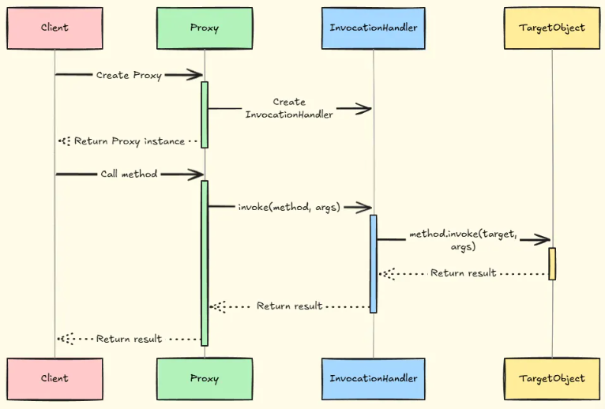

使用反射机制，通过`java.lang.reflect.Proxy`类和`InvocationHandler`接口来实现代理，代理对象仅在代理接口中的方法。当调用代理对象的方法时，代理类会拦截方法调用，并通过`InvocationHandler.invoke()`方法执行额外的逻辑。

```java
// 接口类
public interface DataQuery {
    String query(String queryKey);
    String queryAll(String queryKey);
}

// 目标实现类
public class DatabaseDataQuery implements com.muzi.Structural.proxy.dynamicProxy.jdk.DataQuery {
    @Override
    public String query(String queryKey) {
        // 他会使用数据源从数据库查询数据很慢
        System.out.println("正在从数据库查询数据");
        return "result";
    }

    @Override
    public String queryAll(String queryKey) {
        // 他会使用数据源从数据库查询数据很慢
        System.out.println("正在从数据库查询数据");
        return "all result";
    }
}
// InvocationHandler
public class CacheInvocationHandler implements InvocationHandler {
    private HashMap<String,String> cache = new LinkedHashMap<>(256);

    private DataQuery databaseDataQuery;

    public CacheInvocationHandler(DatabaseDataQuery databaseDataQuery) {
        this.databaseDataQuery = databaseDataQuery;
    }

    public CacheInvocationHandler() {
        this.databaseDataQuery = new DatabaseDataQuery();
    }
    @Override
    public Object invoke(Object proxy, Method method, Object[] args) throws Throwable {
        // 1、判断是哪一个方法
        String result = null;
        if("query".equals(method.getName())){
            // 2、查询缓存，命中直接返回
            result = cache.get(args[0].toString());
            if(result != null){
                System.out.println("数据从缓存重获取。");
                return result;
            }

            // 3、未命中，查数据库（需要代理实例）
            result = (String) method.invoke(databaseDataQuery, args);

            // 4、如果查询到了,进行缓存
            cache.put(args[0].toString(),result);
            return result;
        }

        // 当其他的方法被调用，不希望被干预，直接调用原生的方法
        return method.invoke(databaseDataQuery,args);
    }
}

// 调用
public class Main {
    public static void main(String[] args) {
        // jdk提供的代理实现，主要是使用Proxy类来完成
        // 1、classLoader：被代理类的类加载器
        ClassLoader contextClassLoader = Thread.currentThread().getContextClassLoader();
        // 2、代理类需要实现的接口数组
        Class[] classes = new Class[]{DataQuery.class};
        // 3、InvocationHandler
        CacheInvocationHandler cacheInvocationHandler = new CacheInvocationHandler();
        DataQuery dataQuery  = (DataQuery) Proxy.newProxyInstance(contextClassLoader, classes, cacheInvocationHandler);
        // 事实上调用query方法的使用，他是调用了invoke
        String result = dataQuery.query("key1");
        System.out.println(result);
        System.out.println("--------------------");
        result = dataQuery.query("key1");
        System.out.println(result);
        System.out.println("--------------------");
        result = dataQuery.query("key2");
        System.out.println(result);
        System.out.println("++++++++++++++++++++++++++++++++++++");
        // 事实上调用queryAll方法的使用，他是调用了invoke
        result = dataQuery.queryAll("key1");
        System.out.println(result);
        System.out.println("--------------------");
        result = dataQuery.queryAll("key1");
        System.out.println(result);
        System.out.println("--------------------");
        result = dataQuery.queryAll("key2");
        System.out.println(result);
        System.out.println("--------------------");
    }
}
```

其中DataQuery为接口，DatabaseDataQuery实现该接口，JDK动态代理要求被代理对象至少实现一个接口，以便代理类通过接口暴露代理行为。

通过Proxy.newProxyInstance() 创建代理对象，需三个参数：
- 类加载，用于加载代理类；
- 接口列表，指定代理应实现接口
- InvocationHandler，代理对象实际逻辑由该接口的类完成，如拦截代理方法调用并i俺家额外逻辑

CacheInvocationHandler 的 invoke 方法拦截方法调用，添加一些特殊的业务逻辑，通过 method.invoke(target,args) 执行目标对象原始方法。

> ###### CGLIB 动态代理

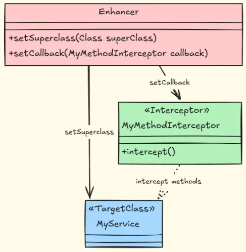

基于字节码操作，使用CGLIB生成目标子类并重写目标类的方法来实现代理。通过继承方式拦截所有非`final`方法的调用。

使用ASM字节码生成框架，生成的字节码级别的代理类，性能相对较好，单生成代理类的开销比JDK动态代理略大。

```java
// 目标类
public class DatabaseDataQuery implements DataQuery {
    @Override
    public String query(String queryKey) {
        // 他会使用数据源从数据库查询数据很慢
        System.out.println("正在从数据库查询数据");
        return "result";
    }

    @Override
    public String queryAll(String queryKey) {
        // 他会使用数据源从数据库查询数据很慢
        System.out.println("正在从数据库查询数据");
        return "all result";
    }
}

// 自定义方法拦截器
public class CacheMethodInterceptor implements MethodInterceptor {
    private HashMap<String,String> cache = new HashMap<>();
    private DatabaseDataQuery databaseDataQuery;
    public CacheMethodInterceptor( ) {
        this.databaseDataQuery = new DatabaseDataQuery();
    };

    @Override
    public Object intercept(Object obj, Method method, Object[] args, MethodProxy proxy) throws Throwable {
        // 1、判断是哪一个方法
        String result = null;
        if("query".equals(method.getName())){
            // 2、查询缓存，命中直接返回
            result = cache.get(args[0].toString());
            if(result != null){
                System.out.println("数据从缓存重获取。");
                return result;
            }

            // 3、未命中，查数据库（需要代理实例）
            result = (String) method.invoke(databaseDataQuery, args);

            // 4、如果查询到了,进行呢缓存
            cache.put(args[0].toString(),result);
            return result;
        }

        return method.invoke(databaseDataQuery,args);
    }
}

// 调用
public class Main {

    public static void main(String[] args) {
        //cglib通过Enhancer
        Enhancer enhancer = new Enhancer();
        //设置父类
        enhancer.setSuperclass(DatabaseDataQuery.class);
        //设置一个拦截器，用来拦截方法
        enhancer.setCallback(new CacheMethodInterceptor());
        //创建代理类
        DatabaseDataQuery databaseDataQuery = (DatabaseDataQuery) enhancer.create();
        databaseDataQuery.query("Key1");
        databaseDataQuery.query("Key1");
        databaseDataQuery.query("Key2");
    }
}
```

> ###### 两者对比

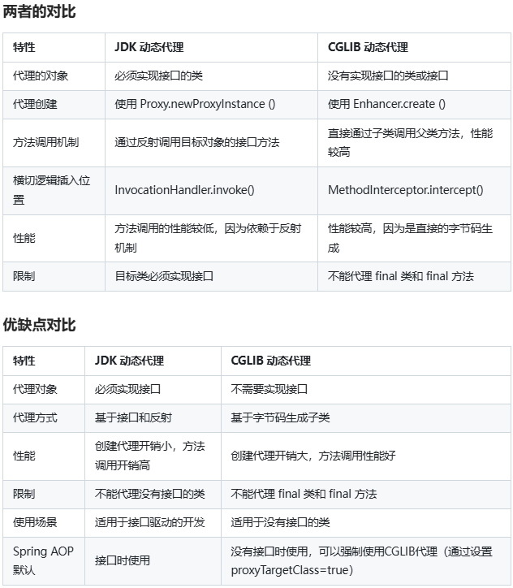

## 🚀 Java中有哪些集合类？请简单介绍

#### 💡 Java中集合的简单介绍？

Java中集合类主要分为两大类：Collection接口和Map接口，前者是存储对象的集合类，后者是存储键值对的类。Collection接口下又分为List，Set，Queue接口，每个接口都有它的实现类。

> ###### List接口：用于存储有序的、允许重复的元素，必须按照元素的插入顺序保存他们

ArrayList：基于动态数组，擅长随机访问元素；查询速度快，插入删除慢
LinkedList：基于双向链表，插入删除快，查询速度慢
Vector：线程安全的动态数组，类似于ArrayLst，但开销较大

> ###### Set接口：用于存储不重复的元素，通常用于去重。

HashSet：基于哈希表，元素无序，不允许重复，查找和插入性能高
LinkedHashSet：基于链表和哈希表，维护插入顺序，不允许重复
TreeSet：基于红黑树，元素有序，不允许重复

> ###### Queue接口

PriorityQueue：基于优先级堆，元素按照自然顺序或指定比较器排序
LinkedList：可以作为队列使用，支持FIFO操作

> ###### Map接口

存储的是键值对，也就是给对象设置了一个key，可以通过key找到value
HashMap：基于哈希表，键值对无序，不允许键重复
LinkedHashMap：基于链表和哈希表，维护插入顺序，不允许键重复
TreeMap：基于红黑树，键值对有序，不允许键重复
Hashtable：线程安全的哈希表，不允许键或值为null
ConcurrentHashMap：线程安全的哈希表，适合高并发环境，不允许键或值为null

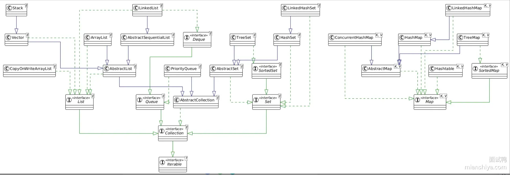

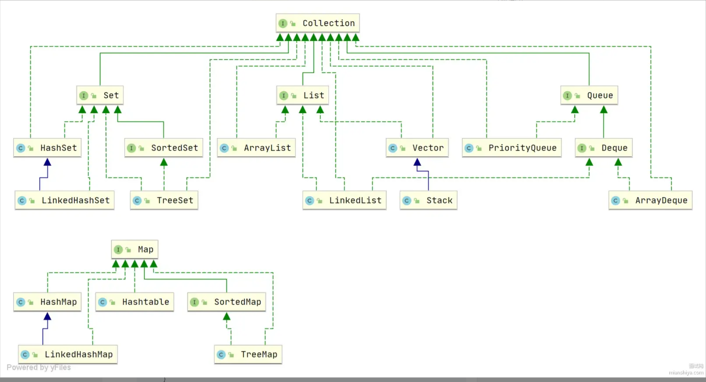

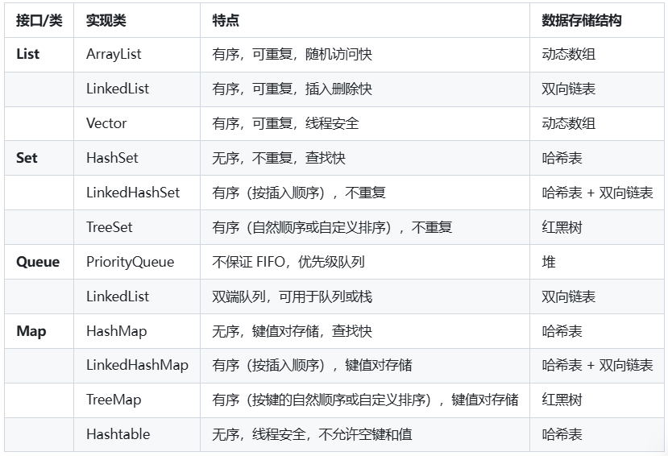

## 🚀 说说Java集合中各种数据结构的原理？

#### 🔍 什么是Java中的LinkedHashMap？

> ###### 整体介绍

LinkedHashMap 是 Java 集合框架中的一个实现类，它继承自 HashMap, 并且**保留了键值对的插入顺序或访问顺序**。提供了多个构造方法，包括默认构造方法和带有访问顺序选项的构造方法，通过指定accessOrder参数为true让其以**访问顺序排序**，而不是插入顺序。

它内部是通过维护了一个双向链表来记录元素的插入顺序或访问顺序。

**使用场景**:
缓存实现：可以根据访问顺序移除最久未使用的元素，常用于 LRU (Least Recently Used) 缓存。
数据存储：需要保持元素插入顺序的场景。

> ###### 内部实现剖析

其父类是HashMap，基于HashMap做了一些扩展。

首先，它在HashMap的Entry中加了指针before和after，用于把与塞入的Entry之间进行关联。


其次，内部有个accessOrder成员，默认为false，代表链表按照插入顺序排列。若为true则按照访问顺序排列，即LRU缓存。

```java
// LRU方法
private static final class LRUCache<K, V> extends LinkedHashMap<K, V> {
    private final int maxCacheSize;
    
    LRUCache(int initialCapacity, int maxCacheSize) {
        super(initialCapacity, 0.75F, true);
        this.maxCacheSize = maxCacheSize;
    }

    protected boolean removeEldestEntry(Map.Entry<K, V> eldest) {
        return this.size() > this.maxCacheSize;
    }
}

// 手写LRU算法
public class LRUCache<K, V> {

    class Node<K,V> {
        K key;
        V value;
        Node<K,V> prev, next;
        public Node() {}
        public Node(K key, V value) {
            this.key = key;
            this.value = value;
        }
    }

    private int capacity;
    private HashMap<K,Node> map;
    private Node<K,V> head;
    private Node<K,V> tail;

    public LRUCache(int capacity) {
        this.capacity = capacity;
        this.map = new HashMap<>(capacity);
        this.head = new Node<>();
        this.tail = new Node<>();
        this.head.next = tail;
        this.tail.prev = head;
    }

    public V get(K key) {
        Node<K,V> node = map.get(key);
        if (node == null)
            return null;
        moveNodeToHead(node);
        return node.value;
    }

    public void put(K key, V value) {
        Node<K,V> node = map.get(key);
        if (node == null) {
            if (map.size() >= capacity) {
                map.remove(tail.prev.key);
                removeTailNode();
            }
            Node<K,V> newNode = new Node<>(key, value);
            map.put(key, newNode);
            addToHead(newNode);
        } else {
            node.value = value;
            moveNodeToHead(node);
        }
    }

    private void addToHead(Node<K,V> newNode) {
        newNode.prev = head;
        newNode.next = head.next;
        head.next.prev = head.next;
        head.next = newNode;
    }

    private void moveNodeToHead(Node<K,V> node) {
        removeNode(node);
        addToHead(node);
    }

    private void removeNode(Node<K,V> node) {
        node.prev.next = node.next;
        node.next.prev = node.prev;
    }

    private void removeTailNode() {
        removeNode(tail.prev);
    }

}
```

#### 🔍 Java的TreeMap是什么

> ###### 整体介绍

TreeMap 内部是通过红黑树实现的，可以让 key 的实现 Comparable 接口或者自定义实现一个 comparator 传入构造函数，这样塞入的节点就会根据你定义的规则进行排序。

**基本特性**:
- 数据结构：TreeMap 基于红黑树实现，红黑树是一种自平衡的二叉查找树，能够保证基本操作(插入、删除、查找) 的时间复杂度为 O(logn)。
- 键的有序性：TreeMap 中的键是有序的，默认按自然顺序 (键的 Comparable 实现) 排序，也可以通过构造时提供的 Comparator 进行自定义排序。
- 不允许 null 键：TreeMap 不允许键为 null, 但允许值为 null。

这个用的比较少，常用在跟加密有关的时候，有些加密需要根据字母序排，然后再拼接成字符串排序，在这个时候就可以把业务上的值统一都塞到 TreeMap 里维护，取出来就是有序的

> ###### 使用实例

```java
import java.util.Comparator;
import java.util.TreeMap;

public class TreeMapExample {
  public static void main(String[] args) {
      // 使用自然顺序
      TreeMap<Integer, String> treeMap = new TreeMap<>();
      treeMap.put(3, "Three");
      treeMap.put(1, "One");
      treeMap.put(2, "Two");
      System.out.println("TreeMap: " + treeMap);
      // 使用自定义比较器
      TreeMap<Integer, String> reverseTreeMap = new TreeMap<>(Comparator.reverseOrder());
      reverseTreeMap.put(3, "Three");
      reverseTreeMap.put(1, "One");
      reverseTreeMap.put(2, "Two");
      System.out.println("Reverse TreeMap: " + reverseTreeMap);
      // 获取子映射
      System.out.println("SubMap (1, 3): " + treeMap.subMap(1, 3));
      // 获取前缀映射
      System.out.println("HeadMap (2): " + treeMap.headMap(2));
      // 获取后缀映射
      System.out.println("TailMap (2): " + treeMap.tailMap(2));
  }
}
```

> ###### 红黑树

红黑树 (Red-Black Tree) 是一种自平衡二叉搜索树 (Binary SearclhTree,BST), 它通过引入颜色 (红色和黑色) 标记每个节点，确保在最坏情况下的时间复杂度仍然是 O(logn)。红黑树常用于需要高效插入、删除和查找操作的场景，如 Java 中的 TreeMap 和 TreeSet, 以及 Linux 内核中的虚拟内存管理。

**它具有以下性质**:
- 节点是红色或黑色。
- 根节点是黑色。
- 所有叶子节点 (NIL 节点) 是黑色。
- 红色节点的两个子节点都是黑色 (从每个叶子到根的路径上不能有两个连续的红色节点)。
- 从任一节点到其每个叶子的所有路径都包含相同数目的黑色节点。

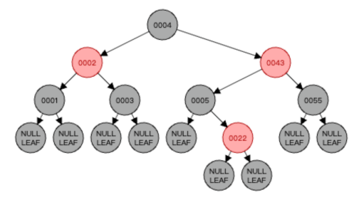

这些性质保证了红黑树的高度近似平衡，使得插入删除查找操作的时间复杂度保持在O(logn)。

1) 插入操作
- 插入的节点初始颜色总是红色。
- 插入后，可能违反红黑树的某些性质 (例如，连续红色节点)。
- 为了恢复红黑树的平衡，可能需要通过旋转 (左旋或右旋) 和颜色调整来修复违反的性质
2) 删除操作
- 删除一个节点后，可能导致树不再平衡，需要通过调整颜色和旋转转操作来恢复平衡。
- 可能会通过替换节点或合并节点的方式来处理删除操作。
3) 旋转操作
- 旋转是红黑树的核心操作，用于恢复平衡:
- 左旋转：将某个节点的右子树提升为其父节点。
- 右旋转：将某个节点的左子树提升为其父节点。

**红黑树的优点**
- 平衡性：通过旋转和颜色调整，红黑树能够保持相对的平衡性，避免退化成链表，保证了查找插入和删除操作的时间复杂度为 O (logn)。
- 灵活性：红黑树在插入和删除操作中相对于 AVL 树的调整操作较少，因此在需要频繁插入和删除的场景中性能更好。

https://www.cs.usfca.edu/~galles/visualization/RedBlack.html

#### 🔍 Java中HashMap的原理是什么？

> ###### 回答重点

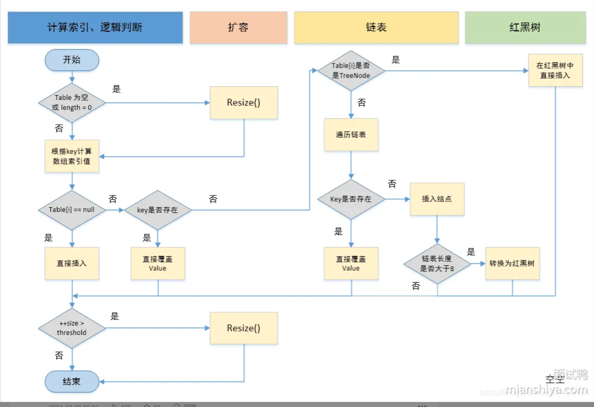

`HashMap` 是基于哈希表的数据结构，用于存储键值对 (key-value)。其核心是将键的哈希值映射到数组索引位置，通过数组 + 链表 (在 Java8 及之后是数组 + 链表 + 红黑树) 来处理哈希冲突。

`HashMap` 使用键的 `hashCode()` 方法计算哈希值，并通过 indexFor 方法 (JDK 1.7 及之后版本移除了这个方法，直接使用 `(n-1)&hash`) 确定元素在数组中的存储位置。哈希值是经过一定扰动处理的，防止哈希值分布不均匀，从而减少冲突。

`HashMap` 的默认初始容量为 16, 负载因子为 0.75。也就是说，当存储的元素数量超过 16x0.75=12 `个时，HashMap`会触发扩容操作，容量 x2 并重新分配元素位置。这种扩容是比较耗时的操作，频繁扩容会影响性能。

> ###### HashMap的红黑树优化

从 Java8 开始，为了优化当多个元素映射到同一个哈希桶 (即发生哈希冲突) 时的查找性能，当链表长度超过 8 时，链表会转变为红黑树。红黑树是一种自平衡二叉搜索树，能够将最坏情况下的查找复杂度从 O (n) 降低到 O (logn)。

如果树中元素的数量低于 6, 红黑树会转换回链表，以减少不必要的树操作开销。

> ###### hashCode()和equals()的重要性

`equals()`方法用于判断两个对象是否相等，默认实现是使用==比较对象的内存地址。
`hashCode()`方法则返回对象的哈希值（默认是基于内存地址计算，类中会重写该方法），同一对象每次调用hashCode()必须返回相同的值。

`HashMap` 的键必须实现 `hashCode()` 和 `equals()` 方法。`hashCode()` 用于计算哈希值，以决定键的存储位置，而 `equals()` 用于比较两个键是否相同。在 put 操作时，如果两个键的 `hashCode()` 相同，但 `equals()` 返回 false, 则这两个键会被视为不同的键，存储在同一个桶的不同位置。

误用 `hashCode()` 和 `equals()` 会导致 HashMap 中的元素无法正常查找或插入。

若两个对象的equals()相等，那他们的hashCode()值相同，若反过来则不成立（哈希冲突）

> ###### 细说hashCode()和equals()函数

由于使用HashMap, HashSet等集合时，内部依赖hashCode()和equals()方法来确定元素存储位置，若没有正确重写这两个方法，集合可能无法判断对象的相等性，导致重复存储查找失败等问题。

重写equals()基本规则：
- 自反性：对于任何非空对象引用x, x.equals(x) 必须为 true。
- 对称性：对于任何非空对象引用 × 和 y,x.equals(y) 应当等于 y.equals(x)
- 传递性：如果 x.equals (y)== true 且 y.equals(z) = true, 那么 x.equals(z)须为 true。
- 一致性：只要对象未发生改变，多次调用 x.equals (y) 结果应该一致。
- 对于 null: 对于任何非空对象引用 x, x.equals (null) 必须返回 false

重写hashCode()基本规则：
- 在相同的应用程序执行过程中，对于同一个对象多次调用必须返回相同hashCode()的值。
- 如果两个对象根据 equals() 方法相等，则它们的hashCode()值必须相等。
- 但是，如果两个对象 equals() 不相等，则它们hashCode()的值不必不同，但不同hashCode()的值可以提高哈希表的性能。

> ###### 默认容量与负载因子的选择：

默认容量（哈希表在初始化时分配的桶的数量，即哈希数组的初始长度）是 16, 负载因子（哈希表在其容量自动扩容前达到的填满程度的比例）为 0.75, 这个组合是在性能和空间之间找到的平衡。较高的负载因子 (如 1.0) 会减少空间浪费，但增加了哈希冲突的概率；较低的负载因子则会增加空间开销，但减少哈希冲突。
**如果已知 HashMap 的容量需求，建议提前设定合适的初始容量，以减少扩容带来的性能损耗。**

> ###### 哈希链表冲突的图解

当要插入一个键值对的时候，会根据hash算法计算key的hash值，再通过数组大小`(n-1)&hash`值后，得到一个数组的下标，然后往那个位置塞入这键值对。

而hash算法可能产生冲突，且数组大小有限，所以很可能通过不同的key计算得到一样的下标，为解决键值对冲突的问题，采用了链表法。在JDK1.7及之前链表的插入采用的是头插法，即当发生哈希冲突的时候，新的节点总是插到链表头部，老节点一次向后移动，形成更新的链表结构。

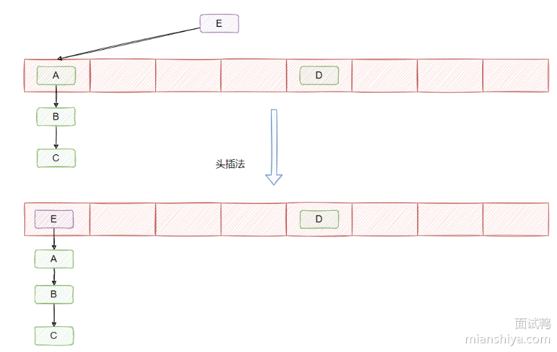

在多线程环境下，头插法可能导致链表形成环，特别在并发扩容的时候，当多个线程同时执行put()操作时，如果线程A在进行头插，线程B也在同一时刻操作链表，可能导致链表结构出现环路而引发死循环，最终导致程序卡死或无限循环。

在JDK1.8的时候改成了尾插法，并引入了红黑树。当链表长度大于等于8且数组大小等于64时，将链表转化为红黑树，红黑树节点小于6的时候，又会退化成链表。

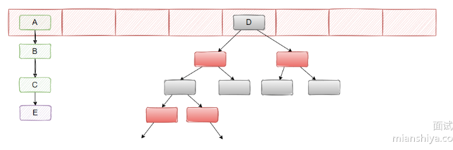

> ###### HashMap的扩容机制是怎样的？

**简单介绍**

HashMap 中的扩容是基于负载因子 (load factor) 来决定的。默认情清况下，HashMap 的负载因子为 0.75, 这意味着当 HashMap 的已存储元素数量超过当前容量的 75% 时，就会触发扩容操作。

例如，初始容量为 16, 负载因子为 0.75, 则扩容阈值为 16×0.75=12。当存入第 13 个元素时，HashMap就会触发扩容。

当触发扩容时，HashMap 的容量会扩大为当前容量的两倍。例如，容量从 16 增加到 32, 从 32 增加到 64 等。

扩容时，HashMap 需要重新计算所有元素的哈希值，并将它们重新分配到新的哈希桶中，这个过程称为 rehashing。每个元素的存储位置会根据新容量的大小重新计算哈希值，并移动到新的数组中。

**rehashing细节**

JDK1.7中，每个元素rehash一个个搬迁过去。JDK1.8中做了优化，关键点在于数组的长度是2的次方且扩容为2的倍数，其扩容前后差别在于高位多了一个1，且hash定位方法为`(n-1)&hash`，因此，**属于低位链表的哈希值留在原位置，而属于高位链表则在新数组中的位置就是原位置索引加上老数组长度**。

Java8 之后的扩容不需要每个节点重新 hash 算下标，因为元素的新位置只与高位有关，通过和老数组长度的 & 计算是否为 0 就能判断新下标的位置，因此链表中的元素可能只需要部分移动。这一优化减少了扩容时的计算开销。

**扩容优化考虑**
由于每次扩容都需要遍历当前所有元素而比较耗时，频繁扩容会造成性能下降。

因此，如果能预估到HashMap中会存储多少个数据，可以在创建的时候指定一个比较大的初始容量以减少扩容次数。

*场景题： 假设有一个 1G 大的 HashMap, 此时用户请求过来刚好触发它的扩容，会怎样？让你改造下 HashMap 的实现该怎样优化？*

若触发了它的扩容，则它需要新增一个比之前大2倍的数组并遍历元素将其搬运到新的数组上，用户请求会被阻塞，等待扩容完毕。
优化方案:
1. 渐进式rehash：将扩容过程分批完成，先创建新的数组，只rehash一部分旧数据，每次插入修改或查询的时候都检查当前是否有未完成的扩容任务，有则迁移少量数据到新数组中，知道完成所有数据的迁移，并通过状态字段记录扩容的进度。
2. 多线程改造：将扩容任务分成多个小段，每次迁移一部分桶，将扩容负担分散在多个线程和操作中，更新完成后更新迁移进度，所有桶都迁移完成后，替换表。

## 🚀 什么是Java的CAS(Compare-And-Swap)操作？

#### 💡 CAS是什么，工作原理是什么？

CAS 是一种**硬件级别的原子操作**，它比较内存中的某个值是否为预期值，如果是，则更新为新值，否则不做修改。

由于加锁比较消耗资源，计算机硬件层面给予支持，将比较和交换动作封装成一个指令，以保证原子性。需要三个操作数：旧的预期值，变量内存地址和新值。指令根据变量地址拿到值，比较是否和预期值相等，若相等则替换成新值，若不是则不替换。

**工作原理**:
- 比较 (Compare):CAS 会检查内存中的某个值是否与预期值相等。
- 交换 (Swap): 如果相等，则将内存中的值更新为新值。
- 失败重试：如果不相等，说明有其他线程已经修改了该值，CAS 操作失败，一般会利用重试，直到成功

#### 🔍 优缺点？

**优点**：
- 无锁并发：CAS 操作不使用锁，因此不会导致线程阻塞，提高了系统的并发性和性能
- 原子性：CAS 操作是原子的，保证了线程安全。
缺点:
- ABA 问题：CAS 操作中，如果一个变量值从 A 变成 B, 又变回 A, CAS 无法检测到这种变化，可能导致错误。
- 自旋开销：CAS 操作通常通过自旋实现，可能导致 CPU 资源浪费，尤其在高并发情况下。
- 单变量限制：CAS 操作仅适用于单个变量的更新，不适用于涉及多个变量的复杂操作。

**ABA问题**：
常见解决方法是：引入版本号或时间戳，每次更新变量同时更新版本号，从而检测变量的变化。

Java中的AtomicStampedReference提供了版本号解决方案，内部提供了Pair封装了引用和版本号，并利用volatile保证了可见性，使用示例如下：

```java
    private AtomicStampedReference<Integer> atomicStampedReference = new AtomicStampedReference<>(0, 0);

    public void updateValue(int expected, int newValue) {
        int[] stampHolder = new int[1];
        Integer currentValue = atomicStampedReference.get(stampHolder);
        int currentStamp = stampHolder[0];

        boolean updated = atomicStampedReference.compareAndSet(expected, newValue, currentStamp, currentStamp + 1);
        if (updated) {
            System.out.println("Value updated to " + newValue);
        } else {
            System.out.println("Update failed");
        }
    }
```

Java还提供了一个AtomicMarkableReference，原理与AtomicStampedReference类似，差别在于内部只要一个bool只，只能表示数据是否被修改过，而stamped中的stamp则是int，可以表现数据被修改了几次。

#### 🧠 CAS在Java中的实现

在 Java 中，CAS 操作由 sun.misc.Unsafe 类提供，但**该类是内部部类**，不推荐直接使用。具体是通过 JNI (Java Native Interface) 调用这些底层的硬件指令来实现 CAS 操作，从而确保操作的原子性。

在 Java 中，可以使用并发包中 Atomic 类 (如 Atomiclnteger、AtomicLong 等), 这些类封装了 CAS 操作，提供了线程安全的原子操作:

```java
 boolean updated = atomicInteger.compareAndSet(expected, newValue);
    if (updated) {
        System.out.println("Value updated to " + newValue);
    } else {
        System.out.println("Update failed");
    }
```

CAS 操作的底层实现依赖于硬件的原子指令，如 x86 架构上的 cmpxchg 指令。

在 JDK9 之前，会根据当前处理器是否是多处理器在 cmpxchg 前加上 lock 前缀，给对应写指令的内存区域加锁，使得其它处理器无法读写这块内存区域，保证指令执行的原子性。如果是单处理器则不会添加 lock 前缀指令。

但是 JDK9 移除了这个判断，直接添加 lock 前缀指令 (基本上市面上都是多处理器了)。

#### 👂 CAS总线风暴

lock 前缀指令会把写缓冲区中的所有数据立即刷新到主内存中。

在对称多处理器架构下，每个 cpu 都会通过嗅探总线来检查自己的缓存是否过期。如果某个 cpu 刷新自己的数据到主存，就会通过总线通知其它 cpu 过期对应的缓存，这就实现了内存屏障，保证了缓存一致性。

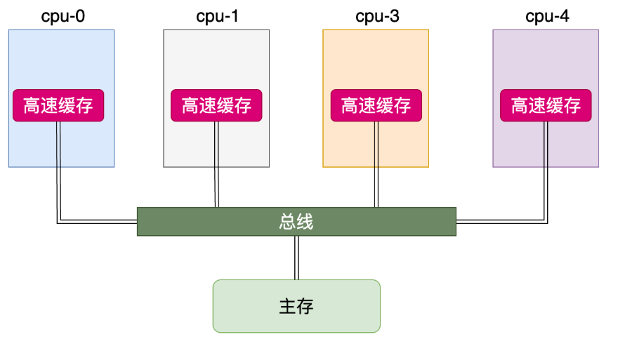

通过总线来回通信称为cache一致性流量，因为都需要通过总线通信，如果这个流量过大，总线就会称为瓶颈，导致本地缓存更新延迟。如果CAS修改同一个变量并发很高，就会导致总线风暴，这也是CAS高并发下的一个性能瓶颈。

## 🚀 你使用过哪些Java并发工具类？

#### 💡 简单说说有哪些Java并发工具类？

ConcurrentHashMap, AtomicInteger, Semaphore, CyclicBarrier, CountDownLatch, BlockingQueue等。

#### 🔍 ConcurrentHashMap

作用：是一个线程安全且高效的哈希表，支持并发访问。
用法：多个线程可以同时进行读写操作，而不会导致线程安全问题。

```java
ConcurrentHashMap<String, Integer> map = new ConcurrentHashMap<>();
map.put("key1", 1);
Integer value = map.get("key1");
map.computeIfAbsent("key2", k -> 2);
```

> ###### 机制

JDK1.7ConcurrentHashMap 采用的是分段锁，即每个 Segment 是独立的，可以并发访问不同的 Segment, 默认是 16 Segment, 所以最多有 16 个线程可以并发执行。

而 JDK1.8 移除了 Segment, 锁的粒度变得更加细化，锁只在链表或红黑树的节点级别上进行。通过 CAS 进行插入操作，只有在更新链表或红黑树时才使用 synchronized, 并且只锁住链表或树的头节点，进一步减少了锁的竞争，并发度大大增加。

并且 JDK1.7 ConcurrentHashMap 只使用了数组 + 链表的结构，而 JDK1.8 和 HashMap 一样引入了红黑树。

除此之外，还有扩容的区别以及 size 方法的计算也不一样。

> ###### ConcurrentHashMap1.7 图解

通过key的hash判断得到Segment数组下标后，将Segment上锁，再通过key的hash获取Segment中HashEntry下标，可以理解成每个Segment数组存放的是一个单独的HashMap。

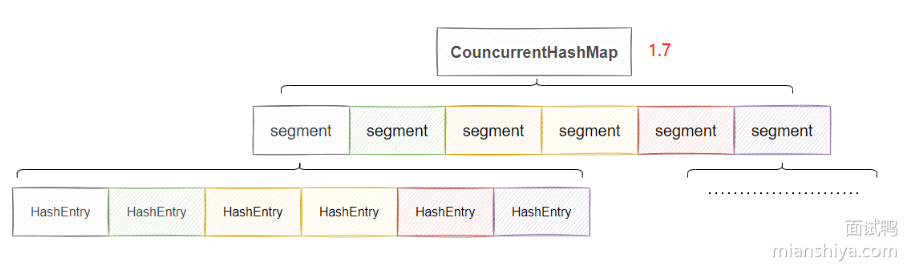

具体上锁方式源于Segment，这个类继承自ReentrantLock，因此它自身具备加锁的功能。

1.7的分段锁已经有了细化锁粒度的概念，它的缺陷在于Segment数组一旦初始化就不会扩容，只有HashEntry数组会扩容，导致并发度过于死板，不能随数据增加而提高并发度。

> ###### ConcurrentHashMap1.8 图解

1.8做了更细粒度的锁控制，可以理解为1.8 HashMap的数组每个位置都是一把锁，即使扩容了锁也会变多，并发度也会增加。

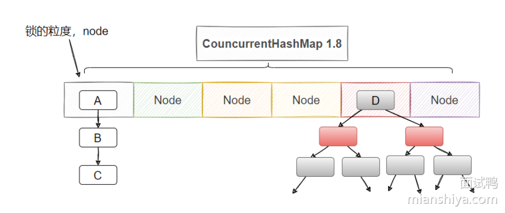

其中思想的转变就是把粒度更加细化，不再分段，直接把 Node 数组的每个节点分别上一把锁，并且 1.8 也不借助于 ReentrantLock 了，直接用 synchronized。

具体实现思路也简单：当塞入一个值的时候，先计算 key 的 hash 后的的下标，如果计算到的下标还未有Node, 那么就通过 CAS 塞入新的 Node。如果已经有 node 则通过 synchronized 将这个 node 上锁，这样别的线程就无法访问这个 node 及其之后的所有节点。然后判断 key 是否相等，相等则是替换 value, 反之则是新增一个 node, 这个操作和 HashMap 是一样的。

> ###### 扩容

JDK1.7中的扩容基于Segment，每个Segment维护自己的负载因子，某个Segment内HashMap达到阈值时单独为该Segment扩容。

JDK1.8中使用全局扩容，当任意元素超过阈值时，整个ConcurrentHashMap数组都会扩容。
在扩容时采用类似HashMap的方式，但通过**CAS操作**保证线程安全，避免锁住整个数组，扩容时多个线程可以同时帮助完成扩容操作。
使用渐进式扩容机制，并不是一次性将所有数据重新分配，而是多个线程共同参与，逐步迁移，降低扩容的性能开销。（维护一个transferIndex变量，用于记录迁移进度，多个线程通过CAS争抢未迁移的下标，抢到了就取执行对应下标的节点迁移工作）

> ###### size逻辑的区别

1.7中有尝试的思想，调用size方法时不加锁，尝试三次不加锁获取sum，若总数一样则返回，若不一样则说明有现成在增删map，于是加锁计算，其他线程就无法操作map了。

1.8中采用分治思想，类似LongAdder思想，搞了一个数组，每个线程在自己对应下标的地方进行累加，最后把数组中的数据统一，从而实现最终值。也就是平时的操作会维护map中节点的数量，通过CAS修改baseCount，若成功则返回，若失败则说明有线程在竞争，此时hash会选择一个CoounterCell对象进行修改，最终size结果是baseCount+所有CounterCell

#### 🔍 AtomicInteger

作用：提供一种线程安全的方式对 int 类型进行原子操作，如增减、比较。
用法：适用于需要频繁对数值进行无锁操作（CAS操作）的场景。

```java
AtomicInteger atomicInt = new AtomicInteger(0);
atomicInt.incrementAndGet(); // 递增
atomicInt.decrementAndGet(); // 递减
atomicInt.compareAndSet(1, 2); // 比较并设置
```

#### 🔍 Semaphore

Semaphore(信号量)是Java并发包中的一个同步工具类，用于管理一组许可，每个许可可以被一个线程持有。当许可被持有时，其他线程需要等待才能获得许可。即可以**限制同时访问特定资源的线程数量**，确保在特定时刻只有有限数量的线程才能够访问资源。

它支持**公平与非公平**策略：
**公平 (Fair)**: 在公平模式下，线程按照请求许可的顺序获取许可，防止线程饥饿。但公平模式可能会导致性能下降。
**非公平 (Unfair)**: 非公平模式下，线程不保证按照请求许可的顺序获取许可，可以提高性能，但可能会导致某些线程长时间无法获取许可。

作用：控制访问资源的线程数，可以用来实现限流或访问控制。
用法：在资源有限的情况下，控制同时访问的线程数量。

```java

// 使用
Semaphore semaphore = new Semaphore(3);
try {
    semaphore.acquire(); // 获取许可
    // 执行任务
} finally {
    semaphore.release(); // 释放许可
}

// 限制访问数量
Semaphore semaphore = new Semaphore(10);  // 允许最多10个线程访问
semaphore.acquire();
try {
    // 访问共享资源
} finally {
    semaphore.release();
}

// 控制并发执行
Semaphore semaphore = new Semaphore(5);  // 允许最多5个线程同时执行任务
for (int i = 0; i < 10; i++) {
    new Thread(() -> {
        try {
            semaphore.acquire();
            // 执行任务
        } catch (InterruptedException e) {
            Thread.currentThread().interrupt();
        } finally {
            semaphore.release();
        }
    }).start();
}
```

#### 🔍 CyclicBarrier

> ###### 定义与概念

CyclicBarrier 是一个同步辅助类，**允许一组线程在执行某个任务时相互等待，直到所有线程都到达屏障 (barrier) 之后才继续执行**。它的设计目的是解决多线程并发任务中需要要同步的场景，确保所有参与的线程都在特定的点上完成执行，然后一起继续后续的任务。

`屏障 (Barrier)`: 一个线程在调用 await() 方法时会被阻塞，直到所有参与的线程都到达屏障点。屏障点可以是一个特定的任务步骤。
`线程数量`：CyclicBarrier 需要的线程数量是预设的，当所有线程都到到达屏障时，屏障被释放，所有线程可以继续执行。
`重用性`：CyclicBarrier 可以被重用，允许在多个阶段中同步线程。例如，在每个阶段的同步点上都可以使用 CyclicBarrier。

作用：让一组线程到达一个共同的同步点，然后一起继续执行。常用于分阶段任务执行。
用法：适用于需要所有线程在某个点都完成后再继续的场景。

> ###### 用法与工作原理

构造函数：
`CyclicBarrier (int parties)`: 初始化一个 `CyclicBarrier` 对象，设置需要等待的线程数量
`CyclicBarrier (int parties, Runnable barrierAction)`: 除了设置线程数量外，还可以指定一个 Runnable 回调，在所有线程到达屏障后执行。

工作原理：

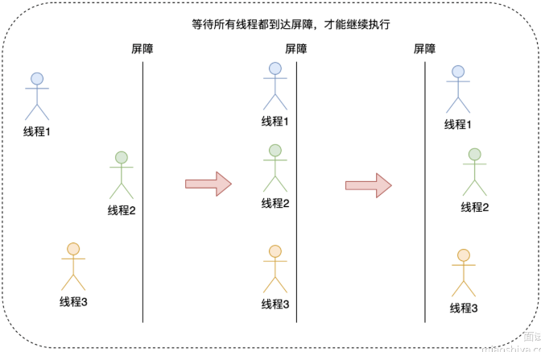

它实际上是基于 ReentrantLock 和 Condition 的封装来实现这一功能的。
`CyclicBarrier` 内部维护了一个计数器，即达到屏障的线程数量，当线程调用 await 的时候计数器会减一，如果计数器减一不等于 0 的时候，线程会调用 condition.await 进行阻塞等待。如果计数器减一的值等于 0, 说明最后一个线程也到达了屏障，于是如果果有 barrierAction 就执行 barrierAction, 然后调用 condition.signalAll 唤醒之前等待的线程，并且重置计数器，然后开启下一代，所以它可以循环使用。
在等待期间，如果屏障被打破 (即出现异常), 其他线程会被通知并抛出BrokenBarrierException异常。

```java
CyclicBarrier barrier = new CyclicBarrier(3, () -> {
    System.out.println("所有线程都到达了屏障点");
});
Runnable task = () -> {
    try {
        // 执行任务
        barrier.await(); // 等待其他线程
    } catch (Exception e) {
        e.printStackTrace();
    }
};
new Thread(task).start();
new Thread(task).start();
new Thread(task).start();
```

#### 🔍 CountDownLatch

> ###### 定义与概念

`CountDownLatch` 是 JUC 中的一个同步辅助类，它允许一个或多个线程等待，直到在其他线程中执行的一组操作完成。CountDownLatch 通过一个计数器来实现，计数器的初始值直由构造方法传入。每当一个线程完成工作后，计数器会递减。当计数器到达零时，所有等待的线程会被唤醒并继续执行。

**主要功能**:
1. 等待事件完成：通过 `await()` 方法，线程可以等待其他线程完成某其些操作。
2. 递减计数器：其他线程在完成各自的任务后，通过调用 `countDown()` 方法将计数器减 1。
3. 线程同步：当计数器变为 0 时，所有调用了 `await()` 的线程将被吗换醒并继续执行。

作用：一个线程 (或多个) 等待其他线程完成操作。
用法：适用于主线程需要等待多个子线程完成任务的场景。

> ###### 内部实现原理

`CountDownLatch` 的内部使用 `AbstractQueuedsynchronizer` (AQS) 实现。计数器的递减操作本质上是通过 AQS 来实现同步机制的。
当调用 `countDown()` 时，内部的 state 值减少，并在 `await()` 中通过检查 state 是否为 0 来决定是否唤醒等待线程。

注意:
由于 `CountDownLatch` 无法重用，它适合用于一次性的任务完成同步。如果需要重复使用，需要使用 `CyclicBarrier` 或其他机制。

```java
import java.util.concurrent.CountDownLatch;

public class CountDownLatchExample {
    public static void main(String[] args) throws InterruptedException {
        // 计数器为 3，表示需要等待 3 个任务完成
        CountDownLatch latch = new CountDownLatch(3);

        // 启动 3 个线程来执行任务
        for (int i = 1; i <= 3; i++) {
            new Thread(() -> {
                System.out.println(Thread.currentThread().getName() + " 执行任务");
                latch.countDown();  // 每个线程执行完任务后递减计数器
            }).start();
        }

        System.out.println("等待所有任务完成...");
        latch.await();  // 主线程等待所有任务完成
        System.out.println("所有任务已完成，继续执行主线程");
    }
}
```

> ###### 使用场景

- **并行计算结果汇总**：可以用于汇聚多个线程的结果，等所有子任务完成后再执行后续逻辑。
- **任务完成信号**：在某些场景下，需要多个任务都完成后才能继续执行后续逻辑，比如在应用启动时，等待所有服务启动后再提供服务。
- **测试并发场景**：在编写并发测试时，利用 CountDownLatch 可以确保多个线程在某一时刻同时开始执行，测试并发场景下的行为。

其与CyclicBarrier对比可看出，CountDownLatch一次性使用，而CyclicBarrier可以重复使用，所有线程达到屏障后会自动重置。

#### 🔍 BlockingQueue

作用：是一个线程安全的队列，支持阻塞操作，适用于生产者-消费者模式
用法：生产者线程将元素放入队列，消费者线程从队列中取元素，队列为空时消费者线程阻塞。

```java
BlockingQueue<String> queue = new LinkedBlockingQueue<>();
Runnable producer = () -> {
    try {
        queue.put("item"); // 放入元素
    } catch (InterruptedException e) {
        e.printStackTrace();
    }
};
Runnable consumer = () -> {
    try {
        String item = queue.take(); // 取出元素
    } catch (InterruptedException e) {
        e.printStackTrace();
    }
};
new Thread(producer).start();
new Thread(consumer).start();
```

#### 🔍 StampedLock

> ###### 定义与概念 

`StampedLock` 是 Java8 引入的一个锁机制，与传统的 `Reentraantlock` 和 `ReadwriteLock` 相比，`StampedLock` 通过引入乐观读锁和时间戳 (stamp) 的概念，提升了读写性能，尤其是在读多写少的场景下。

**核心特性**:
1. **写锁** (write lock): 独占模式的锁，和 ReentrantLock 类似，保证写操作的排他性。(用于修改共享资源，多个线程无法同时持有)
2. **悲观读锁** (read lock): 共享模式的锁，多个线程可以同时持有读钱，但写锁需要等待。(保证数据一致性，适合写操作比较多的场景)
3. **乐观读锁** (optimistic read lock): 无需阻塞的读锁机制，允许在没有竞争的情况下进行快速读取。当检测到有写操作发生时，才会回退到悲观读锁或重试。(适用于读多写少场景，可以在大部分时间无锁读取，大大提高性能)

**时间戳** (stamp):
每个锁操作都会返回一个 stamp, 代表了锁的状态，后续操作需要根据这个 stamp 来验证锁是否有效。

> ###### 内部原理

`StampedLock` 通过一个长整型值来管理状态，低位用于表示锁的类型 (写锁、读锁), 高位用于表示锁的计数。当乐观读锁被获取时，生成一个时间戳 (stamp), 并在后续验证时判断是否有写操作发生。
`validate(stamp)` 方法可以有效判断在持有乐观读锁的情况下，是否有其他写操作干扰(被修改了), 从而决定是否要变为悲观读锁。

```java
import java.util.concurrent.locks.StampedLock;

public class StampedLockExample {
    private double x, y;
    private final StampedLock lock = new StampedLock();

    // 写操作：移动坐标
    public void move(double deltaX, double deltaY) {
        long stamp = lock.writeLock();  // 获取写锁
        try {
            x += deltaX;
            y += deltaY;
        } finally {
            lock.unlockWrite(stamp);  // 释放写锁
        }
    }

    // 悲观读操作：获取坐标
    public double distanceFromOrigin() {
        long stamp = lock.readLock();  // 获取读锁
        try {
            return Math.sqrt(x * x + y * y);
        } finally {
            lock.unlockRead(stamp);  // 释放读锁
        }
    }

    // 乐观读操作：获取坐标
    public double optimisticDistanceFromOrigin() {
        long stamp = lock.tryOptimisticRead();  // 获取乐观读锁
        double currentX = x, currentY = y;
        if (!lock.validate(stamp)) {  // 检查乐观读锁是否被其他写操作干扰
            stamp = lock.readLock();  // 回退到悲观读锁
            try {
                currentX = x;
                currentY = y;
            } finally {
                lock.unlockRead(stamp);  // 释放读锁
            }
        }
        return Math.sqrt(currentX * currentX + currentY * currentY);
    }
}
```

> ###### 优缺点

优点:
- 乐观读模式提供了更高效的并发读操作，避免了传统锁机制下的线程阻塞。
- 更灵活的锁机制，允许不同的锁模式进行切换，适合不同场景。
缺点:
- 不可重入: StampedLock 是非重入锁，这意味着同一个线程不能在持有锁时再次获取同类型的锁，否则会造成死锁。
- 读锁饥饿：在高写入负载的场景下，悲观读锁可能会被长期阻塞，导致读操作饥饿。
- CPU 飙升风险：如果线程使用 `WriteLock()` 或者 `readLock()` 获得锁之后，线程还没执行完就被 `interrupt()` 的话，会导致 CPU 飙升，需要用 `readLockinterruptibly` 或者 `writelockinterruptibly`

#### 🔍 ReentrantLock

> ###### 概念与图解

ReentrantLock 其实就是基于 AQS 实现的一个可重入锁，支持公平和非公平两种方式。

内部实现依靠一个 state 变量和两个等待队列：同步队列和等待队列。

利用 CAS 修改 state 来争抢锁。

争抢不到则入同步队列等待，同步队列是一个双向链表。

条件 condition 不满足时候则入等待队列等待，是个单向链表。

是否是公平锁的区别在于：线程获取锁时是加入到同步队列尾部还是直接利用 CAS 争抢锁。

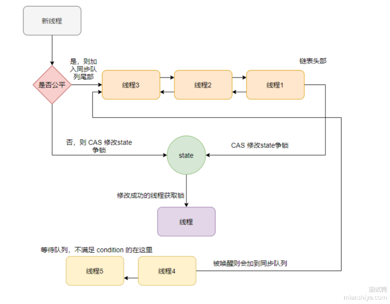

> ###### 自旋锁是什么？

ReentrankLock结合了自旋锁和阻塞锁的特性。

自旋锁(Spinlock) 是一种**轻量级的锁机制**，线程在获取锁失败时不会立即进入阻塞状态，而是会在循环中反复尝试获取锁，直到成功，这种方式避免了线程的上下文切换开销，因此称为轻量级锁，**适用于锁等待时间比较短的场景**。

以下是简单自旋锁的实现：
```java
public class SpinLock {
    private final AtomicBoolean lock = new AtomicBoolean(false);

    public void lock() {
        while (!lock.compareAndSet(false, true)) {
            // 自旋等待
        }
    }

    public void unlock() {
        lock.set(false);
    }
    
 }
```

虽然能避免线程上下文切换的开销，但其也有两点缺点：
- 锁饥饿问题：高并发场景，可能存在某个线程一直 CAS 失败，争抢不到锁。
- 性能问题：多核处理器如果对同一变量高并发进行 CAS 操作，会导致总线风暴问题。

> ###### CLH

针对自旋锁的问题，演进出一种基于队列的自旋锁即 CLH (Craig, Landin,and Hagersten), 它适用于多处理器环境下的高并发场景。

原理是通过维护一个**隐式队列**（不同线程间没有真正的指针，仅仅利用AtomicReferenc+ThreadLocal实现隐式关联），使线程在等待锁时自旋在本地变量上，从而减少了对共享变量的争用和缓存一致性流量。

它将争抢的线程组织成一个队列，通过排队的方式按序争抢锁。且每个线程不再 CAS 争抢一个变量，而是自旋判断排在它前面线程的状态，如果前面的线程状态为释放锁，那么后续的线程则抢锁。因此，CLH通过排队按需争抢解决了锁饥饿问题，通过CAS自旋监听前面线程的状态，避免总线风暴问题的产生。

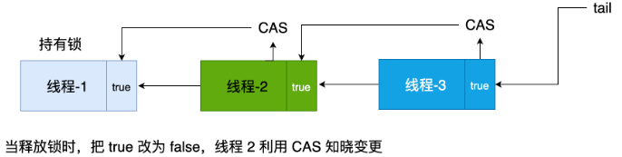

```java

public class CLHLock {
    private static class CLHNode {
        volatile boolean isLocked = true; // 默认加锁状态
    }

    private final ThreadLocal<CLHNode> currentNode;
    private final ThreadLocal<CLHNode> predecessorNode;
    private final AtomicReference<CLHNode> tail;

    public CLHLock() {
        this.currentNode = ThreadLocal.withInitial(CLHNode::new);
        this.predecessorNode = new ThreadLocal<>();
        this.tail = new AtomicReference<>(new CLHNode());
    }

    public void lock() {
        CLHNode node = currentNode.get();
        CLHNode pred = tail.getAndSet(node);
        predecessorNode.set(pred);

        // 自旋等待前驱节点释放锁
        while (pred.isLocked) {
        }
    }

    public void unlock() {
        CLHNode node = currentNode.get();
        node.isLocked = false; // 释放锁
        currentNode.set(predecessorNode.get()); // 回收当前节点
    }
}
```

但CLH的缺点在于，占用CPU资源，自旋期间一直会占用CPU资源，适用于锁等待时间较短的场景。

> ###### AQS对CLH的改造

因为 CLH 有占用 CPU 资源问题，因此 AQS 将自旋等待前置节点改成了阻塞线程。
而后续的线程阻塞就无法主动发现前面的线程释放锁，因此前面线程需要需要**通知后续线程锁被释放了**。
所以 AQS 的变型版 CLH 需要显式地维护一个队列，且是一个双向列表实现，因为前面线程需要通知后续线程。
且前面线程如果等待超时或主动取消后，需要从队列中移除，且后面线程需要"顶"上来。

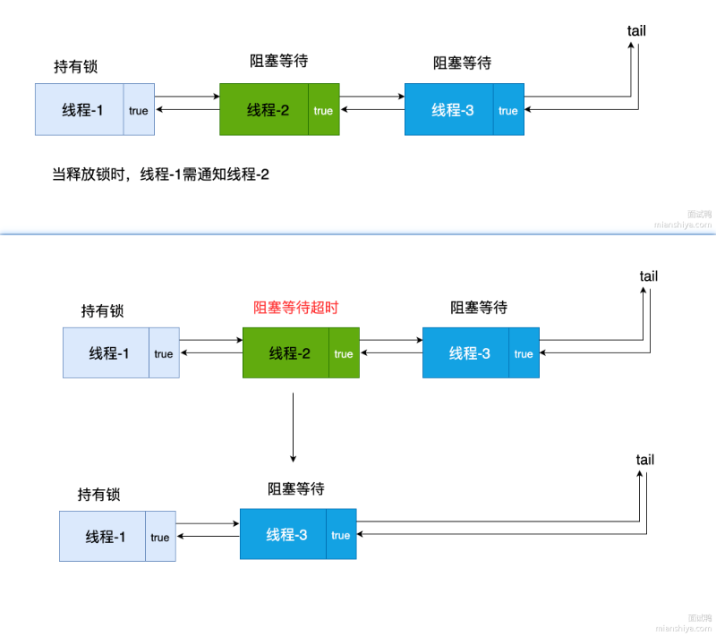

在AQS中，线程等待状态有以下几种：
- 0, 初始化的时候的默认值
- CANCELLED, 值为 1, 由于超时、中断或其他原因，该节点被取消
- SIGNAL, 值为 -1, 表示该节点准备就绪，正常等待资源
- CONDITION, 值为 -2, 表示该节点位于条件等待队列中
- PROPAGATE, 值为 -3, 当处在 SHARED 情况下，该字段才有用，将 releaseShared 动作需要传播到其他节点

#### 🔍 CompletableFuture

> ###### 概念与特性

`CompletableFuture` 是 Java8 引入的一个强大的异步编程工具。允许非阻塞地处理异步任务，并且可以通过**链式调用组合**多个异步操作。

**核心特性**:
1. 异步执行：使用 runAsync () 或 supplyAsync () 方法，可以非阻塞地执行任务。
2. 任务的组合：可以使用 thenApply()、thenAccept() 等方法在任务务完成后进行后续操作，支持链式调用。
3. 异常处理：提供 exceptionally()、handle() 等方法来处理异步任务中的异常。
4. 并行任务：支持多个异步任务的组合，如 thencombine()、allof() 等方法，可以在多个任务完成后进行操作。
5. 非阻塞获取结果：相比 Future, CompletableFuture 支持通过回调函数获取结果，而不需要显式的阻塞等待。

> ###### 使用实例

**创建异步任务**

```java
CompletableFuture<Void> future1 = CompletableFuture.runAsync(() -> {
    // 创建异步任务，不返回结果
});

CompletableFuture<String> future2 = CompletableFuture.supplyAsync(() -> {
    // 异步任务并返回结果
    return "Hello, mianshiya.com!";
});
```

**任务完成回调**

```java

// thenApply 在任务完成后对任务结果进行转换返回
CompletableFuture<String> future = CompletableFuture.supplyAsync(() -> "Hello")
    .thenApply(result -> result + " mianshiya.com");
    
// thenAccept 在任务完成后对结果进行消费，但不返回结果
CompletableFuture<Void> future = CompletableFuture.supplyAsync(() -> "Hello")
    .thenAccept(result -> System.out.println(result));
    
// thenRun 在任务完成后执行一个操作，但不需要使用任务结果
CompletableFuture<Void> future = CompletableFuture.supplyAsync(() -> "Hello")
.thenRun(() -> System.out.println("Task finished"));

```

**任务组合**

```java
CompletableFuture<String> future1 = CompletableFuture.supplyAsync(() -> "Hello");
CompletableFuture<String> future2 = CompletableFuture.supplyAsync(() -> "面试鸭");

// thenCombine: 合并两个CompletableFuture的结果
CompletableFuture<String> combinedFuture = future1.thenCombine(future2, (result1, result2) -> result1 + " " + result2);

// thenCompose：将一个CompletableFuture的结果作为另一个CompletableFuture的输入
CompletableFuture<String> future = CompletableFuture.supplyAsync(() -> "Hello")
    .thenCompose(result -> CompletableFuture.supplyAsync(() -> result + " 面试鸭"));
```

**异常处理**

```java
// exceptionally 在任务发生异常时提供默认值
CompletableFuture<String> future = CompletableFuture.supplyAsync(() -> {
    if (true) {
        throw new RuntimeException("Exception");
    }
    return "Hello";
}).exceptionally(ex -> "面试鸭");

// handle 在任务发生异常时进行处理
CompletableFuture<String> future = CompletableFuture.supplyAsync(() -> {
    if (true) {
        throw new RuntimeException("Exception");
    }
    return "Hello";
}).handle((result, ex) -> {
    if (ex != null) {
        return "Default Value";
    }
    return result;
});
```

**并行处理**

```java
// allOf: 等待多个CompletableFuture全部完成
CompletableFuture<Void> allFutures = CompletableFuture.allOf(future1, future2);
allFutures.thenRun(() -> System.out.println("面试鸭 tasks finished"));

// anyOf: 等待任意一个完成
CompletableFuture<Object> anyFuture = CompletableFuture.anyOf(future1, future2);
anyFuture.thenAccept(result -> System.out.println("面试鸭 task finished with result: " + result));
```

> ###### 与Future的区别：

`Future`是 Java5 引入的接口，提供了基本的异步处理功能，但它的局限性在于只能通过 get() 方法阻塞获取结果，无法链式调用多个任务，也缺少异常处理机制。

`CompletableFuture` 是 Future 的增强版，提供了非阻塞的结果处理、任务组合和异常处理，使得异步编程更加灵活和强大。

> ###### 异步执行自定义线程池

默认情况下，CompletableFuture使用ForkJoinPool作为线程池，可以通过自定义线程池提供性能或满足特定的并发需求。

```java
Executor executor = Executors.newFixedThreadPool(10);
CompletableFuture.supplyAsync(() -> "result", executor);
```

## 🚀 你了解Java线程池的原理吗？

#### 💡 线程池是什么？工作原理是什么？

线程池是一种池化技术，用于预先创建并管理一组线程，避免频繁创建和销毁线程的开销，提高性能和响应速度。

它几个关键的配置包括：`核心线程数`、`最大线程数`、`空闲存活时间`、`工作队列`、`拒绝策略`。

主要工作原理如下:
1. 默认情况下线程不会预创建，任务提交之后才会创建线程 (不过设置 prestartAllCoreThreads 可以预创建核心线程)。
2. 当核心线程满了之后不会新建线程，而是把任务堆积到工作队列中。
3. 如果工作队列放不下了，然后才会新增线程，直至达到最大线程费数。
4. 如果工作队列满了，然后也已经达到最大线程数了，这时候来任务务会执行拒绝策略
5. 如果线程空闲时间超过空闲存活时间，并且当前线程数大于核心线程数的则会销毁线程，直到线程数等于核心线程数 (设置 allowCoreThreadTimeOut 为 true 可以回收核心线程，默认为 false)。

#### 📌 图解线程池？

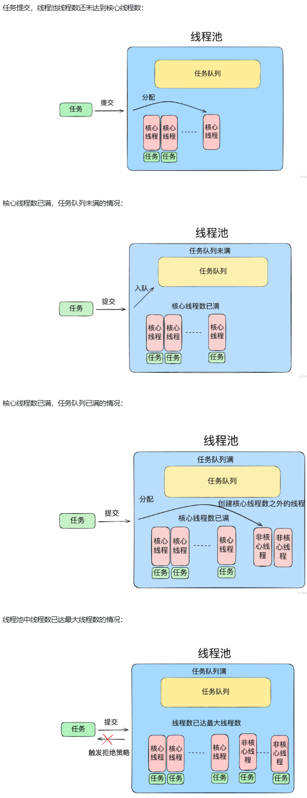

#### 🔍 线程池相关参数的解释 & 工作队列类型？

`corePoolSize`: 核心线程数，即线程池中始终保持的线程数量。
`maximumPoolSize`: 最大线程数，即线程池中允许的最大线程数量。
`keepAliveTime`: 线程空闲时间，超过这个时间的非核心线程会被销毁。
`workQueue`: 任务队列，存放待执行的任务。
`threadFactory`: 线程工厂，用于创建新线程。
`rejectedExecutionHandler`: 任务拒绝处理器，当任务无法执行时的处理策略。

`SynchronousQueue`: 不存储任务，直接将任务提交给线程。
`LinkedBlockingQueue`: 链表结构的阻塞队列，大小无限。
`ArrayBlockingQueue`: 数组结构的有界阻塞队列。
`PriorityBlockingQueue`: 带优先级的无界阻塞队列。

#### 🔍 Java并发库中提供了哪些线程池实现？他们有啥区别？

Java并发库中提供了五种常见的线程池实现，一般通过Executors工具类来创建。

1) `FixedThreadPool`: 创建一个固定数量的线程池。
线程池中的线程数是固定的，空闲的线程会被复用。如果所有线程早都在忙，则新任务会放入队列中等待。
适合**负载稳定**的场景，任务数量确定且不需要动态调整线程数。
2) `CachedThreadPool`: 一个可以根据需要创建新线程的线程池。
线程池的线程数量没有上限，空闲线程会在 60 秒后被回收，如果有新任务且没有可用线程，会创建新线程。
适合**短期大量并发任务**的场景，任务执行时间短且线程数需求变化较大。
3) `SingleThreadExecutor`: 创建一个只有单个线程的线程池。
只有一个线程处理任务，任务会按照提交顺序依次执行。
适用于需要**保证任务按顺序执行**的场景，或者不需要并发处理任务的情况
4) `ScheduledThreadPool`: 支持定时任务和周期性任务的线程池。
可以定时或以固定频率执行任务，线程池大小可以由用户指定。
适用于需要**周期性任务执行**的场景，如定时任务调度器。
5) `WorkStealingPool`: 基于任务取算法的线程池。
线程池中的每个线程维护一个双端队列 (deque), 线程可以从自己的队列中取任务执行。如果线程的任务队列为空，它可以从其他线程的队列中 "窃取" 任务来执行，达到负载均衡的效果。
适合**大量小任务并行执行，更好地利用CPU资源**，特别是递归算法或大任务分解成小任务的场景。

#### 🔍 Java线程池有哪些拒绝策略？

一共提供了四种拒绝策略：
1) `AbortPolicy`, 当任务队列满且没有线程空闲，此时添加任务会直接抛出 `RejectedExecutionException` 错误，这也是默认的拒绝策略。适用于必须通知调用者任务未能被执行的场景。
2) `CallerRunsPolicy`, 当任务队列满且没有线程空闲，此时添加任务由其调用者线程执行。适用于希望通过减缓任务提交速度来稳定系统的场景。
3) `DiscardOldestPolicy`, 当任务队列满且没有线程空闲，会删除最早的任务，然后重新提交当前任务。适用于希望丢弃最旧的任务以保证新的重要任务能够被处理的场景。
4) `DiscardPolicy`, 直接丢弃当前提交的任务，不会执行任何操作，也不会抛出异常。适用于对部分任务丢弃没有影响的场景，或系统负载较高时不需要处理所有任务。

举例，可以实现了RegectedExecutionHandler接口来定义自定义的拒绝策略，例如，记录日志或将任务重新排队。

```java
public class CustomRejectedExecutionHandler implements RejectedExecutionHandler {
    @Override
    public void rejectedExecution(Runnable r, ThreadPoolExecutor executor) {
        System.out.println("mianshiya.com Task " + r.toString() + " rejected");
        // 可以在这里实现日志记录或其他逻辑
    }
}
```

#### 🧠 为什么线程池要使用阻塞队列，而不是直接增加线程？

因为每创建一个线程都会占用一定的系统资源 (如栈空间、线程调度开销等), 直接增加线程会迅速消耗系统资源，导致性能下降。

使用阻塞队列可以将任务暂存，避免线程数量无限增长，确保资原利用率更高。

如果阻塞队列都满了，说明此时系统负载很大，再去增加线程到最大线程数去消化任务即可。

## 🚀 说说AQS吧？

#### 💡 简单说说AQS？

简单来说 AQS 就是起到了一个抽象、封装的作用，将一些排队、入队、加锁、中断等方法提供出来，便于其他相关 JUC 锁的使用，具体加锁时机、入队时机等都需要实现类自己控制。

它主要通过维护一个共享状态 (state) 和一个先进先出 (FIFO) 的等待队列，来管理线程对共享资源的访问。

state 用 volatile 修饰，表示当前资源的状态。例如，在独占锁中，state 为 0 表示未被占用，为 1 表示已被占用。

当线程尝试获取资源失败时，会被加入到 AQS 的等待队列中。这个队列是一个变体的 CLH 队列，采用双向链表结构，节点包含线程的引用、等待状态以及前驱和后继节点的指针。

AQS 常见的实现类有 `Reentrantlock`、`CountDownlatch`、`Semaphore` 等等。

#### 🔍 AQS的核心机制包括哪些？

1) 状态 (status)

AQS通过一个volatile类型的整数state来表示同步状态，子类通过getStatus(), setStatus(int) 和 compareAndSetStatus(int, int)方法来检查和修改该状态。

状态可以有很多含义，在ReentrantLock中，状态标识锁的重入次数，在Semaphore中，状态标识可用的许可数。

2) 队列 (Queue)

AQS维护了一个FIFO的等待队列，用于管理等待获取同步状态的线程，每个节点 (Node) 代表一个等待的线程，节点之间通过next和prev指针链接。

```java
static final class Node {
    static final Node SHARED = new Node();
    static final Node EXCLUSIVE = null;
    volatile int waitStatus;
    volatile Node prev;
    volatile Node next;
    volatile Thread thread; // 保存等待的线程
    Node nextWaiter;
    .....
}
```

当一个线程获取同步状态失败时，它会被添加到等待队列中，并自旋等待或被阻塞，知道前面的线程释放同步状态。

3) 独占模式和共享模式

- 独占模式：只有一个线程能获取同步状态，例如ReentrantLock。
- 共享模式：多个线程可用同时获取同步状态，例如Semaphore和ReadWriteLock

#### 🧠 AQS整体架构

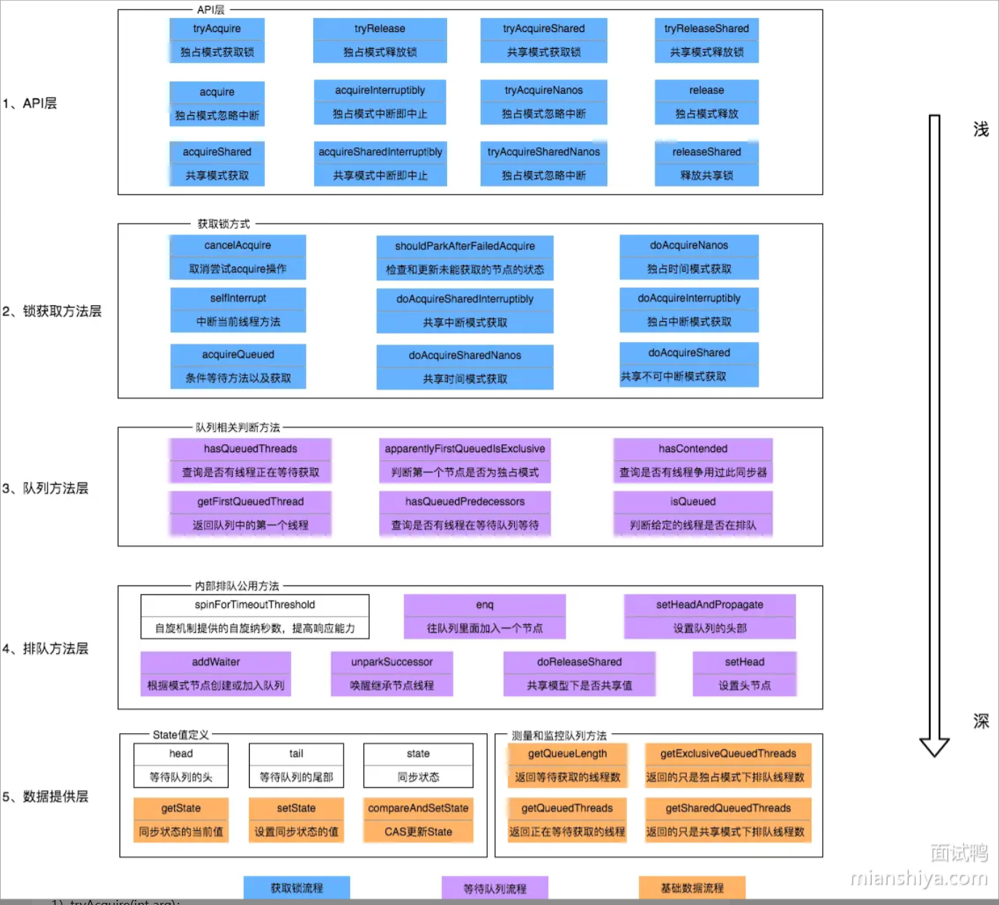

一般实现类仅需重写图中的 API 层，来控制加锁和入队等时机 (仅关注这层就够了，其他 AQS 都封装好了)。具体如何获取到锁由上图第二层的方法提供，如果未获取到锁，则进入排队层。然后上述从 API 层到排队层都依赖数据层提供的支持。

关键方法介绍，子类通过重写这些方法来实现特定的同步器:
1) tryAcquire (int arg):
尝试以独占模式获取同步状态。由子类实现，返回 true 表示获取成功返回 false 表示获取失败。
2) tryRelease (int arg):
尝试以独占模式释放同步状态。由子类实现，返回 true 表示释致成功，返回 false 表示释放失败。
3) tryAcquireShared (int arg):
尝试以共享模式获取同步状态。由子类实现，返回一个非负数表示获取成功，返回负数表示获取失败失败。
4) try ReleaseShared (int arg):
尝试以共享模式释放同步状态。由子类实现，返回 true 表示释放成功返回 false 表示释放失败。
5) isHeldExclusively ():
判断当前线程是否以独占模式持有同步状态。由子类实现，返回 true 表示当前线程持有同步状态，返回 false 表示没有持有。

#### 🧠 手撕一个基于AQS实现的独占锁

```java

public class SimpleLock {
    private static class Sync extends AbstractQueuedSynchronizer {
        @Override
        protected boolean tryAcquire(int acquires) {
            if (compareAndSetState(0, 1)) {
                setExclusiveOwnerThread(Thread.currentThread());
                return true;
            }
            return false;
        }

        @Override
        protected boolean tryRelease(int releases) {
            if (getState() == 0) throw new IllegalMonitorStateException();
            setExclusiveOwnerThread(null);
            setState(0);
            return true;
        }

        @Override
        protected boolean isHeldExclusively() {
            return getState() == 1;
        }

        final ConditionObject newCondition() {
            return new ConditionObject();
        }
    }

    private final Sync sync = new Sync();

    public void lock() {
        sync.acquire(1);
    }

    public void unlock() {
        sync.release(1);
    }

    public boolean isLocked() {
        return sync.isHeldExclusively();
    }

    public Condition newCondition() {
        return sync.newCondition();
    }
}

```

ReentrantLock源码中，锁的实现也是定义了一个Sync类继承了AbstracQueuedSynchronizer类，包括其中的tryAcquire, tryRelease, isHeldExclusively等方法。

nonfairTryAcquire申请锁方法源码分析：

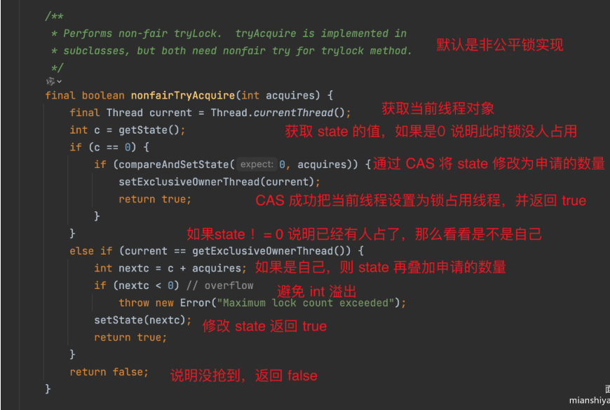

tryRelease释放锁方法：

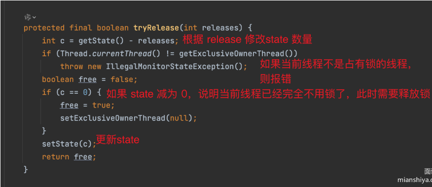

tryAcquire申请公平锁方法源码分析：

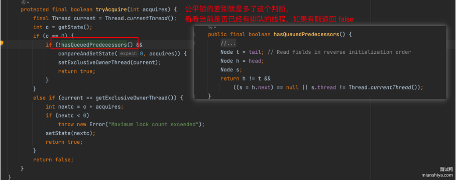

强制加锁，若未抢到则入队的过程：

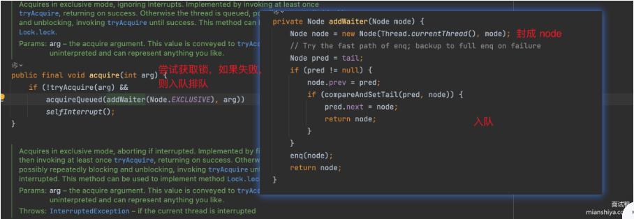

## 🚀 Synchronized和ReentrantLock有什么区别？

#### 💡 简要回答一下？

`Synchronized` 是 Java 内置的关键字，实现基本的同步机制，不支持超时，非公平，不可中断，不支持多条件。
`ReentrantLock` 是 JUC 类库提供的，由 JDK1.5 引入，支持设置超时时间，可以避免死锁，比较灵活，并且支持公平锁，可中断，支持多条件判断。
`ReentrantLock` 需要手动解锁，而 Synchronized 不需要，它们都是可重入锁。

一般情况下用 `Synchronized` 足矣，比较简单，而 `ReentrantLock` 比较变灵活，支持的功能比较多，所以复杂的情况用`ReentrantLock`.

从性能上看，很多年前，Synchronized 性能不如 ReentrantLock, 现在基本上性能是一致的。

#### 🔍 Java的synchronized是怎么实现的？

> ###### 概念与原理

`synchronized` 实现原理依赖于 JVM 的 `Monitor` (监视器锁) 和 `Object Header` (对象头)

当 `synchronized` 修饰在方法或代码块上时，会对特定的对象或类加锁，从而确保同一时刻只有一个线程能执行加锁的代码块。

- synchronized 修饰方法：会在方法的访问标志中增加一个 `ACC_SYNCHRONIZED` 标志。每当一个线程访问该方法时，JVM 会检查方法的访问标志。如果包含`ACC_SYNCHIRONIZED` 标志，线程必须先获得该方法对应的对象的监视器锁 (即对象锁), 然后才能执行方该方法，从而保证方法的同步性。
- synchronized 修饰代码块：会在代码块的前后插入 `monitorenter` 和 `monitorexit` 字节码指令。可以把 `monitorenter` 理解为加锁，`monitorexit` 理解为解锁。

> ###### 锁的升级与优化

为了提高 `synchronized` 的性能，JVM 从 JDK1.6 开始引入了锁的优化机制，包括**偏向锁**、**轻量级锁**、**重量级锁**，这些状态会根据线程的竞争情况进行动态升级或降线级。

**偏向锁**
在没有锁竞争的情况下，锁总是 "偏向" 于第一个获得它的线程。偏向锁通过减少不必要的 CAS 操作来提高性能。
- 加锁过程：当线程第一次请求锁时，JVM 会将该线程的 ID 记录在对象头的 Mark Word 中，表示锁偏向于该线程。后续该线程再进入该锁时，无需进行额外的同步操作。
- 撤销偏向锁：如果在偏向锁持有期间，另一个线程请求同一把锁，JVM 会撤销偏向锁，并升级为轻量级锁。

**轻量级锁**
轻量级锁适用于多个线程短时间内争用同一锁的场景。
- 加锁过程：当线程进入同步块时，JVM 会在当前线程的栈帧中创建个锁记录 (Lock Record), 并将对象头中的 Mark Word 拷贝到锁记录中。**线程尝试使用 CAS 操作将对象头中的 Mark Word 更新为指向锁记录的指针**。如果成功，则表示该线程获取了锁；如果失败，则表示其他线程已经持有该锁，此时锁会升级为重量级锁。
- 解锁过程：线程退出同步块时，JVM 会将对象头中的 Mark Word 恢复为原始值。

**重量级锁** (Heavyweight Locking)
当锁竞争激烈时，JVM 会升级为重量级锁，重量级锁使用操作系统的**互斥量 (Mutex)** 机制来实现线程的阻塞与唤醒。
- 加锁过程：如果线程无法通过轻量级锁获取锁，JVM 会将该锁升级为重量级锁，并将当前线程阻塞。
- 解锁过程：当线程释放重量级锁时，JVM 会唤醒所有阻塞的线程，允许它们再次尝试获取锁。

**锁升级总结**:
- 偏向锁：当一个线程第一次获取锁时，JVM 会将该线程标记为 "偏向" 状态，后续若该线程再获取该锁，几乎没有开销。
- 轻量级锁：当另一个线程尝试获取已经被偏向的锁时，锁会升级为转轻量级锁，使用 CAS 操作来减少锁竞争的开销。
- 重量级锁：当 CAS 失败无法获取锁，锁会升级为重量级锁，线程会被挂起，直到锁被释放

> ###### Sychronized的可重入性

schronized是可重入的，每获取一次锁，计数器加一，释放锁时计数器减一，直到计数器为0，才真正释放。

> ###### Sychronized的可重入性

锁消除：JVM 会通过逃逸分析判断对象是否只在当前线程使用，如果是，那么会消除不必要的加锁操作。
锁粗化：当多个锁操作频繁出现时，JVM 会将这些锁操作合并，减少锁获取和释放的开销。

> ###### 重量级锁的实现原理深入分析

Synchronized 关键字可以修饰代码块，实例方法和静态方法，**本质上都是作用于对象上**。

代码块作用于括号里面的对象，实例方法是当前的实例对象即this，而静态方法就是当前的类。

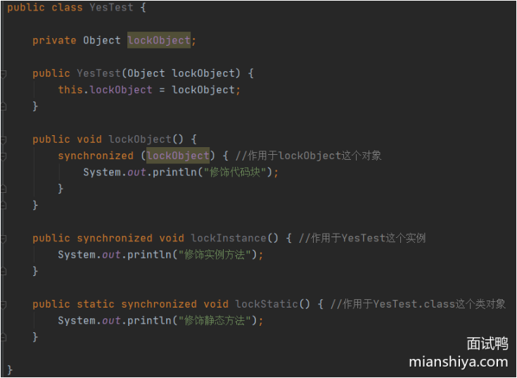

这里有个**临界区**的概念，索德村庄是因为有共享资源的存在，多个线程想要获得这个共享资源，所以就划分了这个区域，操作共享资源的代码就在区域内部，这个需要获得锁才能进入的区域，就是**临界区**。

**当用Synchronizd修饰代码块时**，此时编译得到的字节码会有monitorenter和monitorexit指令，其中enter就是要进入临界区了，此时线程尝试去获取与被修饰对象关联的monitor（监视器）的所有权，获取成功就相当于拿到锁了。而sychronized不需要手动解锁的原因，其实是在编译器生成字节码时，已经自动帮我们插入了monitorexit这类的代码。

**当用synchronzed修饰方法时**，与修饰代码块本质上一样，在 flag 上标记 ACC_SYNCHRONIZED, 在运行时常量池中通过 ACC_SYNCHRONIZED 标志来区分，这样 JVM 就知道这个方法是被 syrchronized 标记的，于是在进入方法的时候就会进行执行争锁的操作，一样只有拿到锁才能继续执行。不论是正常退出还是异常退出，都会进行解锁的操作，所以本质还是一样的。

synchronized是作用于对象身上的。在Java中，对象结构分为对象头，实例数据和对齐填充，对象头又分为MarkWord, klass pointer, 数组长度(只有数组长度)。

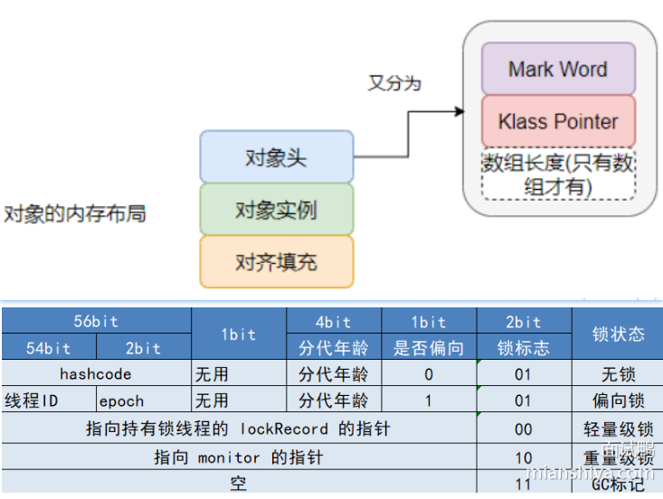

对于MarkWord，将其结构做的如此复杂的原因是，需要**节省内存**，让同一个内存区域在不同阶段有不同的用处。如图所示，在重量级锁时，对象头的锁标记为10，并且会有一个指针指向这个monitor对象，而这个monitor就是监视器，是用c++实现的，头文件注释如图：

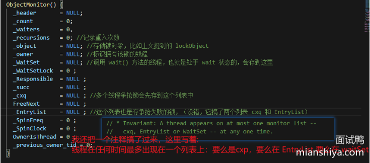

**synchronized底层原理**

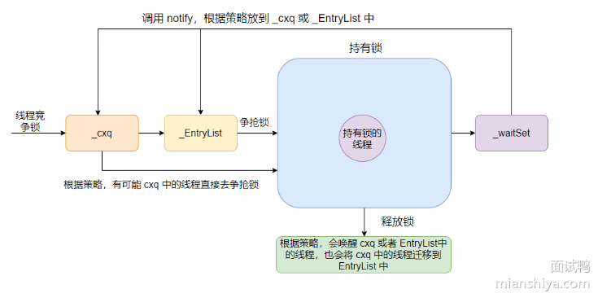

等等等。

#### 📌 什么是可重入锁？

重入锁指的是同一个线程在持有某个锁的时候，可以再次获取该锁而不会发生死锁。例如以下代码:

```java
public class ReentrantLockExample {
    private final ReentrantLock lock = new ReentrantLock();

    public void outer() {
        lock.lock();
        try {
            inner();
        } finally {
            lock.unlock();
        }
    }

    public void inner() {
        lock.lock();
        try {
            // critical section
        } finally {
            lock.unlock();
        }
    }
}
```

outer 还需要调用 inner, 它们都用到了同一把锁，如果不可重入那么就会导致死锁

一般可重入锁是通过计数的方式实现，例如维护一个计数器，当前线程抢到锁则 + 1, 如果当前线程再次抢到锁则继续 + 1。如果当前线程释放锁之后，则计数器 - 1, 当减到 0 则释放当前质。

#### 🧠 syncronized性能优化？

Synchronized 在 JDK1.6 之后进行了很多性能优化，主要包括以下几种:
- 偏向锁：如果一个锁被同一个线程多次获得，JVM 会将该锁设置为偏向锁，以减少获取锁的代价。
- 轻量级锁：如果没有线程竞争，JVM 会将锁设置为轻量级锁，使用 CAS 操作代替互斥同步。
- 锁粗化：JVM 会将一些短时间内连续的锁操作合并为一个锁操作，以减少锁操作的开销。
- 锁消除：JVM 在 JIT 编译时会检测到一些没有竞争的锁，并将这些锁去掉，以减少同步的开销。

## 🚀 Java中volatile关键字的作用是什么？

#### 💡 volatile的作用简单说说？

volatile的主要作用是保证变量的**可见性**和**禁止指令重排优化**。

1) 可见性 (Visibility):
volatile 关键字确保变量的可见性。当一个线程修改了 volatile 变量的值，新值会立即被刷新到主内存中，其他线程在读取该变量时可以立即获得最新的值。这样可以避免线程间由于缓存一致性问题导致的 "看见" 旧值的现象。

2) 禁止指令重排序 (Ordering):
volatile 还通过内存屏障来禁止特定情况下的指令重排序，从而保证程程序的执行顺序符合预期。对 volatile 变量的写操作会在其前面插入一个 StoreStore 屏障，而对 volatile 变量的读操作则会在其后插入一个 LoadLoad 屏障。这确保了在多线程环境下，某些代码块执行顺序的可预测性。

#### 🔍 详细讲讲volatile如何解决的可见性问题？

在 Java 的多线程环境中，每个线程都有自己的工作内存 (CPU 缓存), 它会从主内存中读取变量的副本进行操作。

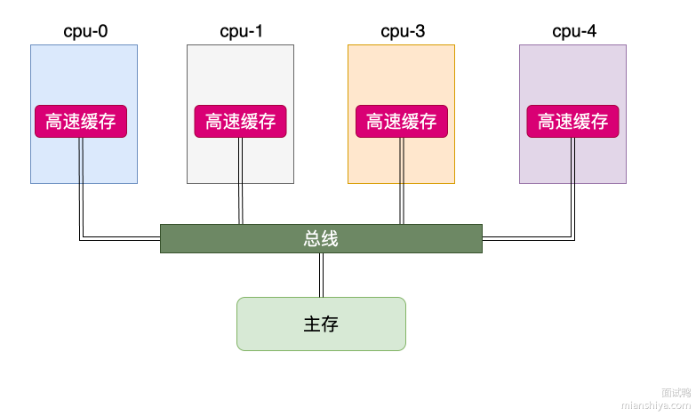

因此，线程 A 修改了某个变量后，线程 B 不一定能立即看到这个修改。volatile 通过强制线程直接从主内存读取或写入变量，从而解决了可见性问题。

而在没有 volatile 的情况下，一个线程可能永远不会看到另一个线程对共享变量的修改:

```java
private static boolean flag = false;

public static void main(String[] args) {
  new Thread(() -> {
      while (!flag) {
          // do something
      }
      System.out.println("Thread terminated.");
  }).start();

  try {
      Thread.sleep(1000);
  } catch (InterruptedException e) {
      e.printStackTrace();
  }

  flag = true; // 没有 volatile, 这个改变对其他线程不可见
}
```
这里，若flag变量被声明为volatile的，线程A修改flag后，线程b能立即看到修改并终止循环。

#### 🔍 详细讲讲volatile如何解决的指令重排序问题？

Java 编译器和 CPU 为了优化性能，可能会对指令进行重排序。一般这不会影响单线程程序的正确性，但在多线程环境中，重排序可能导致意想不到的结果。

**经典双重检查锁定 (Double-Checked Locking) 问题**：在单例模式中，volatile 可以防止指令重排序，从而避免未完全初始化的对象被使用:

```java
public class Singleton {
  private static volatile Singleton instance;

  private Singleton() {}

  public static Singleton getInstance() {
      if (instance == null) {
          synchronized (Singleton.class) {
              if (instance == null) {
                  instance = new Singleton();
              }
          }
      }
      return instance;
  }
}
```
在这里，如果不用volatile，指令重排序可能导致instance在其构造函数完成之前返回，从而使其他线程访问到了一个未初始化完成的对象。

#### 🧠 volatile不能保证操作的原子性

虽然 volatile 保证了可见性和有序性，但它不能保证操作的原子性。原子性意味着一个操作不可分割，不能被中断。典型的例子是 i++ 操作，这实际上分为读取 i 的值、递增、写回三个步骤。如果多个线程同时执行i++，最终结果可能不正确，因为每个线程都可能读取到相同的初始值。

```java
private static volatile int count = 0;

public static void main(String[] args) {
  for (int i = 0; i < 1000; i++) {
      new Thread(() -> count++).start();
  }
  System.out.println(count); // 结果可能不为 1000
}
```
要解决这个问题，需要使用AtomicInteger或者synchronized块。

#### 👂 volatile与synchronized的对比

**性能**:
volatile 是一种轻量级的同步机制，开销较小，但它只能用于变量的可见性和禁止重排序，无法实现复杂的同步逻辑。
synchronized 则是重量级的同步机制，可以保证代码块的原子性和可见性，但开销较大

**使用场景**: volatile 适用于简单的状态标志、标记等场景，而 synchronized 更适合复杂的临界区保护，需要确保多个操作的原子性时。

#### 📌 Java内存模型(JMM) 与 volatile

Java 内存模型 (Java Memory Model,JMM) 定义了多线程环境下共享变量的可见性和指令重排序规则。volatile 是 JMM 的关键组成部分，提供了一种简化的方式来实现线程间的内有可见性。

JMM 中规定了以下规则:
- 对一个 `volatile` 变量的写操作，发生在每一个后续对这个 `volatile` 变量的读操作之前。
- `volatile` 变量的操作不会与其他内存操作进行重排序。
