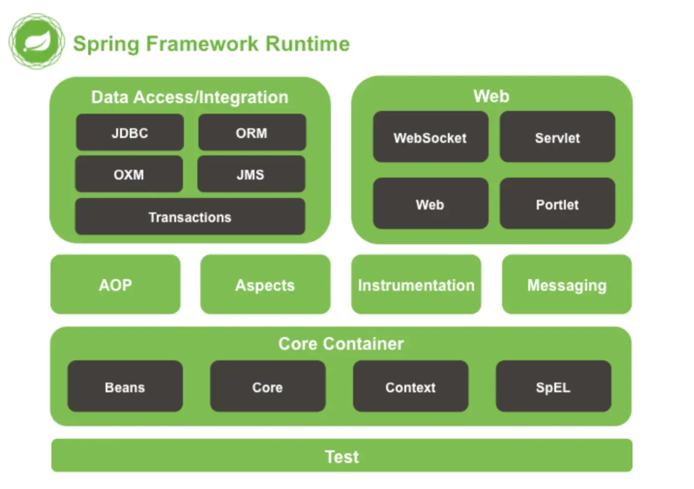
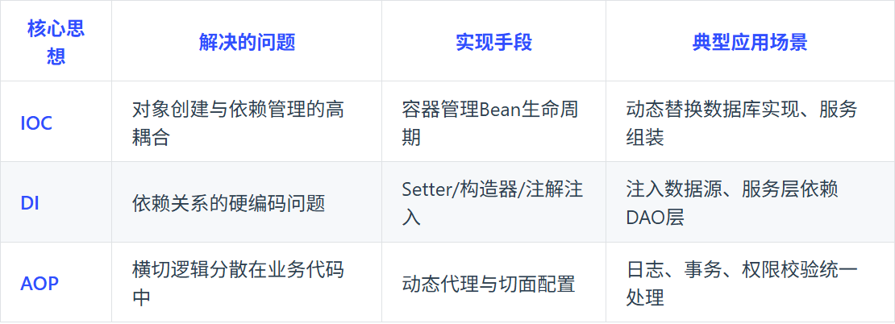

# 📚 Spring 相关学习与整理

> 👋 本文介绍 [Sping] 的相关知识、常见问题与总结。

## 📑 目录
- [📚 Spring 相关学习与整理](#-spring-相关学习与整理)
  - [📑 目录](#-目录)
  - [🚀 Sping 相关问题](#-sping-相关问题)
      - [说一下你对Sping的理解？](#说一下你对sping的理解)
      - [Spring核心思想说说你的理解？](#spring核心思想说说你的理解)
      - [Spring IoC和AOP介绍一下？](#spring-ioc和aop介绍一下)
      - [Spring的AOP详细介绍一下？](#spring的aop详细介绍一下)
      - [IoC和AOP是通过什么机制实现的？](#ioc和aop是通过什么机制实现的)
      - [怎么理解SpringIoC？](#怎么理解springioc)
      - [依赖注入了解吗？是如何实现的？](#依赖注入了解吗是如何实现的)
      - [若让你设计一个SpringIoC，你会从哪些方面考虑？](#若让你设计一个springioc你会从哪些方面考虑)
      - [Spring AOP原理了解吗？主要想解决什么问题？](#spring-aop原理了解吗主要想解决什么问题)

## 🚀 Sping 相关问题

#### 说一下你对Sping的理解？



Spring框架核心：
**IoC容器**：Spring通过控制反转实现了对象的创建和对象间的依赖管理，开发者只需要定义好Bean及其依赖关系，Spring容器负责创建和组装好这些对象。
**AOP**：面向切面编程，允许开发者定义横切关注点，例如事务管理、安全控制等，独立于业务逻辑的代码。通过AOP可用将这些关注点模块化，提高代码的可维护性和可重用性。
**事务管理**：Spring提供一致的管理接口，支持声明式和编程式事务，开发者可用轻松进行事务管理，无需关心具体的事务API
**MVC框架**：Spring MVC是一个基于Servlet API构建的Web框架，采用了模型-视图-控制器(MVC)架构，支持灵活的URL到页面控制器的映射，以及多种视图技术。

#### Spring核心思想说说你的理解？



轻量级，高内聚耦合的企业级应用开发框架

#### Spring IoC和AOP介绍一下？

**loC**: 即控制反转的意思，它是一种创建和获取对象的技术思想，依赖注入 (DI) 是实现这种技术的一种方式。传统开发过程中，我们需要通过 new 关键字来创建对象。使用 loC 思想开发方式的话，我们不通过 new 关键字创建对象，而是通过 loC 容器来帮我们实例化对象。通过 IoC 的方式，可以大大降低对象之间的耦合度。

**AOP**: 是面向切面编程，能够将那些与业务无关，却为业务模均快所共同调用的逻辑封装起来，以减少系
统的重复代码，降低模块间的耦合度。SpringAOP 就是基于动态代理的，如果要代理的对象，实现了某个接口，那么 Spring AOP 会使用 JDK Proxy, 去创建代理对象，而对于没有实现接口的对象，就无法使用 JDKProxy 去进行代理了，这时候 SpringAOP 会使用 Cglib 生成一个被代理对象的子类来作为代理。

IOC与AOP结合使用，可用更好实现代码的模块化和分层管理，如：
- 通过IoC容器管理对象的依赖关系，然后通过AOP将横切关注点统一切入到需要的业务逻辑中
- 使用IoC容器管理Service层和DAO层的依赖关系，通过AOP在Service层实现事务管理，日志记录等横切功能，使业务路基更加清晰、可维护。

#### Spring的AOP详细介绍一下？

AOP最小单元是"切面"，一个切面可用包含很多类型和对象，并对他们进行模块化管理。

面向切面编程思想中，功能分为*核心业务*（登陆注册，增删改查等）和*周边功能*（日志、事务管理等），两者独立开发不耦合，将核心业务和周边功能编织在一起，这就是AOP。

**AOP将与业务无关，却为业务模块所共同调用的逻辑或责任封装起来，减少系统重复代码，降低模块间耦合度，有利于未来的可拓展、可维护性。**

AOP中的概念：
- AspectJ: 切面（JoinPoint，Advice和Pointcut的统称）
- Join Point: 连接点，指程序执行过程的一个点。
- Advice：通知，通常作为拦截器
- Pointcut：切点，用于匹配连接点
- Introduction：引介，让一个切面可用声明被通知的对象实现任何他们没有真正实现的额外接口。
- Weaving：织入，将通知逻辑插入到的方法上
- AOP proxy：AOP代理，AOP实现框架中实现切面协议的对象，SpringAOP中有JDK动态代理和CGLIB动态代理两种。
- Target object：目标对象，即被代理对象。

#### IoC和AOP是通过什么机制实现的？

**Sping IoC实现机制**
- 反射：Spring loC 容器利用 Java 的反射机制动态地加载类、创建对象实例及调用对象方法，反射允许在运行时检查类、方法、属性等信息，从而实现灵活的对象实例化和管理。
- 依赖注入：IOC 的核心概念是依赖注入，即容器负责管理应用程序组件之间的依赖关系。Spring 通过构
造函数注入、属性注入或方法注入，将组件之间的依赖关系描述在配置文件中或使用注解。
- 设计模式-工厂模式：Spring loC 容器通常采用工厂模式来管理对象的创建和生命周期。容器作为工厂
负责实例化 Bean 并管理它们的生命周期，将 Bean 的实例化过程程交给容器来管理。
- 容器实现：Spring loC 容器是实现 IOC 的核心，通常使用 BeanFactory 或 ApplicationContext 来管理Bean。BeanFactory 是 loC 容器的基本形式，提供基本的 IOC 功能；ApplicationContext 是 BeanFactory 的扩展，并提供更多企业级功能。

**Sping AOP实现机制**
Spring AOP实现依赖动态代理技术，动态代理是在运行时态生成代理对象，而不是在编译时。允许开发者在运行时指定要代理的接口和行为，从而实现在不断修改代码的情况下增强方法的功能。

- 基于JDK的动态代理：使用java.lang.reflect.Proxy类和java.lang.reflect.InvocationHandler接口实现，这种方式需要代理的类实现一个或多个接口。
- 基于CGLIB的动态代理：当代理的类没有实现接口时，Spring使用CGLIB库生成一个被代理的子类作为代理，CGLIB是一个第三方代码库，通过集成方式实现代理。

#### 怎么理解SpringIoC？

IoC即Inversion Of Control，控制反转，是一种设计思想。

传统的Java SE程序设计中，我们直接在程序内部通过new方式创建对象，是程序主动创建依赖对象。而Spring中，IoC有专门的容器控制对的创建，初始化和销毁。


IoC解决了繁琐的对象生命周期操作，解耦了代码。

#### 依赖注入了解吗？是如何实现的？

依赖注入是将对象的创建和依赖关系管理交给Spring容器完成，类只要声明自己所依赖的对象，容器会在运行时将这些依赖对象注入到类中，从而降低类与类之间的耦合度，提高代码的可维护性和可测试性。

```java
// 构造器注入
public class UserService {
    private final UserRepository userRepo;

    public UserService(UserRepository userRepo) {
        this.userRepo = userRepo;
    }
}

// Setter方法注入
public class PaymentService {
    private PaymentGateway gateway;
    
    @Autowired
    public void setGateway(PaymentGateway gateway) {
        this.gateway = gateway;
    }
}

// 字段注入
public class OrderService {
    private PaymentGateway gateway;
    
    @Autowired
    private OrderRepository orderRepo;
}
```

#### 若让你设计一个SpringIoC，你会从哪些方面考虑？

- Bean的生命周期管理
- 依赖注入
- Bean作用域
- AOP功能支持
- 异常处理
- 配置文件加载

#### Spring AOP原理了解吗？主要想解决什么问题？

SpringAOP主要依赖于动态代理技术，即在运行时动态生成代理对象，允许开发者在运行时指定要代理的接口和行为，从而实现不修改源码的情况下增强方法的功能。

```java
// 目标接口
public interface Calculator {
    int add(int a, int b); // 原始方法：计算两数之和
}

// 目标实现类
public class CalculatorImpl implements Calculator {
    @Override
    public int add(int a, int b) {
        // 原始逻辑：只做加法
        return a + b;
    }
}

public class DynamicProxyDemo {
    public static void main(String[] args) {
        // 1. 创建目标对象
        Calculator target = new CalculatorImpl();
        // 2. 运行时生成代理对象
        Calculator proxy = (Calculator) Proxy.newProxyInstance(
            // 类加载器（和目标对象用同一个）
            target.getClass().getClassLoader(),
            // 目标对象实现的接口（代理要“模仿”的接口）
            target.getClass().getInterfaces(),
            // 增强逻辑（中介的额外操作）
            new InvocationHandler() {
                @Override
                public Object invoke(
                    Object proxyObj,  // 代理对象自身（一般不用）
                    Method method,    // 被调用的方法（这里是add方法）
                    Object[] args     // 方法参数（这里是a和b）
                ) throws Throwable {
                    // 增强逻辑1：方法执行前打印日志
                    System.out.println("准备执行加法：" + args[0] + "+" + args[1]);

                    // 执行原始方法
                    Object result = method.invoke(target, args);

                    // 增强逻辑2：方法执行后打印结果
                    System.out.println("加法结果：" + result);

                    return result;
                }
            }
        );

        // 3. 调用代理对象的方法
        proxy.add(2, 3);
    }
}
```