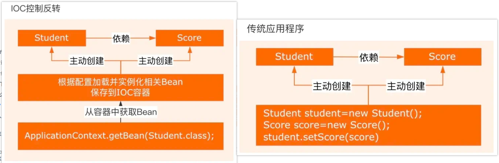

# 📚 Spring 相关学习与整理

> 👋 本文介绍 [Sping] 的相关知识、常见问题与总结。

## 📑 目录
- [📚 Spring 相关学习与整理](#-spring-相关学习与整理)
  - [📑 目录](#-目录)
  - [🚀 Sping 相关问题](#-sping-相关问题)
      - [说一下你对Sping的理解？](#说一下你对sping的理解)
      - [Spring核心思想说说你的理解？](#spring核心思想说说你的理解)
      - [Spring IoC和AOP介绍一下？](#spring-ioc和aop介绍一下)
      - [Spring的AOP详细介绍一下？](#spring的aop详细介绍一下)
      - [IoC和AOP是通过什么机制实现的？](#ioc和aop是通过什么机制实现的)
      - [怎么理解SpringIoC？](#怎么理解springioc)
      - [依赖注入了解吗？是如何实现的？](#依赖注入了解吗是如何实现的)
      - [若让你设计一个SpringIoC，你会从哪些方面考虑？](#若让你设计一个springioc你会从哪些方面考虑)
      - [Spring AOP原理了解吗？主要想解决什么问题？](#spring-aop原理了解吗主要想解决什么问题)
      - [动态代理是什么？](#动态代理是什么)
      - [静态代理和动态代理的区别](#静态代理和动态代理的区别)
      - [AOP实现有哪些注解？](#aop实现有哪些注解)
      - [什么是反射，有哪些使用场景？](#什么是反射有哪些使用场景)
      - [Spring是如何解决循环依赖的？](#spring是如何解决循环依赖的)
      - [Spring为什么用三级缓存而不是二级](#spring为什么用三级缓存而不是二级)
      - [Spring的三层缓存数据结构是什么？](#spring的三层缓存数据结构是什么)
      - [Spring框架都用了什么设计模式？](#spring框架都用了什么设计模式)
      - [Spring的常用注解有哪些？](#spring的常用注解有哪些)
      - [Spring事务是什么？什么情况下会失效？使用this调用是否生效？](#spring事务是什么什么情况下会失效使用this调用是否生效)
      - [Bean的生命周期说说？](#bean的生命周期说说)
      - [Bean是否为单例？](#bean是否为单例)
      - [Bean的单例和非单例，生命周期是否相同？](#bean的单例和非单例生命周期是否相同)
      - [Spring bean的作用域有哪些？](#spring-bean的作用域有哪些)
      - [Spring容器里存的是什么？](#spring容器里存的是什么)
      - [Spring中，bean加载和销毁前后，如果想实现某些逻辑，该怎么做？](#spring中bean加载和销毁前后如果想实现某些逻辑该怎么做)
      - [Spring提供了很多扩展点，有了解吗？](#spring提供了很多扩展点有了解吗)
  - [🚀 SpringMVC相关问题](#-springmvc相关问题)
      - [MVC分层介绍一下？其流程步骤是什么？](#mvc分层介绍一下其流程步骤是什么)
      - [SpringMVC的处理流程？](#springmvc的处理流程)
      - [Handlermapping和handleradapter有了解吗](#handlermapping和handleradapter有了解吗)
  - [🚀 SpringBoot相关问题](#-springboot相关问题)
      - [为什么使用Springboot？比Spring好在哪里？](#为什么使用springboot比spring好在哪里)
      - [SpringBoot用到哪些设计模式？](#springboot用到哪些设计模式)
      - [如何理解SpringBoot中的约定大于配置？](#如何理解springboot中的约定大于配置)
      - [SpringBoot的项目结构是什么样的？](#springboot的项目结构是什么样的)
      - [SpringBoot自动装配原理是什么？](#springboot自动装配原理是什么)
      - [说几个启动器？](#说几个启动器)
      - [写过SpringBoot starter吗？](#写过springboot-starter吗)
      - [Springboot有哪些重要的注解？](#springboot有哪些重要的注解)
      - [SpringBoot如何开启事务？](#springboot如何开启事务)
      - [Springbot怎么做到导入就可直接使用？](#springbot怎么做到导入就可直接使用)
      - [SpringBoot拦截器和过滤器说说？](#springboot拦截器和过滤器说说)
  - [🚀 MyBatis相关问题](#-mybatis相关问题)
      - [和传统的JDBC相比，myBatis的优点是什么？](#和传统的jdbc相比mybatis的优点是什么)
      - [MyBatis觉得在哪方面做的比较好？](#mybatis觉得在哪方面做的比较好)
      - [还记得JDBC连接数据库的步骤吗？](#还记得jdbc连接数据库的步骤吗)
      - [MyBatis中的#和$区别是什么呢？](#mybatis中的和区别是什么呢)
      - [MyBatis和MyBatisPlus的区别是什么？](#mybatis和mybatisplus的区别是什么)
      - [MyBatis运用了哪些常见的设计模式？](#mybatis运用了哪些常见的设计模式)
  - [🚀 SpringCloud相关问题](#-springcloud相关问题)
      - [了解SpringCloud吗？说一下它和SpringBoot的区别？](#了解springcloud吗说一下它和springboot的区别)
      - [用过哪些微服务组件？](#用过哪些微服务组件)
      - [负载均衡有哪些算法？](#负载均衡有哪些算法)
      - [如何实现一直均衡给一个用户？](#如何实现一直均衡给一个用户)
      - [介绍一下服务熔断？](#介绍一下服务熔断)
      - [介绍一下服务降级？](#介绍一下服务降级)

## 🚀 Sping 相关问题

#### 说一下你对Sping的理解？


Spring框架核心：
**IoC容器**：Spring通过控制反转实现了对象的创建和对象间的依赖管理，开发者只需要定义好Bean及其依赖关系，Spring容器负责创建和组装好这些对象。
**AOP**：面向切面编程，允许开发者定义横切关注点，例如事务管理、安全控制等，独立于业务逻辑的代码。通过AOP可用将这些关注点模块化，提高代码的可维护性和可重用性。
**事务管理**：Spring提供一致的管理接口，支持声明式和编程式事务，开发者可用轻松进行事务管理，无需关心具体的事务API
**MVC框架**：Spring MVC是一个基于Servlet API构建的Web框架，采用了模型-视图-控制器(MVC)架构，支持灵活的URL到页面控制器的映射，以及多种视图技术。

#### Spring核心思想说说你的理解？


轻量级，高内聚耦合的企业级应用开发框架

#### Spring IoC和AOP介绍一下？

**loC**: 即控制反转的意思，它是一种创建和获取对象的技术思想，依赖注入 (DI) 是实现这种技术的一种方式。传统开发过程中，我们需要通过 new 关键字来创建对象。使用 loC 思想开发方式的话，我们不通过 new 关键字创建对象，而是通过 loC 容器来帮我们实例化对象。通过 IoC 的方式，可以大大降低对象之间的耦合度。

**AOP**: 是面向切面编程，能够将那些与业务无关，却为业务模均快所共同调用的逻辑封装起来，以减少系
统的重复代码，降低模块间的耦合度。SpringAOP 就是基于动态代理的，如果要代理的对象，实现了某个接口，那么 Spring AOP 会使用 JDK Proxy, 去创建代理对象，而对于没有实现接口的对象，就无法使用 JDKProxy 去进行代理了，这时候 SpringAOP 会使用 Cglib 生成一个被代理对象的子类来作为代理。

IOC与AOP结合使用，可用更好实现代码的模块化和分层管理，如：
- 通过IoC容器管理对象的依赖关系，然后通过AOP将横切关注点统一切入到需要的业务逻辑中
- 使用IoC容器管理Service层和DAO层的依赖关系，通过AOP在Service层实现事务管理，日志记录等横切功能，使业务路基更加清晰、可维护。

#### Spring的AOP详细介绍一下？

AOP最小单元是"切面"，一个切面可用包含很多类型和对象，并对他们进行模块化管理。

面向切面编程思想中，功能分为*核心业务*（登陆注册，增删改查等）和*周边功能*（日志、事务管理等），两者独立开发不耦合，将核心业务和周边功能编织在一起，这就是AOP。

**AOP将与业务无关，却为业务模块所共同调用的逻辑或责任封装起来，减少系统重复代码，降低模块间耦合度，有利于未来的可拓展、可维护性。**

AOP中的概念：
- AspectJ: 切面（JoinPoint，Advice和Pointcut的统称）
- Join Point: 连接点，指程序执行过程的一个点。
- Advice：通知，通常作为拦截器
- Pointcut：切点，用于匹配连接点
- Introduction：引介，让一个切面可用声明被通知的对象实现任何他们没有真正实现的额外接口。
- Weaving：织入，将通知逻辑插入到的方法上
- AOP proxy：AOP代理，AOP实现框架中实现切面协议的对象，SpringAOP中有JDK动态代理和CGLIB动态代理两种。
- Target object：目标对象，即被代理对象。

#### IoC和AOP是通过什么机制实现的？

**Sping IoC实现机制**
- 反射：Spring loC 容器利用 Java 的反射机制动态地加载类、创建对象实例及调用对象方法，反射允许在运行时检查类、方法、属性等信息，从而实现灵活的对象实例化和管理。
- 依赖注入：IOC 的核心概念是依赖注入，即容器负责管理应用程序组件之间的依赖关系。Spring 通过构
造函数注入、属性注入或方法注入，将组件之间的依赖关系描述在配置文件中或使用注解。
- 设计模式-工厂模式：Spring loC 容器通常采用工厂模式来管理对象的创建和生命周期。容器作为工厂
负责实例化 Bean 并管理它们的生命周期，将 Bean 的实例化过程程交给容器来管理。
- 容器实现：Spring loC 容器是实现 IOC 的核心，通常使用 BeanFactory 或 ApplicationContext 来管理Bean。BeanFactory 是 loC 容器的基本形式，提供基本的 IOC 功能；ApplicationContext 是 BeanFactory 的扩展，并提供更多企业级功能。

**Sping AOP实现机制**
Spring AOP实现依赖动态代理技术，动态代理是在运行时态生成代理对象，而不是在编译时。允许开发者在运行时指定要代理的接口和行为，从而实现在不断修改代码的情况下增强方法的功能。

- 基于JDK(基于接口)的动态代理：使用java.lang.reflect.Proxy类和java.lang.reflect.InvocationHandler接口实现，这种方式需要代理的类实现一个或多个接口。
- 基于CGLIB(基于类)的动态代理：当代理的类没有实现接口时，Spring使用CGLIB库生成一个被代理的子类作为代理，CGLIB是一个第三方代码库，通过集成方式实现代理。

#### 怎么理解SpringIoC？

IoC即Inversion Of Control，控制反转，是一种设计思想。

传统的Java SE程序设计中，我们直接在程序内部通过new方式创建对象，是程序主动创建依赖对象。而Spring中，IoC有专门的容器控制对的创建，初始化和销毁。



IoC解决了繁琐的对象生命周期操作，解耦了代码。

#### 依赖注入了解吗？是如何实现的？

依赖注入是将对象的创建和依赖关系管理交给Spring容器完成，类只要声明自己所依赖的对象，容器会在运行时将这些依赖对象注入到类中，从而降低类与类之间的耦合度，提高代码的可维护性和可测试性。

```java
// 构造器注入
public class UserService {
    private final UserRepository userRepo;

    public UserService(UserRepository userRepo) {
        this.userRepo = userRepo;
    }
}

// Setter方法注入
public class PaymentService {
    private PaymentGateway gateway;
    
    @Autowired
    public void setGateway(PaymentGateway gateway) {
        this.gateway = gateway;
    }
}

// 字段注入
public class OrderService {
    private PaymentGateway gateway;
    
    @Autowired
    private OrderRepository orderRepo;
}
```

#### 若让你设计一个SpringIoC，你会从哪些方面考虑？

- Bean的生命周期管理
- 依赖注入
- Bean作用域
- AOP功能支持
- 异常处理
- 配置文件加载

#### Spring AOP原理了解吗？主要想解决什么问题？

SpringAOP主要依赖于动态代理技术，即在运行时动态生成代理对象，允许开发者在运行时指定要代理的接口和行为，从而实现不修改源码的情况下增强方法的功能。

```java
// 目标接口
public interface Calculator {
    int add(int a, int b); // 原始方法：计算两数之和
}

// 目标实现类
public class CalculatorImpl implements Calculator {
    @Override
    public int add(int a, int b) {
        // 原始逻辑：只做加法
        return a + b;
    }
}

public class DynamicProxyDemo {
    public static void main(String[] args) {
        // 1. 创建目标对象
        Calculator target = new CalculatorImpl();
        // 2. 运行时生成代理对象
        Calculator proxy = (Calculator) Proxy.newProxyInstance(
            // 类加载器（和目标对象用同一个）
            target.getClass().getClassLoader(),
            // 目标对象实现的接口（代理要“模仿”的接口）
            target.getClass().getInterfaces(),
            // 增强逻辑（中介的额外操作）
            new InvocationHandler() {
                @Override
                public Object invoke(
                    Object proxyObj,  // 代理对象自身（一般不用）
                    Method method,    // 被调用的方法（这里是add方法）
                    Object[] args     // 方法参数（这里是a和b）
                ) throws Throwable {
                    // 增强逻辑1：方法执行前打印日志
                    System.out.println("准备执行加法：" + args[0] + "+" + args[1]);

                    // 执行原始方法
                    Object result = method.invoke(target, args);

                    // 增强逻辑2：方法执行后打印结果
                    System.out.println("加法结果：" + result);

                    return result;
                }
            }
        );

        // 3. 调用代理对象的方法
        proxy.add(2, 3);
    }
}
```


使用AOP目的是对于面向对象思维的一种补充，一种对于不支持多继承的弥补，除开对象的主要特征被抽象成了一条继承链路，对于一些次要特征，AOP可以统一对他们进行抽象和集中处理。

AOP首先在一个切面中定义了一些Advice增强，其中包含具体实现的代码，同时整理了切入点，切入点的粒度是方法。最后，将这些Advice织入到对象的方法上，形成了最后执行方法时面对的完整方法。

#### 动态代理是什么？

在运行时动态创建代理对象的机制，主要用于不修改原始类的情况下对方法进行拦截和增强。

基于接口的代理(JDK): 目标对象必须实现至少一个接口，Java动态代理会创建一个实现了相同接口的代理类，然后在运行时动态生成该类的实例。每一个动态代理类都必须实现InvocationHandler接口，并且每个代理类实例都关联到一个handler，通过代理对象调用一个方法时，该方法的调用会被转发为由InvocationHandler接口的invoke()方法进行调用。

基于类的代理：在运行时动态生成一个目标类的子类，通过继承的方式创建代理类。

#### 静态代理和动态代理的区别

- 静态代理：程序员或特定工具创建，编译时就被确定是代理类，通常只代理一个类。

- 动态代理：代码运行期间通过反射机制动态创建生成

#### AOP实现有哪些注解？

@Aspect: 用于定义切面，标注在切面类上。
@Pointcut: 定义切点，标注在方法上，用于指定连接点。
@Before: 在方法执行之前执行通知。
@After: 在方法执行之后执行通知。
@Around: 在方法执行前后都执行通知。
@AfterReturning: 在方法执行后返回结果后执行通知。
@AfterThrowing: 在方法抛出异常后执行通知。
@Advice: 通用的通知类型，可以替代 @Before、@After 等。

#### 什么是反射，有哪些使用场景？

程序运行状态下，对于一个类，都能够获取这个类的所有属性和方法；对于任何一个对象，都能够调用它的任意属性和方法。也就是说，Java反射允许在运行时获取类的信息并动态操作对象，即使在编译时不知道具体的类也能实现。

**特性**：
- 运行时类信息访问
- 动态对象创建
- 动态方法调用（Method类的invoke()方法）
- 访问和修改字段值（Field类的get和set）


**Spring的IoC和AoOP如何使用反射技术**

- DI和IoC
开发者通过xml配置文件或注解声明组件之间依赖关系，程序启动时Spring会扫描这些配置或注解，后利用反射实例化为Bean，并根据配置自动装配他们的依赖

- 动态代理
切面中Spring会使用JDK动态代理或CGLIB创建目标类的代理对象

#### Spring是如何解决循环依赖的？

Spring只能解决：通过setter方法进行依赖注入且在单例模式下产生的循环依赖问题。

Spinrg在DefaultSingletonBeanRegistry类中维护了三个重要的缓存(Map)，称为“三级缓存”

- 一级缓存：存放完全初始化号的，可用的Bean实例
- 二级缓存：存放的是提前暴露的Bean原始对象引用，或早期代理对象引用，专门用来处理循环依赖，若一个Bean还在创建过程中器引用就需要被注入另一个Bean时，就暂时放在这里。
- 三级缓存：存放Bean的工厂对象，Bean实例化后SPring会创建一个ObjectFactory并将其放入三级缓存，这个工厂的getObject方法负责该Bean的早期引用。

若BeanA依赖BeanB，且BeanB依赖BeanA，则Spring启动时
**过程**：
1. 创建BeanA实例并提前暴露工厂
2. 填充BeanA的属性时触发BeanB创建
3. BeanB属性注入时发现循环依赖：一级二级缓存都未命中，在三级缓存中找到BeanA工厂并调用getObject方法，并将这个早期引用放入二级缓存，同时清除三级缓存工厂条目，最后将这个早期引入注入BeanB
4. 完成BeanB生命周期：初始化，被提升至一级缓存，二三级缓存条目都被删除，准备就绪
5. 回溯完成BeanA构建：将完备的B注入A，执行A的初始化方法，形成完全初始化的Bean

#### Spring为什么用三级缓存而不是二级

循环依赖问题的解决核心还是在三级缓存中存了一个ObjectFactory，并将半成品bean存在二级缓存中，本质是“按需延迟生成正确引用”

#### Spring的三层缓存数据结构是什么？

都是Map类型的缓存
- 一级缓存：在DefaultStringBeanRegistry类中的singletonObjects属性中。
- 二级缓存，在DefaultStringBeanRegistry类中的earlySingletonObjects属性中。
- 三级缓存：在DefaultStringBeanRegistry类中的singletonFactories属性中。

#### Spring框架都用了什么设计模式？

**工厂设计模式**：Spring 使用工厂模式通过 BeanFactory、ApplicationContext 创建 bean 对象。
**代理设计模式**：Spring AOP 功能的实现。
**单例设计模式**：Spring 中的 Bean 默认都是单例的。
**模板方法模式**：Spring 中 jdbcTemplate、hibernateTemplate 等以 Template 结尾的对数据库操作的类，它们就使用到了模板模式。
**包装器设计模式**：我们的项目需要连接多个数据库，而且不司的客户在每次访问中根据需要会去访问不同的数据库。这种模式让我们可以根据客户的需求能够动态切换不同的数据源。
**观察者模式**：Spring 事件驱动模型就是观察者模式很经典的一个应用
**适配器模式**：SpringAOP 的增强或通知 (Advice) 使用到了适配器模式、spring MVC 中也是用到了适配器式适配 Controller。

#### Spring的常用注解有哪些？

- @Autowired：自动装配bean
- @Component：标记一个类作为Spring的bean并添加到Spring容器中
- @Configuration：标记一个类作为Spring的配置类，其中可包含Bean
- @Bean：标记一个方法作为Spring的Bean工厂方法，Sping会将其返回值作为一个Bean被添加到容器中。
- @Service：标记一个类作为服务层组件，是@Component注解的特例。
- @Repository：标价一个类作为数据服务层组件，是@Component注解的特例。
- @Controller：标记一个类走位控制层的组件，也是@Component注解的特例。

#### Spring事务是什么？什么情况下会失效？使用this调用是否生效？

Spring 事务是 Spring 框架提供的核心功能之一，用于管理数据库操作的原子性、一致性、隔离性和持久性（ACID），确保业务逻辑在数据库层面的正确性。通常是通过@Transactional注解实现，可能会失效的情况包括：

- 未捕获异常：一个事务方法发生了未捕获的异常
- 非受检异常：会对RuntimeException或其子类的非受检异常进行回滚处理
- 事务传播属性设置不当：多个事务之间存在事务嵌套，且事务传播属性配置不正确，可能导致事务失效。
- 多数据源的事务管理：使用多个数据源时，事务管理没有正确配置或存在多个@Transactional注解
- 跨方法调用事务问题：一个事务方法内部调用另一个没有@Transactional注解的方法
- 事务在非公开方法中失效：@Transactional注解标注在私有方法或者非public方法上

Spring事务使用this调用不生效，因为this指向目标对象本身，而Spring事务由代理对象控制，this相当于绕过了代理机制。

#### Bean的生命周期说说？


1. Spring启动,查找并加载需要被Spring管理的bean,进行Bean的实例化
2. Bean实例化后对将Bean的引入和值注入到Bean的属性中
3. 如果Bean实现了BeanNameAware接口的话,Spring将Bean的id传递给setBeanName()方法
4. 如果Bean实现了BeanFactoryAware接口的话,Spring将调用setBeanFactory()方法,将BeanFactory容器实例传入
5. 如果Bean实现了ApplicationContextAware接口的话,Spring将调,用Bean的setApplicationContext()方法,将bean所在应用上下文引用传入进来。
6. 如果Bean实现了BeanPostProcessor接口,Spring就将调用他们的postProcessBeforelnitialization()方法。
7. 如果Bean实现了InitializingBean接口,Spring将调用他们的afterPPropertiesSet()方法。类似的,如果bean使用init-method声明了初始化方法,该方法也会被调用
8. 如果Bean实现了BeanPostProcessor接口,Spring就将调用他们的jpostProcessAfterlnitialization()方法。
9. 此时,Bean已经准备就绪,可以被应用程序使用了。他们将一直驻留在应用上下文中,直到应用上下文被销毁。
10. 如果bean实现了DisposableBean接口,Spring将调用它的destory)接口方法,同样,如果bean使用了destory-method声明销毁方法,该方法也会被调用。

#### Bean是否为单例？

Spring中Bean默认是单例的，只会被创建一次。

Spring同时也支持Bean为多例模式，每次请求都创建一个新的Bean实例，可用在Bean定义中通过设置scope属性为"prototype"实现

#### Bean的单例和非单例，生命周期是否相同？

不同，SpringBean的生命周期由IoC容器控制，Spring只帮我们管理单例模式Bean的完整生命周期。具体区别为：


#### Spring bean的作用域有哪些？

作用域定义了Bean的生命周期和可见性，不同作用域影响Spring容器如何管理这些Bean的实例，包括他们如何被创建、被销毁，以及是否可以被多个用户共享。

**Singleton (单例)**: 在整个应用程序中只存在一个 Bean 实例。默认作用域，Spring 容器中只会创建一个 Bean 实例，并在容器的整个生命周期中共享该实例。
**Prototype (原型)**: 每次请求时都会创建一个新的 Bean 实例。从容器中获取该 Bean 时都会创建一个新实例，适用于状态非常瞬时的 Bean。
**Request (请求)**: 每个 HTTP 请求都会创建一个新的 Bean 实例。仅在 SpringWeb 应用程序中有效，每个 HTTP 请求都会创建一个新的 Bean 实例，适用于 Web 应用中需求局部性的 Bean。
**Session (会话)**: Session 范围内只会创建一个 Bean 实例。该 Bean 实例在用户会话范围内共享，仅在Spring Web 应用程序中有效，适用于与用户会话相关的 Bean。
**Application**: 当前 ServletContext 中只存在一个 Bean 实例。仅在 SpringWeb 应用程序中有效，该 Bean 实例在整个 ServletContext 范围内共享，适用于应用程序范围内共享的 Bean。
**WebSocket (Web 套接字)**: 在 WebSocket 范围内只存在一个 Bean 实例。仅在支持 WebSocket 的应用程序中有效，该 Bean 实例在 WebSocket 会话范围内共享，适用于 WebSocket 会话范围内共享的Bean。
**Customscopes (自定义作用域)**: Spring 允许开发者定义自定义的作用均或，通过实现 Scope 接口来创建新的 Bean 作用域。

Spring配置文件中可用通过标签scope属性定义Bean作用域，也可以通过@Scope注解指定Bean的作用域。

#### Spring容器里存的是什么？

主要是Bean对象。

#### Spring中，bean加载和销毁前后，如果想实现某些逻辑，该怎么做？

可用使用Spring生命周期回调接口或注解。

- 使用init-method或destroy-method

可用在xml配置中通过属性指定，如：

```xml
<bean id = "myBean", class = "com.example.MyBeanClass"
    init-method = "init", destroy-method = "destroy">
```

```java
public class MyBeanClass {
    public void init() {}

    public void destroy() {}
}
```

- 使用InitializingBean和DesposableBean接口

```java
public class MyBeanClass implements InitializingBean, DisposableBean {

    @Overide
    public void afterPropertiesSet() throws Exception {}

    @Overide
    public void destroy() throws Exception {}

}
```

- 使用@PostConstruct或@PreDestroy注解

```java
public class MyBeanClass {

    @PostConstruct
    public void init() {}

    @PreDestroy
    public void destroy() {}

}
```

- 使用@Bean注解的initMethod和destroyMethod属性

```java
@Configuration
public class AppConfig {

    @Bean(initMethod = "init", destroyMethod = "destroy")
    public MyBeanClass myBean() {
        return new MyBeanClass();
    }

}
```

#### Spring提供了很多扩展点，有了解吗？

开发者可用根据需求定制和扩展Spring的功能：

1. BeanFactoryPostProcessor: Bean工厂后置处理器。允许在 Spring 容器实例化 bean 之前修改 bean 的定义。常用于修改 bean 属性或改变 bean 的作用域。
2. BeanPostProcessor: Bean后置处理器。可以在 bean 实例化、配置以及初始化之后对其进行额外处理。常用于代理 bean、修改 bean 属性等。
3. PropertySource: 属性源。用于定义不同的属性源，如文件、数据库等，以便在 Spring 应用中使用。
4. ImportSelector 和 lmportBeanDefinitionRegistrar: 用于根据条件动态注册 bean 定义，实现配置类的模块化。
5. Spring MVC 中的 Handlerlnterceptor: 用于拦截处理请求，可以在请求处理前、处理中和处理后执行特定逻辑。
6. Spring MVC 中的 ControllerAdvice: 用于全局处理控制器的异常、数据绑定和数据校验。
7. Spring Boot 的自动配置：通过创建自定义的自动配置类，可以实现对框架和第三方库的自动配置。
8. 自定义注解：创建自定义注解，用于实现特定功能或约为定，如权限控制、日志记录等。

## 🚀 SpringMVC相关问题

#### MVC分层介绍一下？其流程步骤是什么？

MVC即Model View Controller，模型-视图-控制器的缩写，一种软件设计典范，用一种业务逻辑、数据、界面显示分离的方法组织代码，将业务逻辑聚集到一个部件里，改进和个性化定制界面及用户交互的同时，不需要重新编写业务逻辑。


**介绍**：
- 视图：为用户提供使用界面，与用户直接进行交互
- 控制器：将用户请求转发给相应的Model进行处理，并根据Model计算结果向用户提供相应响应，使视图与模型分离。
- 模型: 代表一个存取数据的对象，主要用于承载数据。分为数据承载Bean和业务处理Bean。

**流程步骤**
1. 用户通过View向服务端请求
2. 服务端Controller接受请求，解析请求，找到相应Model，处理Model。
3. 处理结果交给Controller
4. 根据处理结果找到作为向用户端发回响应的View界面，页面渲染后发给客户端。

#### SpringMVC的处理流程？


1. 用户发送请求到DispatcherServlet
2. DispatcherServlet收到请求调用处理器映射器HandlerMapping
3. 处理映射器根据url找到具体处理器，生成处理器执行链HandlerExecutionChan（处理器对象+处理器拦截器）一并返回DispatcherServlet
4. DispatcherServlet根据处理器Handler获取处理器适配器
5. HandlerAdapter执行HandlerAdapter，处理一系列操作，如参数封装、数据格式转换、数据验证操作等。
6. Handler执行完成返回ModelAndView。
7. HandlerAdapter将Handler执行结果ModelAndView返回到DispatcherServlet。
8. DispatcherServlet将ModelAndView传给ViewResolver视图解析器
9. ViewResolver解析后返回具体View
10. DispatcherServlet对View进行渲染视图
11. DispatcherServlet响应用户

#### Handlermapping和handleradapter有了解吗

**Handlermapping**
- 作用：负责将请求映射到处理器Controller
- 功能：根据请求的URL，请求参数等信息，找到处理请求的Controller
- 类型：Spring提供多种HandlerMapping实现，如BeanNameUrlHandlerMapping, RequestMappingHandlerMapping

**HandlerAdapter**
- 作用：负责调用Controller处理请求
- 功能：处理器(Controller)可能有不同的接口类型，HandlerAdapter根据处理器类型选择合适的方法调用处理器
- 类型：Spring提供了多个HandlerAdapter实现，用于装配不同类型的处理器。
  
两者协同工作，通过将请求映射到处理器，调用处理器处理请求，实现该流程。

## 🚀 SpringBoot相关问题

#### 为什么使用Springboot？比Spring好在哪里？

- 简化开发：SpringBoot提供一系列开箱即用的组件和自动配置，简化了项目的配置和开发过程。
- 快速启动：通过内嵌的Tomcat，Jetty或Undertow等容器快速启动应用程序。
- 自动化配置：根据项目中依赖关系和约定俗成的规则来配置应用程序。

相比于Spring，SpringBoot
- 提供自动化配置，通过约定优于配置原则，很多常用配置可用自动完成
- 提供快速的项目启动器，引入不同的Starter，快速集成常用框架和库，极大提高开发效率
- 默认集成了多种内嵌服务器(Tomcat, Jetty, Undertow)，无需额外配置，即可打包成可执行jar文件，方便部署运行。

#### SpringBoot用到哪些设计模式？

**代理模式**：Spring 的 AOP 通过动态代理实现方法级别的切面增强，有静态和动态两种代理方式，采用动态代理方式。
**策略模式**：SpringAOP 支持 JDK 和 Cglib 两种动态代理实现方式，通过策略接口和不同策略类，运行时动态选择，其创建一般通过工厂方法实现。
**装饰器模式**：Spring 用 TransactionAwareCacheDecorator 解决缓存与数据库事务问题增加对事务的支持。
**单例模式**：SpringBean 默认是单例模式，通过单例注册表 (如 HashMap) 实现。
**简单工厂模式**：Spring 中的 BeanFactory 是简单工厂模式的体现，通过工厂类方法获取 Bean 实例。
**工厂方法模式**：Spring 中的 FactoryBean 体现工厂方法模式，为不同产品提供不同工厂。
**观察者模式**：Spring 观察者模式包含 Event 事件、Listener 监听者、Publisher 发送者，通过定义事件、监听器和发送者实现，观察者注册在 ApplicationContext 中，消息发送由ApplicationEventMulticaster 完成。
**模板模式**：SpringBean 的创建过程涉及模板模式，体现扩展性，类似 Callback 回调实现方式。
**适配器模式**：Spring MVC 中针对不同方式定义的 Controller, 利用适配器模式统一函数定义，定义了统一接口 HandlerAdapter 及对应适配器类。

#### 如何理解SpringBoot中的约定大于配置？

这是SpringBoot的核心设计理念，通过**预设合理的默认行为和项目规范**，大幅减少开发者需要手动配置的步骤，从而提升开发效率和项目标准化程度。可以从如下几个方面解释：

**自动化配置**：可用通过分析项目和依赖的环境，自动配置应用程序。例如引入spring-boot-starter-web后，SpringBoot会自动配置内嵌Tomcat和SpringMVC，无需手动编写XML。
**默认配置**：为诸多方面提供大量默认配置，如数据库连接，Web服务器连接，处理日志等。
**约定的项目结构**：提倡特定项目结构，通常主应用类至于根包，控制器、服务类、数据访问类放在子包。

#### SpringBoot的项目结构是什么样的？


其中：
- Manager层：为通用业务处理层，其功能是：1 对第三方平台封装的层，预处理返回结果及转化异常信息，适配上层接口。2 对Service通用能力的下沉，如缓存方案，中间件通用处理。3 与DAO层交互，对多个DAO的组合复用。
- 第三方服务：包括其他部门RPC服务接口，基础平台，其他公司HTTP接口，如淘宝开放平台，支付宝付款服务，高德地图服务等。
- 外部接口：是外部应用数据存储服务提供的接口，多见于数据迁移场景中。


#### SpringBoot自动装配原理是什么？

**什么是自动装配？**
SpringBoot 的自动装配原理是基于 Spring Framework 的条件化配置和 @EnableAutoConfiguration 注解实现的。这种机制允许开发者在项目中引入相关的依赖，SpringBoot 将根据这些依赖自动配置应用程序的上下文和功能。

SpringBoot 定义了一套接口规范，这套规范规定：SpringBoot 在启动时会扫描外部引用 jar 包中的 META-INF/spring.factories 文件，将文件中配置的类型信息加载到 Spring 容器 (此处涉及到 JVM 类加载机制与Spring 的容器知识), 并执行类中定义的各种操作。对于外部 jar 来说，只需要按照 SpringBoot 定义的标准，就能将自己的功能装置进 SpringBoot。

通俗来讲，自动装配就是通过注解或一些简单的配置就可以在 SpringBoot 的帮助下开启和配置各种功能，比如数据库访问、Web 开发。

**SpringBoot自动装配原理**

在@SpringBootApplication注解内部：
```java
@Target({ElementType.TYPE}) // 指定该注解可用来标记在类上
@Retention(RetentionPolicy.RUNTIME) // 指定注解生命周期，即在运行时保留
@Documented // 表示这个注解应该被包含在Java文档中
@Inherited // 标注这个注解可被继承
@SpringBootConfiguration // 表明是一个SpringBoot配置类
@EnableAutoConfiguration // 自动装配核心，让SpringBoot启动自动装配机制
@ComponentScan(
    // 配置组件扫描规则，让SpringBoot在指定的包及子包中查找组件
    excludeFilters = {
        @Filter(
        type = FilterType.CUSTOM,
        classes = {TypeExcludeFilter.class}
    ), @Filter(
        type = FilterType.CUSTOM,
        classes = {AutoConfigurationExcludeFilter.class}
    )}
)
```

在@EnableAutoConfiguration注解内部：
```java
@Target({ElementType.TYPE})
@Retention(RetentionPolicy.RUNTIME)
@Documented
@Inherited
@AutoConfigurationPackage // 将项目中src中main包下的所有组件都注册到容器中
@Import({AutoConfigurationImportSelector.class}) // 自动装配核心类
public @interface EnableAutoConfiguration {
    String ENABLED_OVERRIDE_PROPERTY = "spring.boot.enableautoconfiguration";

    Class<?>[] exclude() default {};

    String[] excludeName() default {};
}
```

AutoConfigurationImportSelector是SpringBoot中一个重要的类，实现了ImportSelector接口，用于实现自动装配的选择和导入，具体来说，它通过分析项目的类路径和条件来决定应该导入哪些配置类

```java
public class AutoConfigurationImportSelector implements DeferredImportSelector, BeanClassLoaderAware, ResourceLoaderAware, BeanFactoryAware, EnvironmentAware, Ordered {
    ...
    // 获取所有符合条件的类的全限定类名，例如org.springframework.data.redis.core.RedisTemplete。将这些类加载到IoC容器中
    @Overide
    public String[] selectImports(AnnotationMetadata annotationMetadata) {
        if (!this.isEnabled(annotationMetadata)) {
            return NO_IMPORTS;
        } else {
            AutoConfigurationEntry autoConfigurationEntry = this.getAutoConfigurationEntry(annotationMetadata);
            return StringUtils.toStringArray(autoConfigurationEntry.getConfigurations());
        }
    }

    ...
    protected List<String> getCandidateConfigurations(AnnotationMetadata metadata, AnnotationAttributes attributes) {
        // 获取自动配置类的候选列表，从METE-INF/spring.factories文件中读取
        // 通过类加载器加载所有候选者
        ImportCandidates importCandidates = ImportCandidates.load(this.autoConfigurationAnnotation, this.getBeanClassLoader());
        List<String> configurations = importCandidates.getCandidates();
        Assert.notEmpty(configurations, "No auto configuration classes found in META-INF/spring/" + this.autoConfigurationAnnotation.getName() + ".imports. If you are using a custom packaging, make sure that file is correct.");
        return configurations;
    }

    ...
    // 后续还有使用条件判断过滤不满足条件的自动配置类，指定自动配置类顺序等等
    
}

```

梳理一下，AutoConfigurationImportSelector的主要工作是:
- 扫描类路径：程序启动时扫描类路径上的META-INF/spring.factories文件，这个文件包含各种Spring配置和扩展的定义。在这里，它会查找所有实现了AutoConfiguration接口的类，具体的实现为getCandidateConfigurations方法。
- 条件判断：对于每个自动配置类，AutoConfigurationImportSelector都会使用条件判断机制确定是否满足导入条件（配置属性、类是否存在，Bean是否存在等）
- 根据条件导入自动配置类，满足的自动配置类会被导入到应用程序的上下文中。

#### 说几个启动器？

- spring-boot-starter-web: 包含SpringMVC和Tomcat嵌入式服务器，快速构建Web应用服务
- spring-boot-starter-security: 提供Spring Security基本配置，帮助开发者快速实现应用的安全性，包括认证和授权功能。
- mybatis-spring-boot-starter: 自动配置mybatis相关组件，包括SqlSessionFactory, MapperScannerConfigurer等，使开发者能够快速开始使用MyBatis进行数据库操作
- spring-boot-starter-data-jpa, spring-boot-starter-jdbc：Java Persistence API或JDBC实现数据库操作
- spring-boot-starter-data-redis: 用于集成Redis缓存和数据存储服务。
- spring-boot-starter-test: 包含单元测试和集成测试所需的库

#### 写过SpringBoot starter吗？

**首先创建Maven项目**
在pom.xml中添加SpringBoot的starter，parent和一些必要依赖

**添加自动配置**
在src/main/resource/META-INF/spring.factories中添加自动配置的元数据，后创建MyAutoConfiguration类，使用@Configuration和@EnableConfigurationProperties用于启用自定义的配置属性类。

```java
@Configuration
@EnableConfigurationProperties(MyProperties.class)
public class MyAutoConfiguration {
    @Autowired
    private MyProperties properties;

    @Bean
    public MyService myService() {
        return new MyServiceImpl(properties);
    }
}
```

**创建配置属性类**
创建一个配置属性类，使用@Configuration注解绑定配置文件中的属性
```java
@ConfigurationProperties(prefix="my")
public class MyProperties {
    private String name;
}
```

**创建服务器和控制器**
创建Service和Controller来展示功能

**发布starter**
将starter发布到Maven仓库，

**使用starter**
```yml
my:
    name: Hello World
```

#### Springboot有哪些重要的注解？

- @SpringBootApplication: 应用程序入口点，同时启动自动装配和组件扫描
- @Controller：控制器，处理HTTP请求
- @RestController：结合@Controller和@ResponseBody，返回RESTful风格数据
- @Service：服务类，业务逻辑层
- @Repository：数据访问组件，数据访问层
- @Component：表示一个受Spring管理的组件
- @Autowired：自动装配SpringBean
- @Value：注入配置属性值
- @RequestMapping：用于映射HTTP请求到Controller的处理方法
- @GetMapping，@PostMapping等：简化@RequestMapping的GET，POST等请求。
- @Configuration：指定一个类为配置类，其中定义的bean会被Spring容器管理，通常与@Bean配合使用

#### SpringBoot如何开启事务？

在服务层的方法上添加@Transactional注解即可。

#### Springbot怎么做到导入就可直接使用？

需要从自动配置、起步依赖和条件注解等特性说起。

**起步依赖**
开发者在项目中添加一个起步依赖(pom.xml添加dependency)，Maven和Gradle就会自动下载并管理与之关联的所有依赖，避免手动添加大量依赖的繁琐过程。

**自动配置**
自动配置机制会根据类路径下的依赖和开发者的配置，自动创建和配置应用所需的Bean，通过@EnableAutoConfiguration注解启用，该注解会区查找META-INF/spring.factories文件。

spring.factories中定义了一系列自动配置类，SpringBoot会根据当前项目以来情况，选择合适的自动配置类进行加载。

开发者可通过自定义配置来覆盖自动配置的默认行为，如在application中定义特定配置。

**条件注解**
用于控制Bean的创建和加载，只有在满足特定条件时，才会创建Bean。

如@ConditionalClass(表示只有当路径中存在指定类时)

```java
@Configuration
@ConditionalonClass ({Servlet.class, DispatcherServlet.class, WebMvcConfigurer.class})
public class WebMvcAutoConfiguration {
    //配置相关的 Bean
}
```

#### SpringBoot拦截器和过滤器说说？


**过滤器**是 Java Servlet 规范中的一部分，它可以对进入 Servvlet 容器的请求和响应进行预处理和后处理。过滤器通过实现javax.servlet.Filter接口，并重写其中的init, doFilter和destroy方法来完成相应的逻辑。当请求进入 Servlet 容器时，会按照配置的顺序依次经过各个过滤器，然后再到达目标Servlet 或控制器；响应返回时，也会按照相反的顺序再次经过这些过滤器。

**拦截器**是Spring框架的一种机制，可用对控制器方法的执行进行拦击，通过实现org.springframework.web.servlet.HandlerInterceptor接口，并重写七助攻的preHandle、postHandle和afterCompletion方法来完成相应的逻辑。
请求到达控制器时，会经过拦截器的preHandle方法，若返回true则继续执行后续控制器方法和其他拦截器，控制器方法完成后会调用postHandle方法，最后请求处理完后，会调用拦截器的afterCompletion方法。

`过滤器`主要用于对请求和响应进行预处理和后处理，如字符编码处理、请求日志等。`拦截器`可用更细粒度地控制控制器的方法执行，如权限验证、性能监控等。

## 🚀 MyBatis相关问题

#### 和传统的JDBC相比，myBatis的优点是什么？

- 基于 SQL 语句编程，相当灵活，不会对应用程序或者数据库库的现有设计造成任何影响，SQL 写在 XML里，解除 sql 与程序代码的耦合，便于统一管理；提供 XML 标签，支持编写动态 SQL 语句，并可重用。
- 与 JDBC 相比，减少了 50% 以上的代码量，消除了 JDBC 大量冗余的代码，不需要手动开关连接；
- 很好的与各种数据库兼容，因为 MyBatis 使用 JDBC 来连接数据库，所以只要 JDBC 支持的数据库MyBatis 都支持。
- 能够与 Spring 很好的集成，开发效率高
- 提供映射标签，支持对象与数据库的 ORM 字段关系映射；提供对象关系映射标签，支持对象关系组件维护。

#### MyBatis觉得在哪方面做的比较好？

SQL灵活性，动态SQL支持，结果集映射，与Spring整合这些方面做的好

- **SQL与代码解耦，灵活可控**：MyBatis允许开发者直接编写和优化SQL，相比于全自动ORM，MyBatis让开发者明确知道每条SQL的执行逻辑，便于性能优化
- **动态SQL的强大支持**：可动态拼接SQL，通过<if>, <choose>, <foreach>等标签动态生成SQL，避免Java代码中繁琐的字符串拼接。
- **自动映射与自定义映射结合**：自动将查询结果字段名与对象属性名匹配，如驼峰转换
- **插件扩展机制**：可编写插件拦截SQL执行过程，实现分页，性能监控、SQL改写等逻辑
```java
@Intercepts({@Signature(type=Executor.class, method="query", args={...})})
public class PaginationPlugin implements Interceptor {
    // 实现分页逻辑
}
```

- 与Spring生态无缝集成：通过@MapperScan快速扫描Mapper接口，结合Spring事务管理，配置简洁高效

#### 还记得JDBC连接数据库的步骤吗？

步骤：
1. 加载数据库驱动程序：通过Class.forName("com.mysql.jdbc.Driver")加载MySQL数据库的驱动程序，不同的数据库驱动类名会有所不同。
2. 建立数据库连接：使用DriverManager类的getConnection(url, username, passwor) 方法来连接数据库。
3. 创建Statement对象：通过Connection对象的createStatement()方法创建一个Statement对象，用于执行SQL查询或更新操作。
4. 执行SQL查询或更新操作：使用Statement对象的executeQuery方法执行操作。
5. 处理查询结果：若SELECT查询操作，则通过ResultSet对象处理查询结果，可用使用ResultSet.next()方法遍历查询结果集，通过getXXX方法获取各个字段的值。
6. 关闭连接：完成数据库操作后，主机关闭数据库连接相关对象，先关闭ResultSet，再Statement，最后Connection。

#### MyBatis中的#和$区别是什么呢？

Mybatis 在处理 #{} 时，会创建**预编译的 SQL 语句**，将 SQL 中的 #{} 替换为？号，在执行 SQL 时会为预编译 SQL 中的占位符 (?) 赋值，调用 PreparedStatement 的 set 方法来赋值，预编译的 SQL 语句执行效率高，并且可以防止 SQL 注入，提供更高的安全性，适合传递参数值。

Mybatis 在处理 ${} 时，只是创建普通的 SQL 语句，然后在执行 SQL 语句时 MyBatis 将参数直接拼入到 SQL 里，**不能防止 SQL 注入**，因为参数直接拼接到 SQL 语句中，如果参数未经过验证、过滤，可能会导致安全问题。

其中 ${} 的核心作用是直接替换 SQL 中的文本，适用于SQL **语法结构(并非参数)**需要动态调整的场景，但需谨慎处理以避免安全风险。

#### MyBatis和MyBatisPlus的区别是什么？

**CRUD 操作**：MybatisPlus 通过继承 BaseMapper 接口，提供了一系列内置的快捷方法，使得 CRUD 操作更加简单，无需编写重复的 SQL 语句。
**代码生成器**：MybatisPlus 提供了代码生成器功能，可以根据数据库表结构自动生成实体类、Mapper 接口以及 XML 映射文件，减少了手动编写的工作量。
**通用方法封装**：MybatisPlus 封装了许多常用的方法，如条件构造器，排序、分页查询等，简化了开发过程，提高了开发效率。
**分页插件**：MybatisPlus 内置了分页插件，支持各种数据库的分页查询，开发者可以轻松实现分页功能，而在传统的 MyBatis 中，需要开发者自己手动实现分页逻辑。
**多租户支持**：MybatisPlus 提供了多租户的支持，可以轻松实现多租户数据隔离的功能。
**注解支持**：MybatisPlus 引入了更多的注解支持，使得开发者可以通过注解来配置实体与数据库表之间的映射关系，减少了 XML 配置文件的编写。

#### MyBatis运用了哪些常见的设计模式？

**建造者模式** (Builder), 如：SqlSessionFactoryBuilder、XMLConfigBuuilder、XMLMapperBuilder、XMLStatementBuilder、CacheBuilder 等；

作用：复杂对象的分步构建，隔离对象创建的细节。
实现方式：通过链式调用设置参数，最终调用 build() 方法创建对象。

```java
// 分步构建 SqlSessionFactory
InputStream inputStream = Resources.getResourceAsStream("mybatis-config.xml");
SqlSessionFactory sqlSessionFactory = new SqlSessionFactoryBuilder().build(inputStream);

// 内部实现简化逻辑
public class SqlSessionFactoryBuilder {
    public SqlSessionFactory build(InputStream inputStream) {
        // 1. 解析 XML 配置
        XMLConfigBuilder parser = new XMLConfigBuilder(inputStream);
        // 2. 构建 Configuration 对象
        Configuration config = parser.parse();
        // 3. 创建 DefaultSqlSessionFactory
        return new DefaultSqlSessionFactory(config);
    }
}
```

**工厂模式**，如：SqlSessionFactory、ObjectFactory、MapperProxyFacttory

作用：解耦对象的创建和使用，通过工厂统一生成对象。
实现方式：定义工厂接口，具体实现类负责创建对象。

```java
// 通过工厂获取 SqlSession
try (SqlSession session = sqlSessionFactory.openSession()) {
    UserMapper mapper = session.getMapper(UserMapper.class);
    // 使用 mapper...
}

// 工厂接口
public interface SqlSessionFactory {
    SqlSession openSession();
}

// 具体工厂实现
public class DefaultSqlSessionFactory implements SqlSessionFactory {
    private final Configuration configuration;
    
    public DefaultSqlSessionFactory(Configuration configuration) {
        this.configuration = configuration;
    }
    
    @Override
    public SqlSession openSession() {
        // 创建 Executor（执行器）
        Executor executor = configuration.newExecutor(...);
        // 创建 DefaultSqlSession
        return new DefaultSqlSession(configuration, executor, autoCommit);
    }
}
```

**单例模式**，例如 ErrorContext 和 LogFactory;

作用：确保一个类只有一个实例，并提供全局访问点。
实现方式：私有构造函数 + 静态实例 + 静态获取方法。

```java
// 线程安全的单例实现（每个线程独立实例）
public class ErrorContext {
    private static final ThreadLocal<ErrorContext> LOCAL = new ThreadLocal<>();
    
    private ErrorContext() {}  // 私有构造函数
    
    public static ErrorContext instance() {
        ErrorContext context = LOCAL.get();
        if (context == null) {
            context = new ErrorContext();
            LOCAL.set(context);
        }
        return context;
    }
    
    // 其他方法...
}
```

**代理模式**，Mybatis 实现的核心，比如 MapperProxy、ConnectionLogger, 用的 jdk 的动态代理；还有
executor.loader 包使用了 cglib 或者 javassist 达到延迟加载的效果；

作用：通过代理对象控制对目标对象的访问，增强功能或实现延迟加载。
实现方式：

```java
// Mapper 接口
public interface UserMapper {
    User selectById(Long id);
}

// 代理工厂创建 Mapper 代理
public class MapperProxyFactory<T> {
    private final Class<T> mapperInterface;
    
    public T newInstance(SqlSession sqlSession) {
        // 创建 InvocationHandler
        final MapperProxy<T> mapperProxy = new MapperProxy<>(sqlSession, mapperInterface);
        // 通过 JDK 动态代理生成代理对象
        return (T) Proxy.newProxyInstance(
            mapperInterface.getClassLoader(),
            new Class<?>[] { mapperInterface },
            mapperProxy
        );
    }
}

// 代理处理器实现
public class MapperProxy<T> implements InvocationHandler {
    private final SqlSession sqlSession;
    
    @Override
    public Object invoke(Object proxy, Method method, Object[] args) throws Throwable {
        // 解析方法对应的 SQL
        MappedStatement ms = sqlSession.getConfiguration().getMappedStatement(
            method.getDeclaringClass().getName() + "." + method.getName()
        );
        // 执行 SQL
        return sqlSession.selectOne(ms.getId(), args[0]);
    }
}
```

**组合模式**，例如 SqINode 和各个子类 ChooseSqlNode 等；
**模板方法模式**，例如 BaseExecutor 和 SimpleExecutor, 还有BaseTypeHHandler 和所有的子类例如IntegerTypeHandler;
**适配器模式**，例如 Log 的 Mybatis 接口和它对 jdbc、log4j 等各种日志框架的适配实现；
**装饰者模式**，例如 Cache 包中的 cache.decorators 子包中等各个装饰者的实现；
**迭代器模式**，例如迭代器模式 PropertyTokenizer;

## 🚀 SpringCloud相关问题

#### 了解SpringCloud吗？说一下它和SpringBoot的区别？

SpringBoot是用于构建单个Spring应用的框架，而SpringCloud是用于构建分布式系统中微服务架构的工具，SpringCloud提供了服务注册与发现，负载均衡，断路器，网关等功能。

两者可用结合使用，通过SpringBoot构建微服务应用，然后用SpringCloud来实现微服务架构中的各种功能。

#### 用过哪些微服务组件？


**注册中心**：微服务架构最核心的组件，对新节点的注册与状态维护，解决了**如何发现新节点以及检查各节点运行状态的问题**。微服务节点在启动时会将自己的服务名称、IP、端口等信息在注册中心等级，注册中心定期检查该节点运行状态，注册中心通常采用心跳机制最大程度保证已登记过的服务节点都是可用的。

**负载均衡**：解决了**如何发现服务及负载均衡如何实现的问题**。微服务相互调用时，并不直接通过IP、端口访问调用，而是通过服务名在注册中心查询该服务拥有哪些节点，注册中心将该服务可用节点列表返回给服务调用者，这个过程叫服务发现。因服务高可用要求，服务调用着会接收到多个节点，必须从中进行选择。因此服务调用者一端必须内置负载均衡器，通过负载均衡器选择合适的节点发起实质性的通信请求。

**服务通信**：服务通信组件解决了**服务间如何进行消息通信的问题**, 服务间通信采用轻量级协议，通常是 HTTP RESTful 风格。但因为 RESTful 风格过于灵活，必须加以约束，通常应用时对其封装。例如在
SpringCloud 中就提供了 Feign 和 RestTemplate 两种技术屏蔽底层的实现细节，所有开发者都是基于封装后统一的 SDK 进行开发，有利于团队间的相互合作。

**配置中心**：配置中心主要解决了**如何集中管理各节点配置文件的问题**, 在微服务架构下，所有的微服务节点都包含自己的各种配置文件，如 jdbc 配置、自定义配置、环境配置、运行参数配置等。要知道有的微服务可能可能有几十个节点，如果将这些配置文件分散存储在节点上，发生配置更改就需要逐个节点调整，将给运维人员带来巨大的压力。配置中心便由此而生，通过部署配置中心服务器，将各节点配置文件从服务中剥离，集中转存到配置中心。一般配置中心都有 UI 界面，方便实现大规模集群配置调整。

**集中式日志管理**：集中式日志主要是解决了**如何收集各节点日志并统一管理的问题**。微服务架构默认将应用日志分别保存在部署节点上，当需要对日志数据和操作数据进行数据分析和数据统计时，必须收集所有节点的日志数据。那么怎么高效收集所有节点的日志数据呢？业内常见的方案有 ELK、EFK(ElasticSearch, Kibana, Logstash, Fluentd)。通过搭建独立的日志收集系统，定时抓取各节点增量日志形成有效的统计报表，为统计和分析提供数据支撑。

**分布式链路追踪**：分布式链路追踪解决了**如何直观的了解各节点间的调用链路的问题**。系统中一个复杂的业务流程，可能会出现连续调用多个微服务，我们需要了解完整的业务逻辑涉及的每个微服务的运行状态，通过可视化链路图展现，可以帮助开发人员快速分析系统瓶颈及出错的服务。

**服务保护**：服务保护主要是解决了**如何对系统进行链路保护避免服务雪崩的问题**。在业务运行时，微服务间互相调用支撑，如果某个微服务出现高延迟导致线程池满载，或是业务处理失败。这里就需要引入服务保护组件来实现高延迟服务的快速降级，避免系统崩溃。

**SpringCloud Alibaba实现的微服务架构**：


SpringCloud Alibaba 中使用 **Alibaba Nacos** 组件实现注册中心，Naccs 提供了一组简单易用的特性集，可快速实现动态服务发现、服务配置、服务元数据及流量管理星。
SpringCloud Alibaba 使用 **Nacos 服务端均衡**实现负载均衡，与 Ribbon 在调用端负载不同，Nacos 是在服务发现的同时利用负载均衡返回服务节点数据。
SpringCloud Alibaba 使用 **Netflix Feign** 和 **Alibaba Dubbo** 组件来实现服务通行，前者与 SpringCloud 采用了相同的方案，后者则是对自家的 **RPC 框架 Dubbo** 也给予支持，为服务间通信提供另一种选择。
SpringCloud Alibaba 在 API 服务网关组件中，使用与 SpringCloud 相同的维件，即：**SpringCloud Gateway**.
SpringCloud Alibaba 在配置中心组件中使用 **Nacos 内置配置中心**，Nacos 内置的配置中心，可将配置信息存储保存在指定数据库中
SpringCloud Alibaba 在原有的 ELK 方案外，还可以使用**阿里云服务 (LOG)** 实现日志集中式管理。
SpringCloud Alibaba 在**分布式链路组件**中采用与 SpringCloud 相同的方案，即：**Sleuth/Zipkin Server**。
SpringCloud Alibaba 使用 **Alibaba Sentinel** 实现系统保护，Sentinel 不不仅功能更强大，实现系统保护比 Hystrix 更优雅，而且还拥有更好的 UI 界面。

#### 负载均衡有哪些算法？

**简单轮询**：将请求按顺序分发给后端服务器上，不关心服务器器当前的状态，比如后端服务器的性能、当前的负载。
**加权轮询**：根据服务器**自身的性能**给服务器设置不同的权重，将请求按顺序和权重分发给后端服务器，可以让性能高的机器处理更多的请求
**简单随机**：将请求随机分发给后端服务器上，请求越多，各个服务务器接收到的请求越平均
**加权随机**：根据服务器**自身的性能**给服务器设置不同的权重，将详请求按各个服务器的权重随机分发给后端服务器
**一致性哈希**：根据请求的客户端 ip、或请求参数通过哈希算法得到到一个数值，利用该数值取模映射出对应的后端服务器，这样能保证**同一个客户端或相同参数的请求每次都使用同一台服务器**
**最小活跃数**：统计每台服务器上当前正在处理的请求数，也就是请求活跃数，将请求分发给**活跃数最少的后台服务器**

#### 如何实现一直均衡给一个用户？

可用通过一致性哈希算法来实现，根据请求客户端ip或请求参数通过哈希算法得到一个数值，利用该数值取模映射出对应的后端服务器，这样能保证同一个客户端或相同参数的请求每次都使用同一台服务器。

#### 介绍一下服务熔断？

服务熔断是应对微服务雪崩效应的一种**链路保护机制，类似股市、保险丝。**

比如说，微服务之间的数据交互是通过远程调用来完成的。服务 A 调用服务，服务 B 调用服务 C, 某一时间链路上对服务 C 的调用响应时间过长或者服务 C 不可用，随着时间的增长，对服务 C 的调用也越来越多，然后服务 C 崩溃了，但是链路调用还在，对服务 B 的调用也在持续增多，然后服务 B 崩溃，随之 A 也崩溃，导致**雪崩效应**。

服务熔断是应对雪崩效应的一种微服务链路保护机制。例如在高压电路中，如果某个地方的电压过高，熔断器就会熔断，对电路进行保护。同样，在微服务架构中，熔断机制也是起着类似的作用。当调用链路的
某个微服务不可用或者响应时间太长时，会进行服务熔断，不再有该节点微服务的调用，快速返回错误的响应信息。当检测到该节点微服务调用响应正常后，恢复调用链路。

所以，服务熔断的作用类似于我们家用的保险丝，当某服务出现不可用或响应超时的情况时，为了防止整个系统出现雪崩，暂时停止对该服务的调用。

在 Spring Cloud 框架里，熔断机制通过 **Hystrix** 实现。Hystrix 会监控微服务间调用的状况，当失败的调用到一定阈值，缺省是 5 秒内 20 次调用失败，就会启动熔断机制。

#### 介绍一下服务降级？

服务降级一般是指在服务器压力剧增的时候，根据实际业务创使用情况以及流量，**对一些服务和页面有策略的不处理或者用一种简单的方式进行处理**，从而释放服务器资源以保证核心业务的正常高效运行。

服务器的资源是有限的，而请求是无限的。在用户使用即并发高峰期，会影响整体服务的性能，严重的话会导致宕机，以至于某些重要服务不可用。故高峰期为了保正核心功能服务的可用性，就需要对某些服务
降级处理。可以理解为舍小保大

服务降级是从整个系统的负荷情况出发和考虑的，对某些负荷会比较高的情况，为了预防某些功能 (业务场景) 出现负荷过载或者响应慢的情况，在其内部暂时**舍弃又对一些非核心的接口和数据的请求**，而直接返一个提前准备好的 fallback (退路) 错误处理信息。这样，虽然提供的是一个有损的服务，但却保证了整个系统的稳定性和可用性。