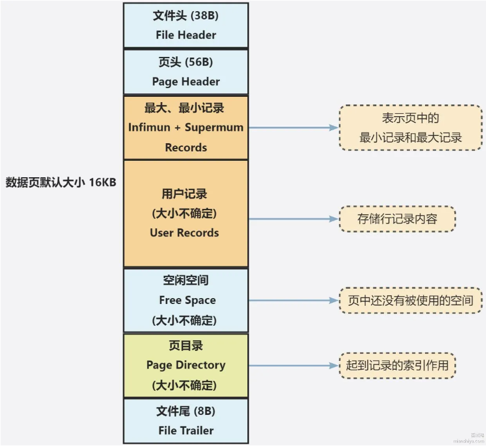
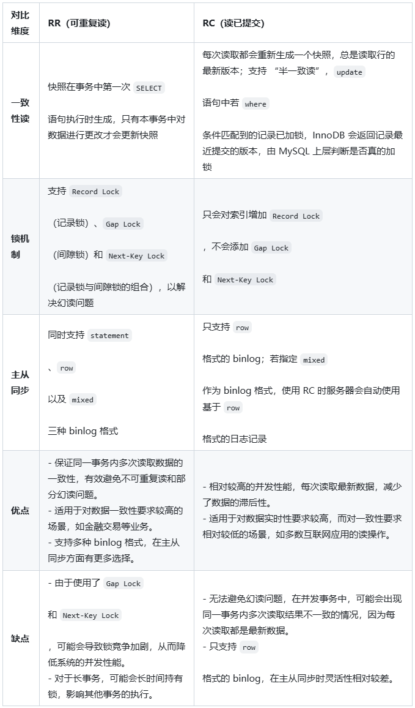

# 📚 MySQL 相关学习与整理

> 👋 本文介绍 [MySQL数据库] 的相关知识、常见问题与总结。

---

## 📑 目录

- [📚 MySQL 相关学习与整理](#-mysql-相关学习与整理)
  - [📑 目录](#-目录)
  - [🚀 MySQL 的存储引擎有哪些，他们之间有什么区别](#-mysql-的存储引擎有哪些他们之间有什么区别)
      - [💡 什么是 MySQL 存储引擎？](#-什么是-mysql-存储引擎)
      - [🔍 MySQL 存储引擎有哪些？他们有什么特点？](#-mysql-存储引擎有哪些他们有什么特点)
      - [🔣 这些存储引擎的区别是什么？](#-这些存储引擎的区别是什么)
      - [🖊 一些场景问题](#-一些场景问题)
  - [🚀 MySQL InnoDB 引擎中的聚簇索引和非聚簇索引有什么区别](#-mysql-innodb-引擎中的聚簇索引和非聚簇索引有什么区别)
      - [💡 什么是聚簇索引和非聚簇索引？](#-什么是聚簇索引和非聚簇索引)
      - [🔍 聚簇和非聚簇索引是怎么实现的？](#-聚簇和非聚簇索引是怎么实现的)
      - [🖊 一些场景问题](#-一些场景问题-1)
  - [🚀 MySQL 的索引类型哪些？](#-mysql-的索引类型哪些)
      - [💡 有哪几种分类方法？](#-有哪几种分类方法)
      - [⚙ 进一步从数据结构角度分析索引？](#-进一步从数据结构角度分析索引)
      - [⚙ 进一步从InnoDB中B+树分析索引？](#-进一步从innodb中b树分析索引)
      - [⚙ 进一步从索引性质角度分析索引？](#-进一步从索引性质角度分析索引)
      - [🖊 一些场景问题](#-一些场景问题-2)
  - [🚀 为什么 MySQL 选择使用 B+ 树作为索引结构？](#-为什么-mysql-选择使用-b-树作为索引结构)
      - [💡 在数据结构中有哪些树？它们的特点是什么呢？](#-在数据结构中有哪些树它们的特点是什么呢)
      - [🔍 MySQL为什么不使用B树，B-link树，红黑树？](#-mysql为什么不使用b树b-link树红黑树)
  - [🚀 MySQL 索引的最左前缀匹配原则是什么？](#-mysql-索引的最左前缀匹配原则是什么)
      - [💡 什么是最左前缀匹配原则？](#-什么是最左前缀匹配原则)
      - [🔍 注意范围查询的情况](#-注意范围查询的情况)
  - [🚀 MySQL 三层B+树能存多少数据？](#-mysql-三层b树能存多少数据)
      - [💡 InnoDB中页有多大？](#-innodb中页有多大)
      - [🔍 如何计算呢？](#-如何计算呢)
  - [🚀 MySQL 中回表是什么？](#-mysql-中回表是什么)
      - [💡 回表是啥？](#-回表是啥)
      - [🔍 回表会带来什么？](#-回表会带来什么)
  - [🚀 MySQL 中使用索引一定有效吗？如何排查索引效果？](#-mysql-中使用索引一定有效吗如何排查索引效果)
      - [💡 什么情况下用索引？什么情况下不用呢？](#-什么情况下用索引什么情况下不用呢)
      - [🔍 索引不生效的一些场景？](#-索引不生效的一些场景)
      - [🔣 什么是用上了索引？什么是全表扫描？](#-什么是用上了索引什么是全表扫描)
  - [🚀 MySQL 中构建索引时有哪些注意事项？](#-mysql-中构建索引时有哪些注意事项)
      - [💡 我们要根据什么构建索引？](#-我们要根据什么构建索引)
      - [🔣 索引是不是越多越好？](#-索引是不是越多越好)
      - [📚 如何看查询分析EXPLAIN的各类属性？](#-如何看查询分析explain的各类属性)
      - [🔍 如何实现MySQL优化？](#-如何实现mysql优化)
        - [MySQL的升级](#mysql的升级)
        - [建立合适的索引](#建立合适的索引)
        - [SQL语句优化](#sql语句优化)
        - [数据库优化](#数据库优化)
        - [配置参数](#配置参数)
  - [🚀 MySQL 中如何实现SQL调优？](#-mysql-中如何实现sql调优)
      - [💡 请简要回答如何进行SQL调优？](#-请简要回答如何进行sql调优)
      - [🔍 如何找到慢SQL的原因呢？](#-如何找到慢sql的原因呢)
  - [🚀 详细描述MySQL中B+树查询数据的全过程？](#-详细描述mysql中b树查询数据的全过程)
      - [💡 从哪些步骤开始说呢？](#-从哪些步骤开始说呢)
      - [🔍 每一页里的结构是什么样呢？](#-每一页里的结构是什么样呢)
      - [📚 InnoDB中数据页Page内的存储结构？](#-innodb中数据页page内的存储结构)
  - [🚀 MySQL中count(\*), count(1), count(字段名)有什么区别？](#-mysql中count-count1-count字段名有什么区别)
      - [💡 他们是啥？](#-他们是啥)
      - [🔍 功能哪里不同？](#-功能哪里不同)
  - [🚀 MySQL中varchar和char有什么区别？](#-mysql中varchar和char有什么区别)
      - [💡 核心区别](#-核心区别)
      - [🔍 我们在使用varchar的时候，要注意什么？](#-我们在使用varchar的时候要注意什么)
  - [🚀 MySQL是如何实现事务的？](#-mysql是如何实现事务的)
      - [💡 MySQL是通过哪些工具实现事务的？](#-mysql是通过哪些工具实现事务的)
      - [🔍 MySQL中有哪些锁类型？](#-mysql中有哪些锁类型)
      - [📚 MySQL中有哪些日志类型？](#-mysql中有哪些日志类型)
      - [🔒 在了解MVCC前，一定要知道MySQL中事务的隔离级别有哪些？为什么有这些隔离级别？他们会造成什么问题？](#-在了解mvcc前一定要知道mysql中事务的隔离级别有哪些为什么有这些隔离级别他们会造成什么问题)
      - [📚 MySQL中锁有哪些类型？](#-mysql中锁有哪些类型)
      - [🔣 MySQL中的MVCC是什么？](#-mysql中的mvcc是什么)
  - [🚀 MySQL事务的二阶段提交是什么？](#-mysql事务的二阶段提交是什么)
      - [💡 简单解释一下MySQL事务的二阶段提交](#-简单解释一下mysql事务的二阶段提交)
      - [🔣 如何对比redolog和binlog一致？](#-如何对比redolog和binlog一致)
      - [⚙ 日志如何提交？](#-日志如何提交)
  - [🚀 MySQL中如果发生死锁应该如何解决？](#-mysql中如果发生死锁应该如何解决)
      - [💡 MySQL中有哪些解决死锁的方案？](#-mysql中有哪些解决死锁的方案)
      - [🔣 如何避免死锁或降低死锁？](#-如何避免死锁或降低死锁)
      - [📕 如何手动kill死锁事务？](#-如何手动kill死锁事务)
  - [MySQL如何解决深度分页问题？](#mysql如何解决深度分页问题)
      - [💡 什么是分页查询？底层逻辑是什么？什么是深度分页？](#-什么是分页查询底层逻辑是什么什么是深度分页)
      - [🔍 深度分页问题如何优化？](#-深度分页问题如何优化)
  - [🚀 什么是MySQL主从同步机制？它是如何实现的？](#-什么是mysql主从同步机制它是如何实现的)
      - [💡 简单说一下主从同步](#-简单说一下主从同步)
      - [🔍 主从复制类型有哪些？](#-主从复制类型有哪些)
  - [🚀 如何处理MySQL的主从同步延迟？](#-如何处理mysql的主从同步延迟)
      - [🔍 主从同步延迟的解决方法](#-主从同步延迟的解决方法)
      - [📚 主从延迟常见的原因是什么？](#-主从延迟常见的原因是什么)

**关键词**：引擎，索引，语法，事务（锁，日志，MVCC），主从同步

---

## 🚀 MySQL 的存储引擎有哪些，他们之间有什么区别

> MySQL是一种广泛使用的关系型数据库管理系统，其开源免费、高性能、高可扩展性、有强大的跨平台支持和社区支持（够用简单便宜好招人工具多风险小大部分业务都合适），使其成为了许多开发者和企业的首选数据库解决方案。MySQL也支持多种存储引擎，每种引擎有自己独特的优势和适用场景。

#### 💡 什么是 MySQL 存储引擎？

MySQL 存储引擎（Storage Engine）是数据库处理表中数据的方式。它决定了数据的 **存储结构、索引实现、事务支持、并发机制** 等。
MySQL 支持为每张表单独指定存储引擎，因此可以根据具体业务需求灵活配置。

#### 🔍 MySQL 存储引擎有哪些？他们有什么特点？

- **InnoDB**：
**特点**：
MySQL的默认存储引擎（5.5.5版本前）；
支持事务、外键、行级锁定；
提供高并发性能，适用于高负载的OLTP应用；
数据以聚集索引的方式存储，提高检索效率；
**适用场景**：
需要事务支持、高并发、数据一致性要求高的应用，如金融、电子商务等。

- **MyISAM**：
**特点**：
MySQL的默认存储引擎（5.5.5版本后）；
不支持事务和外键，使用表级锁。
适合读取多，更新少的场景，如数据仓库。
具有较高的读性能和较快的表级锁定。
**适用场景**：
读密集型应用，数据仓库，数据分析系统，嵌入式系统和移动应用等。

- **MEMORY**：
**特点**：
MySQL5.6.3开始默认启用；
包括临时缓存会话信息等，以及对频繁访问的小数据集快速查询；
数据存储在内存中，速度快但重启后会丢失；
**适用场景**：
适用临时数据存储或快速存储

- **NDBCluster**：
**特点**：
架构上：1-2个管理节点，2个或更多数据节点，1个或多个SQL节点；
支持高可用性和数据分布，适合大规模分布式应用。
提供行级锁和自动分区；
**适用场景**：
大量并发事务场景，金融电商社交网络等应用。

- **ARCHIVE**：
**特点**：
用于存储大量历史数据，支持高效的插入和压缩
不支持索引，适合日志数据存储
**适用场景**：
存储系统日志，操作记录，访问日志等历史数据，业务中不再频繁访问但需合规保留的数据。

#### 🔣 这些存储引擎的区别是什么？

最常用的应该是InnoDB，MyISAM和MEMORY。从以下几个方面说区别：

- **事务支持**：
InnoDB支持事务，MyISAM和MEMORY不支持事务。
- **外键支持**：
InnoDB支持外键，MyISAM和MEMORY不支持外键。
- **并发控制**：
InnoDB使用行级锁，MyISAM使用表级锁，MEMORY使用内存锁。
- **存储方式**：
InnoDB将数据存储在磁盘上，MEMORY将数据存储在内存中，ARCHIVE将数据存储在磁盘上并压缩。
- **索引类型**：
- InnoDB支持聚集索引和非聚集索引，MyISAM支持非聚集索引，MEMORY支持哈希索引。
- **缓存支持**：
- InnoDB支持缓存，MyISAM和MEMORY不支持缓存。
- **读写阻塞**：
- InnoDB读写阻塞和事务隔离级别有关，而MyISAM读写相互阻塞。
- **数据恢复**：
- InnoDB支持崩溃恢复(redolog与undolog)，MyISAM不支持崩溃恢复。

#### 🖊 一些场景问题

- Q: 为什么MyISAM比InnoDB快？
- A: **1** MyISAM只缓存了索引块，减少了缓存换入换出的频率。**2** MyISAM使用非聚簇索引，而InnoDB使用聚簇索引，InnoDB的二级索引需要找到id回表查一级索引，而MyISAM所有索引直接指向数据行的存储位置offset。**3** InnoDB还需要维护MVCC一致，即使场景中没有也会去检查和维持，而MyISAM牺牲了写性能而提升了读性能。
 
- Q: 行级锁是什么？能否讲一下InnoDB的锁机制？
- A: `是什么`：行级锁允许数据库在并发访问时只锁定特定的数据行而非整张表，可以显著提升并发性能，尤其是高并发写入的时候。`锁机制`：InnoDB实现了行级锁（对比 MyISAM 的表级锁），支持 共享锁（S） 和 排他锁（X），通过 MVCC（多版本并发控制）让读操作无锁访问历史版本，写操作加锁保证一致性。锁类型包括 记录锁（锁定单行）、间隙锁（锁定索引间隙，防插入）和 临键锁（记录锁 + 间隙锁，默认在可重复读隔离级别下防幻读）。锁的粒度与 索引 强相关：有索引时精确匹配只锁单行，无索引则退化为表级锁。
 
- Q: MyISAM的索引结构是什么样的？它存在了什么问题？
- A: MyISAM采用了数据和索引分离的形式，也就是两者是相互独立的，因此MyISAM的索引都为非聚簇索引，这也导致MyISAM查询数据需要进行两次查询，先通过索引查出数据所在地址，再查询到真正的数据。

## 🚀 MySQL InnoDB 引擎中的聚簇索引和非聚簇索引有什么区别

#### 💡 什么是聚簇索引和非聚簇索引？

**聚簇索引**的叶子节点存储的是数据行，可以访问完整的数据；非叶子节点存储的是索引值。每个表只能有一个聚簇索引，适合范围查询和排序。
**非聚簇索引**的叶子节点存储的是数据行的主键和对应的索引列，通过主键才能访问完整的数据行；非叶子节点存储的也是索引值。一个表可以有多个非聚簇索引，适合快速查找数据。

#### 🔍 聚簇和非聚簇索引是怎么实现的？

InnoDB中聚簇索引就是主键索引，非聚簇索引值的是非主键索引（辅助索引、二级索引），默认情况下它们都是`B+树`实现的。

若是主键索引：
- 非叶子节点存主键和页号，叶子节点存储完整数据
- 叶子节点间有双向链表链接，方便范围查询
- 叶子节点内有页目录，内部记录是单链表链接，通过页目录二分再遍历链表即可找到对应记录。B+树能够快速定位到页而并非记录。
- 页大小默认16kb，按照主键大小排列，页内和页间都是有序的，方便范围查询和排序。

若是非聚簇索引：
- 差别在于叶子节点仅存储索引列和主键，不包含整行数据。

所谓回表，就是通过二级索引找到id也就是主键，再去根据主键索引查询整行数据的过程。

#### 🖊 一些场景问题

- Q: 我们应该如何提升查询效率呢？
- A: 我们可以优化索引结构，添加相应的索引以及优化sql语句，减少回表的次数以提升查询效率，也可以依赖索引覆盖和索引下推等技术。具体一些，**索引覆盖** 指的是在索引中包含了我们要查询的数据列，这样就不用回表了。**索引下推** 指的是：若查询条件中有的列作为条件不在索引范围内，那么很多不满足条件的数据也进行了回表操作。为减少回表次数，可以在存储引擎层使用索引的列进行额外的筛选操作。即联合索引在本身数据就有的情况下，再进行一次数据过滤，而不是回表到server层后再过滤。

## 🚀 MySQL 的索引类型哪些？

#### 💡 有哪几种分类方法？

- 从数据结构角度：B+树索引，哈希索引，倒排索引（全文），R树索引（空间）
- 从B+树索引角度看：聚簇索引，非聚簇索引
- 从索引性质角度看：普通索引，主键索引，联合索引，唯一索引，全文索引，空间索引

#### ⚙ 进一步从数据结构角度分析索引？
- B+树索引：MySQL默认索引类型，常用于InnoDB和MyISAM引擎，适用于范围查询和精确查询。
- 哈希索引：基于哈希表结构，适用于等值且很快，但不支持范围。常用于Mmory引擎。
- 倒排索引：用于全文搜索，将全文分词，通过存储词与文档的映射，支持模糊匹配和关键字搜索，适用于大文本字段如TEXT类型。
- R-树索引：专用于多为空间数据的设计。

#### ⚙ 进一步从InnoDB中B+树分析索引？
- 聚簇索引：之前说过。
- 非聚簇索引：InnoDB中非主键的索引，做主键查询、范围查询和JOIN操作的时候使用聚簇索引，而在非主键查询、覆盖索引及频繁更新非主键列的时候，需要从聚簇索引中通过主键查询完整行数据，再实现操作。一个表中可以有多个非聚簇索引。

#### ⚙ 进一步从索引性质角度分析索引？
- 普通索引：非主键索引且唯一。
- 主键索引：每张表唯一，且不为空，通常通过聚簇索引实现。
- 联合索引：多个列组成，使用多列查询条件，提高多列查询性能。
- 唯一索引：保证索引列值唯一。
- 全文索引：用于全文搜索。
- 空间索引：用于地理信息的查询。

#### 🖊 一些场景问题

- Q: InnoDB为什么使用B+树实现索引？
- A: 支持范围查询，支持排序，可以存储更多索引数据，有利于磁盘预读，可以缓存更多索引数据。

- Q: B+树索引和Hash索引有什么区别？
- A: **1** hash索引更适合等值查询而不是和范围查询和排序。 **2** B+树插入删除数据时要调整索引结构，维护成本搞，而哈希索引只需要计算哈希值并插入。 **3** B+树在磁盘上是有序存储的，而哈希索引无序。

## 🚀 为什么 MySQL 选择使用 B+ 树作为索引结构？

#### 💡 在数据结构中有哪些树？它们的特点是什么呢？
- 链表：O(n)的时间复杂度，是效率最低的树，具有：空间利用率低、事务支持受限、碎片问题严重的问题。
- 二叉搜索树：左子树的所有节点值 < 根节点值 < 右子树的所有节点值。可能会退化成单链表，也就是时间复杂度可能为O(n)。
- 红黑树：一种自平衡的二叉搜索树，确保在插入删除和查找操作最坏情况下时间复杂度为O(logn)；每次插入或删除操作成功后，红黑树自动维持平衡。JDK1.8后选择红黑树+链表+数组作为HashMap底层数据结构。为什么不用红黑树呢？**1** 而红黑树节点层次较多，每次增删查都需要多次磁盘I/O来获取不同节点数据，导致较高时间开销；**2**且该结构空间利用率较低， **3**且红黑树操作较多，并发操作难以保证数据一致性，需要较复杂的锁机制。
- B树：平衡多路查找树，减少磁盘访问次数提高查询性能。每个节点都存储数据。
- B+树：相比于B树，数据项只存在叶子节点中，且叶子节点间通过指针连成链表，方便进行范围查询。
- B-link树：优化了B+树的并发性能，非叶子节点也可能存储数据记录，每个节点都有指向同级右侧兄弟节点的指针。

#### 🔍 MySQL为什么不使用B树，B-link树，红黑树？
- 为什么不用B树：
**1** 范围查询更高效，不用回溯到非叶子节点；
**2** B+树空间利用率相对更高，高度更低，查询时有更少的磁盘IO次数； 
**3** 叶子节点存储所有数据，便于数据查找定位
- 为什么不用B-link树： 
**1** B-link树MVCC机制更加复杂，B+树已满足需求，不需要引入B-link树重构
- 为什么不用红黑树：
这个问题，我认为要从两个角度考虑，机组原理和数据结构
**1** 从计算机组成原理角度说：首先，磁盘IO速度相对于内存来说非常慢，因此减少磁盘IO次数是提高数据库性能的关键，而红黑树一个节点只存储一个键值和少量指针，树高度高而带来了更多的磁盘IO操作。其次，计算机访问数据具有局部性原理，一个数据被访问，其附近的数据也很可能被访问，B+树当读取一个节点时，多个相关数据也会一起加载至内存中，后续访问这些数据时也会从内存中获取从而减少磁盘IO。
**2** 从数据结构角度说：B+树和B树通过遍历节点和指针实现高效范围查询，且B树中叶子节点通过链表相连，查询也更加方便。且在修改时，一个节点可以存储多个键值对，调整频率也比红黑树低。

## 🚀 MySQL 索引的最左前缀匹配原则是什么？

#### 💡 什么是最左前缀匹配原则？
指在使用**联合索引**的时候，查询条件必须从索引的最左侧开始匹配，若一个联合索引包含多个列，查询条件必须包含第一个列的条件，然后是第二个，以此类推。

也就是如果有一个a，b，c的联合索引，在查询时一定要有a的条件，才能使用这个联合索引。若查询条件只有a和c，在MySQL5.6后会有索引下推机制，即先通过a的条件筛选数据后，再利用c的值过滤不符合的数据。

#### 🔍 注意范围查询的情况

还是拿a，b，c的字段查询举例子，联合索引在B+树中，其数据结构是先按a的值排序，后按b，c的值排序。

因此，如果遇到范围查询（a>1,b=2,c=3）则会在a处停止匹配，因为a经过范围查询筛选得到的bc数据是无序的。而遇到>=,<=,BETWEEN,like这种范围查询，则不会停止匹配，因为这些查询包含一个等值判断，可以定位道某个数据后再向后扫描。

而在MySQL8以后引入了 `Skip Scan Range Access Method` ，可以在左侧条件基数很低的情况下，通过列举左侧条件，匹配索引，再进行范围查询。

## 🚀 MySQL 三层B+树能存多少数据？

#### 💡 InnoDB中页有多大？

B+树每个节点对应一个页，默认大小为16kb，可以通过调整参数innodb_page_size来修改。

#### 🔍 如何计算呢？

每个叶子节点大小为16kb，假设每个数据记录的主键和数据大小为1kb（一般比这个小），每个非叶子节点存储的是指向子节点的指针和索引键。

第三层为叶子节点，每个叶子节点可以存储`16kb / 1kb`条数据记录；
第二层中，假设每个指针6字节，索引键8字节，则每个非叶子节点可以指向`16 * 1024 / (6+8) = 1170`个叶子节点。
第一层，同样指向1170个非叶子节点。

因此三层B+树大致能存储：`1170 * 1170 * 16 = 21902400` 条数据。

## 🚀 MySQL 中回表是什么？

#### 💡 回表是啥？

回表是MySQL在使用二级索引（非聚簇索引）作为条件查询的时候，通过二级索引只能查到索引字段值和对应主键值，再通过主键值去聚簇索引中查找实际的数据行，的过程。

#### 🔍 回表会带来什么？

通过id去主键索引查询的时候，由于id不连续，因此去主键索引频繁查询会造成大量随机IO。

## 🚀 MySQL 中使用索引一定有效吗？如何排查索引效果？

#### 💡 什么情况下用索引？什么情况下不用呢？

MySQL会计算成本，评估CPU和IO成本最终选择使用辅助索引还是全表扫描。

#### 🔍 索引不生效的一些场景？

- 查询不符合最左前缀
- 索引中使用了运算或函数
- like的随意使用，如`like '%abc%'`
- or的随意使用
- 字段类型的随意使用，比如varchar类型的字段被匹配成了int型，mysql会做隐式转换即函数计算，索引会失效
- MySQL优化器选择不使用索引，特别在复杂查询的情况下
- 表中不同字段做比较
- orderby中使用了非索引字段

#### 🔣 什么是用上了索引？什么是全表扫描？

所谓全表扫描，就是MySQL找到最左侧叶子节点，然后从左到右遍历找到所有满足条件的叶子节点。

所谓用上索引也分了好几种：利用主键索引快速查找；利用二级索引快速查找；全表扫描二级索引后快速查找(这玩意有点难理解，其实就是在你要查找的数据已经被包含在索引中的时候，直接全表扫描二级索引，比全表扫描主键索引开销要小一些)。

## 🚀 MySQL 中构建索引时有哪些注意事项？

#### 💡 我们要根据什么构建索引？

- 要选择合适的列：选择性高，数据重复少的列；频繁用于查询的列；很长字符串类可以使用前缀索引。
- 索引数量的把控：索引也是需要维护的，索引过多插入的性能会大打折扣；组合索引的顺序也很重要。
- 索引的维护和更新：索引会产生碎片，MyISAM可定期使用OPTIMIZE TABLE，InnoDB可使用ALTER TABLE重新组织表来优化索引。在创建索引的时候可以先测试。
- 根据引擎特性选择：InnoDB指向业务强依赖事务，MyISAM执行全文索引。

#### 🔣 索引是不是越多越好？

每次对表中数据进行增删改的时候，索引也会被更新，这会增加写入操作的开销。
且MySQL有查询优化器，会考虑选择哪个索引查询成本低，索引过多优化器会将时间花在选择上，甚至会选择次优的索引。
每建立一个二级所有，都需要建立一个B+树，默认每个数据页都是16kb，索引多了占用空间也多。

#### 📚 如何看查询分析EXPLAIN的各类属性？

`id`：查询的执行顺序标识符，值越大优先级越高，简单查询id通常只有一个，复杂查询会有多个。
`select_type`；查询的类型，如simple简单查询、primary主查询、subquery子查询。
`table`：表
`type`：访问类型，如ALL全表扫描、index索引扫描、range范围扫描、ref索引匹配、eq_ref唯一索引匹配、const常量匹配、system系统表。性能从好到差是 system > const > eq_ref > ref > range（至少达到这个级别） > index > all。
`possible_keys`：可能用到的索引。
`key`：实际用到的索引。
`key_len`：用到索引的长度。
`ref`：显示索引哪一列被使用。
`row`：要扫描的行数，越少越好
`filtered`：查询条件过滤掉的百分比
`Extra`：额外信息

#### 🔍 如何实现MySQL优化？

针对这个问题，我觉得主要得从三个层面说，软件层面、硬件层面和架构层面去说。

**首先是软件层面**：
这是最直接也是优化效果最好的层面，也就是MySQL自身的优化。

##### MySQL的升级

MySQL官方描述自己8.0的性能是5.7的两倍，官方针对InnoDB存储引擎进行了优化，主要是索引方面，MySQL8支持对索引的拆分，简单来说就是一个大索引拆成了多个小索引，和JDK1.7中CurrentHashMap1.7的分段思想是一致的，插入的时候分段插入，最大程度减少了锁的冲突，一定程度上减少了锁的粒度。

##### 建立合适的索引

我们知道如果索引太少，效果可能不明显，而索引太多又会造成数据维护成本高，也不一定有用。因为MySQL索引底层用的是B+树，三层B+树就可以达到大约2000万条数据，使用索引三次IO就可以找到对应的数据。我们在建立索引的时候，要针对一些经常查询，排序，分组的字段建立对应的索引。

##### SQL语句优化

索引建立完后就是经典的SQL语句优化了。如果SQL语句没走索引就会走全表查询，回表此时太多而导致随机IO太多，因此也要避免写一些全表扫描的SQL，尽可能用一个字段去查询，也要避免索引失效。比如模糊匹配和全文搜索（这里更建议用es）。也要避免使用<或者>这样的范围查询，会导致索引失效。还有就是关联查询，这里如果两张表关联字段的类型不同，就会做一个隐式的类型转换，相当于做了一个函数计算，这样也就索引失效了。函数计算也要避免使用。
**SQL监控**
可以使用慢查询日志，查看是哪些查询比较慢，然后通过explain排查sql，主要看type，性能从好到差是 system > const > eq_ref > ref > range > index > all。其中system和const是走索引的，而all是全表扫描。
**MySQL回表**
如果走非聚簇索引，就会产生回表操作，查询数据越多回表也就越多，就会多出一些随机Io操作。最好的情况是查询的时候可以走索引覆盖，避免二次回表。

##### 数据库优化

**数据库设计**
最好选择单调递增的数字，可以保证新插入的数字在后面，从而避免索引重建，同时在查询的时候也可以直接比较大小，比字符串逐字符比较性能更好。表结构设计的时候也要尽可能满足原子性（字段值不能再分），唯一性（每行数据描述同一业务属性的数据），独立性（非主键字段间无依赖性）。但考虑到频繁join也就是底层的for循环操作会影响性能，有时候会进行一些反范式设计。
**数据库合理分表**
由于在海量数据查询中，会导致磁盘IO较大。针对这个问题需要采取分表策略。分表有水平分表和垂直分表，垂直分表可以减少单条数据的大小，而水平分表可以按照一个字段进行哈希分表，可以针对表性能进行压测，看看多少容量会有明显延迟；也可以按照时间分表，比如将3个月内数据定义为热数据，3-6月内定义为温数据，6月以上定义为冷数据。

##### 配置参数

buffer_pool 缓冲池，可以配置服务器物理内存的50%-80%
join_buffer_size join时分配缓冲区的大小
sort_buffer_size 排序时分配缓冲区的大小，太小了mysql可能在硬盘上进行排序
read_buffer_size 空值单个session读取数据的缓冲池大小，增大可以提高性能。
根据实际压测效果给出

**然后是硬件层面：**

万不得已的时候采用的方式。比如更换硬盘的类型（HDD换成SSD），固态1000TPS，机械硬盘大概600-700TPS。或者扩大硬件规格，增加内存。

**最后是架构层面**：
可以部署MySQL主从集群，做分布式数据库，可以提升数据库性能。将冷数据归档到HBase这种数据库中也可以减小MySQL的负担。也可以通过分库分表的方式减小数据库压力，引入MyCat，Sharding等框架实现跨表查询跨表事务等。

也可以考虑添加话u村，把查询频繁而更新不频繁的数据放到缓存中。Java中可以使用多级缓存，比如Caffeine，guava，ehcache，Redis等。

## 🚀 MySQL 中如何实现SQL调优？

#### 💡 请简要回答如何进行SQL调优？

- 避免 select*, 只查询必要的字段
- 合理设计索引，通过联合索引进行覆盖索引及索引下推技术的优化，减少回表的次数，提升效率
- 避免 SQL 中进行函数计算等操作，导致无法命中索引
- 避免使用 like, 导致全表扫描 (如果符合最左前缀匹配原则可以走索引)
- 注意使用联合索引需满足最左匹配原则
- 不要对无索引字段进行排序操作
- 连表查询需注意不同字段的字符集保持一致，
- 注意隐式类型转换操作，会导致索引失效
- 使用 OR, 两边需保持等值匹配且都为索引列，才会走索引

#### 🔍 如何找到慢SQL的原因呢？

- 索引失效
- 多表 join（MySQL使用嵌套循环方式Nested-Loop Join实现关联查询，说白了就是第一张表外循环，第二张表内循环，每一条记录都作比较，符合条件就输出。n张表就是O(n)的复杂度；如果不用join，可以在代码中做关联，或在表中做数据冗余而避免join，或基于join关系将数据库中多张表数据打平做一张大宽表，同步到ES或者直接在数据库中查）
- 查询字段太多
- 表中数据量太大（历史数据迁移出来归档，或者将数据拆分开并分散到多个地方去，或者将数据同步到支持大数据量查询的分布式数据库中）
- 索引区分度不高
- 数据库连接数不够
- 数据库的表结构不合理
- 数据库 IO 或者 CPU 比较高
- 数据库参数不合理
- 长事务导致的
- 锁竞争导致的长时间的等待

## 🚀 详细描述MySQL中B+树查询数据的全过程？

#### 💡 从哪些步骤开始说呢？

- 首先，从根节点找起，根据比较数据键值与节点中存储的索引键值，确定数据位于哪个区间，从而确定分支，从上到下最终定位到叶子节点。
- 叶子节点一页有16kb，存储数据不止一条。叶子节点中数据以组的形式划分，利用叶目录结构，通过二分查找可以定位到对应的组。
- 定位到组后，利用链表遍历找到对应的数据行。

#### 🔍 每一页里的结构是什么样呢？

页目录中分为多个槽，每个槽都指向对应一个分组内最大的记录，每个分组都会包含若干条记录。
通过二分查找，利用槽就能定位到记录所在的组，从而获得对应的记录。

#### 📚 InnoDB中数据页Page内的存储结构？

`File Header`: 记录页的头信息，共8部分，共占38字节，包括页号、上一页、下一页、页类型，页内偏移量等信息。
`Page Header`: 记录页的状态信息，共14部分，共占56字节。
`Infirmun + Supermum Recor`: 限定记录的边界，Infir和Super分别记录比该页中任何主键都小的值。
`User Record`：实际存储记录的内容
`Free Space`: 空闲空间，记录删除后空间会加入到这里
`Page Directory`: 页目录，页会被分为若干组，每个分组对应一个槽（Slot），这里记录槽的位置，实现基于当前数据页二分查找快速分组。

InnoDB通过Page Directory根据索引值范围进行二分查找获取大概位置，利用record header中的next record进一步定位具体位置，从而获取到具体的数据。

## 🚀 MySQL中count(*), count(1), count(字段名)有什么区别？

#### 💡 他们是啥？

都是用来统计行数 聚合函数

#### 🔍 功能哪里不同？

- count(*)会统计表中所有行的数量包括null值，不处理具体的列，效率较高
- count(1)和count(*)基本没差
- count(字段名)会统计指定字段不为null的行数据，会对指定字段进行计数。
因此，如果统计null就用count(*)或count(1)，如果统计具体字段就用count(字段名)

在MyISAM中只有表锁，因此count(*)相当于查询一个字段，非常快；在InnoDB中由于支持行锁，无法维护全局计数器，因此InnoDB对count(*)和count(1)做了优化

## 🚀 MySQL中varchar和char有什么区别？

#### 💡 核心区别

VARCHAR是可变长度的字符串，存储字符串长度与实际相等，存储数据时会增加1-2个字节存储字符串长度信息。最大65535字节。
CHAR是固定长度字符串，MySQL会在字符串末尾填充空格以达到指定的长度。

#### 🔍 我们在使用varchar的时候，要注意什么？

如果查询字段a,b,c并根据c排序，在排序操作时，如果字段总长度较长，sort_buffer放不下，则会使用双路排序，即sort_buffer存放需要排序的字段b和id，排序完后再通过id回表查询abc字段，多了一步回表，性能较差。

## 🚀 MySQL是如何实现事务的？

> mysql的事务是数据库操作的基本单元，是一组逻辑上相互关联的 SQL 操作集合。MySQL事务的特性有原子性（事务内的所有操作要么全部执行，要么全部不执行）、一致性（事务执行前后，数据库都要处于一致性状态）、隔离性（多个事务并发执行时，不同事务之间相互隔离，一个事务的执行不能被其他事务干扰）和持久性（事务一旦提交，其对数据库的修改会永久保存）。

#### 💡 MySQL是通过哪些工具实现事务的？

- 锁：行锁、间隙锁等机制，使用数据并发修改的控制，满足事务的隔离性
- Redo Log：记录事务对数据库的所有更改，当MySQL发生宕机或崩溃的时候，用于事务的回滚，使事务执行失败之后可以恢复之前的样子，实现原子性和隔离性。
- Undo Log：记录事务的反向操作，即历史版本，同样使事务执行失败之后可以恢复之前的样子，实现原子性和隔离性。
- MVCC：多版本并发控制满足了非锁定读的需求，提高并发读，实现了读已提交和可重复读的隔离级别，实现事务的隔离性。

#### 🔍 MySQL中有哪些锁类型？

大概可以分为：行级锁，表级锁，意向锁，共享锁，排他锁，元数据锁，间隙锁，临键锁，插入意向锁，自增锁

可以从演进的角度来看MySQL中比较关键的几个锁。

**一些概念**：DDL（数据定义语言，用于创建修改和删除数据库对象），DML（数据操作语言）

> ###### 首先是共享锁和排他锁

共享锁(shared(S) locks)：当事务读物记录的时候获取S锁，它允许多个事务同时获取S锁，相互之间不会冲突。
排他锁(exclusive locks): 事务在修改记录的时候获取X锁，只允许一个事务获取X锁，其他事务需要阻塞等待。

X锁与S锁和X锁都冲突，S锁与S锁不冲突。

> ###### 接着是元数据锁

元数据锁也分为读锁和写锁：
读锁(MDL_SHARED)：当一个事务需要读取表的元数据时（SELECT），会获取读锁，多个事务可以同时持有读锁，不会相互阻塞。
写锁(MDL_EXCLUSIVE)：当一个事务需要修改表的元数据时（ALTER TABLE），会获取写锁，写锁会阻塞其他任何读锁和写锁，确保独占访问。

元数据所的主要作用是：**1** 防止并发的DDL操作和DML操作冲突，*如一个事务对表结构进行了修改，元数据锁会阻止其他事务对该表操作；或一个事务对表进行数据操作时，。元数据锁会组织其他事务对表进行结构性更改*；**2** 保证元数据一致性，DDL操作执行时，元数据不会被其他事务同时修改。

> ###### 然后是意向锁

在InnoDB加表锁的时候，如何判断表中是否有行锁？

可以通过使用；
共享意向锁(IS)：表明此表内有S锁，在添加表级锁时可以不遍历表中记录而快速上锁。
独占意向锁(IX)：表明此表内有X锁，在添加表级锁时可以不遍历表中记录而快速上锁。

意向锁都是表级别的锁，当需要对表中某条记录上S锁或X锁的时候，需要先在表上加IS或IX锁。这样如果要加表锁，就可以看表上面有没有IS和IX锁，不用遍历记录去找了。

S，X，IS，IX之间的关系图应该是这样的：

> ###### 下面再看看MySQL的行锁有哪些

主要有三种，记录锁，间隙锁，临键锁

其中，`记录锁`是加在索引记录上的锁。如事务A执行`select * from yes where name = 'xx' for update`，则这条记录被锁定而其他事务无法插入删除修改。当事务A未提交时，B若修改这条数据`insert into table (name) values ('xx')`会被阻塞，而事务C执行`insert into table (name) values ('xx')`是否被阻塞则取决于name字段，若name有索引则事务C不会被阻塞，若name没有索引，由于记录锁只能依赖聚簇索引，而聚簇索引无法通过name快速定位数据，需要全表扫描，因此全表会被锁定而C会被阻塞。

`间隙锁`则是给间隙加上所，可以防止其他事务将数据插入到间隙中，防止幻读的出现。

`临键锁`则会锁住某条所以记录及这条记录前的间隙，形成一个左开右闭区间，防止其他事无对索引的记录修改删除，也避免插入新记录从而避免出现幻读问题。

> ###### 插入意向锁

若事务A被间隙锁阻塞了，则会生成插入意向锁，等待这个间隙释放后再进行插入操作。因此插入意向锁之间不会阻塞。

锁其实就是内存中的一个结构，每个事务为某个记录或间隙上锁，其实就是创建一个锁对象来争抢资源。若事务没有抢到资源，就会生成一个锁对象，等拥有资源的事务释放锁后就会寻找正在等待当前资源的锁结构，并选一个让它获得资源并唤起对应的事务。

> ###### Auto-Inc Lock

自增列插入的时候使用。5.1.22后用`互斥量`来进行自增减的累加，性能高于Auto-Inc Lock，因为它在语句插入的时候获得自增值的时候，就可以释放锁了。

但互斥量并发插入时基于statement-based binlog复制，自增的值顺序难以把控，可能造成主从数据不一致。

可以通过innodb_autoinc_lock_mode配置控制自增锁使用：0仅Auto-Inc Lock，1默认值，对于已知插入行数的使用互斥量，不知插入行数的使用Auto-Inc Lock，2仅使用互斥量。

> ###### 谓词锁

Predicate Locks。由于多维数据没有下一个的概念，因此InnoDB在用于查询的最小边界举行MBR值上设置谓词锁，使InnoDb在索引上执行一致性读，其他事务无法插入或修改查询条件匹配的行。

#### 📚 MySQL中有哪些日志类型？

> ###### 简单描述一下这些日志呢？

MySQL共有三种类型的日志：binlog，redolog和undolog。
- binlog: 二进制日志，用于记录MySQL服务器所有更新和修改操作，可以记录所有DDL和DML操作，包括对表结构的修改，数据的插入修改删除等，binlog是在日志事务提交后生成的，可以用于恢复数据库。
- redolog：重做日志，用于恢复数据，保证数据一致性和持久性。MySQL发生更改后，redolog会将这些操作记录下来并写入磁盘。当MySQL当即崩溃时，重放redolog就可以恢复数据。
- undolog：回归日志，用于回滚操作，MySQL发生数据新增或更改时，undolog会记录这些操作并将其写入磁盘，重放undolog可以用来回滚事务。

他们的区别在于：
binlog和redolog都是二进制日志，但binlog是逻辑日志，记录的是SQL语句，而redolog是物理日志，记录的是数据页的修改。binlog可以跨平台使用，而redolog不能。

undolog在数据修改操作同步写入；redolog在事务执行中就开始写，写入日之后落实到磁盘；binlog在事务提交时写入，保证记录完整已完成事务。

> ###### 什么是Write-Ahead Logging技术，它的优点是什么，MySQL是否用到了WAL

WAL是预写日志，是数据库系统中确保数据持久性和一致性的核心机制，其核心思想在于将数据写入实际存储位置之前，先修改操作记录到持久化日志中，然后再将数据写入数据文件。

其优点在于：
- 提升写入性能。由于日志以顺序方式写入磁盘，而数据文件修改则是随机IO（比顺序慢一百倍）；多事务日志可批次写入磁盘从而减少IO次数。
- 数据持久性与一致性保障。事务失败通过日志回滚保证原子性，数据库崩溃可通过日志恢复或回滚保证持久性。
- 支持事务并发与MVCC。事务提交前确保日志持久化，无需等待数据文件更新，支持高并发；UndoLog作为MVCC基础能够生成旧版本实现无锁读。
- 简化备份与恢复流程。可基于时间点或事务ID恢复，可基于Binlog反向生成sql语句恢复。

MySQL的InnoDB完全实现了WAL机制，RedoLog和UndoLog就是代表。

InnoDB可以
通过`innodb_flush_log_at_trx_commit`控制 Redo Log 刷盘时机：0 = 每秒刷盘；1 = 每次提交刷盘（默认，最强持久性）；2 = 每次提交写入 OS 缓存；
通过`innodb_log_file_size`控制单个 Redo Log 文件大小，影响日志切换频率和恢复时间；
通过`innodb_log_buffer_size` 控制Redo Log 缓存大小，较大值可减少刷盘次数，提升大事务性能

> ###### Log Buffer 是什么，有什么作用？

Log Buffer是一块位于内存中的区域，属于 InnoDB 缓冲池的一部分。作为事务日志的临时存储位置，为了提升数据库的写入性能，减少磁盘的开销。

其核心作用在于：
- 提升写入性能。当执行事务操作时，InnoDB 不会立即将 redo log 写入磁盘，而是先将日志数据写入 Log Buffer，日志会在缓冲区中积累到一定量（或达到特定条件）后，再批量刷新到磁盘。
- 保证事务持久性。事务提交时，redo log 需要从 Log Buffer 刷新到磁盘，确保事务即使在数据库崩溃后也能恢复。
- 控制日志刷新策略。通过innodb_flush_log_at_trx_commit参数可控制日志刷新时机。

> ###### MySQL从数据修改提交到最终持久化到数据文件的过程？

- 任务初始化，MySQL为其分配一个事务ID并在InnoDB中创建事务对象，放入事务列表跟踪其状态。Log Buffer初始化准备记录后续日志。
- 数据修改执行时，修改Buffer Pool中缓存的数据页，修改后的数据页称为脏页。
- 修改数据页之前，生成undoLog记录原始数据，生成redoLog记录对数据页的物理修改，并写入Log Buffer，由innodb_flush_log_at_trx_commit参数控制刷盘时机。如果另一个事务执行select则会通过undoLog读取旧版本数据而不会看未提交的新数据。
- 事务提交时，InnoDB确保redoLog记录被写入磁盘文件。通过两阶段提交，prepare阶段将redolog写入磁盘，commit阶段写入binlog（先写入binlog cache再刷盘）并在redolog中写入commit标记。 
- 事务提交后，Buffer Pool中的脏页会在InnoDB检查点机制异步刷盘，写入.ibd文件完成事件持久化。

#### 🔒 在了解MVCC前，一定要知道MySQL中事务的隔离级别有哪些？为什么有这些隔离级别？他们会造成什么问题？

> ###### MySQL事务有哪些隔离级别？

主要有以下四种：
- 读未提交（Read Uncommitted）：最低的隔离级别，一个事务可以看到另一个事务尚未提交的数据修改，会导致`脏读`的问题，也就是读取到其他事务未提交的数据。
- 读已提交（Reda Committed）：事务只能看到已经提交的其他事务所做的修改，避免`脏读`问题，但会引发`不可重复读`问题，也就是同一事务中，相同的查询可能返回不同结果。（大公司所使用的隔离级别，可以提高并发降低死锁概率）
- 可重复读（Repeatable Read）: 确保一个事务中多个查询返回的结果是一致的，避免`不可重复读`问题，但会引发`幻读`问题，也就是在同一个事务中，多次查询可能返回不同数量的行（MySQL默认的隔离级别）
- 串行化（Serializable）：并发执行的SQL事务操作，其效果与这些SQL事务按某种顺序串行执行的效果相同，即每个SQL事务在下一个SQL事务开始之前完成其全部操作。也就是事务间操作结果相当于按顺序执行的单线程操作，可避免所有并发问题，但大大降低性能。

> ###### 为什么MySQL中默认隔离级别是RR？

由于早期binlog的statement格式问题，如果使用RU或者RC，binlog会导致主从数据库数据不一致（RC隔离级别下事务多次select可能返回不同结果，而statement格式的binlog只记录SQL不记录主库查询结果，而从库重放SQL的时候会基于不同数据状态从而导致结果不一致），可重复读级别下有间隙锁、临键锁，可以有效避免这种问题。

而MySQL中binlog的格式有statement，row，mixed三种。statement由于上述原因使用较少；row的binlog会记录每个数据具体行的更新细节，记录内容很多且数据恢复的时候也需要更长时间；mixed是前两种的混合模式，会根据SQL的情况自动在两者间切换。

> ###### 为什么大公司里会改成RC？

- 提升并发性能，不需要添加间隙锁、临键锁，也可以提前释放锁。
- 减少死锁，减小锁的粒度。

> ###### 隔离级别的不同会带来哪些问题？

- 脏读：一个事务读取了另一个事务未提交的数据，若未提交数据最终被回滚，则第一个事务读取的数据就是不一致的。
- 不可重复读：一个事务中多次读取同一数据，结果不一致。
- 幻读：一个事务中多次查询，结果数量由于其他数据的插入而不一致。

幻读和不可重复读的区别在于，数据的数量和内容的差异

#### 📚 MySQL中锁有哪些类型？

> ###### MySQL中锁有哪些类型？

MySQL中锁主要有以下几种类型：

#### 🔣 MySQL中的MVCC是什么？

> ###### 简单解释下MVCC

MVCC(Multi-Version Concurrency Control)多版本并发控制，是一种并发控制机制，允许多个事务同时读取和写入数据库，而无需互相等待，从而提高数据库的并发性能。
在 MVCC 中，数据库为每个事务创建一个数据快照。每当数据被修改时，MySQL 不会立即覆盖原有数据，而是生成新版本的记录。每个记录都保留了对应的版本号或时间戳。
多版本之间串联起来就形成了一条版本链，这样不同时刻启动的事务可以无锁地获得不同版本的数据 (普通读)。此时读 (普通读) 写操作不会阻塞。
写操作可以继续写，无非就是会创建新的数据版本 (但只有在事务提交后，新版本才会对其他事务可见。未提交的事务修改不会影响其他事务的读取), 历史版本记录可供已经启动的事务读取。

> ###### UndoLog版本链条

数据条目除自身数据外，还有trx_id和roll_pointer字段，分别存放修改的事务id以及undolog的指针，而roll_pointer指向的undolog则也会有old roll_pointer作为上版本数据指针。

> ###### readView

reaView用来判断哪个版本对应当前事务可见。这里有几个概念：

`creator_trx_id`：当前事务ID
`m_ids`；生成readView时还活跃的事务ID集合，及已经启动但还未提交的事务ID列表
`min_trx_id`：当前获取ID中的最小值
`max_trx_id`：生成readView时InnoDB将分配给下一个事务的ID值

对于可见版本的判断，是从最新版本开始沿着版本链条寻找老版本，直到遇见符合条件版本就返回。（在min-max之间说明没提交，不可见；在min以前说明老版本，可见；在max之后说明事务生成readView的时候还没启动，不可见）

> ###### 读已提交和可重复读隔离级别下的MVCC

两者的MVCC判断版本一致，但读已提交每次都在事务提交时生成新的ReadView，而可重复读在第一次生成readView之后所有的查询公用同一个MVCC。

> ###### 可重复读能完全避免幻读吗？

首先了解快照读和当前读的区别：

**快照读（Snapshot Read）**：执行查询时不读取最新数据，而是读取历史版本，即快照读只会返回事务开始时可见的数据。
**当前读（Current Read）**：读取数据最新版本，且会通过加锁（如临键锁）锁定读范围内的所有记录和间隙，防止其他事务在该范围内插入新纪录。

若为快照读，没有加锁的前提下肯定无法保证没有幻读。若为当前读，通过加锁只能锁住当前数据库中指定范围及其数据，但无法防止其他事务提交了范围外的数据。因此，可重复读不能完全避免幻读。

## 🚀 MySQL事务的二阶段提交是什么？

#### 💡 简单解释一下MySQL事务的二阶段提交
MySQL 事务的二阶段提交是指在 MySQL 中，为了确保 redolog 和 binlog 之间的一致性，使用的一种机制。MySQL 通过二阶段提交来保证在崩溃恢复时，不会出现数据丢失或数据不一致的情况。

其中的两个阶段为：
`准备阶段 (Prepare Phase):` 在事务提交时，MySQL 的 InnoDB 引擎会先写入 redolog, 并将其状态标记为prepare, 表示事务已经准备提交但还未真正完成。此时的 redolog 是预提交状态，还未标记为完成提交。
`提交阶段 (Commit Phase):` 当 redolog 的状态变为 prepare 后，MySQL Server 会写入 binlog 。binlog 写入成功后，MySQL 会通知InnoDB, 将 redolog 状态改为 commit, 完成整个事务的提交过程。

如果没有二阶段提交，则要么先写完binlog再写redolog，要么反过来，那这会产生什么后果呢？

首先要明确binlog和redolog的作用：当数据库宕机后重启，MySQL 会先依据 redo log（重做日志）把已提交事务的修改恢复到数据库中，后续如果需要进行主从复制或数据恢复，则是通过binlog进行实现。因此，binlog和redolog但凡哪里不对应，在后续数据恢复和主从复制的时候就会出现数据不一致的问题。

有了二阶段提交，如果redolog处于准备阶段而binlog没写入时宕机，则数据回复时该记录不作数；如果redolog处于准备阶段而binlog已写入时宕机，则仅需对比redolog中prepare数据和binlog中数据是否都一致即可，一致则提交，否则回滚事务。

#### 🔣 如何对比redolog和binlog一致？

两日志都有XID字段，XID是全局唯一的事务ID，通过对比XID可以判断两日志是否一致。

#### ⚙ 日志如何提交？

通过`组提交`的方式优化redolog的写入过程，将多个事务的redolog刷盘操作合并成一次磁盘同步操作，减少fsync的调用次数。

## 🚀 MySQL中如果发生死锁应该如何解决？

#### 💡 MySQL中有哪些解决死锁的方案？

**自动检测与回滚**：MySQL中自带死锁检测机制，检测到死锁后会自动回滚其中一个事务并解除死锁
**手动kill发生死锁的语句**：通过命令获取被阻塞的事务及其线程ID再手动kill

#### 🔣 如何避免死锁或降低死锁？

- 避免大事务（占锁时间长），将其分成多个小事务
- 调正申请锁顺序，更新的时候保证获取足够的锁，比如修改操作先将X锁获取到，再获取S锁
- 更改数据库隔离级别，利用读已提交替换可重复读，降低死锁概率
- 合理建立索引，防止全表锁住
- 开启死锁检测，调整锁等待时长

#### 📕 如何手动kill死锁事务？

`SHOW ENGINE INNODB STATUS;`查看当前执行事务和锁相关信息 -> `SELECT * FROM INFORMATION_SCHEMA.INNODB_LOCKS;SELECT * FROM INFORMATION_SCHEMA.INNODB_LOCK_WAITS;`找到事务ID和线程ID对应关系 -> `KILL <thread_id>`

## MySQL如何解决深度分页问题？

#### 💡 什么是分页查询？底层逻辑是什么？什么是深度分页？

MySQL分页通常使用`LIMIT offset, size`语法实现。MySQL会先根据查询条件检索出所有满足条件的记录，跳过`offset`条记录，再取出`size`条记录作为结果返回，而跳过的这部分数据实际上也会被MySQL读取，只是不返回给客户端。

深度分页是指在使用 MySQL 进行数据分页查询时，查询的页码很大，即需要跳过大量数据后再返回结果。

#### 🔍 深度分页问题如何优化？

**子查询**：
如:
`select * from table where name = 'chry' limit 999999999990,10`
可以优化成：
`select * from table where name = 'chry' and id >= (select id from table where name = 'chry' order by id limit 99999990，1) order by id limit 10;`

通过直接扫描name二级索引，将查询到的id再去主键索引中进行范围查询。

**记录id**:
每次分页都返回当前最大id，下次查询带上id再利用id>maxid过滤，仅适合连续查询的情况，跳页不适用

**使用es**：
那es是如何解决深度分页问题的呢？

- search_after：适用于实时性要求高、用户翻页场景。通过上一次返回结果的排序字段值作为下一次查询的起点，实现高效的深度分页。
`
GET /index/_search
{
  "size": 10,
  "query": { ... },
  "sort": [
    {"create_time": "desc"},
    {"_id": "desc"}
  ],
  "search_after": ["2024-06-01T00:00:00", "xxxx"]
}
`

- scroll：适用于一次性导出大量数据的场景。scroll会在es内部维护一个快照游标，保证数据一致性和高效遍历。
`
GET /index/_search?scroll=1m
{
  "size": 1000,
  "query": { ... }
}
`
然后用返回的`_scroll_id`继续请求下一批数据，直到取完。

**总结**：es深度分页推荐用`search_after`（实时翻页）或`scroll`（批量导出），避免使用`from+size`大offset方式。

## 🚀 什么是MySQL主从同步机制？它是如何实现的？

#### 💡 简单说一下主从同步

MySQL 的主从同步机制是一种数据复制技术，用于将主数据库 (Maaster) 上的数据同步到一个或多个从数据库 (Slave) 中。主要是通过二进制日志 (Binary Log, 简称 binlog) 实现数据的复制。主数据库在执行写操作时，会将这些操作记录到 binlog 中，然后推送给从数据库，从数据库重放对应的日志即可完成复制。

#### 🔍 主从复制类型有哪些？

- 异步复制：主库不需要等待从库的响应 (性能较高，数据一致性低)。
**主库流程**：
1. 接收到提交事务请求
2. 更新数据
3. 数据写入binlog
4. 给客户端响应
5. 主库dump线程监听binlog文件变更，若由更新则推送binlog变更事件到从库中
6. 从库接收事件后去主库拉取数据
**从库流程**：
1. 由I/O线程将同步过来的binlog写入relaylog中
2. SQL线程从relaylog重放事件，更新数据
3. 给主库返回响应

- 同步复制：主库同步等待所有从库确认收到数据 (性能差，数据一致性高)。
主库将binlog复制到所有从库，等所有从库响应后才会给客户端响应，性能差，一般不选

- 半同步复制：主库等待至少一个从库确认收到数据 (性能折中，数据致性较高)。
成功同步（）个数据库后返回数据，（）中可以自由设置

- 并行复制：由于一个SQL线程按顺序执行主库的binlog速度跟不上主库，会产生主从延迟问题，因此启动多个SQL线程并发执行重放事件。
MySQL 5.6 基于库级别并行复制
MySQL 5.7 基于组提交并行复制
MySQL 5.7 基于逻辑时钟并行复制，将在主库中处于prepare但未提交阶段的事务，打上事件标记，在从库中识别到这些事务后并发执行。
MySQL 8.0 基于WriteSet并行复制，WriteSet是事务更新行的集合，通过哈希算法对主键或唯一索引生成标识并记录在binlog中，只要事务之间没有冲突就可以并行回放。

## 🚀 如何处理MySQL的主从同步延迟？

#### 🔍 主从同步延迟的解决方法

- 二次查询，如果从库查不到数据就再去主库查一遍，兜底策略，但会造成主库压力
- 强制将写之后立马读的操作转移到主库上，比较死板
- 关键业务读写都走主库，非关键还是读写分离。
- 使用缓存，主库写入后同步到缓存，直接查询缓存而避免延迟，但会引入缓存数据一致性问题

#### 📚 主从延迟常见的原因是什么？

- 从库单线程复制
- 网络延迟
- 从库性能不足
- 长事务
- 从库太多
- 从库负载太高