# 📚 Redis 相关学习与整理

> 👋 本文介绍 [Redis数据库] 的相关知识、常见问题与总结。

---

## 📑 目录

- [📚 Redis 相关学习与整理](#-redis-相关学习与整理)
  - [📑 目录](#-目录)
  - [🚀 Redis中常见的数据类型有哪些？](#-redis中常见的数据类型有哪些)
      - [💡 Redis中主要的数据结构有哪些？](#-redis中主要的数据结构有哪些)
      - [🔍 Redis版本更新后四种高级数据类型？](#-redis版本更新后四种高级数据类型)
      - [📚 Redis不同数据结构的底层实现？](#-redis不同数据结构的底层实现)
  - [🚀 Redis为什么这么快？](#-redis为什么这么快)
      - [💡 简单回答Redis为什么这么快？](#-简单回答redis为什么这么快)
      - [🔍 扩展一下呢？](#-扩展一下呢)
  - [🚀 为什么Redis设计为单线程？6.0版本为何引入多线程？](#-为什么redis设计为单线程60版本为何引入多线程)
      - [💡 回答重点？](#-回答重点)
  - [🚀 Redis源码中有哪些巧妙的设计？举几个简单的例子？](#-redis源码中有哪些巧妙的设计举几个简单的例子)
      - [💡 回答重点？](#-回答重点-1)
      - [🔍 线程模型是什么？](#-线程模型是什么)
      - [🔍 Redis数据结构有什么特点？](#-redis数据结构有什么特点)
      - [🔍 Redis共享对象池？](#-redis共享对象池)
      - [🔍 Redis过期设计？](#-redis过期设计)
      - [🔍 Redis数据如何持久化？](#-redis数据如何持久化)
  - [🚀 如何使用Redis快速实现布隆过滤器](#-如何使用redis快速实现布隆过滤器)
      - [💡 什么是布隆过滤器？如何实现？](#-什么是布隆过滤器如何实现)
      - [🔍 布隆过滤器原理是什么？优缺点是什么？有什么适用场景？](#-布隆过滤器原理是什么优缺点是什么有什么适用场景)
      - [🔣 位图如何实现布隆过滤器？](#-位图如何实现布隆过滤器)
      - [🔣 RedisBloon模块如何实现布隆过滤器？](#-redisbloon模块如何实现布隆过滤器)
  - [🚀 Redis如何保证缓存与数据库一致性？](#-redis如何保证缓存与数据库一致性)
      - [💡 有哪几种方式？](#-有哪几种方式)
      - [🔍 对以上几种方式进行分析](#-对以上几种方式进行分析)
      - [🔣 强一致性](#-强一致性)
  - [🚀 Redis中缓存击穿、缓存穿透和缓存雪崩是什么？](#-redis中缓存击穿缓存穿透和缓存雪崩是什么)
      - [💡 简单介绍一些概念？](#-简单介绍一些概念)
      - [🔍 这些问题的解决方案是什么？](#-这些问题的解决方案是什么)
      - [🔣 互斥锁如何实现？](#-互斥锁如何实现)
  - [🚀 Redis分布式锁的原理是什么？](#-redis分布式锁的原理是什么)
      - [💡 分布式锁是什么？其原理是什么？](#-分布式锁是什么其原理是什么)
      - [🔍 Redisson如何加锁和释放锁？](#-redisson如何加锁和释放锁)
      - [🔣 Redisson有哪些类型？](#-redisson有哪些类型)
      - [⚙ 锁过期和网络分区补充？](#-锁过期和网络分区补充)
  - [🚀 Redis如何实现分布式锁](#-redis如何实现分布式锁)
      - [💡 简单说一下](#-简单说一下)
      - [🔍 具体是如何实现的？](#-具体是如何实现的)
      - [🧠 碰到单点故障问题怎么办？红锁是什么？](#-碰到单点故障问题怎么办红锁是什么)
  - [🚀 Redisson看门狗机制了解吗？](#-redisson看门狗机制了解吗)
      - [💡 简要回答](#-简要回答)
      - [🔍 定期续期的核心方法](#-定期续期的核心方法)
      - [🧠 如果获取锁的客户端挂了怎么办](#-如果获取锁的客户端挂了怎么办)
  - [🚀 分布式锁一般都怎样实现？](#-分布式锁一般都怎样实现)
  - [🚀 Redis实现分布式锁会碰到什么问题？](#-redis实现分布式锁会碰到什么问题)
  - [🚀 Redis主从复制的实现原理是什么？](#-redis主从复制的实现原理是什么)
      - [💡 简单回答](#-简单回答)
      - [🔍](#)
  - [🚀 如何解决Redis中的热点Key问题？](#-如何解决redis中的热点key问题)
      - [💡 Redis中热点key是什么？如何解决带来的问题?](#-redis中热点key是什么如何解决带来的问题)
      - [🔍 热点key的定义是什么？](#-热点key的定义是什么)
      - [🧠 如何发现热点key？](#-如何发现热点key)
      - [🔣 应用程序中的多级缓存](#-应用程序中的多级缓存)
      - [👂 热点key拆分](#-热点key拆分)
  - [🚀 什么是以及如何解决Redis中的BigKey问题？](#-什么是以及如何解决redis中的bigkey问题)
      - [💡 什么是bigkey？它又有什么危害呢？](#-什么是bigkey它又有什么危害呢)
      - [🔍 如何解决bigkey问题？](#-如何解决bigkey问题)
  - [🚀 Redis集群的实现原理是什么？](#-redis集群的实现原理是什么)
      - [💡 Redis集群是什么？简单说一下其实现原理？](#-redis集群是什么简单说一下其实现原理)
      - [🔍 Redis集群节点之间如何实现信息同步？](#-redis集群节点之间如何实现信息同步)
      - [🧠 Gossip协议](#-gossip协议)
      - [👂 Redis集群中存储和请求key的示例](#-redis集群中存储和请求key的示例)
      - [🔣 Redis中分片原理](#-redis中分片原理)

---

## 🚀 Redis中常见的数据类型有哪些？

#### 💡 Redis中主要的数据结构有哪些？

- **String**：
字符串类型，可以存储任何类型的数据，包括文本数字和二进制数据，最大长度为512MB。
**使用场景**：
缓存：存储临时数据如用户会话，页面缓存
计数器：用于统计用户访问量，点赞数等，通过原子操作增加或减少

- **List**：列表类型，有序的字符串集合，支持从两端推入和弹出元素，底层实现为双向链表。
**使用场景**：
消息队列：用于简单任务调度、消息传递等场景，通过LPUSH和RPOP 操作实现生产者消费者模式。
历史记录：存储用户操作的历史记录，便于快速访问。

- **Hash**：哈希类型，键值对集合，适合存储对象的属性。Redis内部使用哈希表实现，适合小规模数据。。
**使用场景**：
商品详情：存储商品的各个属性，方便快速检索。

- **Set**：集合类型，无序且不重复的字符串集合，使用哈希表实现，支持快速查找和去重操作。
cc
标签系统：存储用户的兴趣标签，避免重复。
唯一用户集合：记录访问过某个页面的唯一用户，方便进行分析。

- **ZSet**：有序集合类型，每个元素都有一个分数 (score), 用于排序。底层使用跳表实现，支持快速的范围查询。
**使用场景**：
排行榜：存储用户分数，实现实时排行榜。
任务调度：根据任务的优先级进行排序，方便调度执行。、

#### 🔍 Redis版本更新后四种高级数据类型？

- **Bitmaps**：2.2版新增，位图类型。以位为单位存储数据的高效方式，适合用来表示布尔值 (如存在性、状态等)。每个 bit 可以表示一个状态 (0 或 1),使用空间少且操作快速。
**使用场景**：
假设要统计每天用户的在线状态，可以用 Bitmap 记录每个用户是否在线。

- **HyperLogLog**：2.8版新增，概率性数据结构。用于估算基数 (不同元素的数量), 内存占用固定，适合处理大规模数据的去重和计数。
**使用场景**：
估算访问网站的独立用户数量。

- **GEO**：3.2版新增，地理空间类型。存储经纬度信息并支持空间查询，例如计算距离和获取范围内的坐标。
**使用场景**：
存储城市的位置并查找距离某个城市在一定范围内的其他城市

- **Stream**：流类型，5.0版本新增。一种日志数据结构，适合于存储时间序列数据或消息流。支持高效的消息生产和消费模式，具有持久性和序列化特性。
**使用场景**：
存储传感器数据流，可以使用 Stream 进行数据插入和消费。

#### 📚 Redis不同数据结构的底层实现？

> ###### Redis的底层存储结构

Redis中所有键值对的值底层都是以redisObject来表示，其包括type（对象类型，如字符串，列表，哈希等）,encoding（对象的编码方式，不同编码适用于不同场景）和ptr（指向实际数据的指针）三个属性。
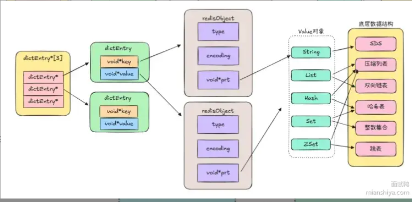

**redisObject**
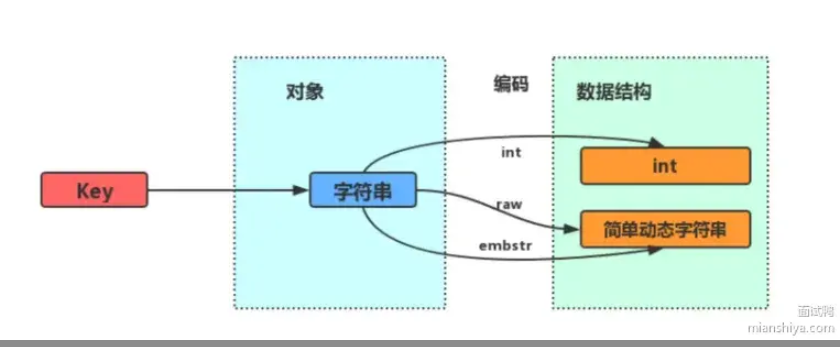

以字符串和int的存储为例子
**int编码**
```c++
struct redisObject {
    unsigned type:4;      // 数据类型（字符串、哈希等）
    unsigned encoding:4;  // 编码类型（int、embstr、raw等）
    int64_t ptr;          // 实际的数据指针，这里直接存储整数值
};
```

**embstr编码**
```c++
struct redisObject {
    unsigned type:4;       // 数据类型
    unsigned encoding:4;   // 编码类型，这里是 embstr
    void *ptr;             // 指向 sdshdr 结构
};

struct sdshdr {
    uint32_t len;          // 当前字符串长度
    uint32_t alloc;        // 已分配的内存大小
    unsigned char flags;   // 编码类型
    char buf[];            // 实际字符串数据
};
```

**raw编码**
```c++
struct redisObject {
    unsigned type:4;       // 数据类型
    unsigned encoding:4;   // 编码类型，这里是 raw
    void *ptr;             // 指向 sdshdr 结构
};

struct sdshdr {
    uint32_t len;          // 当前字符串长度
    uint32_t alloc;        // 已分配的内存大小
    unsigned char flags;   // 编码类型
    char buf[];            // 实际字符串数据
};
```

> ###### String 类型的底层实现

基于SDS (Simple Dynamic String，简单动态字符串) 实现，并结合int，embstr，raw等不同编码方式进行优化存储。

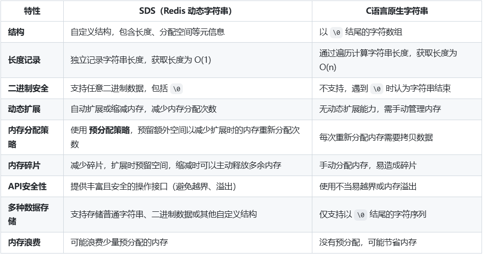

- 可以自定义结构，包含长度分配空间等元信息。
- 记录独立字符串长度，获取长度时间复杂度为O(1)。
- 使用预分配策略，预留额外空间减少内存重新分配。

进一步解析sds，其底层结构为sdshdr

```c++
struct __attribute__ ((__packed__)) sdshdr64 {
    uint64_t len; /* used */
    uint64_t alloc; /* excluding the header and null terminator */
    unsigned char flags; /* 3 lsb of type, 5 unused bits */
    char buf[];
};
```
`len`:长度
`alloc`：分配空间长度，通过alloc-len可知剩余长度
`flags`：sds类型
`buf`：存储数据的字符数组

上面提到的embstr编码和raw编码，他们的**区别**在于：
`embstr` 通过一次内存分配函数，分配一块连续内存空间保存 redisObject 和 SDS
`raw` 通过调用两次内存分配函数，分别分配两块空间保存 redisObject 和 SDS。

embstr编码可以将创建字符串对象所需的内存分配次数从两次降为一次，释放对象时也只需调用一次内存释放函数，将所有数据保存在连续内存，利于利用 CPU 缓存提升性能。

但是，embstr 编码的字符串长度增加需重新分配内存时，整个 redisObject 和 SDS 都要重新新分配空间，且其实际上是只读的，Redis 未编写相应修改程序，执行修改命令 (如append) 时，会先将编码从 embstr 转换为 raw,再执行修改。

**总结下来：**
int编码可以用来存储可以解析为整数的字符串，内存消耗最小，适合数字值。
embstr编码可以用于存储较短的字符串，将元数据和内容存储在一小块内存中，适合读多写少的场景。
raw编码用于存储较长字符串，元数据和内容分开存储，适合需要频繁操作的大字符串。

> ###### Hash类型的底层实现

Redis的hash是一种键值对集合，将多个字段和值存储在同一个键中，便于管理关联数据，其特点是：1 适合存储小数据，使用哈希表实现，能够在内存中高效存储和操作；2 支持快速的字段操作（增、删、改、查），非常适合存储对象属性。

底层结构分两种情况：
Redis 6及之前：压缩列表+哈希表（ziplist+hashtable）
Redis 7之后：紧凑列表+哈希表（Listpack+hashtable）
ziplist和listpack查找key效率都是O(n)，listpack解决了ziplist**级联更新**的问题。

`ziplist`：压缩列表，是一块连续的内存空间，特殊编码的双向链表，存储字符串或整数，节点间紧密相连，无需额外指针开销。其**特点**是插入删除相对快，查找需从头遍历，内存利用率高，适合存储少量数据。其数据结构包括：Header(存储元信息，比如 ziplist 的总字节数、尾部偏移量等)，Entries(实际存储的数据，包括前一个条目长度，编码信息，实际数据)，End Marker（一个特殊的标志0xFF，表示 ziplist 结束）
`listpack`：也是连续内存存储，类似 ziplist 但设计上消灭了级联更新问题，读取效率相对低，不过比 ziplist 在复杂场景下表现更好。相比 ziplist 牺牲少许内存使用率以避免连锁更新。其数据结构包括：Header(然存储元信息，但设计更简单)，Entries(说明数据类型和长度，存储具体的值，直接记录当前条目占用的字节数)，End Marker（与ziplist类似）
`级联更新`：ziplist节点除了记录数据还会记录前一个节点的长度，当插入或删除一个节点时如果该节点长度变化，则后续节点对于前一节点长度的记录都需要重新计算。而listpack则通过记录节点长度和前一个节点长度的差值来避免级联更新。
`hashtable`：由数组和链表组成，通过哈希函数计算槽位存储数据，理想情况下查询复杂度接近 O (1) ，速度快；插入删除可能因哈希冲突及扩容等操作有额外开销。内存占用相对较大，尤其数据稀疏时浪费空间。

`hash-max-ziplist-entries`(`hash-max-listpack-entries`): hash类型键中字段数量
`hash-max-ziplist-value`(`hash-max-listpack-value`): hash类型键中字段值长度

hash小于这两个值的时候会用listpack或ziplist存储，大于时则会用hashtable存储。

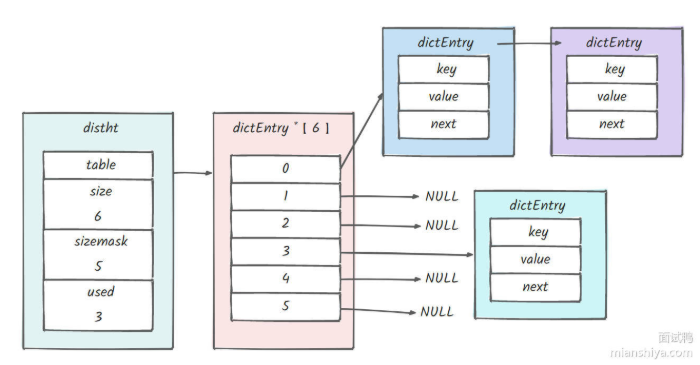

对于Hashtable，其存储结构如下：
```c++
typedef struct dictht {
    //哈希表数组
    dictEntry **table;
    //哈希表大小
    unsigned long size;  
    //哈希表大小掩码，用于计算索引值
    unsigned long sizemask;
    //该哈希表已有的节点数量
    unsigned long used;
} dictht;

typedef struct dictEntry {
    //键值对中的键
    void *key;
  
    //键值对中的值
    union {
        void *val;
        uint64_t u64;
        int64_t s64;
        double d;
    } v;
    //指向下一个哈希表节点，形成链表
    struct dictEntry *next;
} dictEntry;
```
这里使用了union来存取值，当值是整数或浮点数时，可以将值存在哈希节点中，不需要使用一个指针指向实际的值。

**渐进式rehash**

渐进式hash，即一点一点扩容。
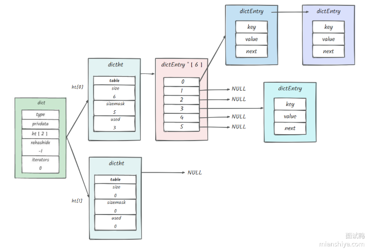

当表1的dict空间不够时会出发扩容条件，其流程为：
1. 为新表2分配空间，其大小大于等于原表两倍，字典的rehashidx即rehash索引值从-1暂时变成0，开始数据转移操作。
2. 每次对hash进行增删改查操作时，都会将当前 rehashidx 的数据从在哈希表 1 迁移到 2 上，然后 rehashidx + 1，因此迁移过程分多次且渐进式地完成。
3. 操作不断执行，最终哈希表1会被完全迁移到2中，此时指针对象呼唤，表2变成表1，表1变成表2并设成空表，最后讲rehashidx设置为-1。

当redis的负载因子（哈希表已保存节点数量 / 哈希表大小）大于等于1时说明空间紧张，此时如果没有进行RDB快照或AOF重写这两个持久化机制，就会进行rehash操作。
若负载因子大于5，空间已经非常紧张，无论如何都会rehash。
若负载因子小于0.1，就会进行缩容操作，新表大小是老表used的二次方幂。

> ###### ZSet类型的底层实现

ZSet即有序集合类型，是由一种**跳表** (Skip List) 和**哈希表** (Hash Table) 组成的数据结构。ZSet 结合了集合 (Set) 的特性和排序功能，能够存储具有有唯一性的成员，并根据成员的分数(score) 进行排序。

**跳表**用于存储数据的排序和快速查找，**哈希表**则用于存储成员与其分数的映射，提供快速查找。

当ZSet元素数量较少（默认<=zset-max-ziplist-entries为128，元素成员名和分值长度zset-max-ziplist-value为64字节）时，Redis会使用zipList来节省内存，两者中任何条件不满足，都会使用`跳表+哈希表`实现。

**下面讲一下跳表的原理：**
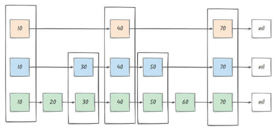
跳表主要是通过多层链表来实现，底层链表保存所有元素，而每每一层链表都是下一层的子集。其平均时间查询复杂度为O(logn)，最差为O(n)。
**插入**时，首先从最高层开始查找插入位置，然后随机决定新节点的层数，最后在相应的层中插入节点并更新指针。
**删除**时，同样从最高层开始查找要删除的节点，并在各层中更新指针，以保持跳表的结构。
**查找**时，从最高层开始，逐层向下，直到找到目标元素或确定元素不下存在。查找效率高，时间复杂度为 O (logn)

Redis中的跳表相对于普通跳表多了一个回退指针，且score可以重复。

```c++
typedef struct zskiplistNode {
    //Zset 对象的元素值
    sds ele;
    //元素权重值
    double score;
    //后退指针
    struct zskiplistNode *backward;
  
    //节点的level数组，保存每层上的前向指针和跨度
    struct zskiplistLevel {
        struct zskiplistNode *forward;
        unsigned long span;
    } level[];
} zskiplistNode;
```

ele: 这里用到了 Redis 字符串底层的一个实现 sds, 其主要作用是用来存储数据。
score: 节点的分数，double 即浮点型数据。
backward: 我们可以看到其是 zskiplistNode 结构体指针类型，即代表指向前一个跳表节点
level: 这个就是 zskiplistNode 的结构体数组了，数组的索引代表层及索引，这里注意与 hashtable 中的结构进行区分，那个使用的是联合体，一个是 forward, 其代表下一个跳转的跳表节点，注意一个点，其是跳转到同一层；span 主要作用代表距离下一个节点的步数。

回退指针提高跳表的操作效率和灵活性，例如删除节点时，铜鼓前去指针可以一次遍历中找到并记录所有关联的前驱节点，无需在变更指针时在查找前驱节点，减小了节点之间指针更新的复杂度，提升性能。

插入随机等级，附上源码：
```c++
#define ZSKIPLIST_MAXLEVEL 32 /* Should be enough for 2^64 elements */
#define ZSKIPLIST_P 0.25   /* Skiplist P = 1/4 */

/* Returns a random level for the new skiplist node we are going to create.
 * The return value of this function is between 1 and ZSKIPLIST_MAXLEVEL
 * (both inclusive), with a powerlaw-alike distribution where higher
 * levels are less likely to be returned. */
int zslRandomLevel(void) {
    static const int threshold = ZSKIPLIST_P*RAND_MAX;
    int level = 1;
    while (random() < threshold)
        level += 1;
    return (level<ZSKIPLIST_MAXLEVEL) ? level : ZSKIPLIST_MAXLEVEL;
}
```

```c++
/**
创建跳表
 */
zskiplist *zslCreate(void) {
    int j;
    zskiplist *zsl;
 
    zsl = zmalloc(sizeof(*zsl));
 
    zsl->level = 1;
    zsl->length = 0;
 
    // 初始化头节点， O(1)
    zsl->header = zslCreateNode(ZSKIPLIST_MAXLEVEL,0,NULL);
    // 初始化层指针，O(1)
    for (j = 0; j < ZSKIPLIST_MAXLEVEL; j++) {
        zsl->header->level[j].forward = NULL;
        zsl->header->level[j].span = 0;
    }
    zsl->header->backward = NULL;
 
    zsl->tail = NULL;
 
    return zsl;
}

/**
插入跳表
 */
zskiplistNode *zslInsert(zskiplist *zsl, double score, robj *obj) {
 
    // 记录寻找元素过程中，每层能到达的最右节点
    zskiplistNode *update[ZSKIPLIST_MAXLEVEL], *x;
 
    // 记录寻找元素过程中，每层所跨越的节点数
    unsigned int rank[ZSKIPLIST_MAXLEVEL];
 
    int i, level;
 
    redisAssert(!isnan(score));
    x = zsl->header;
    // 记录沿途访问的节点，并计数 span 等属性
    // 平均 O(log N) ，最坏 O(N)
    for (i = zsl->level-1; i >= 0; i--) {
        /* store rank that is crossed to reach the insert position */
        rank[i] = i == (zsl->level-1) ? 0 : rank[i+1];
 
        // 右节点不为空
        while (x->level[i].forward &&                   
            // 右节点的 score 比给定 score 小
            (x->level[i].forward->score < score ||      
                // 右节点的 score 相同，但节点的 member 比输入 member 要小
                (x->level[i].forward->score == score && 
                compareStringObjects(x->level[i].forward->obj,obj) < 0))) {
            // 记录跨越了多少个元素
            rank[i] += x->level[i].span;
            // 继续向右前进
            x = x->level[i].forward;
        }
        // 保存访问节点
        update[i] = x;
    }
 
    /* we assume the key is not already inside, since we allow duplicated
     * scores, and the re-insertion of score and redis object should never
     * happpen since the caller of zslInsert() should test in the hash table
     * if the element is already inside or not. */
    // 因为这个函数不可能处理两个元素的 member 和 score 都相同的情况，
    // 所以直接创建新节点，不用检查存在性
 
    // 计算新的随机层数
    level = zslRandomLevel();
    // 如果 level 比当前 skiplist 的最大层数还要大
    // 那么更新 zsl->level 参数
    // 并且初始化 update 和 rank 参数在相应的层的数据
    if (level > zsl->level) {
        for (i = zsl->level; i < level; i++) {
            rank[i] = 0;
            update[i] = zsl->header;
            update[i]->level[i].span = zsl->length;
        }
        zsl->level = level;
    }
 
    // 创建新节点
    x = zslCreateNode(level,score,obj);
    // 根据 update 和 rank 两个数组的资料，初始化新节点
    // 并设置相应的指针
    // O(N)
    for (i = 0; i < level; i++) {
        // 设置指针
        x->level[i].forward = update[i]->level[i].forward;
        update[i]->level[i].forward = x;
 
        /* update span covered by update[i] as x is inserted here */
        // 设置 span
        x->level[i].span = update[i]->level[i].span - (rank[0] - rank[i]);
        update[i]->level[i].span = (rank[0] - rank[i]) + 1;
    }
 
    /* increment span for untouched levels */
    // 更新沿途访问节点的 span 值
    for (i = level; i < zsl->level; i++) {
        update[i]->level[i].span++;
    }
 
    // 设置后退指针
    x->backward = (update[0] == zsl->header) ? NULL : update[0];
    // 设置 x 的前进指针
    if (x->level[0].forward)
        x->level[0].forward->backward = x;
    else
        // 这个是新的表尾节点
        zsl->tail = x;
 
    // 更新跳跃表节点数量
    zsl->length++;
 
    return x;
}


    /* 
 * 内部函数，被 zslDelete、zslDeleteRangeByScore 和 zslDeleteRangeByRank 使用
 * 功能：从跳跃表中删除指定节点，并更新相关节点的跨度和指针
 * 参数：
 *  - zsl: 指向跳跃表的指针
 *  - x: 要删除的节点
 *  - update: 一个数组，记录每层中查找过程中到达的最后一个节点，用于后续指针更新
 */
void zslDeleteNode(zskiplist *zsl, zskiplistNode *x, zskiplistNode **update) {
    int i;
    // 遍历跳跃表的每一层
    for (i = 0; i < zsl->level; i++) {
        // 如果当前层的 update[i] 节点的下一个节点是要删除的节点 x
        if (update[i]->level[i].forward == x) {
            // 更新 update[i] 节点的跨度
            update[i]->level[i].span += x->level[i].span - 1;
            // 将 update[i] 节点的下一个节点直接指向 x 的下一个节点
            update[i]->level[i].forward = x->level[i].forward;
        } else {
            // 如果当前层的 update[i] 节点的下一个节点不是 x，说明 x 在这一层对 update[i] 的跨度没有影响，只需要将跨度减 1
            update[i]->level[i].span -= 1;
        }
    }
    // 如果要删除的节点 x 的下一个节点存在
    if (x->level[0].forward) {
        // 将 x 的下一个节点的前驱指针指向 x 的前驱节点
        x->level[0].forward->backward = x->backward;
    } else {
        // 如果 x 没有下一个节点，说明 x 是尾节点，更新跳跃表的尾节点为 x 的前驱节点
        zsl->tail = x->backward;
    }
    // 如果跳跃表的层数大于 1 且最高层的头节点的下一个节点为空
    while(zsl->level > 1 && zsl->header->level[zsl->level-1].forward == NULL)
        // 减少跳跃表的层数
        zsl->level--;
    // 跳跃表的节点数减 1
    zsl->length--;
}

/* 
 * 从跳跃表中删除具有匹配分数和元素的节点
 * 参数：
 *  - zsl: 指向跳跃表的指针
 *  - score: 要删除节点的分数
 *  - ele: 要删除节点的元素
 *  - node: 指向指针的指针，如果为 NULL，删除节点后会释放该节点；否则，将该指针设置为被删除的节点指针，供调用者重用该节点
 * 返回值：
 *  - 如果找到并删除节点，返回 1
 *  - 否则，返回 0
 */
int zslDelete(zskiplist *zsl, double score, sds ele, zskiplistNode **node) {
    zskiplistNode *update[ZSKIPLIST_MAXLEVEL], *x;
    int i;

    // 从跳跃表的头节点开始遍历
    x = zsl->header;
    // 从最高层开始，逐层向下遍历
    for (i = zsl->level-1; i >= 0; i--) {
        // 在当前层中，找到满足条件的节点
        while (x->level[i].forward &&
                (x->level[i].forward->score < score ||
                    (x->level[i].forward->score == score &&
                     sdscmp(x->level[i].forward->ele,ele) < 0)))
        {
            // 移动到下一个节点
            x = x->level[i].forward;
        }
        // 记录当前层遍历到的最后一个节点
        update[i] = x;
    }
    // 继续移动到下一层的第一个节点，准备检查是否是要删除的节点
    x = x->level[0].forward;
    // 如果找到的节点存在，且分数和元素都匹配
    if (x && score == x->score && sdscmp(x->ele,ele) == 0) {
        // 调用 zslDeleteNode 函数删除节点
        zslDeleteNode(zsl, x, update);
        // 如果 node 为 NULL，说明调用者不需要重用该节点，释放该节点
        if (!node)
            zslFreeNode(x);
        else
            // 如果 node 不为 NULL，将 *node 设置为被删除的节点指针，供调用者重用
            *node = x;
        // 返回 1 表示成功删除节点
        return 1;
    }
    // 如果没有找到匹配的节点，返回 0
    return 0; 
}
```

**跳表和哈希表是如何结合的呢？**

Redis使用哈希表存储ZSet中成员和分数之间的映射关系，哈希表的键是ZSet成员，值是该成员的分数，哈希表提供了O(1)的查找、更新删除操作。而跳表则用于维持ZSet的顺序，通过跳表可以快速找到某个成员在ZSet中的位置，以及其前驱和后继节点。

ZSet的核心时间复杂度为O(logN)，因为大多数操作如插入删除查找都需要使用跳表，对于范围查询其时间复杂度为O(logN + M)，其中M为返回的元素数量。通过成员分数查询的时间复杂度为O(1)，由于使用哈希表存储成员与分数的映射。

ZSet常用于实现需要排序和快速查询的场景，如：
- 排行榜
- 延迟队列（按时间戳排序，实现任务调度和低延迟）
- 社交网络中的关注/粉丝数排序

**如何用Redis快速实现排行榜？**

使用有序集合ZSet实现，可以高效存储更新已经获取排名数据。

ZADD命令添加成员和分数：`ZADD leaderboard 1000 user1`
ZRANK命令获取某个用户排名：`ZRANK leaderboard user1`
ZREVRANGE命令获取前N名：`ZREVRANGE leaderboard 0 9 WITHSCORES`
ZINCRBY命令更新分数：`ZINCRBY leaderboard 500 user1`

> ###### Redis中Ziplist和Quicklist数据结构的特点是什么？

`Ziplist`简单紧凑存储连续，适合小数据量场景单不适合大量数据的频繁修改

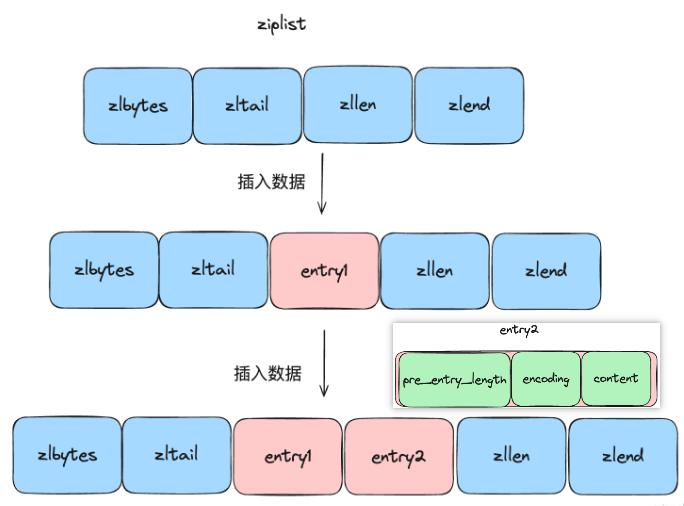
zlbytes: 记录整个 ziplist 所占用的字节数。
zltail: 记录 ziplist 中最后一个节点距离 ziplist 起始地址的偏移量。
zllen: 记录 ziplist 中节点的个数。
entry: 各个节点的数据。
zlend: 特殊值 0xFF, 用于标记 ziplist 的结束。
entry中：pre_entry_length: 记录前一个节点所占用的字节数，用于快速定位前一个节点。可以使用当前节点位置-pre_entry_length的方式获取前一个节点位置。

**特点**：
1. 紧凑性，所有元素紧密排列且没有额外内存开销，适合存储少量数据。
2. 元素按顺序存储，顺序访问性能好但随机访问性能差。

在Redis中，列表List在列表长度小于（默认512元素）且每个元素长度小于64字节时，Redis会使用Ziplist存储列表。哈希表也同样。

`Quicklist`将链表与ziplist结合，实现链表的灵活操作又能节省内存，Redis3.2后成为List的默认实现。适用于频繁插入、删除、查找等操作场景，且数据量较大，既保留链表灵活性又能压缩列表内存。


结合了ziplist和双端列表的优点，每个quicklist节点都是一个ziplist，限制了单个ziplist大小降低级联更新产生的影响。

**特点**：
1. 高效内存利用：结合ziplist的内存紧凑性和双端列表的快速插入删除操作。
2. 降低级联更新产生的影响。

在Redis中，列表List在长度超过Ziplist阈值时，使用Quicklist存储列表。

>  ###### Redis中Listpack数据结构是什么？

ListPack 是 Redis 内部的一种数据结构，用于高效存储短小的字符串或整数集合。它是一种**紧凑型的序列化数据结构**，旨在减少内存占用和提升性能。为了尽可能紧凑地存储数据，因此它没有使用 Redis 常见的对象模型，而是直接以字节序列的形式存绪数据。

ListPack 是 Redis 6.0 引入的新数据类型，在 List、Hash 和 ZSet 的内部实现中使用。
ListPack 的优点:
- 内存高效：通过变长编码和紧凑存储减少内存占用。
- 高性能：由于数据紧凑存储，可以更快地进行读取和写入操作。
- 简单实现：结构简单，便于实现和维护。

Redis作者说，Listpack的设计是由于怀疑ziplist连锁更新产生了一个bug。其采用一种紧凑的格式来存储多个元素 (本质上仍是一个字节数组), 并且使用多种编码方式来表示不同长度的数据。

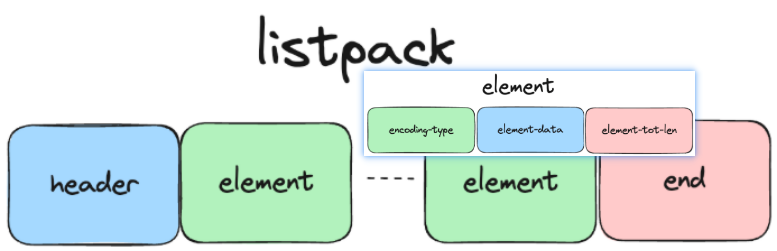

`header`: 整个 listpack 的元数据，包括总长度和总元素个数。
`elements`: 实际存储的元素，每个元素包括长度和数据部分。
`end`: 标识 listpack 结束的特殊字节
`element`中：
`encoding-type`: 元素的编码类型。
`element-data`: 实际存放的数据。
`element-tot-len`:encoding-type + element-data 的总长度，不包含自己的长度。

## 🚀 Redis为什么这么快？

#### 💡 简单回答Redis为什么这么快？

可以从三个方面回答：
**存储方式**：Redis 将数据存储在内存中，提供快速的读写速度，相比于传统的磁盘数据库，内存访问速度快得多。
**IO模型**：Redis 使用单线程事件驱动模型结合 I/O 多路复用，避免了多线程上下文切换和竞争条件，提高了并发处理效。
**数据结构**：Redis 提供多种高效的数据结构 (如字符串、哈希、列表、集合等), 这些结构经过优化，能够快速完成各种操作。

#### 🔍 扩展一下呢？

**存储方式**：

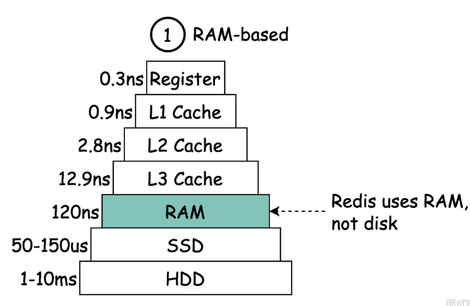

如图所示，从访问时间上看，传统硬盘 > SSD磁盘 > 内存 > 三级缓存(多核cpu共享) > 二级缓存(cpu芯片内部，离cpu核心较远) > 一级缓存(cpu芯片内部，分为数据缓存和指令缓存) > 寄存器。

Redis读写基于内存，除了持久化很少与磁盘交互。

**优秀的现成模型以及IO模型**
Redis使用单个主线程来执行命令，不需要进行线程切换，避免了上下文切换带来的性能开销，大大提高了 Redis 的运行效率和响应速度。

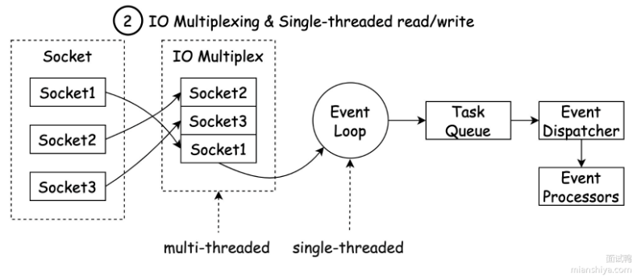

Redis采用I/O多路复用技术，实现了单个线程同时处理多个客户端连接的能力，从而提高 Redis 的并发能力。

不过 Redis 并不是一直都是单线程的，自 4.0 开始，Redis 就引入了 Unlink 这类命令，用于异步执行删除等操作，还有在 6.0 之后，Redis 为了进一步提升 I/O 的性能，引入了多线程的机制，利用多线程的机制并发处理网络请求，从而减少 Redis 由于网络 I/O 等待造成的影响。

**高效的数据结构**

Redis本身提供了丰富的数据结构，如字符串、哈希、Zset等，这些数据结构大多操作的时间复杂度都为O(1)。

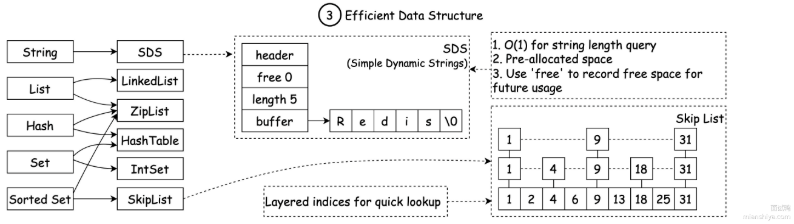

## 🚀 为什么Redis设计为单线程？6.0版本为何引入多线程？

#### 💡 回答重点？

单线程设计原因:
1. Redis 的操作是基于内存的，其大多数操作的性能瓶颈主要不是 CPU 导致的
2. 使用单线程模型，代码简便的同时也减少了线程上下文切换带来的性能开销
3. Redis 在单线程的情况下，使用I/O多路复用模型就可以提高Redis的I/O利用率了
6.0 版本引入多线程的原因:
1. 随着数据规模的增长、请求量的增多，Redis 的执行瓶颈主要在于网络 I/O。引入多线程处理可以提高网络 I/O 处理速度。

## 🚀 Redis源码中有哪些巧妙的设计？举几个简单的例子？

#### 💡 回答重点？

Redis 作为一款高性能的内存数据库，其源码中包含了许多巧妙的设计。这些设计不仅体现了高效的数据处理和管理能力，也为后续的系统扩展和性能优化奠定了基础。
巧妙的设计主要包括：**线程模型**、**数据结构**、**共享对象池**、**过期设设计**、**数据持久化设计等**。

#### 🔍 线程模型是什么？

Redis 使用**单线程模型**来处理所有的客户端请求。
虽然看似单线程简单，但这种设计减少了上下文切换和锁的开销，避免了多线程编程中的复杂性。
并且通过多路复用 (epoll、select 等) + 事件驱动机制，Redis 仍然能够处理大量的并发连接。

#### 🔍 Redis数据结构有什么特点？

Redis对很多数据结构进行了优化，例如sds，ziplist和hash的扩容机制。

`sds`在提升了安全性的同时还大大简化了开发中内存管理问题，能做到`1.`动态扩展与空间预分配（自动分配更大的内存空间且会预留一部分），`2.`二进制安全（不依赖\0来标识字符串的结束，可以安全存储二进制数据）`3.`常数时间获取长度（不需要遍历字符串获取长度），`4.`防止缓冲区溢出（维护分配空间的总长度和已用长度），`5.`惰性空间释放（字符串长度缩短时会保留部分缩短后的空间，避免频繁的内存分配操作）

`ziplist`在列表或哈希表数据量较小且长度较短时，被选用存储数据来达到节省内存消耗的目的。

`渐进式rehash`哈希表在扩缩容的时候不会一次性全量rehash，避免集中的性能抖动。

#### 🔍 Redis共享对象池？

Redis 中有许多常用的小整数，例如 0 到 9999。这些整数频繁地出现在各种命令和数据操作中。

为了减少内存分配和释放的开销，Redis 使用了**共享对象池** (SharedDbject Pool), 实现了:
- *对象复用*：对于常用的小整数，Redis 会在启动时预先创建这些对象，并将它们存储在一个共享对象池中。当系统需要这些整数对象时，直接从池中获取，而不需要重复分配内存。这大大减少了内存分配和释放的开销，提高了系统的效率。
- *内存节省*：共享对象池有效地节省了内存，尤其是在大规模使用这些常量的场景中。通过对象复用，避免了频繁的内存申请和垃圾回收。

#### 🔍 Redis过期设计？

Redis 支持为键设置过期时间。当键过期后，它应该被自动删除。
然而，过期键的处理需要在性能和准确性之间找到平衡。Redis 采用了一种**惰性删除与定期删除相结合的策略**来处理过期键:

- 惰性删除：当客户端访问一个键时，Redis 会检查该键是否已经过期。如果过期，则立即删除。这种方式不会增加系统负担，因为只在访问时才检查键的状态。
- 定期删除：Redis 每隔一段时间（默认100毫秒）会随机抽取一部分键进行过期检查，并删除其中已过期的键。通过这种方式，Redis 可以避免系统中大量存在过期键而无法及时清理的情况。

惰性删除确保访问性能，定期删除避免内存泄漏。通过惰性删除和定期删除相结合，Redis 实现了过期键的高效管理。

> ###### 定期删除细节

定期删除为Redis内部定时任务，周期性扫描一些设置了过期时间的键。

但Redis并不会一次性扫描所有设置了过期时间的键，因为这样会消耗大量的 CPU 资源。**它会在每次扫描时限制扫描的时间和数量**，以避免对性能产生过大的影响，因此可能会有部分键过期了没有被及时删除。

每次获取 20 个 key 判断是否过期，如果发现过期的 key 占比超过 25% 则继续再拉 20 个，如果小于 25% 则停止。这里还有一个时间限制，即一次删除时间不超过 25ms, 即如果发现占比超过 25% 的时候，需要判断目前是否已经花了 25ms , 如果已经用了这么多时长也会结束。

> ###### 惰性删除优缺点

**优点**：可以减少 CPU 的占用，因为只有查询到了相关的数据才执行厅删除操作，不需要主动去定时删除。
**缺点**：如果一直没有查询一个 Key, 就有可能不会被删除，这样就容易造成内存泄漏问题。

> ###### 内存回收机制

除了这两个删除，还有一个机制也会淘汰 key, 即当 Redis 内存使用达到设置的 maxmemory 限制时，会触发内存回收机制。

此时会主动删除一些过期键和其他不需要的键，以释放内存。具体的删除策略有以下几种:

- volatile-Iru: 从设置了过期时间的键中使用 LRU (Least RecentlyJsed, 最近最少使用) 算法删除键。
- allkeys-Iru: 从所有键中使用 LRU 算法删除键。
- volatile-lfu: 从设置了过期时间的键中使用 LFU (Least Frequently Used, 最少使用频率) 算法删除键。
- allkeys-lfu: 从所有键中使用 LFU 算法删除键。
- volatile-random: 从设置了过期时间的键中随机删除键。
- allkeys-random: 从所有键中随机删除键。
- volatile-ttl: 从设置了过期时间的键中根据 TTL (TimetoLive, 存活时间) 删除键，优先删除存活时间短的键。
- noeviction: 不删除键，只是拒绝写入新的数据。

Redis 在正常情况下对过期键的处理就是惰性删除 + 定期删除一起使用，主动删除 (内存回收) 其实属于**异常的兜底处理**了。

#### 🔍 Redis数据如何持久化？

Redis提供两种主要的持久化机制：

`RDB (Redis Database)` 快照持久化方式：

- RDB 是通过生成某一时刻的数据快照来实现持久化的，可以在特定时间间隔内保存数据的快照。
- 适合灾难恢复和备份，能生成紧凑的二进制文件，但可能会在崩溃时丢失最后一次快照之后的数据。

`AOF (Append Only File)` 持久化方式。

- AOF 通过将每个写操作追加到日志文件中实现持久化，支持将所有写操作记录下来以便恢复。
- 数据恢复更为精确，但文件体积较大，重写时可能会消耗更多资源。

> ###### Redis的RDB持久化详解

**RDB 持久化**通过创建快照来获取内存某个时间点上的副本，利用快照可以进行方便地进行主从复制，默认快照文件为dump.rdb。redis.conf 文件可以配置在 x 秒内如果至少有 个 key 发生变化就会触发命令进行持久化操作。

**优缺点**：
- 快速加载：RDB 生成的快照文件是压缩的二进制文件，适合备份和灾难恢复。
- 低资源占用：RDB 持久化在 Redis 主线程之外进行，不会对主编我程产生太大影响。
- 数据丢失风险：由于 RDB 是间隔性保存的快照，如果 Redis 崩溃，可能会丢失上次保存快照后的数据。

**持久化命令**：save(主线程执行，会阻塞)，bgsave(子进程执行，不阻塞，默认使用)

**注意事项**：
1. Fork 操作会产生短暂的阻塞，微秒级别操作过后，不会阻塞主进程，整个过程不是完全的非阻塞。
2. RDB 由于是快照备份所有数据，而不是像 AOF 一样存写命令，因为 Redis 实例重启后恢复数据的速度可以得到保证，大数据量下比 AOF 会快很多。
3. Fork 操作利用了**写时复制**，类似与 CopyOnWriteArrayList。

**写时复制**：一种保证数据一致性和线程安全的技术，核心思想是进行写操作时不直接修改原来的数据结构，而是先复制一份副本，在副本上进行修改，然后将修改后的副本替换原来的数据结构。

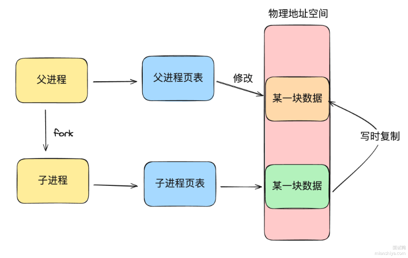

在子进程创建时，它不会直接将主进程地址空间全部复制，而是共享同一个内存。
当主进程fork出一个子进程后，不会把主进程所有内存数据重新复制给子进程，而是仅仅复制页表，映射的物理内存还是同一个。
需要修改数据的时候，主进程会将对应的数据所在页复制一份，对副本进行修改。

> ###### Redis的AOF持久化详解

**AOF 持久化机制**是指**将 Redis 写命令以追加的形式写入到磁盘中的 AOF 文件**，AOF 文件记录了 Redis 在内存中的操作过程，只要在 Redis 重启后重新执行 AOF 文件中的写命令即可将数据恢复到内存中。

**优缺点**:
- AOF 机制比 RDB 机制更加可靠，因为 AOF 文件记录了 Redis 执行的所有写命令，可以在每次写操作命令执行完毕后都落盘存储。
- AOF 机制生成的 AOF 文件比 RDB 文件更大，当数据集比较大时，AOF 文件会比 RDB 文件占用更多的磁盘空间。
- AOF 机制对于数据恢复的时间比 RDB 机制更加耗时，因为要重新执行 AOF 文件中的所有操作命令。

**混合持久化**：
RDB 和 AOF 都有各自的缺点，如果 RDB 备份的频率低，那么丢的数据多。备份的频率高，性能影响大，AOF 文件虽然丢数据比较少，但是恢复起来又比较耗时。

因此 Redis4.0 以后引入了混合持久化，通过 aof-use-rdb-preamble 配置开启混合持久化。**当 AOF 重写的时候** (注意混合持久化是在 aof 重写时触发的)。它会先生成当前时间的 RDB 快照，将其写入新的 AOF 文件头部位置。这段时间主线程处理的操作命令会记录在重写缓冲区中，RDB 写入完毕后将这里的增量数据追加到这个新 AOF 文件中，最后再用新 AOF 文件替换旧 AOF 文件。
如此一来，当 Redis 通过 AOF 文件恢复数据时，会先加载 RDB, 然后再重新执行指令恢复后半部分的增量数据，这样就可以大幅度提高数据恢复的速度！

**AOF写回策略**：

AOF 提供了三种写回策略，决定何时将数据同步到磁盘中:
- always: 每次写操作后立即调用 fsync, 将数据同步到磁盘。这种策略保证了最高的数据安全性，但也会显著降低性能，因为每个写操作都要等待磁盘写入完成。
- everysec: 每秒调用一次 fsync, 将数据同步到磁盘。这种策略在生能和数据安全性之间做了折中，默认情况下，Redis 使用这种策略。最多会丢失 1 秒的数据。
- no: 由操作系统决定何时将数据写入磁盘。通常，操作系统会在一定时间后或缓冲区满时同步数据到磁盘。这种策略具有最高的性能，但数据安全性较低，因为在 Redis 崩溃时可能会丢失较多的数据

即使是设置了always，也不能保证数据不丢失（在写入aof的时候宕机），所以**redis的持久化机制不能保证数据不丢失!**

**AOF重写机制**：
- 增量重写：AOF 重写并不会中断正常的写操作。在重写期间，Redis 仍然可以将新的写操作继续追加到旧的 AOF文件中，确保了高并发写入时的持久化性能。
- 空间优化：AOF 重写过程中，Redis 并不会简单地复制所有命令，而是根据当前的数据状态，生成最精简的命令集。即使一个键值经过多次修改，最终的 AOF 文件中只会保留一条最有效的命令，从而大幅减少了文件大小。
- 异步执行：AOF 重写是通过子进程异步执行的，主进程不会受到影响，这保证了在执行重写的同时，Redis 仍然可以提供高效的服务。

AOF重写流程：

1. 创建子进程：Redis 使用 BGREWRITEAOF 命令创建一个子进程，负责 AOF 重写操作。
2. 生成新的 AOF 文件：子进程根据当前数据库的状态，将每个键的最新值转换为对应的写命令，并写入新的 AOF
文件。例如，对于一个列表键，子进程会使用一条 RPUSH 命令将所有有元素写入，而不是记录之前的多次操作。
3. 处理新写入的命令：在重写过程中，主进程仍然处理新的写操作。为了避免数据不一致，主进程会将这些新的写
命令同时追加到现有的 AOF 文件和一个缓冲区 (aof_rewrite_buf) 中。
4. 合并新命令：当子进程完成新的 AOF 文件的写入后，主进程会将缓冲区中的新命令追加到新的 AOF 文件中，确
保其包含所有最新的操作。
5. 替换旧的 AOF 文件：最后，Redis 使用新的 AOF 文件替换旧的文件，实现 AOF 文件的重写。

7.0之前的AOF重写，结合上面来看有这些问题：
1. 内存开销：aof和aof_rewrite_buf有大部分内容是重复的
2. CPU开销较大：主进程要向aof_rewrite_buf写入数据，向子进程发送aof_rewrite_buf数据，子进程也要消耗CPU将aof_rewrite_buf写入新AOF文件
3. 磁盘开销：aof_buf数据也会写入当前AOF，aof_rewrite_buf数据也会写入AOF，一份数据会写两次。

Redis7.0后引入MP-AOP机制，将一个AOF文件拆成：
一个基础文件，一些增量文件，并存放在单独目录中由文件清单管理。

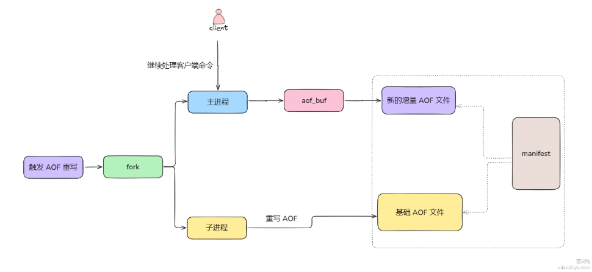

重写期间的数据变更直接写到 aof_buf 再到新的增量 AOF 文件中，避免了之前多个 buf 的写入。且子进程独立重写基础的 AOF, 于主进程无交互，节省了主进程的 CPU 开销。

当重写完毕后，仅需更新 manifest 文件，加入新的增量 AOF 文件和基础 AOF 文件，然后将之前的增量 AOF 文件和基础 AOF 文件标记为历史文件 (会被异步删除) 即可。更新完 manifest 就代表 AOF 重写结束。

## 🚀 如何使用Redis快速实现布隆过滤器

#### 💡 什么是布隆过滤器？如何实现？

布隆过滤器是一种高效的概率数据结构，常用于检测一个元素是否在一个集合中，可以有效减少数据库的查询次数，解决缓存穿透等问题。

可以通过使用**位图 (Bitmap)** 或使用 **Redis 模块 RedisBloom**。
- 使用位图实现布隆过滤器:
使用 Redis 的位图结构 SETBIT 和 GETBIT 操作来实现布隆过滤器。位图本质上是一个比特数组，用于标识元素是否存在。对于给定的数据，通过多个哈希函数计算位置索引，将位图中的相应位置设置为 1, 表示该元素可能存在。
- 使用 RedisBloom 模块:
Redis 提供了一个官方模块 RedisBloom, 封装了哈希函数、位图大小等操作，可以直接用于创建和管理布隆过滤器。
使用 BF.ADD 来向布隆过滤器添加元素，使用 BF.EXISTS 来检查某个元素是否可能存在

#### 🔍 布隆过滤器原理是什么？优缺点是什么？有什么适用场景？

布隆过滤器是由**一个位数组和 k 个独立的哈希函数**组成。

添加元素时，通过 k 个哈希函数将元素映射到位数组的 k 个位置上，将这些位置设置为 1。
检查元素是否存在时，同样计算 k 个位置，如果所有位置都是 1, 则说明元素可能存在；只要有一个位置为 0, 就可以确定元素一定不存在。

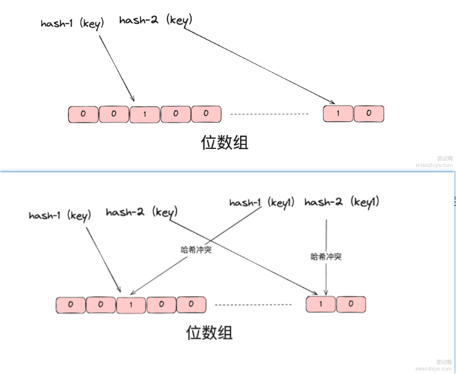

例如某个 key 通过 hash-1 和 hash-2 两个哈希函数，定位到数组中的值都为 1, 则说明它存在。如果布隆过滤器判断一个元素不存在集合中，那么这个元素一定不在集合中，如果判断元素存在集合中则不一定是真的，因为哈希可能会存在冲突。因此布隆过滤器**有误判的概率**。并且它不好删除元素，只能新增，如果想删除则只能重建。

**优缺点**：
1) 优点
高效性：插入和查询操作都非常高效，时间复杂度为 O (k),k 为哈希函数的数量。
节省空间：相比于直接存储所有元素，布隆过滤器大幅度减少了内存使用
可扩展性：可以根据需要调整位数组的大小和哈希函数的数量来平衡时间和空间效率。
2) 缺点
误判率：可能会误认为不存在的元素在集合中，但不会漏报 (不存在的元素不会被认为存在)。
不可删除：一旦插入元素，不能删除，因为无法确定哪些哈希值是由哪个元素设置的。
需要多个哈希函数：选择合适的哈希函数并保证它们独立性并不容易。

**使用场景**：
- 爬虫：对已经爬取过的海量URL去重
- 黑名单：判断一个邮件地址是否在黑名单中（可能会误杀）
- 分布式系统：判断数据是否在某个节点上，减少网络请求，提高系统性能
- 推荐系统：判断用户是否已经看过某个推荐内容，避免重复推荐

#### 🔣 位图如何实现布隆过滤器？

- 位图使用单个位来表示某个位置的状态，通过 Redis 的 SETBIT keey offset value操作可以设置位图中某个偏移位置的值。
- 假设有 k 个哈希函数 H1,H2,....,Hk, 对于每个新加入的元素 x, 通过这些哈希函数计算位置，将相应位置的比特位设置为 1。
- 查询元素是否存在时，计算相同的 k 个位置并用 GETBIT key offset 来判断这些位置是否都是 

#### 🔣 RedisBloon模块如何实现布隆过滤器？

RedisBloom是Redis官方提供的插件，简化了布隆过滤器的实现，提供了更好的性能和更少的误判控制。

## 🚀 Redis如何保证缓存与数据库一致性？

#### 💡 有哪几种方式？

1. 先更新缓存，再更新数据库
2. 先更新数据库存，再更新缓存
3. 先删除缓存，再更新数据库，后续等查询把数据库的数据回种到缓存中
4. 先更新数据库，再删除缓存，后续等查询把数据库的数据回种到缓存中
5. 缓存双删策略。更新数据库之前，删除一次缓存；更新完数据库后，再进行一次延迟删除
6. 使用 Binlog 异步更新缓存，监听数据库的 Binlog 变化，通过异步方式更新 Redis 缓存

以上是实现数据库与缓存一致性的六种方式，这里前面三种都不太推荐使用，后面三种的话其主要根据实际场景:
- 如果是要考虑实时一致性的话，先写 MySQL, 再删除 Redis 应该是较为优的方案，虽然短期内数据可能不一致，不过其能尽量保证数据的一致性。
- 如果考虑最终一致性的话，推荐的是使用 binlog + 消息队列的方式，这个方案其有重试和顺序消费，能够最大限度地保证缓存与数据库的最终一致性。

#### 🔍 对以上几种方式进行分析

**1、先更新缓存，再更新数据库**：
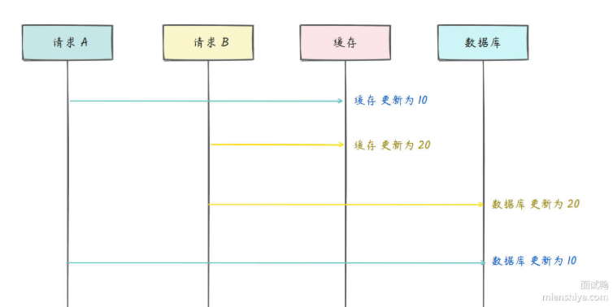
由于网络原因，请求顺序无法保证。若请求A先发于请求B，A更新了缓存为10，后请求B更新了缓存为20，紧接着请求B更新了数据库为20，请求A再更新了数据库为10，这样数据就不一致了

**2、先更新数据库，再更新缓存**：
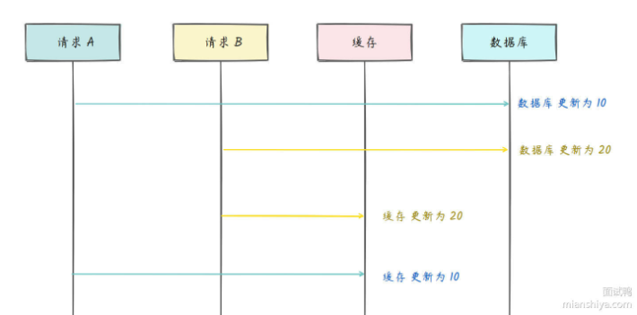
同上，可能出现不一致的情况。

**3、先更删除缓存，再更新数据库**：
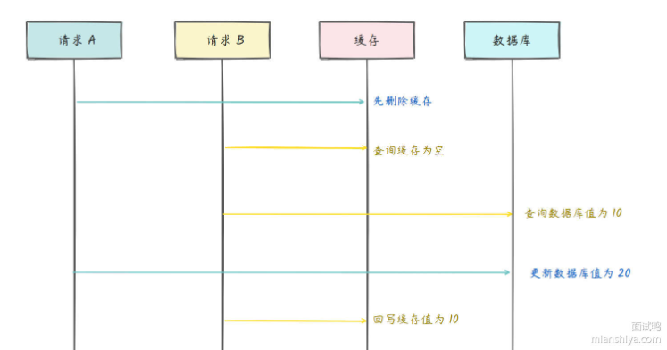
同样可能出现缓存和数据库不一致的情况，本质上是还是更新数据库和缓存操作的并发问题，删除缓存的操作如果不即使修改数据库，可能会被后来查询并且修改数据库的操作抢占，导致缓存和数据库不一致。

**4、先更新数据库，再删除缓存**：
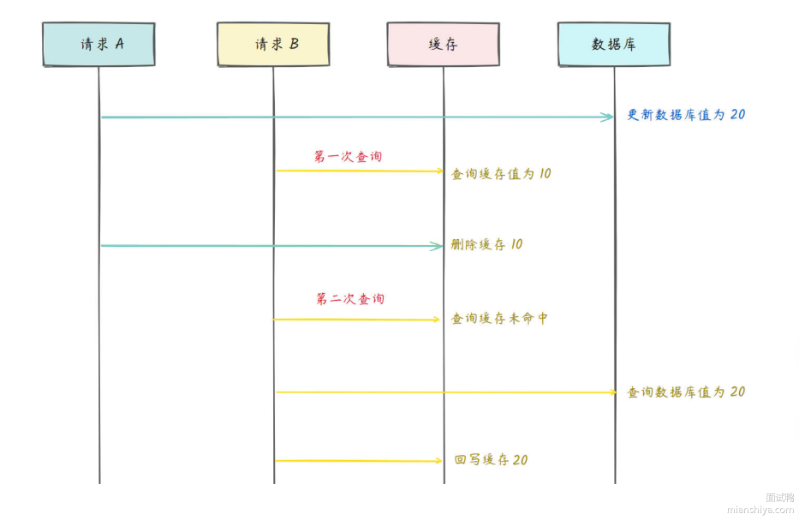
可能会有一定时间的缓存和数据库不一致，但保证最终缓存的一致性。

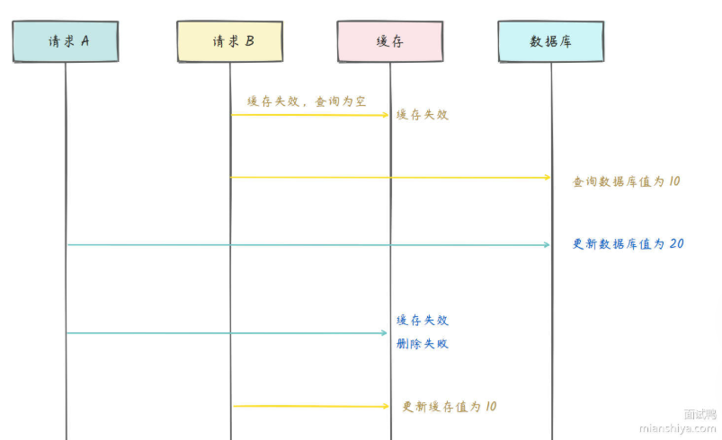
若读的时候正好缓存失效，读取数据库的时候正好有一个写操作修改了数据库，此时该读操作会将缓
存修改成读取的老版本数据库数据，由此造成数据库与缓存不一致。
这种概率较低，一般业务会使用这个方案。

**5、缓存双删，即删缓存，再写数据库，过一段时间再删除缓存**：
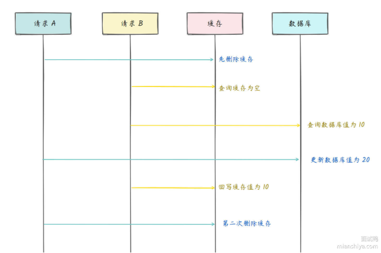
为避免旧数据被回种，过一段时间再延迟删除缓存

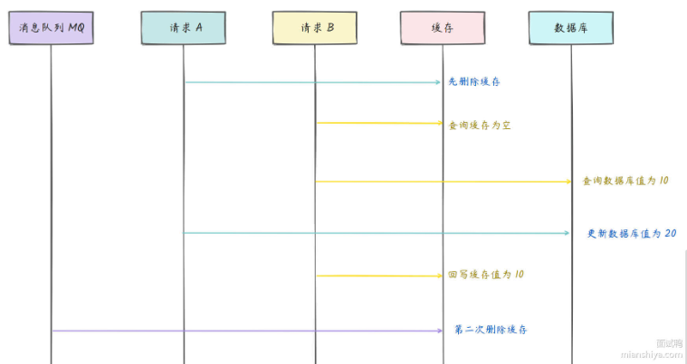
也可以使用消息队列，定时任务或者延迟任务等方式实现延迟删除

**6、先写数据库，再通过binlog异步更新缓存**：
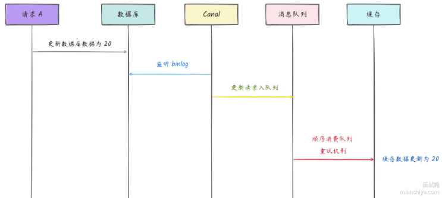
先修改数据库，再通过Canal监听数据库的binlog日志，记录数据库修改信息，再通过消息队列异步修改缓存数据。在这里需要保证顺序消费。

#### 🔣 强一致性

可以使用分布式读写锁实现强一致性，读读不互斥，读写、写写互斥

**写操作流程：**
- 获取写锁
- 更新数据库
- 删除缓存
- 释放写锁

**读操作流程：**
- 获取读锁
- 查询缓存：若命中则释放读锁，返回结果；若未命中则读取数据库，并将数据更新到缓存。
- 释放读锁

## 🚀 Redis中缓存击穿、缓存穿透和缓存雪崩是什么？

#### 💡 简单介绍一些概念？

**缓存击穿**：指某个热点数据在缓存中失效，导致大量请求直接访问数据库。此时，由于瞬间的高并发，可能导致数据库崩溃。
**缓存穿透**：指查询一个不存在的数据，缓存中没有相应的记录，每次请求都会去数据库查询，造成数据库负担加重。
**缓存雪崩**：指多个缓存数据在同一时间过期，导致大量请求同时认问数据库，从而造成数据库瞬间负载激増。

#### 🔍 这些问题的解决方案是什么？

> ###### 缓存击穿

缓存击穿强调的是热点数据

1) 加互斥锁：保证同一时间只有一个请求来构建缓存，跟缓存雪崩相同。
2) 热点数据永不过期：不要给热点数据设置过期时间，在后台异步更新缓存。

> ###### 缓存穿透

缓存穿透强调的是恶意的请求不存在数据，攻击者可能构造不存在的key大量请求，对数据库造成很大压力而导致系统宕机。

1) 防止非法请求：检查非法请求，封禁其 IP 以及账号，防止它再次为非作歹。
2) 缓存空值：将数据库中不存在的结果 (例如空值) 也缓存起来，并设置一个较短的过期时间，避免频繁查询数据库。
3) 使用布隆过滤器：使用布隆过滤器来快速判断一个请求的数据是是否存在，如果布隆过滤器判断数据不存在，则直接返回，避免查询数据库。

> ###### 缓存雪崩

缓存雪崩强调的是大量的缓存键同时失效所带来的大量请求达到数据库或后端系统。

1) 过期时间随机化：设置缓存的过期时间，加上一个随机值，避免同一时间大量缓存失效。
2) 使用多级缓存：引入多级缓存机制，如本地缓存和分布式缓存相结合，减少单点故障风险。
3) 缓存预热：系统启动时提前加载缓存数据，避免大量请求落到冷启动状态下的数据库。
4) 加互斥锁：使得没缓存或缓存失效的情况下，同一时间只有一个请求来构建缓存，防止数据库压力过大。

缓存中间件故障:
1) 服务熔断：暂停业务的返回数据，直接返回错误。
2) 构建集群：构建多个 Redis 集群保证其高可用。

#### 🔣 互斥锁如何实现？

互斥锁是一种用于保证共享资源在同一时间只能被「单个线程 / 进程」访问的机制

```java

public class CacheService {
    private Jedis jedis = new Jedis("localhost");
    private Lock lock = new ReentrantLock();

    public String getData(String key) {
        // 尝试从缓存获取数据
        String value = jedis.get(key);
        
        // 如果缓存不存在
        if (value == null) {
            // 加锁以防止并发请求
            lock.lock();
            try {
                // 再次检查缓存，避免重复查询
                value = jedis.get(key);
                if (value == null) {
                    // 查询数据库
                    value = queryDatabase(key);
                    // 将结果放入缓存
                    jedis.set(key, value);
                }
            } finally {
                // 释放锁
                lock.unlock();
            }
        }
        return value;
    }
}

```

**加锁**：如果缓存中没有数据，使用`ReentrantLock`加锁，确保只有一个线程可以查询数据库
**二次检查**：加锁后再次检查缓存，避免重复查询。
**数据库查询**：若缓存中仍然没有数据，则查询数据库并将结果写入缓存。
**释放锁**：确保锁在查询结束后释放，防止死锁。

## 🚀 Redis分布式锁的原理是什么？

#### 💡 分布式锁是什么？其原理是什么？

多线程环境中，多个线程同时访问共享资源会发生数据竞争，可能会导致出现脏数据或系统问题，因此需要使用互斥锁进行共享资源的互斥访问。而分布式系统中，多个进程共享一份资源的情况下，本地锁无法实现资源的互斥访问，因此就有了**分布式锁**。

`Redisson`是基于Redis实现的分布式锁，实际上是使用 Redis 的原子操作来确保多线程、多进程或多节点系统中，只有一个线程能获得锁，避免并发操作导致的数据不一致问题。
**1. 锁的获取**:
- Redisson 使用 Lua 脚本，利用 `exists` + `hexists` + `hincrby`命令来保证只有一个线程能成功设置键 (表示获得锁)。
- 同时，Redisson 会通过 `pexpire` 命令为锁设置过期时间，防止因宕机等原因导致锁无法释放 (即死锁问题)。
**2. 锁的续期**:
- 为了防止锁在持有过程中过期导致其他线程抢占锁，Redisson 实现了锁自动续期的功能。持有锁的线程会定期续期，即更新锁的过期时间，确保任务没有完成时锁不会失效。
**3. 锁的释放**:
- 锁释放时，Redisson 也是通过 Lua 脚本保证释放操作的原子性。利用 `hexists` + `del` 确保只有持有锁的线程才能释放锁，防止误释放锁的情况。
- Lua 脚本同时利用 `publish` 命令，广播唤醒其它等待的线程。
**4. 可重入锁**:
- Redisson 支持可重入锁，持有锁的线程可以多次获取同一把锁而不会被阻塞。具体是利用 Redis 中的哈希结构，哈希中的 key 为线程 ID, 如果重入则 `value+1`, 如果释放则 `value-1`, 减到 0 说明锁被释放了，则 `del` 锁。

#### 🔍 Redisson如何加锁和释放锁？

**加锁**

下面脚本中，`KEY[1]`为**锁的名称**，`ARGV[1]`为**锁的过期时间**，`ARGV[2]`为**当前锁唯一标识（和线程id相关）**。

若锁不存在则新增锁，并设置锁重入计数为1，且设置过期时间
```lua
if (redis.call('exists', KEYS[1]) == 0) then 
    redis.call('hincrby', KEYS[1], ARGV[2], 1); 
    redis.call('pexpire', KEYS[1], ARGV[1]); 
    return nil; 
    end;
```

若锁存在，且唯一标识 (线程 id 相关) 也匹配，则当前加锁请求为锁的重入请求，哈希的重入计数 + 1, 并再次设置锁过期时间
```lua
if (redis.call('hexists', KEYS[1], ARGV[2]) == 1) then
    redis.call('hincrby', KEYS[1], ARGV[2], 1);
    redis.call('pexpire', KEYS[1], ARGV[1]);
    return nil;
    end;
```

若锁存在，但唯一标识不匹配，则说明锁被其他线程占用，当前线我程无法解锁，直接返回锁剩余过期时间 (pttl)
```lua
return redis.call('pttl', KEYS[1]);
```

**释放锁**

下面脚本中，`KEY[1]`为**锁的名称**，`KEYS[2]`为**解锁通知通道名称**，`ARGV[1]`为**解锁消息内容**，`ARGV[2]`为**锁自动释放时间（毫秒）**，`ARGV[3]`为**当前锁唯一标识（和线程id相关）**

若锁不存在，直接返回不需要解锁

```lua
if (redis.call('hexists', KEYS[1], ARGV[3]) == 0) then 
    return nil;
end; 
```

若锁存在，且唯一标识 (线程 id 相关) 也匹配，计数-1, 如果此时计数还大于0,再次设置锁过期时间

```lua
local counter = redis.call('hincrby', KEYS[1], ARGV[3], -1);
if (counter > 0) then 
    redis.call('pexpire', KEYS[1], ARGV[2]);
return 0; 
```

若计数小于等于 0, 则删除 key, 且通过广播通知其它等待锁的线程，此时释放锁了。

```lua
else
    redis.call('del', KEYS[1]);
    redis.call('publish', KEYS[2], ARGV[1]);
return 1;
```

#### 🔣 Redisson有哪些类型？

- **公平锁**：与可重入锁类似，公平锁确保多个线程按请求锁的顺序获得锁
- **读写锁**：支持读写分离，多个线程可以同时获得读锁，而写锁是独占的
- **信号量与可数锁**：允许多个线程同时持有锁，适用于资源的限流和控制

#### ⚙ 锁过期和网络分区补充？

- 锁过期问题：在 Redis 中，通过 `SETNX` 获取的锁通常带有过期时间。如果业务逻辑执行时间超过锁的过期时间，可能会出现锁被其他线程重新获取的问题。Redisson 通过锁的续期机制解决了这个问题。
- 网络分区问题：Redis 是基于主从复制的，在主从切换或发生网络分区区时，锁可能出现不一致的情况 (如主节点锁还存在，副节点却因为主从切换失去了锁)。为解决这一问题，业界提出了 Redlock 算法，Redisson 也可以使用此算法确保锁的高可用性。

## 🚀 Redis如何实现分布式锁

#### 💡 简单说一下

在 Redis 中实现分布式锁的常见方法是通过 `set ex nx` 命令 + lua 脚本组合使用。确保多个客户端不会获得同一个资源锁的同时，也保证了安全解锁和意外情况下锁的自动释放。

#### 🔍 具体是如何实现的？

- 加锁：`SET lock_key uniqueValue EX expire_time NX`
- 解锁：使用lua脚本，先通过get获取key的value判断是否是自己加的锁，若是则del

需要为锁设置一个**唯一值**（2.6.12版本后），防止被其他客户端释放（客户端1加锁后执行超时，锁自动释放，客户端2获取锁继续执行，此时若客户端1删除了客户端2正在使用的锁，就出问题了）

#### 🧠 碰到单点故障问题怎么办？红锁是什么？

单台 Redis 实现分布式锁存在单点故障问题，如果采用主从读写分离架构，如果一个客户端在主节点上锁成功，但是主节点突然宕机，由于主从延迟导致从节点还未同步到这个锁，此时可能有另一个客户端抢到新晋升的主节点，此时会导致两个客户端抢到锁，产生了数据不一致。基于这个情况，Redis 推出了 `Redlock` 红锁。

其基本思想是：
- 部署多个 Redis 实例 (通常为 5 个)。
- 客户端在大多数实例 (如至少 3 个) 上请求锁，并在一定时间 P 内获得成功，表示加锁成功。
- 使用 Redlock 可以提供更高的容错性，即使部分 Redis 实例故障，仍然可以获得锁

其实现流程是：
- 客户端获取当前时间 (t1)。
- 客户端按照顺序依次对 N 个 Redis 节点利用 set 命令进行加锁操作，对每个节点加锁都会设置超时时间 (远小于锁的总过期时间), 如果当前节点请求起超时，立马向下一个节点申请锁。
- 当客户端成功从半数的 Redis 节点获取到了锁，这个时候获取一下当前时间 t2, 然后计算加锁过程的总耗时 t (t2-t1)。如果 t < 锁的过期时间，这个时候就就可以判断加锁成功，反之加锁失败。
- 加锁成功则执行业务逻辑，加锁失败则依次向全部节点发起释放锁的流程

RedLock的缺点包括：
**复杂性**：实现 Redlock 需要多个 Redis 实例，增加了系统的复杂性生和维护成本。
**时间同步依赖**：Redlock 依赖于多个节点的系统时间的一致性。如果节点之间的时间不同步 (例如发生时间回拨), 可能导致锁的有效性受到影响。
**不适用于高并发**：在高并发场景下，因需要访问多个实例同时尝试获取锁，可能会导致锁获取的性能下降。
**锁的续期问题**：在长时间的操作中，可能需要手动续期锁，因为涉及多个实例，增加了实现的复杂度和风险。

RedLock也不一定完全安全，
若在client1抢到红锁后发生了gc并暂停了很久，于此同时redis中锁也过期了，client2在gc后持有锁，就导致client1和client2同时持有锁。
或如果出现了时钟漂移，几个redis实例时间跳跃导致锁提前过期，可能会导致其他client抢到锁

一般业务还是使用主从+哨兵实现分布式锁

## 🚀 Redisson看门狗机制了解吗？

#### 💡 简要回答

Redisson 的看门狗 (watchdog) 主要用来避免 Redis 中的锁在超时，后业务逻辑还未执行完
毕，锁却被自动释放的情况。它通过定期刷新锁的过期时间来实现自动续期
其主要原理为:
1. 定时刷新：如果当前分布式锁未设置过期时间，Redisson 基于 Netty 时间轮启动一个定时任务，定期向 Redis 发送命令更新锁的过期时间，默认每 10s 发送一次请求，每次续期30s。
2. 释放锁：当客户端主动释放锁时，Redisson 会取消看门狗刷新操作。如果客户端宕机了，定时任务自然也就无法执行了，此时等超时时间到了，锁也会自动释放。

#### 🔍 定期续期的核心方法

`renewExpiration`: 定期刷新锁的过期时间(续期), 确保锁不会因过期而被其他客户端抢占。

方法流程：获取锁的过期续期条目 -> 找到条目则启动定时任务开始续期 -> 每次定时任务都从map中获取锁的过期条目，异步续期锁的过期时间，若续期成功则重新调度续期任务，否则删除相关条目

```java
// 续期锁的过期时间
private void renewExpiration() {
    // 从过期续期映射中获取锁的过期条目
    ExpirationEntry ee = EXPIRATION_RENEWAL_MAP.get(getEntryName());
    if (ee == null) {
        return; // 如果找不到条目，说明没有锁需要续期
    }

    // 创建一个定时任务，用于定期续期锁的过期时间
    Timeout task = commandExecutor.getServiceManager().newTimeout(new TimerTask() {  
        @Override
        public void run(Timeout timeout) throws Exception {
            // 重新获取过期条目
            ExpirationEntry ent = EXPIRATION_RENEWAL_MAP.get(getEntryName());
            if (ent == null) {
                return; // 如果条目已被移除，结束任务
            }
            // 获取持有锁的线程 ID
            Long threadId = ent.getFirstThreadId();
            if (threadId == null) {
                return; // 如果没有线程 ID，说明没有线程持有该锁，结束任务
            }

            // 异步续期锁的过期时间
            CompletionStage<Boolean> future = renewExpirationAsync(threadId);
            future.whenComplete((res, e) -> {
                if (e != null) {
                    // 如果续期过程中发生错误，记录日志并移除续期条目
                    log.error("Can't update lock {} expiration", getRawName(), e);
                    EXPIRATION_RENEWAL_MAP.remove(getEntryName());
                    return;
                }

                if (res) {
                    // 如果续期成功，重新调度续期任务
                    renewExpiration();
                } else {
                    // 如果续期失败，取消续期操作
                    cancelExpirationRenewal(null);
                }
            });
        }
    }, internalLockLeaseTime / 3, TimeUnit.MILLISECONDS); // 定时任务每 internalLockLeaseTime / 3 毫秒执行一次
    
    // 设置定时任务到过期条目中
    ee.setTimeout(task);
}
```

`scheduleExpirationRenewal`: 用于在客户端获取到锁后，启动锁的过期续期机制。

创建新的ExpirationEntry对象用于存储锁的过期信息 -> 将新的ExpirationEntry对象添加到续期map中，若存在则已有其他线程续期，添加线程id -> 若不存在则开始续期任务，若当前线程中断则取消续期操作

```java
// 启动续期操作，首次获取锁时会调用此方法
protected void scheduleExpirationRenewal(long threadId) {
    // 创建新的过期条目
    ExpirationEntry entry = new ExpirationEntry();
    // 尝试将新的条目加入到续期映射中
    ExpirationEntry oldEntry = EXPIRATION_RENEWAL_MAP.putIfAbsent(getEntryName(), entry);
    if (oldEntry != null) {
        // 如果条目已存在，说明已有其他线程在续期，添加当前线程 ID 到条目中
        oldEntry.addThreadId(threadId);
    } else {
        // 如果是首次添加，开始进行续期操作
        entry.addThreadId(threadId);
        try {
            // 启动锁过期续期任务
            renewExpiration();
        } finally {
            // 如果当前线程被中断，取消续期操作
            if (Thread.currentThread().isInterrupted()) {
                cancelExpirationRenewal(threadId);
            }
        }
    }
}
```

其他的一些源码：

`renewExpirationAsync`

```java
// 异步续期锁的过期时间
protected CompletionStage<Boolean> renewExpirationAsync(long threadId) {
    // 执行 Redis Lua 脚本进行锁的过期时间续期
    return commandExecutor.syncedEval(getRawName(), LongCodec.INSTANCE, RedisCommands.EVAL_BOOLEAN,
            // Lua 脚本，检查锁的持有者并延长过期时间
            "if (redis.call('hexists', KEYS[1], ARGV[2]) == 1) then " +
                    "redis.call('pexpire', KEYS[1], ARGV[1]); " +
                    "return 1; " +
                    "end; " +
                    "return 0;",
            // 锁的名称，传入 Redis 脚本
            Collections.singletonList(getRawName()),
            // 续期时间（单位：毫秒）和当前线程 ID
            internalLockLeaseTime, getLockName(threadId));
}
```

`cancelExpirationRenewal`

```java
// 取消锁的续期操作
protected void cancelExpirationRenewal(Long threadId, Boolean unlockResult) {
    // 获取锁的过期续期条目
    ExpirationEntry task = EXPIRATION_RENEWAL_MAP.get(getEntryName());
    if (task == null) {
        return; // 如果找不到过期条目，退出方法
    }
    
    // 如果提供了线程 ID，移除该线程 ID
    if (threadId != null) {
        task.removeThreadId(threadId);
    }

    // 如果没有线程 ID 或没有线程持有该锁，取消续期任务
    if (threadId == null || task.hasNoThreads()) {
        Timeout timeout = task.getTimeout();
        if (timeout != null) {
            timeout.cancel(); // 取消定时续期任务
        }
        EXPIRATION_RENEWAL_MAP.remove(getEntryName()); // 移除过期条目
    }
}
```

`unlock`

```java
    @Override
    public void unlock() {
        try {
            get(unlockAsync(Thread.currentThread().getId()));
        } catch (RedisException e) {
            if (e.getCause() instanceof IllegalMonitorStateException) {
                throw (IllegalMonitorStateException) e.getCause();
            } else {
                throw e;
            }
        }
    }

    @Override
    public RFuture<Void> unlockAsync(long threadId) {
        return commandExecutor.getServiceManager().execute(() -> unlockAsync0(threadId));
    }

    private RFuture<Void> unlockAsync0(long threadId) {
        CompletionStage<Boolean> future = unlockInnerAsync(threadId);
        CompletionStage<Void> f = future.handle((opStatus, e) -> {
            cancelExpirationRenewal(threadId);

            if (e != null) {
                if (e instanceof CompletionException) {
                    throw (CompletionException) e;
                }
                throw new CompletionException(e);
            }
            if (opStatus == null) {
                IllegalMonitorStateException cause = new IllegalMonitorStateException("attempt to unlock lock, not locked by current thread by node id: "
                        + id + " thread-id: " + threadId);
                throw new CompletionException(cause);
            }

            return null;
        });

        return new CompletableFutureWrapper<>(f);
    }
```


#### 🧠 如果获取锁的客户端挂了怎么办

正常是每隔30s进行定时任务续期，此时如果客户端挂了锁就可以被其他客户端获取

若客户端宕机还需等待30s嫌时间太长，紧急情况可以直接在redis中删除对应key，释放锁；或通过`lockWatchdogTimeout`参数修改看门狗机制的超时时间。

## 🚀 分布式锁一般都怎样实现？

分布式锁需要实现多个应用实例之间的临界资源竞争，因此它需要依赖三方组件才能实现这样的功能。常见依赖 Redis、ZooKeeper 来实现分布式锁。

**基于Redis缓存实现**分布式锁性能上会有优势，可以使用Redis SETNX 实现分布式锁。示例如下所示：

```java
public class RedisDistributedLock {
    private static final String LOCK_SUCCESS = "OK";
    private static final Long RELEASE_SUCCESS = 1L;

    private Jedis jedis;
    private String lockKey;
    private String lockValue;
    private int lockTimeout;

    public RedisDistributedLock(Jedis jedis, String lockKey, int lockTimeout) {
        this.jedis = jedis;
        this.lockKey = lockKey;
        this.lockTimeout = lockTimeout;
        this.lockValue = UUID.randomUUID().toString();
    }

    public boolean acquireLock() {
        String result = jedis.set(lockKey, lockValue, "NX", "PX", lockTimeout);
        return LOCK_SUCCESS.equals(result);
    }

    public boolean releaseLock() {
        String releaseScript = 
            "if redis.call('get', KEYS[1]) == ARGV[1] then " +
            "return redis.call('del', KEYS[1]) " +
            "else return 0 end";
        Object result = jedis.eval(releaseScript, Collections.singletonList(lockKey), Collections.singletonList(lockValue));
        return RELEASE_SUCCESS.equals(result);
    }

    public static void main(String[] args) {
        // 创建一个 Jedis 连接实例
        Jedis jedis = new Jedis("localhost", 6379);

        // 创建分布式锁实例
        RedisDistributedLock lock = new RedisDistributedLock(jedis, "my_lock", 10000);

        // 尝试获取锁
        if (lock.acquireLock()) {
            try {
                // 执行你的业务逻辑
                System.out.println("Lock acquired, executing business logic...");
            } finally {
                // 释放锁
                lock.releaseLock();
                System.out.println("Lock released.");
            }
        } else {
            System.out.println("Unable to acquire lock, exiting...");
        }

        // 关闭 Jedis 连接
        jedis.close();
    }
}
```

注意点：
- 这里lockValue需要保证唯一，防止被其他客户端释放锁。
- 此外引入watchDog机制不断给锁续期（不指定超时时间）。
- 若出现单点故障问题，则可以引入Redis主从，利用哨兵进行故障转移。
- 若master挂了而锁信息没有转移给slave节点，则可以使用RedLock，引入多个主从节点共同加锁解决单点故障问题。——Redission客户端
- 也有可能出现GC问题，即长时间的GC导致redis锁过期，其他客户端也可以拿到锁，造成并发修改。

**基于Zookeeper**可以使用其**临时有序节点**实现分布式锁，`临时`能保证超时释放，`有序`能选出谁抢到了锁

其流程为：多进程争抢创建Zookeeper指定目录下的临时有序节点，创建序号最小的节点即抢到锁的进程，释放锁可以删除次节点，服务端挂了也可以释放这个节点

优点在于：本身已经以后纳入Zookeeper则成本不大且实现简单
缺点在于：没有Redis性能好，Zookeeper写入也只能到主节点再同步到从节点，临时节点如果有网络抖动，节点也会删除，导致多个客户端抢到锁。

## 🚀 Redis实现分布式锁会碰到什么问题？

1. 业务未执行完，锁已到期（业务还在执行但锁已到期——看门狗续约机制）
2. 单点故障问题（单机部署Redis实例宕机或不可用，分布式锁服务无法正常工作——红锁）
3. 主从不同步问题（异步复制从节点时，若Redis主节点获取锁后没有同步其他从节点，会导致多个应用服务获取锁）
4. 网络分区问题（客户端与Redis连接中断，若未设置锁的过期时间可能会导致锁无法释放，还可能引发死锁等）
5. 时钟漂移问题（锁失效——所有节点系统时钟通过NTP服务进行同步）
6. 锁的可重入性问题
7. 误释放锁

## 🚀 Redis主从复制的实现原理是什么？

#### 💡 简单回答

一个Redis实例可以将数据复制到一个或多个节点（从节点），从节点和主节点获取数据并保持同步，仅主节点可以写入，其他节点都通过复制来同步数据。
流程为：
- 开始同步：从节点通过向主节点发送 `PSYNC` 命令发起同步。
- 全量复制：如果是第一次连接或之前的连接失效，从节点会请求全量复复制，主节点将当前数据快照 (RDB 文件)发送给从节点。
- 增量复制：全量复制完毕后，主从之间会保持一个长连接，主节点会通过这个连接将后续的写操作传递给从节点执行，来保证数据的一致。

#### 🔍

主从复制的两种同步方式：**全量同步**和**增量同步**

**全量同步**

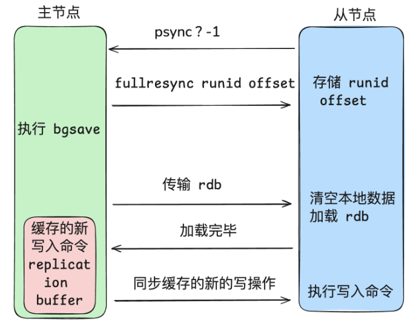

- 从节点发送 psync?-1, 触发同步。
- 主节点收到从节点的 psync 命令之后，发现 runid 没值，判断是全量同步，返回 fullresync 并带上主服务器的 runid 和当前复制进度，从服务器会存储这两个值。
- 主节点执行 bgsave 生成 RDB 文件，在 RDB 文件生成过程中，主节点新接收到的写入数据的命令会存储到 `replication buffer` 中。
- RDB 文件生成完毕后，主节点将其发送给从节点，从节点清空旧数据，加载 RDB 的数据
- 等到从节点中 RDB 文件加载完成之后，主节点将 `replication buffer` 缓存的数据发送给从节点，从节点执行命令，保证数据的一致性。

同步完毕后，主从之间会保持一个长连接，主节点会通过这个连接将后续的写操作传递给从节点执行，来保证数据的一致。

**增量同步**

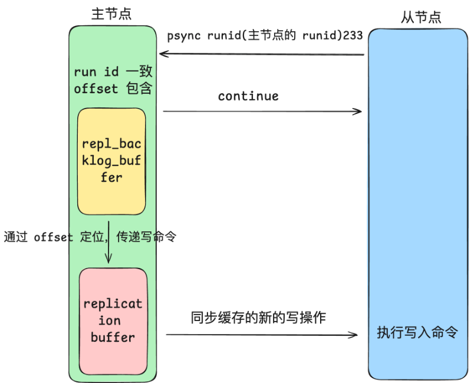

Redis 2.8版本引入了增量同步，在主从网络断开的时候，仅需把连接断开期间的数据同步给从节点即可，不需要再进行全量同步。

`repl_backlog_buffer`是一个环形缓冲区，默认大小为 1m。主节点会将写入命令存到这个缓冲区中，但是大小有限，待写入的命令超过 1m 后，会覆盖之前的数据，因为是环形写入。
Slave通过`psync`指令将自己的`slave_repl_offsetf`发送给主服务器，服务器根据`master_repl_offset`与`slave_repl_offset`的差距决定对从服务器的同步操作：
若从服务器所需数据在 `repl_backlog_buffer`缓冲区，主服务器采用增量同步；
若不在，主服务器采用全量同步。

**replicationbuffer和repl_backlog_buffer的区别**

**`replication buffer`**
因为不同的从节点同步速度不一样，**主节点会为每个从节点都创建一个 replication buffer, 它用于实时传输写命令**, 且大小是动态的，因为对于同步速度较慢的从服务器，需要更多的内存来缓存数据。

虽说 `replicationbuffer` 没有明确的大小限制，但是可以通过 `c1lient-output-buffer-limit` 间接控制，该参数可以设置不同类型客户端 (普通、从服务器、发布订阅) 的输出缓冲区限制。当缓冲区大小超过限制时，Redis 会断开与
客户端 (从节点其实就是一个客户端) 的连接。
`client-output-buffer-limit slave 256mb 64mb60`
上述配置表示，如果从服务器的输出缓冲区大小超过 256MB 或超过 64MB 的时间达到 60s,Redis 将断开与从服务器的连接。

**`repl backlog buffer`**
`repl_backlog_buffer` 在主节点上只有一个，**存储最近的写命令**，用于记录主节点最近一段时间内执行的写操作命令，主要目的是支持部分同步，避免频繁的全量同步，提升主从复制的效率。

## 🚀 如何解决Redis中的热点Key问题？

#### 💡 Redis中热点key是什么？如何解决带来的问题?

Redis 中的热点 Key 问题是指某些 Key 被频繁访问，导致 Redis 的压力过大，进而影响整体性能甚至导致集群节点故障。
解决热点 Key 问题的主要方法包括:
- **热点 key 拆分**：将热点数据分散到多个 Key 中，例如通过引入随机前绕，使不同用户请求分散到多个 Key, 多个 key 分布在多实例中，避免集中访问单一 Key。
- **多级缓存**：在 Redis 前增加其他缓存层 (如 CDN、本地缓存), 以以分担 Redis 的访问压力。
- **读写分离**：通过 Redis 主从复制，将读请求分发到多个从节点，从而减轻单节点压力。
- **限流和降级**：在热点 Key 访问过高时，应用限流策略，减少对 Reddis 的请求，或者在必要时返回降级的数据或空值。

#### 🔍 热点key的定义是什么？

阿里云对热点key的定义：

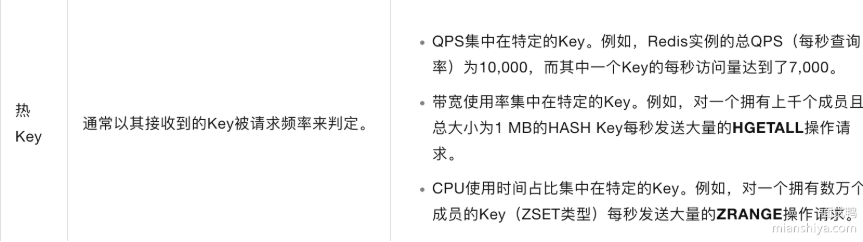

即一个key的访问频率占比大，带宽占比大，都属于热点key。
由于Redis是单线程执行的，热点key可能会影像Redis整体效率，消耗大量cpu资源，降低Redis整体吞吐量，集群环境下会使流量不均衡，从而导致热点倾斜问题的发生。

#### 🧠 如何发现热点key？

1) 根据业务经验进行分析
这个主要就是依据业务场景进行分析，通过经验判断哪些 key 可能成为热 key, 比如某明星的花边新闻、秒杀活动，演唱会门票等。
2) redis 集群监控
这种方式主要依据与 Redis 集群，我们只需要查看集群中哪个 Redis 出现 QPS 倾斜，而出现 QPS 倾斜的实例有极大的概率存在热点 Key。
3) 使用 hotkey 监控
这个是 Redis4.0 版本之后引入的一个新的指令，只需要在命令行执行 reddis-cli 的时候加上 --hotkeys 的选项就可以了。它是通过 scan+object freq 实现的。
4) 使用 monitor 命令
通过MONITOR命令开启监视器，在执行后结合一些日志和相关分析工具就可以统计
5) 客户端收集
操作Redis前加上统计Redis键值查询频次的逻辑
6) 代理层收集
在代理层进行统一收集，因为有些服务在请求Redis前都会请求一个代理服务

#### 🔣 应用程序中的多级缓存

应用程序中，一般结合一级缓存和二级缓存：
一级缓存：应用程序本地缓存，如JVM内存中的缓存
二级缓存：Redis中缓存

#### 👂 热点key拆分

按照不同场景做不同的拆分，即将key复制成key_1, key_2, key_3，他们之间数据是一致的，不同用户都能访问到全量的数据。

## 🚀 什么是以及如何解决Redis中的BigKey问题？

#### 💡 什么是bigkey？它又有什么危害呢？

Redis 中的 "big Key" 是指一个**内存空间占用比较大的键**(Key)，如大型字符串，大型哈希表等。

可以使用bigkeys命令查看

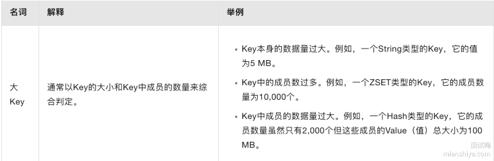

它会导致：
- 内存分布不均。在集群模式下，不同 slot 分配到不同实例中，如果大 key 都映射到一个实例，则分布不均，查询效率也会受到影响。
- 由于 Redis 单线程执行命令，操作大 Key 时耗时较长，从而导致 Redis 出现其它命令阻塞的问题。
- 大 Key 对资源的占用巨大，在你进行网络 I/O 传输的时候，导致你获取过程中产生的网络流量较大，从而产生网络传输时间延长甚至网络传输发现阻塞的现象，例如一个 key 2MB, 请求个 1000 次 2000MB。
- 客户端超时。因为操作大 Key 时耗时较长，可能导致客户端等待超时

#### 🔍 如何解决bigkey问题？

- 从开发方面：
对数据压缩后再存储；大对象可以拆分成多个小对象；使用合适的数据结构进行优化

- 从业务方面
可以根据实际情况调整存储策略，只存一些必要的数据；优化业务逻辑，从根源上避免大key的产生。

- 从数据分布方面
可以采用Redis集群方式进行Redis部署，将大key拆分到不同的服务器上以加快相应速度

## 🚀 Redis集群的实现原理是什么？

#### 💡 Redis集群是什么？简单说一下其实现原理？

Redis 集群 (Redis cluster) 是通过多个 Redis 实例组成的，**每个实例存储部分的数据** (即每个实例之间的数据是不重复的)。

具体是采用哈希槽 (Hash Slot) 机制来分配数据，将整个键空间划分为 16384 个槽 (slots)。每个 Redis 实例负责一定范围的哈希槽，数据的 key 经过哈希函数计算后对 16384 取余即可定位到对应的节点。

客户端在发送请求时，会通过集群的任意节点进行连接，如果该节点存储了对应的数据则直接返回，反之该节点会根据请求的键值计算哈希槽并路由到正确的节点。

简单来说，集群就是通过多台机器分担单台机器上的压力。

#### 🔍 Redis集群节点之间如何实现信息同步？

Redis 集群内每个节点都会保存集群的完整拓扑信息，包括每个节点的 ID、IP 地址、端口、负责的哈希槽范围等。
节点之间使用 Gossip 协议进行状态交换，以保持集群的一致性和故障检测。每个节点会周期性地发送 PING 和PONG 消息，交换集群信息，使得集群信息得以同步。

**Gossip 的优点:**
快速收敛：Gossip 协议能够快速传播信息，确保集群状态的迅速更新
降低网络负担：由于信息是以随机节点间的对话方式传播，避免了集中式的状态查询，从而降低了网络流量。

#### 🧠 Gossip协议

主要特点：
1. **分布式信息传播**：每个节点定期向其他节点发送其状态信息，确保所有节点对集群的状态有一致的视图。
2. **低延迟和高效率**：Gossip协议设计为轻量级的通信方式，能够快速传播信息，减少单点故障带来的风险。
3. **去中心化**：没有中心节点，所有节点平等地参与信息传播，提高了系统的鲁棒性。

工作原理：
1. **状态报告**：每个节点在特定的时间间隔内，向随机选择的其他节点发送其自身的状态信息，包括节点的主从关系、槽位分布等。
2. **信息更新**：接收到状态信息的节点会根据所接收到的数据更新自自己的状态，并将更新后的状态继续传播给其他节点。
3. **节点检测**：通过周期性交换状态信息，节点可以检测到其他节点的存活状态。如果某个节点未能在预定时间内响应，则该节点会被标记为故障节点。
4. **容错处理**：在检测到节点故障后，集群中的其他节点可以采取措施 (如重新分配槽位) 以保持系统的高可用性。

#### 👂 Redis集群中存储和请求key的示例

**存储key实例**
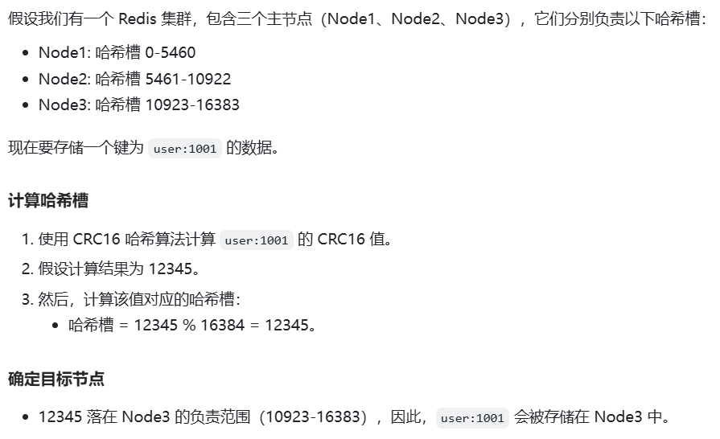

**请求key实例**
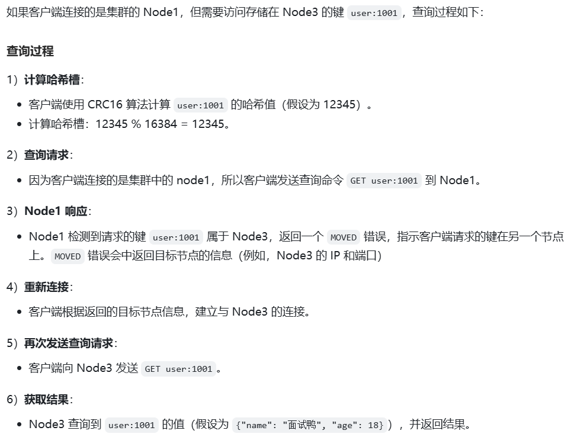


#### 🔣 Redis中分片原理

Redis 集群会将数据分散到 16384 (2 ^ 14) 个哈希槽中，集群中的的每个节点负责一定范围的哈希槽，在 Redis 集群中，使用 CRC16 哈希算法计算键的哈希槽，以确定该键应存储在哪个节点。


其中每个节点拥有一部分槽位，对应的键值会根据其本身的key映射到一个哈希槽中，即按照CRC16算法计算一个16bit的值，并对16384取余，最后得到一个对应的哈希值编号。

为什么哈希槽节点的数量为16384？因为正常心跳包需要携带节点完整配置数据，Redis使用位图标识槽位分配情况，而消息头中最占空间的是发送节点锁负责的槽信息。考虑到数据包的大小，因为16384的位图大小为2048字节，也就是2kb，在大多数网络环境下是一个合理的平衡点。