# 📚 操作系统 相关学习与整理

> 👋 本文介绍 [操作系统] 的相关知识、常见问题与总结。

---

## 📑 目录

- [📚 操作系统 相关学习与整理](#-操作系统-相关学习与整理)
  - [📑 目录](#-目录)
  - [🚀 线程和进程有什么区别？](#-线程和进程有什么区别)
      - [💡 线程是什么？进程是什么？他们的区别是什么？](#-线程是什么进程是什么他们的区别是什么)
      - [🔍 线程模型有哪些？](#-线程模型有哪些)
      - [🧠 Linux是如何创建进程和线程的？](#-linux是如何创建进程和线程的)
      - [👂 在JVM中举例看看？](#-在jvm中举例看看)
      - [🔣 进程切换和线程切换的区别是什么？](#-进程切换和线程切换的区别是什么)
      - [🧠 程序上下文涉及了啥？](#-程序上下文涉及了啥)
      - [👂 文件句柄？内存空间？网络连接？](#-文件句柄内存空间网络连接)
  - [🚀 进程之间的通信方式有哪些？](#-进程之间的通信方式有哪些)
      - [💡 什么是进程间通信？简单说一下进程间通信的方式？](#-什么是进程间通信简单说一下进程间通信的方式)
      - [🔍 管道与命名管道的差异是什么？](#-管道与命名管道的差异是什么)
      - [🔍 共享内存与同步机制？](#-共享内存与同步机制)
      - [🔍 套接字通信的分类和应用场景？](#-套接字通信的分类和应用场景)
      - [🔍 信号的使用与处理机制？](#-信号的使用与处理机制)
  - [🚀 进程的调度算法你知道吗？](#-进程的调度算法你知道吗)
      - [💡 常见的进程调度算法有哪些？](#-常见的进程调度算法有哪些)
      - [🔍 最高相应比优先？](#-最高相应比优先)
      - [🔍 多级反馈队列调度？](#-多级反馈队列调度)
      - [🔍 时间片轮转(RR)的时间片选择](#-时间片轮转rr的时间片选择)
      - [🧠 主流操作系统采用的进程调度策略？](#-主流操作系统采用的进程调度策略)
  - [🚀 I/O模型有哪些？](#-io模型有哪些)
      - [💡 总体上分为哪些？](#-总体上分为哪些)
      - [🧠 深入研究五种I/O模型？](#-深入研究五种io模型)
      - [🔍 深入研究五种I/O模型的对比？](#-深入研究五种io模型的对比)
      - [👂 其中的select，sigaction，aio\_read是什么？](#-其中的selectsigactionaio_read是什么)
  - [🚀 Select、Poll、Epoll之间有什么区别？](#-selectpollepoll之间有什么区别)
      - [💡 他们的概念分别是什么？区别是什么？](#-他们的概念分别是什么区别是什么)
      - [🧠 select，poll，epoll的底层了解吗？](#-selectpollepoll的底层了解吗)
  - [🚀 为什么网络I/O会被阻塞？](#-为什么网络io会被阻塞)
      - [💡 网络I/O被阻塞的原因是什么？](#-网络io被阻塞的原因是什么)
      - [🧠 从 socket通信看 I/O 阻塞](#-从-socket通信看-io-阻塞)
      - [🔍 网络I/O被阻塞的常见场景有哪些？](#-网络io被阻塞的常见场景有哪些)
  - [🚀 什么是用户态和内核态？](#-什么是用户态和内核态)
      - [💡 两者的区别和特点是什么？](#-两者的区别和特点是什么)
      - [🔍 操作系统的保护模式是什么？](#-操作系统的保护模式是什么)
      - [🔣 微内核和宏内核的区别是什么？](#-微内核和宏内核的区别是什么)
      - [📌 上下文切换的机制？](#-上下文切换的机制)
      - [🧠 设计用户态和内核态的原因？](#-设计用户态和内核态的原因)
  - [🚀 什么是软中断，硬中断？](#-什么是软中断硬中断)
      - [💡 什么是中断？什么是软硬中断？](#-什么是中断什么是软硬中断)
      - [🔍 软硬中断的详细解释？](#-软硬中断的详细解释)
      - [📌 软硬中断的区别？](#-软硬中断的区别)
      - [🧠 SoftIRQ软中断？](#-softirq软中断)
  - [🚀 什么是分段，什么是分页？](#-什么是分段什么是分页)
      - [💡 分段和分页的概念是什么？](#-分段和分页的概念是什么)
      - [🔍 分段和分页的详细解释？](#-分段和分页的详细解释)
      - [📌 分段和分页的对比？](#-分段和分页的对比)
      - [👂 分页与虚拟内存的关系](#-分页与虚拟内存的关系)
  - [🚀 为什么要有虚拟内存？](#-为什么要有虚拟内存)
      - [💡 有虚拟内存的原因是什么？](#-有虚拟内存的原因是什么)
      - [🔍 虚拟内存的执行原理是什么？](#-虚拟内存的执行原理是什么)
  - [🚀 到底什么是Reactor?](#-到底什么是reactor)
      - [💡 Reactor是什么？Reactor是如何工作的？](#-reactor是什么reactor是如何工作的)
      - [🔍 Reactor的结构与组件](#-reactor的结构与组件)
      - [📌 Reactor模式与Proactor模式区别](#-reactor模式与proactor模式区别)
      - [📌 单Reactor和多Reactor模型](#-单reactor和多reactor模型)
      - [🔣 Reactor模式实际应用案例](#-reactor模式实际应用案例)
      - [🧠 更深入了解一下Reactor](#-更深入了解一下reactor)
  - [🚀 说下你常用的Linux命令？](#-说下你常用的linux命令)
      - [💡 按照不同的分类，有哪些linux命令？](#-按照不同的分类有哪些linux命令)
      - [🔍 进阶命令？](#-进阶命令)


## 🚀 线程和进程有什么区别？

#### 💡 线程是什么？进程是什么？他们的区别是什么？

**进程**：是*资源分配的基本单位*，每个进程都有自己独立的内存空间 (代码段、数据段、堆栈等), 可以看作是一个正在运行的程序实例。进程之间是相互独立的。

**线程**：是*CPU调度的基本单位*，属于进程，一个进程中可以包含多个线程。线程共享进程的内存空间和资源 (如文件句柄数据段), 但每个线程有自己独立的栈和寄存器。

**线程和进程的区别在于**:
- 资源消耗不同：进程时需要为其分配独立的内存空间和系统资源，创建和切换进程的开销较大。线程间共享进程的资源，创建线程所需的开销较小，线程切换的开销也远小于进程切换
- 通信方式：因为各自独立的内存空间，进程间通信 (IPC) 较为复杂，需要使用管道、消息队列、共享内存、套接字等方式。同一进程内的线程共享内存空间，因此线程直接读写内存即可，但注意需要使用同步机制避免数据错误。

#### 🔍 线程模型有哪些？

1. 单线程模型：每个进程仅有一个线程，所有任务都在一个线程中顺序执行。适合简单的任务，但无法利用多核 CPU 的并行能力。
2. 多线程模型：一个进程包含多个线程，可以利用多核 CPU 的并行执行能力，显著提升任务处理效率。
3. 线程池：线程池是为了避免频繁创建和销毁线程的开销，将一定数量的线程进行复用。常用于 Web 服务器、数据库连接池等场景，能够显著提升系统的性能和资源利用率。

#### 🧠 Linux是如何创建进程和线程的？

**创建进程**：

fork() 系统调用用于复制当前进程，生成一个子进程。调用fork() 后，父进程和子进程从 fork() 返回的位置继续执行，但它们的 fork() 返回值不同：父进程中 fork() 返回子进程的 PID (正整数), 子进程中 fork() 返回 0。

```c++
#include <unistd.h>
#include <stdio.h>

int main() {
    pid_t pid = fork();

    if (pid < 0) {
        perror("fork failed");
        return 1;
    } else if (pid == 0) {
        printf("This is the child process.\n");
    } else {
        printf("This is the parent process. Child PID: %d\n", pid);
    }

    return 0;
}
```
上述代码块中，若fork成功，就会生成一个新的子进程，父进程和子进程分别输出各自信息

exec系列函数:
- 子进程创建后，通常会使用 exec 系列函数 (如 execl()、execvp() 等) 来加载和执行新程序。exec会用新的程序替换当前进程的地址空间，从而运行不同的程序。
- exec不创建新进程，只是用新程序替换当前进程，所以常与 fork() 结合使铺，

vfork() 类似于 fork(), 但它会让子进程共享父进程的地址空间，直到子进程调用 exec() 或 exit()。这样可以提高性能，但子进程在执行前不能修改父进程的数据。

**创建线程**：

- pthread_create():

使用 pthread 库中的 pthread_create() 函数创建新线程。pthread 库是 POSIX 标准下的多线程库，线程间共享进程的内存空间，但拥有各自的栈空间。

函数原型：
```c++
int pthread_create(pthread_t *thread, const pthread_attr_t *attr, 
                   void *(*start_routine)(void *), void *arg);
```

其中，
thread: 指向 pthread_t 类型的指针，用于接收创建的线程 ID。
attr: 线程属性，通常传 NULL 表示使用默认属性。
start_routine: 线程函数，线程启动时执行的函数。
arg: 传递给线程函数的参数。

- pthread_join()：

用于阻塞当前线程，直到指定的线程执行结束。它可以获取被等待续线程的返回值。常用于确保主线程等待所有子线程完成后再退出。

例如：
```c++
#include <pthread.h>
#include <stdio.h>
#include <stdlib.h>

void *print_message(void *message) {
    printf("%s\n", (char *)message);
    return NULL;
}

int main() {
    pthread_t thread;
    const char *message = "Hello from the thread!";
    int result = pthread_create(&thread, NULL, print_message, (void *)message);

    if (result != 0) {
        perror("pthread_create failed");
        return 1;
    }

    pthread_join(thread, NULL);  // 等待线程结束
    return 0;
}
```
这其中，pthread_create()创建了一个新线程，并调用了print_message()函数，pthread_join()用于等待线程执行完毕。

本质上，进程作为操作系统进行资源分配的基本单元，而线程则构成任务调度和执行的核心单元。

#### 👂 在JVM中举例看看？

JVM内存模型如图所示：

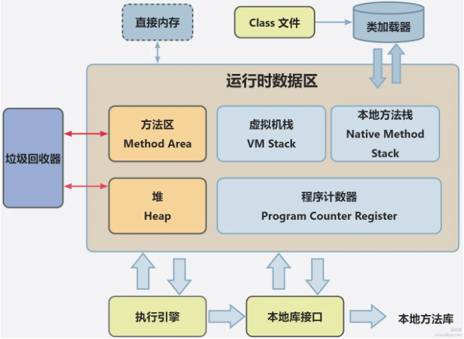

其中，线程共享的数据区有：堆(Heap)、方法区(Method_Area，JDK8以后称为元空间)，执行引擎等；线程隔离区域有程序计数器、虚拟机栈、本地方法栈，每个线程都有自己的副本；多线程共享堆和方法去，但独立的栈和计数器确保线程间执行上下文彼此隔离。

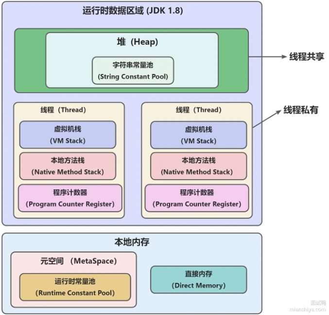

一个进程中可以有多个线程，多个线程共享进程中的堆和方法区(元空间)资源，但每个线程有自己的程序计数器，虚拟机栈和本地方法栈。因此：
- 线程是进程划分成的更小运行单位，一个进程在其执行的过程中可以产生多个线程。
- 线程和进程最大的不同在于基本上各个进程都是独立的，而各个线程则不一定，因为同一进程中的线程极有可能会相互影响
- 线程执行开销小，不利于资源的管理和保护，而进程相反

#### 🔣 进程切换和线程切换的区别是什么？

从时间效率上看，线程切换比进程切换更快，因为线程共享地址空间，而进程需要切换页表(用于建立进程虚拟地址与物理内存地址之间的映射关系)和上下文，涉及了更多的资源。

从空间效率看，线程共享内存和文件资源，数据交互无需内核参与，效率更高；而进程切换涉及更复杂的上下文保存和恢复。

#### 🧠 程序上下文涉及了啥？

> ###### 进程的控制结构

进程控制块 (process control block, PCB) 数据结构是用来描述进程的，PCB 是进程存在的唯一标识，其中包含:
- PCB 内容：进程唯一标识符、状态信息 (如就绪、运行、阻塞)、优先级、资源分配清单 (内存、文件句柄)、CPU 寄存器值等。
- 进程状态变迁：创建、就绪、运行、阻塞、终止，这些状态通过调度器进行切换

进程的状态变迁：

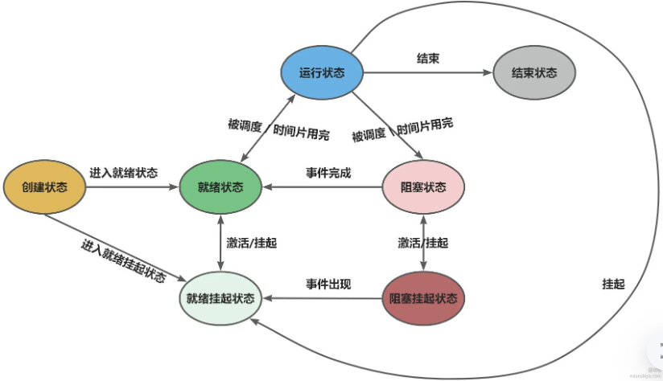

> ###### 进程的上下文切换

**名词**：
- CPU 上下文：CPU 寄存器和程序计数器在执行任务前所需要依赖的环境。
- CPU 上下文切换：把前一个任务的 CPU 上下文保存起来，然后加载新任务的上下文到寄存器和程序计数器，再跳到程序计数器所指的新位置，运行新任务。

**进程的上下文切换**
包含：
- 用户空间：虚拟内存（页表映射）、用户栈、全局变量、文件描述符等
- 内核空间：内核栈、内核态寄存器、进程状态（就绪 / 运行）、PCB 中的控制信息（PID、优先级）

将上一个进程的上下文保存到进程的 PCB 中，当需要运行另外一个进程的时候，需要从这个进程的 PCB 取出上下文，恢复到 CPU 中，使得这个进程可以继续执行。

**进程切换发生场景**
1. 时间片用完：进程转为就绪态，调度下一个进程
2. 资源不足：进程等待 IO 等资源时被挂起
3. 主动挂起：通过sleep()、wait()等系统调用主动放弃 CPU
4. 高优先级抢占：更高优先级进程就绪时抢占 CPU
5. 硬件中断：CPU 转去执行中断处理程序

> ###### 线程的上下文切换

如果属于不同进程内的线程切换：相当于不同进程间上下文切换

如果属于同一个进程两个线程切换：因为虚拟内存是共享的，所以在切换时，虚拟内存这些资源就保持不动，只需要切换线程的私有数据、寄存器等不共享的数据；

#### 👂 文件句柄？内存空间？网络连接？

**文件句柄**是操作系统分配给进程的一个编号，用于标识进程正在操作的文件或资源，进程通过文件句柄与文件进行交互，而不是直接操作底层文件

```shell

ls /proc/<PID>/fd # 查看

ls -l /proc/<PID>/fd # 查看详情

```

**内存空间**通常被分为：代码段（存放二进制可执行代码）, 数据段（存放全局变量和静态变量，分为已初始化数据区和未初始化数据区），堆区（用于动态分配内存），栈区（存放函数的局部变量、参数、返回地址等，大小固定），文件映射段（包括动态库，共享内存等）

每个进程都有独立的虚拟内存空间，进程间隔离。虚拟内存通过页表映射到物理内存，所有进程共享内存空间。

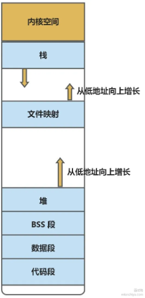

```shell

top # 查看所有进程状态

pmap <PID> # 查看指定进程（PID 为进程 ID）的内存占用情况和虚拟内存映射

```


**网络连接**是一种特殊的文件，可以通过文件句柄进行操作。网络连接通常指两台计算机通过网络协议建造的通信通道，在linux中每个网络连接都会分配一个文件句柄

```shell
cat /proc/<PID>/fd # 查看网络连接对应的文件句柄
```

**总结一下三者的关系**，*文件句柄*是一个编号，帮助进程管理资源 (包括文件和网络连接), *内存空间*通过系统调用与文件句柄交互。而网络连接是通过文件句柄实现的，使得 Linux 下进程可以像操纵文件一样操作网络连接。

## 🚀 进程之间的通信方式有哪些？

#### 💡 什么是进程间通信？简单说一下进程间通信的方式？

进程间交换数据需要通过内核，在内核开辟缓冲区，进程1从用户空间将数据拷贝到内核缓冲区，进程2再从内核缓冲区读走数据，这种内核提供固定机制被称为进程间通信（IPC，InterProcess Communication）。

通信方式有：
1) 管道 (Pipes): 管道是一种单向通信方式，用于在父进程和子进程之间或者同一主机上的不同进程之间传递数据。它可以是匿名的，也可以是命名的。
2) 命名管道 (Named Pipes): 与匿名管道类似，但具有一个在文件系统中有名的路径，允许不相关的进程之间进行通信。
3) 消息队列 (MessageQueues): 消息队列允许一个进程向另一个进程发送消息，消息在队列中按顺序存储，并且接收方可以按需接收。
4) 共享内存 (Shared Memory): 共享内存允许多个进程访问同一块内存区域，从而实现快速的数据交换。但需要注意同步问题，以避免竟态条件和数据一致性问题。
5) 信号量 (Semaphores): 信号量是一种同步原语，用于管理对共享资源的访问。它可以用于实现进程间的互斥访问和同步操作。
6) 信号 (Signal): 信号是一种异步的通信方式，用于通知目标进程发生了某个事件。信号常用于进程之间发送中断或终止命令。
7) 套接字 (Sockets): 套接字允许在网络上的不同主机上的进程进行通信，是实现网络通信的基础。
 
基于TCP协议通信的socket编程模型：
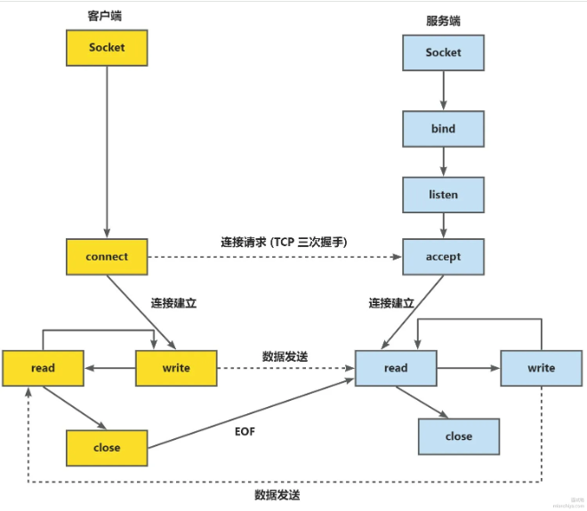
服务端与客户端除四害socket得到描述符 -> 服务端bind绑定IP和端口，listen监听，accept等客户端连接 -> 客户端connect向服务端地址和端口发起连接请求 -> 服务端accept返回传输socket描述符 -> 客户端write写入数据 -> 客户端close时服务端read到EOF，处理完数据后服务端close关闭连接

8) 文件 (File): 进程可以通过读写文件来进行通信，这种方式通常用于进程之间的间接通信，例如使用临时文件或者共享文件。

#### 🔍 管道与命名管道的差异是什么？

- 匿名管道：只能用于父子进程或兄弟进程之间的通信。匿名管道是单向的，数据从一端写入，从另一端读取。它简单易用，但局限于具有亲缘关系的进程。
- 命名管道 (FIFO): 支持无亲缘关系的进程之间的通信。命名管道是一种存在于文件系统中的特殊文件，通过管道名称可以进行读写操作。适用于需要跨进程通信且不具备亲缘关系的场景。

#### 🔍 共享内存与同步机制？

共享内存虽然能提供最快速的通信方式，但存在并发读写的问题，需要使用同步机制来控制:
- 信号量：用于对共享内存进行访问控制，防止多个进程同时读写时出现数据不一致。
- 互斥锁 (Mutex) 和读写锁 (Read-WriteLock): 用于解决多进程对共享资源的互斥访问问题，互斥锁确保只有一个进程可以访问共享资源，读写锁则允许多个进程进行读取操作，但在写操作时需要排他锁。

#### 🔍 套接字通信的分类和应用场景？

- 本地套接字 (UNIX 域套接字): 用于同一台计算机上的进程通信，速度快且无需通过网络协议，是替代管道的更灵活的方式，适合需要传输大量数据的本地进程通信。
- 网络套接字 (TCP/UDP): 用于不同计算机上的进程通信，通过网络协议传输数据。TCP 套接字提供可靠的、面向连接的通信，保证数据包的顺序和完整性，适合文件传输、Web 服务等场景。UDP 套接字适合需要低延迟的场景，如实时音视频传输，但不保证数据的可靠性。

#### 🔍 信号的使用与处理机制？

信号是操作系统提供的一种通知机制，用于在进程间传递简单的通知信息。常见信号包括 SIGKILL(强制终止进程)、SIGTERM(请求终止进程)、SIGUSR1 和 SIGUSR2(用户自定义信号)等。

信号是一种异步事件，进程无需主动等待信号到来，可以在任意对被信号中断。接收进程可以通过信号处理函数 (SignalHandler) 来处理接收到的信号。

在多进程服务中，可以通过信号来实现进程的优雅退出，或在调过程中通过向进程发送信号来暂停、继续执行。

## 🚀 进程的调度算法你知道吗？

#### 💡 常见的进程调度算法有哪些？

1. 先来先服务 (FCFS,First-Come,First-Served): 按照进程到达的顺序进行调度，适用于批处理系统。简单易实现，但可能造成 "长任务" 拖延其他任务的执行。
2. 短作业优先 (SJF,Shortest Job First): 优先调度执行时间最短的进程，能减少平均等待时间。分为非抢占式和抢占式 (SRTF,Shortest Remaining Time First)。但它需要要预先知道任务执行时间，不适用于交互式系统。
3. 优先级调度 (Priority Scheduling): 根据进程的重要性 (优先级) 来调度，优先级高的进程先执行。适用于需要不同优先级服务的场景。可能导致 "低优先级进程" 长期得不到调度，造成饥饿现象。
4. 时间片轮转 (RR,Round Robin): 为每个进程分配固定的时间片，时间片结束后调度下一个进程。适用于交互式系统，能提升系统响应性。时间片的选择对系统性能有有重要影响。
5. 最高响应比优先 (HRRN,Highest Response Ratio Next): 通过计算响应比来决定下一个被调度的进程，适合在批处理环境中平衡长短任务的等待时间，防止短任务过多导导致长任务饥饿
6. 多级反馈队列调度 (MLFQ, Multilevel FeedbackQueue): 结合多个调度策略，通过将进程放入不同优先级的队列，实现灵活的调度机制。优先级较高的进程先被调度，随着执行时间增加，进程可能被降至低优先级队列。适合多任务、多类型的操作系统。

#### 🔍 最高相应比优先？

通过计算每个进程的响应比来决定调度顺序，相应比公式为：

```shell
( 等待时间 + 服务时间 ) / 服务时间
```

其中，`等待时间`是进程在就绪队列中等待的时间，`服务时间`是进程预计需要的执行时间。通过这个公式，响应比会随着等待时间的增加而提升。

**调度策略**：
- 对于短任务，其服务时间小，初始响应比就较高，容易被优先调度。
- 对于长任务，随着等待时间的增加，响应比逐渐提升，最终也会被认周度，避免了长任务的饥饿。

**优点**：HRRN 能够在不完全了解执行时间的情况下，通过等待时间的增加来动态调整调度顺序。它在减少平均等待时间的同时，避免了短作业优先算法 (SJF) 中长任务被长期延迟的问题

**缺点**：相比于简单的 FCFS 和 RR, HRRN 的实现复杂度较高，因为需要持续计算并更新每个进程的响应比，适用于需要平衡长短任务的批处理系统，但在交互式系统中不常用。

**应用场景**：HRRN 适合用于批处理环境，特别是在任务执行时间差差距较大时，它能提供更公平的调度。比如在一些服务器负载较高的后台任务处理中，可以使用 HRRN 来确保所有任务都能被合理调度。

#### 🔍 多级反馈队列调度？
MLFQ 由多个优先级不同的队列组成，高优先级队列时间片较短，低优先级队列时间片较长。新到达的进程首先进入高优先级队列。

如果进程在高优先级队列中未能在时间片内完成，则被移至低优先级队列。若进程被阻塞后恢复，就可以重新回到高优先级队列中。

**优点**：能够灵活处理短任务与长任务，兼顾响应时间和吞吐量。
**缺点**：算法设计复杂，实现难度大，需要根据应用场景调整参数。

#### 🔍 时间片轮转(RR)的时间片选择

时间片越短，系统响应性越好，但上下文切换的次数增加，可能导导致调度开销增大。时间片太长则会退化为先来先服务。

**应用场景**：时间片轮转适合于交互式操作系统，如桌面系统和移动边备操作系统，能够确保所有用户程序都能在合理时间内获得 CPU。

#### 🧠 主流操作系统采用的进程调度策略？

**Windows 操作系统**：Windows 的调度算法基于优先级调度和多级反馈队列，同时结合了抢占式调度。Windows 将进程分为不同优先级级别，从 0 到 31，其中 0 级用于系统空闲进程，1 到 15 级用于普通进程，16 到 31 级用于实时进程。高优先级的进程优先获得 CPU，对于普通优先级的进程，Windows 会为其分配固定长度的时间片，在同一优先级的进程间，采用时间片轮转方式来保证公平性，而实时进程则不会被时间片轮转机制影响。此外，长时间没有获得 CPU 的低优先级进程会被提升优先级，以避免饥饿现象。

Linux 操作系统：Linux 目前采用的是基于完全公平调度器（CFS）算法，并结合了优先级和抢占式调度特性。CFS 的核心思想是分时公平，它采用红黑树数据结构来组织进程，红黑树中的节点按照进程的虚拟运行时间排序，CFS 会优先调度虚拟运行时间最少的进程。虚拟运行时间会受到进程优先级的影响，优先级越高的进程，其虚拟运行时间的增加速率越慢，从而优先获得调度机会。除了普通进程，Linux 还支持实时进程，实时进程分为 SCHED_FIFO（先进先出调度）和 SCHED_RR（时间片轮转调度）两种调度策略。

macOS 操作系统：macOS 的进程调度策略类似于 Windows 和 Linux，它采用了基于优先级的调度算法，并结合了时间片轮转和抢占式调度。macOS 将进程分为不同的优先级类别，如系统进程、用户交互进程和后台进程等。高优先级的进程，特别是与用户交互相关的进程，会优先获得 CPU 资源，以确保系统的响应速度和用户体验。对于同一优先级的进程，则通过时间片轮转的方式来共享 CPU 时间。同时，当有更高优先级的进程准备运行时，当前进程会被抢占。

## 🚀 I/O模型有哪些？

#### 💡 总体上分为哪些？

**阻塞 I/O (Blocking I/O)**: 调用 I/O 操作时，进程会被阻塞，直到数据准备好或操作完成后才继续执行。
**非阻塞 I/O (Non-blocking I/O)**: I/O 操作不会阻塞进程，如果数据没有准备好，立即返回错误或状态，进程可以继续执行其他操作。
**I/O 多路复用 (I/OMultiplexing)**: 使用 select, poll, epoll 等系统调用，允许程序同时等待多个 I/O 操作，当其中任意一个就绪时进行处理。
**信号驱动 I/O (Signal-driven I/O)**: 在数据准备好时，内核通过信号通知进程进行 I/O 操作，进程在接收到信号后再进行数据读取或写入。
**异步 I/O (Asynchronous I/O)**: 发起 I/O 请求后立即返回，内核在后台完成 l/O 操作，并在操作完成时通知进程。进程不需要等待 I/O 完成即可继续执行其他任务

#### 🧠 深入研究五种I/O模型？

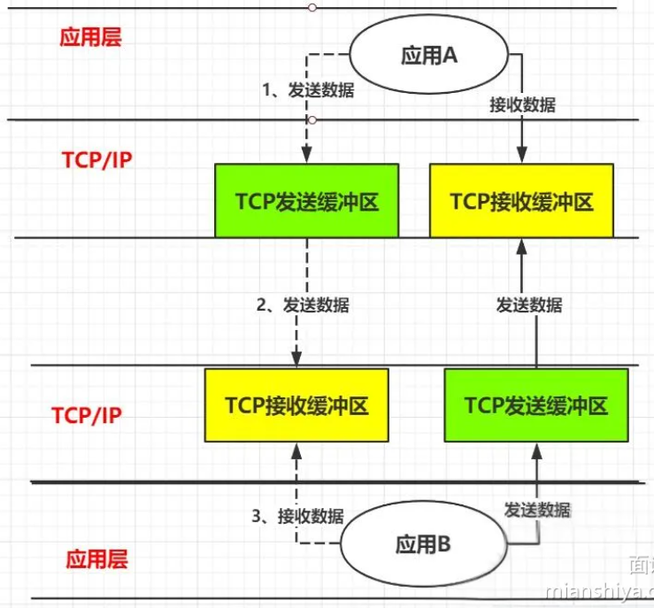

以图中应用A和应用B数据发送和接收举例

> ###### 阻塞I/O

即图中TCP缓冲区还没有接收到属于B应该读取的消息时，B需要持续等待数据状态，直到内核把数据准备好交给B

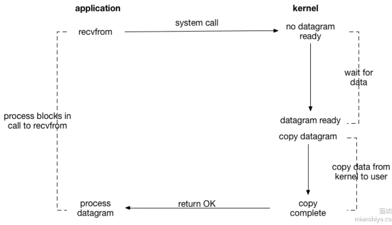

**过程**：
1. 应用程序 (application) 发起 recvfrom 系统调用 (systemcal), 请求接收数据报(datagram)。
2. 此时内核 (Kernel) 中没有准备好的数据报 (nodatagram ready), 所以应用程序的进程会被阻塞 (processblocksincall to recvfrom), 等待数据。
3. 当内核中有数据报准备好 (datagram ready) 后，内核会将数据报从内核空间复制到用户空间(copy datagram, copy data from kernel to user) 。
4. 数据复制完成 (copy complete) 后，系统调用返回成功 (returrOK), 应用程序的进程解除阻塞，并可以处理接收到的数据报 (process datagram)。

**特点**


> ###### 非阻塞IO模型

即B发起读取数据申请时，内核数据没准备好就立刻告诉B，不让B继续等待，后通过轮询(程序主动询问)或者数据驱动的方式(注册回调函数)等待数据就绪。

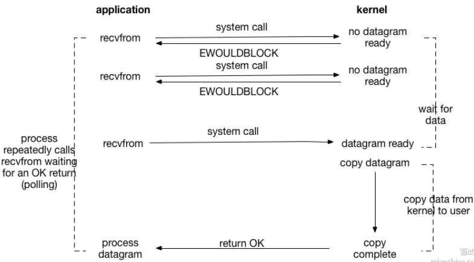

**过程**：
应用程序 (application) 端:
1. 应用程序发起 recvfrom 系统调用，请求接收数据报 (datagram)。
2. 当内核中没有准备好的数据报 (no datagram ready) 时，系统调用不会阻塞进程，而是立即返回一个错误码 EWOULDBLOCK, 表示当前没有数据可接收。
3. 应用程序的进程不会像阻塞 I/O 那样一直等待，而是会反复调用 recyfrom(即轮询polling), 不断地检查数据是否准备好。
4. 直到某次调用 recvfrom 时，内核中有数据报准备好 (datagram ready)。

内核 (Kernel) 端:
1. 内核一直等待数据到来 (wait for data)。
2. 当数据报准备好后，内核将数据报从内核空间复制到用户空间 (copy datagram, copy data from kernel to user)。
3. 数据复制完成 (copy complete) 后，系统调用返回成功 (returnCK) 给应用程序，此时应用程序可以处理接收到的数据报 (process datagram)。

socket相关函数
```c++
#include <sys/socket.h>
#include <unistd.h>

/**
 * 常与select, poll, epoll等多路复用机制配合，处理新连接时可将客户端套接字设为非阻塞模式，需谨慎处理返回值和错误码，避免死循环或错误逻辑，可使用状态机处理I/O事件
 * 
 * params：
 * @param sockfd   套接字文件描述符，指定要监听的套接字。通常由socket()函数创建，通过bind()和listen()函数配置
 * @param addr     指向 struct sockaddr 结构体的指针，用于存放客户端的地址信息。
 * @param addrlen  指向 socklen_t 类型的指针，存储addr结构体的长度，调用前应设置为 addr 所指结构体的长度，调用后会被内核修改为实际的地址长度。
 *
 * return：
 * 成功时返回新的已连接套接字的文件描述符，失败时返回 -1，并设置 errno 以指示错误类型。
 */
int accept(int sockfd, struct sockaddr *addr, socklen_t *addrlen);

/**
 * params：
 * @param fd       文件描述符，可以是文件、套接字等的描述符
 * @param buf      是一个指向存储读取数据的缓冲区的指针     
 * @param count    是要读取的字节数
 *
 * return：
 * 非阻塞I/O下立即返回，无数据时返回-1，errno设为EAGAIN或EWOULDBLOCK
 */
ssize_t read(int fd, void *buf, size_t count);
```

> ###### I/O多路复用

若用先前的方法，则应用B在接收到大量请求的时候，需要创建大量的线程区读取数据，且这些线程需要不断轮询向内核请求来读取数据。

I/O多路复用为解决这个方法，用一个线程监控多个网络请求，这样只需要一个或少量的线程就可以完成数据状态询问的操作，当数据准备就绪只会再分配对应的线程去读取数据，这样就可以省出大量线程资源出来。

核心思路是，系统提供了一种函数可以同时监控多个fd的操作，这个函数就是select, poll, epoll函数，应用系统通过调用select函数，同时监控多个fd，只要其中一个数据状态准备就绪，select函数就会返回可读状态，然后询问线程再去通知处理数据的线程，对应线程再去发起请求读取数据。

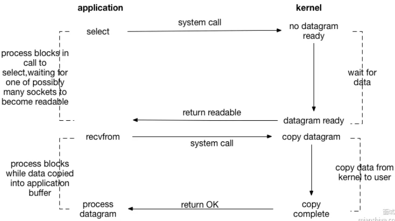

**过程**：
应用程序 (application) 端:
1. 应用程序调用 select 系统调用，该调用会阻塞进程 (process blocks incall to select), 目的是等待多个套接字 (sockets) 中的任意一个变为可读状态 (waiting for one of possibly many sockets to become readable)。
2. 当 select 检测到有套接字可读 (即有数据报准备好，datagram ready) 时，select 调用返回，表示有套接字可以进行读取操作 (return readable)。
3. 然后应用程序调用 recvfrom 系统调用去接收数据。此时进程会再次阻塞 (process blocks while data copied into application buffer), 直到内核将数据报从内核空间复制到应用程序的缓冲区 (copydatagram,copydata from kernel to user)。
4. 数据复制完成 (copy complete) 后，recvfrom 调用返回成功 (returnOK), 应用程序可以处理接收到的数据报 (process datagram)。

内核 (Kernel) 端:
1. 内核一直等待数据到来 (wait for data), 直到有数据报准备好。
2. 当数据报准备好后，内核会将数据报的状态告知 select 系统调用，你使其返回可读的信息给应用程序。
3. 在 recvfrom 调用时，内核负责将数据报从内核空间复制到用户空间

> ###### 信号驱动式IO

即不采用轮询方案，通过调用sigaction建立一个SIGIO的信号联系，在内核数据准备就绪后，通过SIGIO通知线程数据准备好的可读状态，线程收到信号后再向内核发起读取数据的请求。

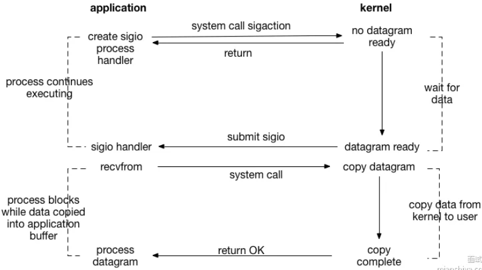

**过程**：
应用程序 (application) 端:
1. 应用程序首先通过 sigaction 系统调用创建一个 sigio (信号 I/O) 处理程序 (create sigioprocess handler)。此时，即使数据还未准备好 (no datagram ready), 该系统调用也会立即返回，应用程序可以继续执行其他操作 (process continuesexecuting), 而不是像阻塞I/O 那样被阻塞。
2. 当内核中有数据报准备好 (datagram ready) 时，内核会向应用程序提交 sigio 信号 (submitsigio), 触发之前注册的 sigio 处理程序 (sigio handler)。
3. 在 sigio 处理程序中，应用程序通常会调用 recvfrom 系统调用来接收数据。此时，进程会阻塞(process blocks while data copied into application buffer), 直到内核将数据报从内核空间复制到应用程序的缓冲区 (copydatagram,copydata fromkerneltouser)。
4. 数据复制完成 (copy complete) 后，recvfrom 调用返回成功 (returnOK), 应用程序可以处理接收到的数据报 (processdatagram)。

内核 (Kernel) 端:
1. 内核一直等待数据到来 (wait for data)。
2. 当数据报准备好后，内核向应用程序发送 sigio 信号，通知应用程序序可以进行数据接收操作。
3. 在 recvfrom 调用时，内核负责将数据报从内核空间复制到用户空间。


> ###### 异步IO

即应用只需要向内核发送一个read请求，内核收到请求后建立一个信号联系，数据准备就绪后会主动将数据从内核复制到用户空间，等所有操作完成后内核会告诉应用。

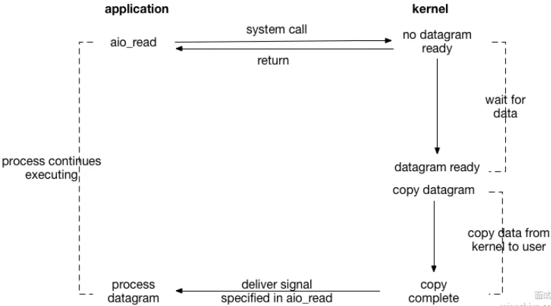

**过程**：
应用程序 (application) 端:
1. 应用程序调用 aio_read 系统调用发起异步读操作 (systemcall aio_read)。此时，无论数据是否准备好，该调用都会立即返回 (return), 应用程序的进程可以继续执行其他任务
(process continues executing), 而不会被阻塞等待 I/O 操作完成。
2. 当内核中的数据报准备好 (datagram ready) 后，内核会在后台进行数据报的复制操作 (copy datagram,copy data from kernel to user), 将数据从内核空间复制到用户空间。
3. 数据复制完成 (copy complete) 后，内核会按照 aio_read 调用中指定的方式向应用程序发送信号 (deliver signal specified in aio_read), 通知应用程序数据已准备好可以进行处理。
4. 应用程序收到信号后，就可以处理接收到的数据报 (process datagram)
    
内核 (Kernel) 端:
1. 内核一直等待数据到来 (wait for data)。
2. 当数据报准备好后，内核负责将数据报从内核空间复制到用户空间，并在完成后向应用程序发送信号。

#### 🔍 深入研究五种I/O模型的对比？

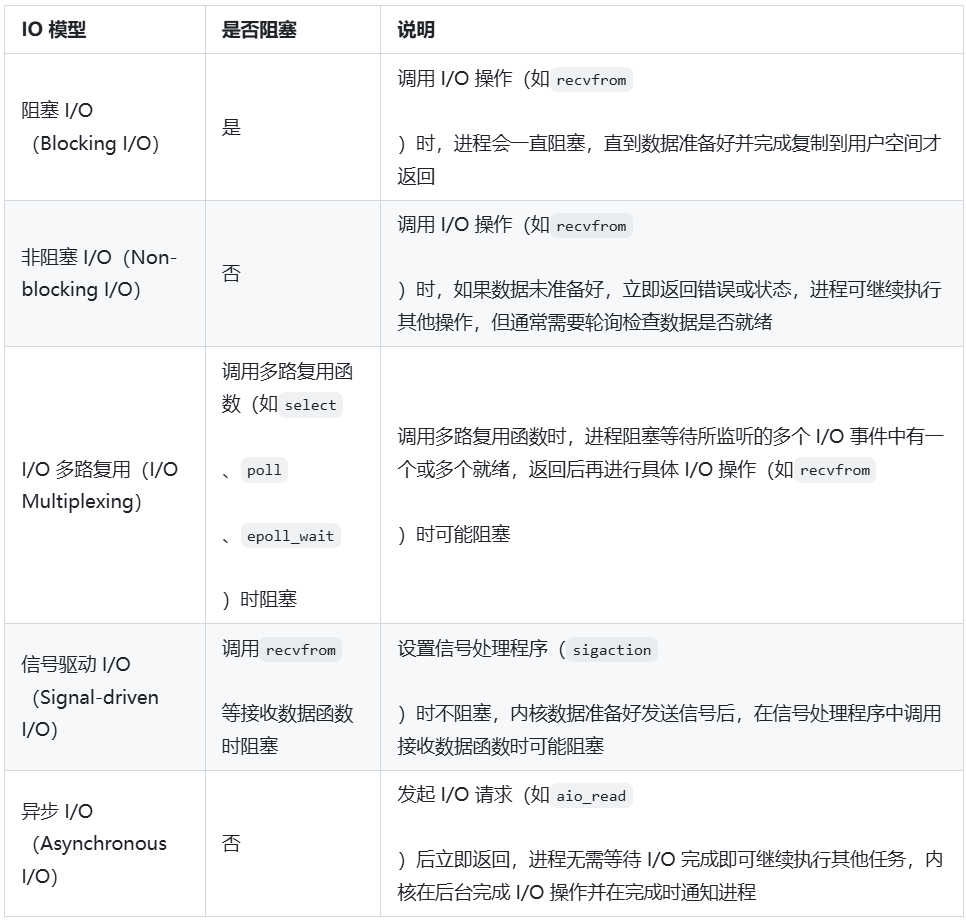

#### 👂 其中的select，sigaction，aio_read是什么？

他们都是 系统调用(System Calls)，是操作系统提供给用户程序的接口，用于访问底层硬件资源（如文件、网络、设备等）或执行特权操作（如进程管理、内存分配）。用户程序通过这些接口间接与内核交互，避免直接操作硬件带来的安全风险。

`select`监听多个文件描述符（如 socket、文件）的读写状态，当其中任何一个就绪时返回，避免程序阻塞在单个 I/O 操作上。

`sigaction`注册信号处理函数，当进程收到特定信号（如 SIGINT、SIGTERM）时，执行预先定义的处理逻辑。

`aio_read`发起非阻塞的读操作，调用后立即返回，内核完成数据读取后通过信号或回调通知进程。

`recvfrom`从 socket 接收数据，并获取发送方的地址信息（常用于 UDP 通信）。

## 🚀 Select、Poll、Epoll之间有什么区别？

#### 💡 他们的概念分别是什么？区别是什么？

它们都是操作系统中用于多路复用 I/O 的机制:

`select`是早期的 I/O 多路复用机制，使用固定长度的数组表示文件描述符集。每次调用 select 时都需要重新构建和检查文件描述符集。**支持的文件描述符数量有限** (通常为 1024), 在大规模连接的场景下效率较低。

`poll` 与 `select` 类似，但使用**动态数组**来存储文件描述符，因此没有 `select` 的最大连接数限制。**每次调用时仍需遍历全部描述符**，在处理大量连接时效率不高。

`epoll` 是 Linux 系统对 `select` 和 `poll` 的优化，提供了边缘触发 (EET) 和水平触发 (LT) 模式。不会遍历所有文件描述符，而是通过事件通知的方式，只处理实际发生变化的描述符，适合高并发服务器。epoll 在注册文件描述符后，只需调用一次添加操作，后续的事件管理更高效。

#### 🧠 select，poll，epoll的底层了解吗？

> ###### select

`select` 函数使用一个固定大小的位图来表示文件描述符集，通过将文件描述符的状态 (如可读、可写) 存储在一个数组中，调用 `select` 时检查这些描述符的状态。

每次调用 `select` 时，程序需要重新构建位图，并将所有文件描述符集传递给内核检查状态，判断是否有 I/O操作就绪。

**局限性**:
- 文件描述符限制：通常为 1024 (可以通过修改系统参数调整), 限制了并发处理的数量。
- 性能低：在高并发场景中，每次都需要遍历整个文件描述符集进行检查，性能开销大。
- 不适合高并发场景：随着连接数的增加，select 的效率会急剧下降，因为每次调用都需要线性扫描整个文件描述符集。

**底层逻辑**

`select`的核心数据结构为: `fd_set`，用来管理需要监视的文件描述符。`fd_set`本质上是一个位图，大小默认为1024，每一位对应一个文件描述符的状态，值为1标识该文件描述符需要监视，0标识不需要监视。(有可读事件，可写事件，异常事件三种监视类型存放在fd_set中)

**操作流程**

1) 构建fd_set并调用select

在调用 select 之前，程序需要根据需要监视的文件描述符和事件类型，将文件描述符添加到 readfds，writefds 或 exceptfds 中。

```c++
/**
 * params
 * @param    nfds: 要监视的文件描述符最大值+1
 * @param    readfs,writefds,excepfds: 要监视的可读、可写、异常文件描述符集合
 * @param    timeout: 指定select的超时时间，可以是阻塞、立即返回、或指定等待时间
**/
int select(int nfds, fd_set *readfds, fd_set *writefds, fd_set *exceptfds, struct timeval *timeout);
```

2) 进入内核态进行检查：

调用 select 后，程序进入内核态。内核会扫描 fd_set 中的每一个文件描述符，并检查对应的状态是否符合监视的事件。

内核会遍历所有传入的 fd_set, 检查每个文件描述符是否处于可读、可写或异常状态。如果有符合条件的描述符，内核将其标记为就绪。

3) 阻塞等待或超时：

如果在遍历所有文件描述符时，没有任何描述符符合就绪条件，则 select 调用会根据 timeout 参数进行阻塞等待。

- 阻塞等待：如果 timeout 为 NULL, select 会无限期地等待，直到有文件描述符变为就绪。
- 超时返回：如果 timeout 为 0, select 会立即返回，表示非阻塞调用。如果 timeout 指定了时间，则等待指定的时间后仍然无事件发生时返回。

4) 返回就绪的文件描述符：

当 select 发现有文件描述符就绪时，内核会将这些文件描述符的状态写回到readfds、writefds、exceptfds 中，并返回就绪的文件描述符数量。

程序可以通过遍历更新后的 fd_set, 找到哪些文件描述符发生了事件，并执行相应的处理操作。

> ###### poll

`poll` 使用一个动态数组来管理文件描述符，能够支持更多的连接数。每个文件描述符有一个对应的结构体(pollfd), 包含文件描述符和事件类型。

调用 `po11` 时，程序传入的描述符数组会被内核修改，以反映当前文件描述符的状态。

**改进**:
- 打破文件描述符数量限制: poll 不再依赖于固定大小的位图，可以以支持任意数量的文件描述符。
- 接口更灵活：比 select 更灵活，适合大部分网络应用场景。

**不足**:
- 每次调用时仍需遍历所有描述符：即使只有少数描述符发生变化，也需要检查整个数组。
- 性能开销较大：在大规模并发场景下，性能问题依然存在。

**底层逻辑**

`poll`的核心数据结构是pollfd结构体数组，通过这个数组来管理需要监视的fd，每个数组元素都是一个pollfd，该结构体描述了需要监听的文件描述符及其关注的事件类型。

```c++
struct pollfd {
    int fd;        // 要监视的文件描述符
    short events;  // 该文件描述符上用户感兴趣的事件，如可读(POLLIN)，可写(POLLOUT)，出错(POLLERR)，发送挂起(POLLHUP)，有紧急数据可读(POLLPRI)等
    short revents; // 在poll返回后标识实际发生的事件，由内核填充
};
```

**操作流程**

1) 构建一个pollfd数组，并在数组中指定需要监视的文件描述符和感兴趣的事件。

```c++
/**
 * params
 * @param    fds: 指向pollfd结构体数组的指针
 * @param    ndfs: 标识数组中元素的数量
 * @param    timeout: 指定poll等待的超时时间，以毫秒为单位
**/
int poll(struct pollfd *fds, nfds_t nfds, int timeout);
```

2) 进入内核态进行检查

调用 `poll` 后，程序会从用户态切换到内核态。内核会遍历 fds 数阻中的所有文件描述符，检查它们的状态是否与 events 字段中的感兴趣事件匹配。

内核会逐一检查每个文件描述符，判断其当前状态是否有数据可读、可写，或是否发生了错误等。

3) 阻塞等待或超时

如果在遍历过程中，没有找到任何就绪的文件描述符，则`poll`会根据timeout参数进行阻塞等待。

- 阻塞等待：如果 timeout 为 -1 , `poll` 会无限期地等待，直到有文件描述符的状态发送变化。
- 超时返回：如果 timeout 为 0, `poll` 会立即返回，即使没有文件描述符发生状态变化。

4) 更新 revents 字段并返回:

当文件描述符的状态与指定的 events 匹配时，poll 会将实际发生的事件写入 revents 字段。

`poll` 返回时，会返回就绪文件描述符的数量，程序可以遍历 fds 数组，检查 revents 字段以确定哪些文件描述符发生了事件。

> ###### epoll

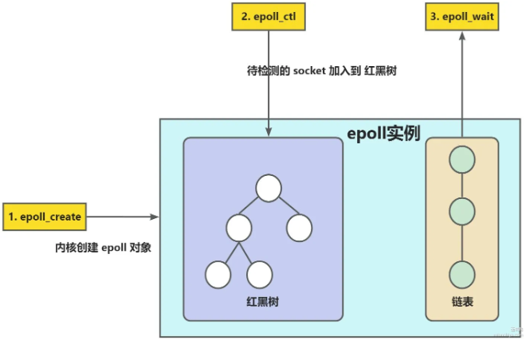

`epoll` 使用一个内核空间的事件列表，应用程序可以通过 `epoll_ctl` 向 `epoll` 实例注册、修改或删除感兴趣的文件描述符及其事件。

调用 epoll_wait 时，只会返回发生事件的文件描述符，而不是检查所有描述符。

**优势**:
1) 事件驱动模型: `epoll` 基于事件驱动，不再像 select 和 po11 那样需要线性扫描所有描述符。只有当注册的事件发生时，epoll 才会通知应用程序。
2) 边缘触发与水平触发:
- 水平触发 (LT,Level Triggered): 是默认模式，类似于 select/poll 的工作方式，只要文件描述符上有未处理的数据，每次调用 epoll_wait 都会返回该文件描述符
- 边缘触发 (ET,EdgeTriggered): 仅在状态发生变化时通知一次，需要用户在事件发生时读取所有数据，否则可能会错过后续事件。减少了重复事件通知的次数，但增加了编程的复杂度，通常需要结合非阻塞 I/O 使用。
3) 内存映射: `epoll` 通过内存映射 (mmap) 减少了在内核和用户空间之间的数据复制，进一步提高了性能。

**底层逻辑**

epoll的两大核心数据结构：

1) **红黑树** (用于管理注册的文件描述符):
`epoll` 通过一棵红黑树来存储和管理注册到 `epoll` 实例中的文件描述符。红黑树的特性使得在插入、删除、查找文件描述符时，操作的时间复杂度为 O(logN), 其中 N 是是注册的文件描述符数量。
每次调用 epoll_ctl 添加 (EPOLL_CTL_ADD)、修改 (EPOLL_CTL_CTL_MOD) 或删除 (EPOLL_CTL_DEL) 文件描述符时，都会对这棵红黑树进行操作，以维护文件描述符和其感兴趣事件的对应关系。
2) **就绪事件链表** (用于存储触发的事件):
`epoll` 使用一个双向链表 (就绪列表) 存储所有发生了事件变化的文件描述符。当某个文件描述符上的事件就绪 (如可读、可写) 时，`epoll` 会将该文件描述符添加到家优绪链表中。
当调用 `epoll_wait` 时，系统会检查这个链表，并将其中就绪的文件描述符返回给用户。由于只需要遍历就绪的文件描述符，`epoll_wait` 的性能与注册的文件描述符总数无关，而是与就绪的描述符数目相关。

**操作流程**

1) 创建 epoll 实例 (epoll_create):
`epoll_create` 调用会在内核中创建一个 `epoll` 实例，分配相应的数据结构，并返回一个 epoll 文件描述符。此时，内核会分配一棵红黑树用于管理文件描述符，以及一个就绪事件的链表。

2) 注册、修改、删除事件 (`epoll_ctl`): 
epoll_ctl 是 epoll 是 epoll 用于管理文件描述符与事件关系的接口，它有三种操作模式:
- EPOLL_CTL_ADD: 将一个文件描述符添加到 epoll 实例中，并指定关注的事件类型 (如 EPOLLIN, EPOLLOUT等)。这个操作会将文件描述符和相关事件添加到红黑树中。
- EPOLL_CTL_MOD: 修改已经注册的文件描述符的事件类型，这会更新红黑树中的相应节点。
- EPOLL_CTL_DEL: 将文件描述符从 epoll 实例中移除，这会从红黑树中中删除对应的节点，并清理关联的数据。

调用epoll_ctl将fd注册到epoll实例内核将fd添加到红黑树管理，记录关注事件的类型。

3) 调用等待事件 (epoll_wait):
调用 `epoll_wait` 时，内核会检查就绪事件链表，将链表中所有就绪的文件描述符返回给用户空间。
如果就绪链表为空，`epoll_wait` 会将调用线程挂起，直到有新的事件发生或超时时间到达为止。
`epoll_wait` 的高效性主要得益于它返回的是已经发生事件的文件描述符，而不是遍历所有注册的文件描述符。

## 🚀 为什么网络I/O会被阻塞？

#### 💡 网络I/O被阻塞的原因是什么？

**网络 I/O 会被阻塞**是因为在进行网络数据传输时，操作系统在等待数据的发送或接收完成之前，会将进程挂起，直到数据传输完成后才恢复进程执行。

阻塞的主要原因是:
- 等待数据到达或发送完成：当进程尝试从网络套接字中读取数据时，如果数据尚未到达，操作系统会使进程进入阻塞状态，直到数据到达为止。同样，当数据未能立即发送出去时，发送操作也可能被阻塞，等待缓冲区有空闲空间。
- 系统资源有限：当系统资源 (如网络缓冲区、连接数等) 被占满时，进步的 I/O 请求可能会被阻塞，等待资源释放后才能继续。
- 默认的阻塞行为：大多数网络 API (如 recv、send、accept等) 在默认情况下都是阻塞的，即调用这些 API 时，如果条件不满足，会使调用者等待，直到 I/O 操作完成。

#### 🧠 从 socket通信看 I/O 阻塞

> ###### 创建socket

首先服务端需要先创建一个 socket。在 Linux 中一切都是文件，那么创建的 socket 也是文件，每个文件都有一个整型的文件描述符 (fd) 来指代这个文件。

```c++
/**
 *@param   domain: 这个参数用于选择通信的协议族，比如选择 IPv4 通信，还是 IPv6 通信等等
 *@param   type: 选择套接字类型，可选字节流套接字、数据报套接字等等。
 *@param   protocol: 指定使用的协议。
*/
int socket (int domain, int type, int protocol);
```
这个 protocol 通常可以设为 0, 因为由前面两个参数可以推断出所要使用的协议。
比如 socket (AF_INET,SOCK_STREAM,0), 表明使用 IPV4, 且使用字节流套接字，可以判断使用的协议为 TCP 协议。
这个方法的返回值为 int, 其实就是创建的 socket 的 fd。

> ###### bind

现在我们已经创建了一个 socket, 但现在还没有地址指向这个 socket
众所周知，服务器应用需要指明 IP 和端口，这样客户端才好找上门来要服务，所以此时我们需要指定一个地址和端口来与这个 socket 绑定一下。

```c++
/**
 *@param   sockfd: 创建的socket的fd
 *@param   addr: 存储要绑定的IP 地址和端口号。
 *@param   addrlen: addr 结构体的实际长度
*/
int bind (int sockfd, const struct sockaddr *addr, socklen_t addrlen);
```

参数里的 sockfd 就是我们创建的 socket 的文件描述符，执行了 bind 参数之后我们的 socket 距离可以被
访问又更近了一步。

> ###### listen

执行了 socket、bind 之后，此时的 socket 还处于 closed 的状系态，也就是不对外监听的，然后我们需要调用 listen 方法，让 socket 进入被动监听状态，这样的 socket 才能够监听到客户端的连接请求。

```c++
/**
 *@param   sockfd: 创建的socket的fd
 *@param   backlog: 已完成连接的队列大小(全连接，不包括半连接)
*/
int listen (int sockfd, int backlog);
```

> ###### accept

现在我们已经初始化好监听套接字了，此时会有客户端连上来，然后我们需要处理这些已经完成建连的连接。从上面的分析我们可以得知，三次握手完成后的连接会被加入到已完成连接队列中去。

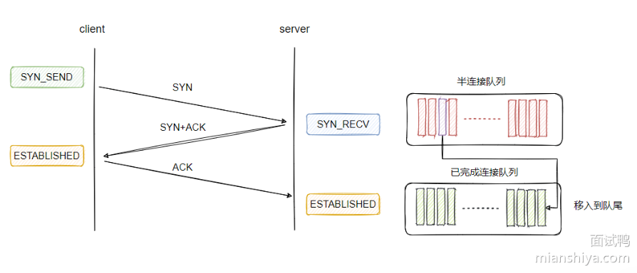

这时候，我们就需要从已完成连接队列中拿到连接进行处理，这个拿取动作就由 accpet 来完成。

```c++
int accept(int sockfd, struct sockaddr *addr, socklen_t *addrlen)
```

这个方法返回的 int 值就是拿到的已完成连接的 socket 的文件描述符，之后操作这个 socket 就可以进行通信了。

如果已完成连接队列没有连接可以取，那么调用 accept 的线程会**阻塞等待**。

**以上是服务端的通信流程，下面是客户端的通信流程。**

> ###### connect

客户端同样也要调用socket()创建socket，并与服务端建立连接，在TCP写一下进行三次握手操作。

客户端创建完`socket`并调用`connect`后连接处于`SYN_SEND`状态，当收到服务端`SYN+ACK`后，连接成为`ESTABLISHED`状态，三次握手完毕。

```c++
int connect(int sockfd, const struct sockaddr *addr, socklen_t addrlen);
```

调用`connect`需要指定远程的地址和端口进行建连，三次握手完毕之后就可以开始通信了。客户端这波不需要调用bind操作，默认会选择源IP和随机端口。

两个阻塞点：
`connect`：需要阻塞等待三次握手的完成
`accept`: 需要等待可用的已完成的连接，如果已完成的连接队列为空，则被阻塞

> ###### read, write

连接建立成功后，就开可用发送和接受消息了。

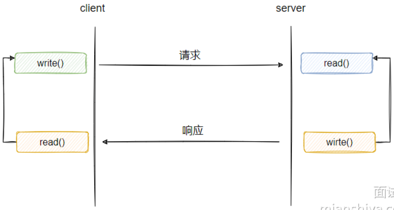

read 为读数据，从服务端来看就是等待客户端的请求，如果客户端不发请求，那么调用 read 会处于阻塞等待状态，没有数据可以读，这个应该很好理解。

write 为写数据，一般而言服务端接受客户端的请求之后，会进行一些些逻辑处理，然后再把结果返回给客户端，这个写入也可能会被阻塞。

这里可能有人就会问 read 读不到数据阻塞等待可以理解，write 为什么还要阻塞，有数据不就直接发了吗？因为我们用的是 TCP 协议，TCP 协议需要保证数据**可靠地、有序地传转输，并且给予端与端之间的流量控制**。

所以说发送不是直接发出去，它有个发送缓冲区，我们需要把数据先拷贝到 TCP 的发送缓冲区，由 TCP 自行控制发送的时间和逻辑，有可能还有重传什么的。

如果我们发的过快，导致接收方处理不过来，那么接收方就会通过 TCP 协议告知：别发了！忙不过来了。发送缓存区是有大小限制的，由于无法发送，还不断调用 write 那么缓存区就满了，满了就不让你 write 了，所以 write 也会发生阻塞。

综上，read 和 write 都会发生阻塞。

#### 🔍 网络I/O被阻塞的常见场景有哪些？

**连接的阻塞**:
- **accept () 阻塞**：服务器在调用 accept() 时，会阻塞在这个调用上，直到有新的客户端连接请求到来。此时，服务器进程会等待客户端的连接，无法继续执行其他操作。
- **connect () 阻塞**：客户端在调用 connect() 尝试连接服务器时，如果果连接不能立即建立 (如服务器响应慢或网络不通畅),connect() 会阻塞，直到连接成功或超时。

**数据传输的阻塞**:
**recv() 和 read() 阻塞**：当使用这些函数从套接字中读取数据时，如果缓冲区中没有数据 (如对方尚未发送数据), 进程会被阻塞，直到数据到达。
**send () 和 write ()阻塞**：当缓冲区已满 (如网络拥塞或对方接收缓慢), 数据无法立即写入时，send() 或 write() 会阻塞，等待缓冲区有空闲空间时再发送数据。

## 🚀 什么是用户态和内核态？

#### 💡 两者的区别和特点是什么？

用户态 (UserMode) 和内核态 (Kernel Mode) 是操作系统中的两种运行模式，用于区分应用程序与操作系统内核的操作权限。

两者的区别在于**权限级别**:

**用户态：**应用程序在用户态下运行，权限较低，**不能直接访问硬件或进行特权操作**。应用程序需要通过系统调用与内核进行通信，由内核代为执行敏感操作。用户态的优势是安全性高，即使程序出现问题也不会影响操作系统的稳定性。

**内核态：**内核态是操作系统内核运行的模式，具有最高的权限，可以**直接访问硬件资源和执行各种特权操作** (如内存管理、进程调度)。当程序执行系统调用或硬件中断时，操作系统会将其切换到内核态。

**用户态和内核态的空间**：
在对内存资源的使用上，操作系统对用户态和内核态也做了限制，每个进程创建都会分配虚拟空间地址，进程的内存结构如下：

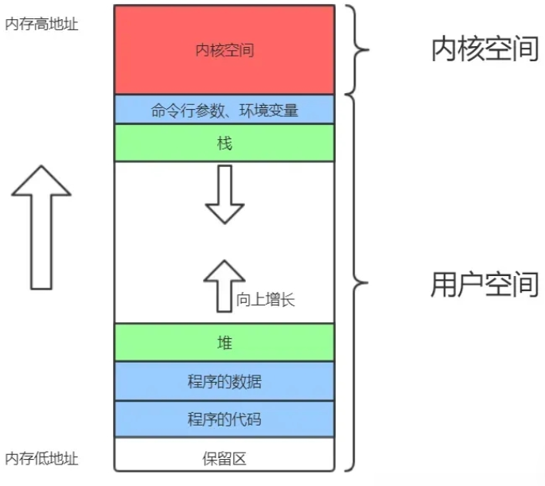

内核态的地址空间存放整个内核的代码、所有内核模块及内核维护的数据，所有进程的内核态逻辑地址是共享一块内存地址。内核态可用操作全部范围的虚拟空间地址，并且属于内核态的高位虚拟空间地址必须由内核态操作。

**由此可见，操作系统不仅从指令集权限区分了用户态和内核态，还限制了内存资源的使用**。

#### 🔍 操作系统的保护模式是什么？

操作系统中通常采用**保护模式** (Protection Mode) 来实现用户态和内核态的区分。现代 CPU (如 x86 架构) 支持多级特权模式 (Ring0 到 Ring3), Ring0 对应内核态，具有最高权限，Ring3 对应用户态，具有最低权限。操作系统利用这些模式来保护内核代码和数据，防止用户态程序的非法访问。

#### 🔣 微内核和宏内核的区别是什么？

**微内核** (Microkernel): 尽量将大部分操作系统功能移至用户态，仅保留最基础的功能 (如进程间通信、内存管理) 在内核态中。优点是系统更稳定、模块化，但切换频繁，性能不如宏内核。
**宏内核** (Monolithic Kernel): 大部分操作系统服务在内核态中运行，包括文件系统、驱动程序等。优点是性能高，因为减少了用户态与内核态之间的切换，但可能增加系统的复杂性和维护难度。

#### 📌 上下文切换的机制？

在用户态和内核态之间切换时，操作系统会执行**上下文切换**，包括保存当前进程的寄存器、状态和堆栈等信息，并加载内核态的状态以处理系统调用。上下文切换的**成本较高**，所以优化系统性能时，需要减少不必要的系统调用和态切换。

**用户态切换到内核态的过程**：
1. 保留用户态现场 (上下文、寄存器、用户栈等)
2. 复制用户态参数，用户栈切到内核栈，进入内核态
3. 额外的检查 (因为内核代码对用户不信任)
4. 执行内核态代码
5. 复制内核态代码执行结果，回到用户态
6. 恢复用户态现场 (上下文、寄存器、用户栈等)

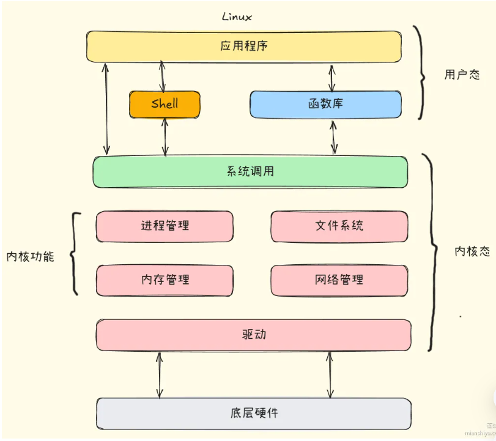
由linux架构图可见，内核提供了系统调用的通用访问接口，库函数通过频闭这些底层实现细节对操作系统调用进行封装，提供了简单的基本接口进行开发。

**什么时候会导致从用户态切换到内存态？**
- 系统调用：用户态进程主动切换到内核态的方式，如fork()
- 异常：CPU执行用户态进程时，发生没有预知的异常，切换到处理此异常的内核相关进程中
- 中断：当 CPU 在执行用户态的进程时，外围设备完成用户请求的操作后，会向 CPU 发出相应的中断信号，这时 CPU 会暂停执行下一条即将要执行的指令，转到与中断信号对应的处理
程序去执行，也就是切换到了内核态。如硬盘读写操作完成，系统会切换到硬盘读写的中断处理程序中执行后边的操作等。

#### 🧠 设计用户态和内核态的原因？

**安全性**：用户态和内核态的划分确保了普通应用程序无法直接访问硬件资源或执行敏感操作，避免了程序或用户恶意操作对系统核心的破坏。例如，防止应用程序随意读写内存或控制硬件设备，保护了操作系统和其他应用的安全。
**稳定性**：通过在内核态中运行关键系统服务 (如内存管理、文件系统、设备驱动等), 操作系统可以对资源进行集中管理和保护。如果某个应用程序崩溃，只会影响用户态中的进程，不会影响到整个系统。
**访问控制**：通过设置不同的权限级别，操作系统能够更好地控制对资源的访问。只有在内核态下，操作系统才有权对硬件资源进行操作，而用户态程序必须通过系统调用请求内核服务，这种设计确保了对系统资源的统一管理。
**性能优化**：虽然用户态和内核态的切换有一定开销，但这种设计可以减少用户程序直接操作硬件带来的复杂性，避免频繁的资源争夺和死锁问题，从而提升系统的整体性能

## 🚀 什么是软中断，硬中断？

#### 💡 什么是中断？什么是软硬中断？

操作系统中的中断（Interrupt） 是指硬件或软件发出的一种信号，用于通知 CPU 暂停当前正在执行的任务，转而去处理更紧急或更重要的事件。

**软中断**和**硬中断**是操作系统处理外部或内部事件的两种中断方式:

- **硬中断** (Hardware Interrupt): 是由硬件设备 (如键盘、网络卡、定付器等) 触发的中断信号。当硬件设备需要与 CPU 交互 (如数据传输完成、定时中断等), 会通过硬中断通知 CPU。硬中断具有高优先级，通常会立即打断当前执行的程序，进行中断处理。
- **软(件)中断** (Software Interrupt): 是由软件 (程序) 触发的中断元，通常是通过执行特定指令 (如 int 指令) 或系统调用产生的。软中断用于在程序运行中请求操作系统的服务，如文件读写、进程调度等。软中断的优先级一般低于硬中断。

#### 🔍 软硬中断的详细解释？

> ###### 硬中断

硬中断由外部硬件设备发出。设备通过硬件控制器 (如中断控制器) 向 CPU 发送中断信号，通知它完成了某些操作或需要处理的事件 (如键盘按键、网络数据到达等)。

每个硬中断都有一个对应的中断向量，中断向量表存储了各个中断处理程序的入口地址。CPU 接收到硬中断信号后，通过中断向量表找到对应的中断处理程序。

**处理过程**:
- 当硬中断发生时，CPU 会保存当前执行的上下文，并跳转到中断处理程序。
- 中断处理程序处理完成后，会恢复被中断的程序的上下文，并继续执行。

不同的硬中断有不同的优先级，中断控制器负责管理和调度这些中断，优先处理高优先级的中断信号。例如，定时器中断通常优先级较高，用于维持系统的时间片调度。

**举例**:网卡接收数据，键盘按键输入，磁盘I/O

> ###### 软中断

软(件)中断是由程序或操作系统内部生成的。它们通常是由程序员在代码中显式调用中断指令 (如 int 指令) 或通过系统调用触发的，用于请求操作系统执行特定服务。

比如程序需要操作系统的服务 (如文件操作、网络通信等) 时，会触发软中断进入内核态，执行对应的系统调用。

或者当程序运行中出现除零错误、非法内存访问等情况时，也会触发软中断进入异常处理程序。

操作系统也可以通过软中断来进行任务切换和进程调度。例如，在时间片轮转调度中，操作系统可能会使用定时器产生硬中断，然后通过软中断来触发进程的切换。

**举例**:系统调用（访问文件或网络），程序异常(执行错误或遇到特殊条件)

#### 📌 软硬中断的区别？

**触发方式**:
- 硬中断由外部硬件触发。
- 软中断由软件指令或程序逻辑触发。

**优先级**:
- 硬中断通常具有更高的优先级，会立即打断当前执行的任务进行处里。
- 软中断通常在硬中断处理完成后，操作系统根据优先级和调度策略进行处理

**应用场景**:
- 硬中断用于实时性要求高的事件，如定时器中断、设备数据接收等。
- 软中断用于程序请求操作系统服务或处理内部异常。

#### 🧠 SoftIRQ软中断？

上述的软中断实际上称为软件中断比较合适，因为操作系统中有软中断 (SoftIRQ) 的概念，两者还是有所区别的。

软中断 (SoftIRQ) 是 Linux 内核中用于延迟处理部分中断任务的机制，属于中断处理的下半部。由于硬中断处理程序 (上半部) 需要尽可能短暂，以减少对系统的影响，因此将些耗时的工作延迟到软中断中执行。

即硬中断处理程序触发，然后内核在适当的时候调度执行。

内核维护一个软中断向量表，包含不同类型的软中断 (如网络接收、网络发送、定时器等)。当需要触发软中断时，内核将相应的软中断标记为待处理状态，并在稍后的时间点 (如在中断上下文退出时或在内核的调度点) 执行这些软中断处理程序。

软中断 (SoftIRQ) 和软件中断 (Software Interrupt) 的区别如下:
- **触发源不同**：软件中断由用户程序通过指令触发；软中断通常由硬中断处理程序在内核中触发。
- **目的不同**：软件中断用于实现系统调用，提供用户态与内核态的接口；软中断用于延迟处理需要较长时间的中断任务，减少硬中断处理时间。
- **执行上下文不同**：软件中断导致从用户态切换到内核态；软中断在内核态执行，不涉及用户态。

**举例**:网络数据包处理，设备I/O处理

## 🚀 什么是分段，什么是分页？

#### 💡 分段和分页的概念是什么？

**分段 (Segmentation) 和分页 (Paging)**是操作系统中用于内存管理的两种方式，目的是提高内存利用率并简化程序的管理。

**分段** (Segmentation):
- 是一种根据程序逻辑结构划分内存的方式，例如将程序分为若干个段 (如代码段、数据段、堆栈段等), 每个段有独立的段号和段内偏移量。
- 每个段可以有不同的大小，段的长度取决于程序的实际需求，段与段之间可能不连续。
- 分段管理提供了一种更贴近程序结构的内存管理方式，有助于提高程序的可读性和维护性。

**分页**(Paging):
- 是一种将物理内存和逻辑内存划分为固定大小的页 (Page) 和页框 (Frame) 的方式，每个页和页框的大小相同。
- 逻辑地址空间被划分为若干个固定大小的页，物理内存则被划分为相同大小的页框，页通过页表映射到页框。
- 分页管理解决了内存碎片问题，但程序的逻辑结构和内存的物理结构不再一致。

#### 🔍 分段和分页的详细解释？

> ###### 分段的详细解释

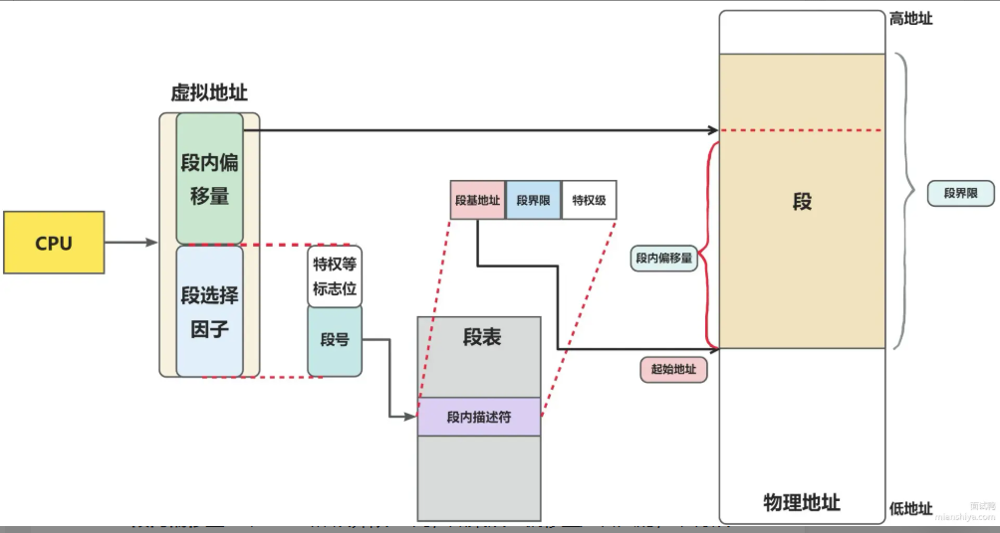

分段是基于程序的逻辑结构进行内存管理的，每个段代表不同的程序模块，如代码段(存放程序代码)、数据段 (存放全局变量和静态变量)、堆栈段 (用于函数调用栈)等。

逻辑地址由段号和段内偏移量组成，CPU 在访问内存时需要根据段表将段号映射到对应的物理地址。

**段表**：
- 分段使用段表 (SegmentTable) 来记录每个段的基址和长度。段表的每个条目对应一个段，存储段的起始地址 (基址) 和段的大小。
- 在地址转换时，CPU 通过段号在段表中查找段基址，并加上段内偏移量，得到实际的物理地址。

**分段的优点**:
- 与程序的逻辑结构一致，便于编译器和程序员理解。
- 每个段可以独立增长，不会影响其他段的大小。
- 支持动态内存分配，例如，数据段可以在运行时增大。

**分段的缺点**:
- 易产生**外部碎片**：由于段的大小不固定，段之间可能会出现未使用的小块内存空间。
- 复杂性高：段表的管理和维护比较复杂，尤其在段数量较多时。

> ###### 分页的详细解释

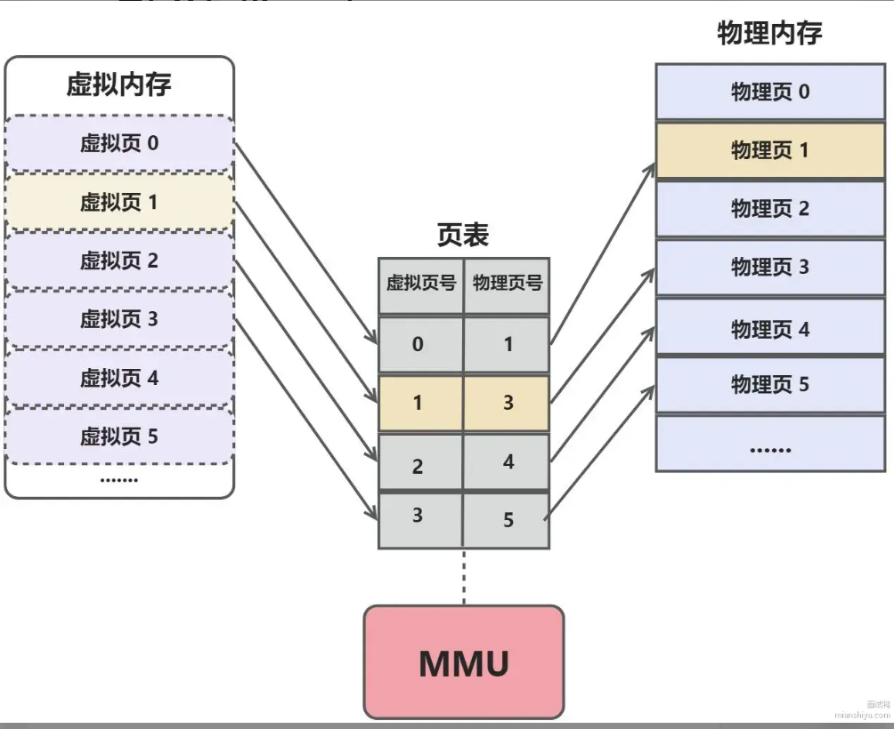

分页是一种固定大小的内存分配方式，将内存分割成等大小的页 (Page) 和页框 (Frame)。每个页和页框的大小相同，通常为 4KB 或 2MB。页与页框之间通过页表进行映射，程序访问内存时通过页表查找页对应的物理页框。

**页表**:
- 页表 (Page Table) 是分页机制中用于记录逻辑页到物理页框映射关系的数据结构。每个页表条目 (PTE, Page Table Entry) 存储一个逻辑页在物理内存中的位置。
- 页表的结构可以是单级页表、二级页表或多级页表，较大的地址空间通常使用多级页表以节省内存。

**分页的优点**：
- 解决外部碎片问题：由于页和页框大小固定，可以有效避免分段方式中段间未使用内存造成的外部碎片问题。
- 内存管理灵活：页表支持页的按需加载和交换 (如虚拟内存机制), 可以将不常用的页交换到磁盘上，从而扩大进程的可用内存空间。

**分页的缺点**:
- 内部碎片：如果程序使用的内存量不足一个页的大小，会造成页内未使用部分的浪费，即内部碎片问题。
- 页表管理开销大：每个进程都需要维护自己的页表，页表的大小与逻辑地址空间成正比。多级页表虽然节省了内存，但增加了地址转换的复杂性。

> ###### 分段分页的结合使用

一些操作系统 (如 x86 架构下的 Linux) 结合使用分段和分页进行内存管理。内存首先根据程序的逻辑结构划分为段，每个段再按照分页的方式进一步划分。

这种方式既利用了分段的逻辑性，又利用了分页的固定大小的页框，有效地避免了外部和内部碎片的影响。

**优点**:
- 灵活性更高，可以根据应用需求调整段的大小和页的大小，适应不同的的内存管理需求。
- 提供了程序逻辑上的模块化管理，同时可以使用分页机制实现虚拟内存

#### 📌 分段和分页的对比？

**管理单位**:
- 分段的管理单位是段，段大小不固定，且与程序的逻辑结构相关。
- 分页的管理单位是页，页大小固定，与程序的逻辑结构无关。

**地址空间的组成**:
- 分段中的逻辑地址由段号和段内偏移量组成，适合按模块组织的程序。
- 分页中的逻辑地址由页号和页内偏移量组成，适合简单的内存分配和管理

**碎片问题**:
- 分段存在**外部碎片**，段的大小不固定，可能在段与段之间产生未使用的内存空隙。
- 分页存在**内部碎片**，由于页的大小固定，页内未使用的部分会造成内存浪费。

#### 👂 分页与虚拟内存的关系

**虚拟内存**：分页是实现虚拟内存的重要手段，虚拟内存允许程序使用比物理内存更大的逻辑地址空间。操作系统通过**页表将虚拟地址映射到物理地址**，实现按需加载和页面置换。
**页面置换算法**：当物理内存不足时，操作系统会将不常用的页置换到磁盘中，并在需要时重新加载。常见的页面置换算法有**LRU (最近最少使用)**、**FIFO (先进先出)** 等。

## 🚀 为什么要有虚拟内存？

#### 💡 有虚拟内存的原因是什么？

虚拟内存的主要作用是**提升系统效率和简化内存管理**。
1) 内存扩展能力:
- 虚拟内存允许程序运行在比实际物理内存大的地址空间上。即使物理内存不足，系统也可以通过交换 (swapping) 将不常用的内存页移到磁盘中，使得多个程序能够同时运行。
2) 进程隔离:
- 每个进程拥有独立的虚拟地址空间，防止进程间的内存访问冲突，提高系统稳定性和安全性。
- 使用虚拟内存，操作系统可以通过页面表设置访问权限，防止非法访问。
3) 简化内存管理:
- 操作系统可以更灵活地分配和回收内存，无需手动考虑物理内存布局问题。
- 虚拟内存可以将程序逻辑地址与物理地址解耦。

#### 🔍 虚拟内存的执行原理是什么？

> ###### 逻辑地址与物理地址的映射：

每个进程生成的逻辑地址需要经过地址翻译，映射到实际的物理内存地址。地址翻译由硬件中的内存管理单元 (MMU) 完成。

具体过程是:
1. CPU 生成逻辑地址。
2. MMU 根据页表将逻辑地址分解为页号和页内偏移量。
3. MMU 查找页表，找到对应页号的物理地址。
4. 合并物理页号与偏移量，生成最终的物理地址。

如果页表项未命中 (Page Fault), 操作系统将从磁盘中加载相应的页面。

> ###### 页表管理与多级页表：

页表记录逻辑地址与物理地址的映射关系，但大型程序需要的页表非常大。现代系统使用多级页表来减少内存占用。比如，Linux 中采用四级或五级页表结构。

> ###### 交换(Swapping)

当物理内存不足的时候，操作系统将不常用的页面移到磁盘的交换区，释放内存给活跃的程序使用。

Page Fault处理过程：
- CPU 中断触发，保存上下文
- 操作系统从页表中判断所需页面位置
- 将页面从磁盘加载到内存，并更新页表
- 恢复上下文，继续执行

> ###### 写时复制 (Copy On Write)：

当多个进程共享相同的页内存时，只在发生写操作的时候才复制页面，这样可用显著减少内存占用。

> ###### 虚拟内存与缓存一致性

虚拟内存引入了TLB(Translation Lookaside Buffer)，用于加速逻辑地址到物理地址的映射

TLB是CPU缓存的一部分，存储最近使用的页表项，若TLB缺失，会触发页表查找。

## 🚀 到底什么是Reactor?

#### 💡 Reactor是什么？Reactor是如何工作的？

Reactor 是一种用于处理**并发I/O事件**的设计模式，特别适合于网络服务器的开发。它通过事件驱动机制和非阻塞I/O, 能够高效地处理大量并发连接。

Reactor 模式的核心思想是**将I/O事件与相应的处理程序解耦**，并通过**事件分发器** (Event Demultiplexer) 来管理事件和响应操作。

**Reactor 的工作方式**:
- 事件驱动：Reactor 通过监听多个事件源 (如Socket连接、读写事件), 在有事件发生时调用对应的处理程序(Handler)。
- 非阻塞 I/O: 使用非阻塞 I/O 模型，Reactor 能够在单个或少数线程中高效处理大量 l/O 操作，避免了线程的频繁切换。
- 事件分发与处理：Reactor 会将收到的事件 (如连接到达、数据可读数据可写) 分发给相应的事件处理器，处理器对事件进行处理。

#### 🔍 Reactor的结构与组件

**核心组件**:
- Reactor (事件反应器): 负责等待和分发事件。它通常封装了一个多路复用器 (如 select、epoll), 在事件到达时将其分发给相应的**事件处理器**。
- Handler (事件处理器): 每个事件处理器与一个具体的 I/O 事件续那定，如读、写、连接等。Handler 定义了在事件发生时应该执行的逻辑。
- Acceptor: 在服务器端，Acceptor用于接受新的客户端连接，并为每个新连接分配一个 Handler 进行后续的数据处理。

**工作流程**:
1. Reactor 通过多路复用器监听多个通道 (如 SocketChannel), 等待事件 (如连接到达、数据可读等) 的发生。
2. 当某个通道有事件发生时，Reactor 将事件分发给相应的 Handler。(如果事件是新连接请求，Reactor分发的事件会交给Accepter处理，即接收连接，创建新通信套接字，分配Handler；如果事件发生在已建立通信套接字上，Reactor分发事件会交给普通的I/O Handler处理)
3. Handler 根据事件类型执行相应的操作，如读取数据、写入数据或处理业务逻辑。
4. 事件处理完成后，Reactor 继续监听其他事件。

#### 📌 Reactor模式与Proactor模式区别

**Reactor 模式**:
- Reactor 是**同步非阻塞**的，事件的处理由应用程序本身完成，Reactor 只是负责事件的分发和响应。
- 当事件发生时，Reactor 通知相应的 Handler 进行读写操作，Handler 在操作完成后进行处理。
- 适用于需要精细控制 I/O 操作的场景，如需要自己管理缓冲区的读取和写入。
**Proactor 模式**:
- Proactor 是**异步非阻塞**的，事件的处理由操作系统或 l/O 库完成，应用程序只在操作完成后处理结果。
- 应用程序发出异步 i/o 请求后，操作系统在完成 l/O 操作后调用回调函数或事件处理器。
- 适用于操作系统或平台支持异步 l/O 操作的场景，如 Windows 的 IOCP

#### 📌 单Reactor和多Reactor模型

**单 Reactor 单线程**:
- Reactor、事件处理和事件监听都在一个线程中进行。
- 实现简单，但不适合高并发场景，因为在高负载下，单个线程容易成为瓶颈。
**单 Reactor 多线程**:
- Reactor 在主线程中监听事件，每当有事件发生时，将事件分发给工作线程池处理。
- 适用于中等并发场景，可以在一定程度上提升并发处理能力。
**多 Reactor 多线程**:
- 使用多个 Reactor 实例，每个 Reactor 管理一部分连接，并通过过多线程处理事件。
- 适用于大规模并发场景，如需要处理成千上万的并发连接时，通过多个 Reactor 实例分担负载，可以提高系统的伸缩性。

#### 🔣 Reactor模式实际应用案例

**Nginx**:Nginx 使用了类似 Reactor 模式的架构，通过事件驱动和非阻塞 I/O 实现高并发请求的处理。它使用`epoll`(在 Linux 上) 来监听多个连接的状态变化，实现了单线程高效处理大量并发请求

**Java 的 Netty 框架**：Netty 基于 Reactor 模式，通过 EventLoop 和 Channe1 的结合，实现了高效的网络数据传输和处理。在 Netty 中，EventLoopGroup 负责事件的监听和分发，适合构建高性能的 TCP/UDP 服务器。

**Node.js**: Nodejs 是基于事件驱动的 JavaScript 运行环境，它的底层机制也使用了类似 Reactor 的模式，通过事件循环和非阻塞 I/O, 实现了单线程处理高并发的能力。通过合理使用 Reactor, 可以减少 I/O 操作中的阻塞等待，提高系统的吞吐量和响应速度。

#### 🧠 更深入了解一下Reactor

Reactor算是一种编程模式或架构模式，常用在服务端网络通信相关的模块，**其核心思想是针对不同事件需要有不同的处理逻辑，能一对多地根据不同请求做出不同的响应实现**。

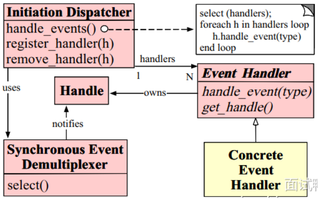

1. 首先通过 Initiation Dispatcher 的 register_handler(h) 方法注册 Event Handler 实例。
2. Synchronous Event Demultiplexer 通过 select() 监测事件，当事件发生（由 Handle 通知），Initiation Dispatcher 被触发，调用 handle_events() 。
3. handle_events() 方法会调用 select(handlers) 选取已注册的 Event Handler ，并在循环中依次调用每个 Event Handler 的 handle_event(type) 方法，从而让具体的Concrete Event Handler 来处理相应事件。

## 🚀 说下你常用的Linux命令？

#### 💡 按照不同的分类，有哪些linux命令？

> ###### 文件与目录操作:
`1s`: 列出当前目录的文件和子目录，常用参数如 `-l` (详细信息)、`-a` (包括隐藏文件)。
`cd`: 切换目录，用于在文件系统中导航。
`mkdir`: 创建新目录。
`rm`: 删除文件或目录，用于删除文件时加上 `-f` 参数，删除目录时加上 `-r` 参数。
`cp`: 复制文件或目录，`cp -r` 用于递归复制目录。
`mv`: 移动或重命名文件或目录。

> ###### 文件内容查看:
`cat`: 查看文件内容，常用于查看小型文本文件。
`more/less`: 分页直看文件内容，`less` 支持向上翻页，适合查看大文件。
`tail`: 查看文件末尾的若干行，tail -f 用于实时监控文件内容变化，如日志文件。
`head`: 查看文件的开头几行。

> ###### 系统管理:
`ps`: 显示当前运行的进程列表，`ps aux` 可以查看所有用户的进程。
`top/htop`: 实时查看系统中的进程状态和资源使用情况。
`kill/killall`: 终止进程，kill 后跟进程 ID,killall 后跟进村程名。
`df`: 显示文件系统的磁盘使用情况。
`du`: 统计目录或文件所占用的磁盘空间，`du -h` 以人类可读的格式显示。

> ###### 网络配置与调试:
`ping`: 测试与目标主机的连通性。
`ifconfig/ip`: 查看和配置网络接口信息，`ifconfig` 已逐渐被 `ip` 命令替代。
`netstat/ss`: 查看网络连接和端口使用情况，`ss` 是 `netstat` 的替代品，提供更详细的信息。
`curl/wget`: 发送 HTTP 请求或下载文件，`curl` 更适合进行 API 调试，`wget` 则用于下载文件。

> ###### 文件权限与用户管理:
`chmod`: 修改文件或目录权限，常用模式如 `chmod 755`。
`chown` : 更改文件或目录的所有者。
`useradd/userdel`: 添加或删除用户。
`passwd`: 修改用户密码。

#### 🔍 进阶命令？

*高效使用文件和目录操作命令*

```shell
find . -name "*.txt" # 查找当前目录下所有txt

grep "error" log.txt # 查找log.txt中包含error的行
```

*文件压缩与解压缩*

```shell
tar -czvf mydir.tar.gz mydir
tar -xzvf mydir.tar.gz

zip -r myfile.zip mydir
unzip myfile.zip
```

*进程管理与系统性能调优*

```shell
renice +10 1234 # 将进程ID为1234的进程优先级降低
```

*任务调度与自动化*

```shell
crontab -e # 定时执行任务

echo "/path/to/script.sh" | at 3pm # 下午三点定时执行任务
```

*监控与日志管理*

```shell
journalctl -b # 查看最新的系统启动日志

dmesg | grep sda # 查看硬盘相关信息
```

*网络调试的高级工具*

```shell
tcpdump src 192.168.1.100 # 捕获来着指定IP的数据包

nmap 192.168.1.1 # 扫描某个IP的开放端口
```

*数据流操作与管道*

```shell
awk '{sum += $2} END {print sum}' data.txt # 统计文件中某个字段的总和

sed 's/foo/bar/g' file.txt # 将file.txt中的foo替换为bar
```

```shell
ls -l | grep ".txt" # |管道将一个命令的输出作为下一个命令的输入，比如该例子筛选出ls的结果中的.txt文件
```