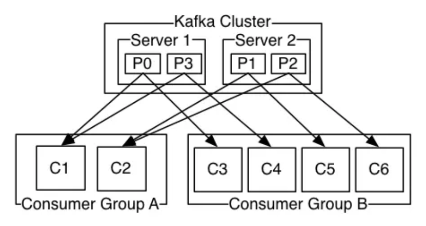

# 📚 消息队列 相关学习与整理

> 👋 本文介绍 [消息队列] 的相关知识、常见问题与总结。

---

## 📑 目录
- [📚 消息队列 相关学习与整理](#-消息队列-相关学习与整理)
  - [📑 目录](#-目录)
  - [🚀 消息队列场景](#-消息队列场景)
      - [什么是消息队列](#什么是消息队列)
      - [消息队列选型？](#消息队列选型)
      - [消息队列使用场景？](#消息队列使用场景)
      - [消息重复消费解决方法？](#消息重复消费解决方法)
      - [消息丢失是如何解决的？](#消息丢失是如何解决的)
      - [消息队列需要注意哪些问题？](#消息队列需要注意哪些问题)
      - [如何保证消息的可靠性顺序性？](#如何保证消息的可靠性顺序性)
      - [如何保证幂等写](#如何保证幂等写)
      - [如何处理消息积压问题](#如何处理消息积压问题)
      - [如何保证数据有一致性、事务消息如何实现？](#如何保证数据有一致性事务消息如何实现)
      - [消息队列是参考哪种设计模式？](#消息队列是参考哪种设计模式)
      - [如果让你写一个消息队列，你该如何进行架沟设计](#如果让你写一个消息队列你该如何进行架沟设计)
  - [🚀 RocketMQ](#-rocketmq)
      - [选择RocketMQ原因:](#选择rocketmq原因)
      - [RocketMQ和Kafka的区别是什么，如何选型？](#rocketmq和kafka的区别是什么如何选型)
      - [RocketMQ延时消息的底层原理](#rocketmq延时消息的底层原理)
      - [RocketMQ怎么处理分布式事务？](#rocketmq怎么处理分布式事务)
      - [RocketMQ如何保证消息顺序？](#rocketmq如何保证消息顺序)
      - [RocketMQ如何保证消息不被重复消费？](#rocketmq如何保证消息不被重复消费)
      - [RocketMQ消息积压了怎么办？](#rocketmq消息积压了怎么办)
  - [🚀 kafka](#-kafka)
      - [对kafka有什么了解吗](#对kafka有什么了解吗)
      - [kafka为什么这么快](#kafka为什么这么快)
      - [Kafka的模型介绍一下，是推送还是拉取？](#kafka的模型介绍一下是推送还是拉取)
      - [kafka如何保证顺序读取消息](#kafka如何保证顺序读取消息)
      - [kafka消息积压怎么办？](#kafka消息积压怎么办)
      - [kafka为什么一个分区只能由消费者组的一个消费者消费？这么设计的意义是什么？](#kafka为什么一个分区只能由消费者组的一个消费者消费这么设计的意义是什么)
      - [如果由一个topic，一个consumergroup，topic有十个分区，消费线程数和分区数的关系是怎么样的？](#如果由一个topic一个consumergrouptopic有十个分区消费线程数和分区数的关系是怎么样的)
      - [消息中间件如何做到高可用？](#消息中间件如何做到高可用)
      - [Kafka和RocketMQ消息确认机制有什么不同？](#kafka和rocketmq消息确认机制有什么不同)
      - [kafka和RocketMQ的broker架构区别？](#kafka和rocketmq的broker架构区别)
  - [🚀 RabbitMQ](#-rabbitmq)
      - [RabbitMQ的特性有哪些？](#rabbitmq的特性有哪些)
      - [RabbitMQ的底层架构是什么？](#rabbitmq的底层架构是什么)

## 🚀 消息队列场景

#### 什么是消息队列

本质就是个发消息，存消息，消费消息的转发中间件

#### 消息队列选型？

高吞吐量：Kafka，RocketMQ
多主题：RocketMAQ，RabbitMQ
分布式部署：Kafka，Rocket

#### 消息队列使用场景？

**解耦**：网网络调用方式改为使用MQ，项目之间耦合性，系统挂了也不会造成太多影响

**异步**：加快系统访问速度，提供更好用户体验

**削峰**：在流量高峰期时让系统按照自己最大消费能力去消费消息，保证稳定。

#### 消息重复消费解决方法？

MQ框架会避免处理重复消息如使用空间换时间，存储已处理过的message_id，给生产端提供幂等性发送消息的接口

消费端需要自己做控制，比如消费成功的消息在缓存或数据库中进行标识，每次处理前校验

#### 消息丢失是如何解决的？

**消息生产阶段**：取决于生产者逻辑，需要生产者提交消息给消息队列，接收ack确认响应后提交成功，正常是不会出现消息丢失的。

**消息存储阶段**：kafka使用时会部署一个集群，生产者发布消息时中间件会写入多个节点，也就是多个副本，即便其中一个挂了也能保证集群数据不丢失

**消息消费阶段**：消费者接收消息处理后才恢复ack则不会丢失，若收到后立即返回ack则若消息处理中途挂了则消息丢失。

#### 消息队列需要注意哪些问题？

消息的**可靠性**和**顺序性**

#### 如何保证消息的可靠性顺序性？

- 消息可靠性保证：

**消息持久化**：在系统崩溃重启或网络故障的情况下，未处理的消息不应丢失。例如RabbitMQ会将消息持久化到磁盘上。

**消息确认机制**：消费者处理消息后，应向队列发送确认。消息队列收到确认后才将消息从队列中移除。若没收到确认，则在一定时间后重新发送消息给其他消费者或同一消费者。

**消息重试策略**：消费者处理消息失败时，需要多次重试，若仍失败，可以将消息发送到死信队列，以便后续人工排查或采取特殊处理。

- 消息顺序性保证：

**有序消息处理场景识别**：明确哪些消息需要保证顺序，确保消费者和队列按照顺序处理。

**消息队列对顺序性支持**：部分消息队列提供顺序性保证支持。如kafka通过将消息划分到同一个分区来保证消息在分区内有序，消费者按分区顺序读取保证消息有序。

**消费者顺序处理**：消费者可以通过单线程或使用线程池对顺序消息进行串行化处理。

#### 如何保证幂等写

幂等性为：统一操作执行多次对系统的影响与执行一次一致

实现方法：
- 唯一标识：客户端为每个请求生成全局唯一ID服务端校验ID是否已经处理
- 数据库事务+乐观锁：通过版本号或状态字段控制并发更新，确保多次更新等同单次操作（适合场景数据记录更新，如订单状态变更）。
- 数据库唯一约束：利用数据库唯一索引防止重复数据写入（适合场景数据插入场景，如订单创建）
- 分布式锁：保证同一时刻仅有一个请求执行关键操作（适合场景高并发下的资源抢夺，如秒杀）
- 消息去重：生产者为每条消息生成唯一ID，处理前检查该消息是否处理过

#### 如何处理消息积压问题

先检查是否是bug

若不是，可以优化消费逻辑，如之前是一条一条处理消息，可以优化为**批量处理消息**，再进一步可以考虑**水平扩容，增加topic队列数和消费组机器数量**，提升消费能力

对于bug导致百万条消息积压几个小时，可以**临时紧急扩容**：
- 先修复consumer消费者的问题，以确保其恢复消费速度，然后将现有consumer 都停掉。
- 新建一个 topic，partition 是原来的 10 倍，临时建立好原先10倍的queue 数量。
- 然后写一个临时的分发数据的 consumer 程序，这个程序部署上去消费积压的数据，消费之后不做耗时的处理，直接均匀轮询写入临时建立好的 10 倍数量的 queue。
- 接着临时征用 10 倍的机器来部署 consumer，每一批 consumer 消费一个临时 queue 的数据。这种做法相当于是临时将 queue 资源和 consumer 资源扩大 10 倍，以正常的 10 倍速度来消费数据。
- 等快速消费完积压数据之后，得恢复原先部署的架构，重新用原先的 consumer 机器来消费消息。

#### 如何保证数据有一致性、事务消息如何实现？

普通的MQ消息流程：

- 生产者产生消息并发送给MQ服务器
- MQ收到消息后持久化到存储系统，返回ACK到生产者
- MQ将消息push到消费者
- 消费者消费完后返回ACK给MQ
- MQ收到ACK认为消费成功，删除存储中消息

如下订单这个方法，订单系统创建完订单后需要发送消息到下游系统，若订单创建成功但**没发出去**，下游没感知到，就会导致数据不一致问题。

因此，可以使用**事务消息**

流程如下：
- 生产者收到消息后发送一条半事务消息到MQ
- MQ收到消息后将其持久化到存储系统，该消息状态为半发送状态，返回ACK到生产者
- 生产者执行本地事务若执行成功则commit执行结果到MQ服务器，更新消息状态为可发送；失败则发送rollback，并删除此消息。
- 若消息可发送则MQpush给消费者，消费完后返回ACK；若MQ没有收到commit或rollback，则会反查生产者并查询最终状态

#### 消息队列是参考哪种设计模式？

主要参考观察者模式和发布订阅模式，两种设计模式的思路是一样的。

**观察者模式**
存在一个主题和多个观察者，发布消息时会通知各观察者，观察者会收到消息后做操作。

**发布订阅模式**
和观察者模式不同点在于，发布者和订阅者完全解耦，通过中间的发布订阅中心进行消息通知

#### 如果让你写一个消息队列，你该如何进行架沟设计

- **三大模块**。首先是消息队列的整体流程，producer发送消息给broker，broker存储好，broker再发送给consumer消费，consumer回复消费确认等。
- **网络框架**。producer发送消息给broker，broker发消息给consumer消费，那就需要两次RPC了，RPC如何设计呢？可以参考开源框架Dubbo，你可以说说服务发现、序列化协议等等
- **持久化方法**。broker考虑如何持久化呢，是放文件系统还是数据库呢，会不会消息堆积呢，消息堆积如何处理呢。
- **通信方式与数据处理**。消费关系如何保存呢？点对点还是广播方式呢？广播关系又是如何维护呢？zk还是config server消息可靠性如何保证呢？如果消息重复了，如何幂等处理呢？
- **集群服务**。消息队列的高可用如何设计呢？可以参考Kafka的高可用保障机制。多副本 -> leader & follower -> broker 挂了重新选举 leader 即可对外服务。
- **事件监听**。消息事务特性，与本地业务同个事务，本地消息落库;消息投递到服务端，本地才删除；定时任务扫描本地消息库，补偿发送。
- **伸缩性扩展性**。MQ的伸缩性和可扩展性，如果消息积压或者资源不够时，如何支持快速扩容，提高吞吐？可以参照一下 Kafka 的设计理念，broker -> topic -> partition，每个 partition 放一个机器，就存一部分数据。如果现在资源不够了，简单啊，给 topic 增加 partition，然后做数据迁移，增加机器，不就可以存放更多数据，提供更高的吞吐量了。

## 🚀 RocketMQ

#### 选择RocketMQ原因:

- 开发语言优势，使用Java，更容易上手和排查问题
- 社区氛围活跃
- 特性丰富，如顺序消息，事务消息，消息过滤，定时消息等特性丰富

#### RocketMQ和Kafka的区别是什么，如何选型？

**kafka**优缺点：
- 优点:具有高吞吐量，4CPU8G配置下，一台机器可以抗住几十万QPS，且支持支持集群部署。
- 缺点：kafka可能造成数据丢失，在接收到消息后不立即写入物理磁盘，而是会写入磁盘缓冲区。其功较为单一，主要支持收发消息，基本没有高级功能，因此使用场景受限。

**RocketMQ**优缺点：
- 优点：支持功能较多，延迟队列、消息事务等，高吞吐量，单机达到10万级，支持集群部署，线性扩展方便，且是Java语言开发，满足绝大多数公司技术栈。
- 缺点：性能相比kafka弱一点，因为kafka用到sendfile零拷贝技术，而rocketMQ主要是用mmap+write实现零拷贝。

#### RocketMQ延时消息的底层原理

- 延时消息不直接进入目标主题，而是先被发送到一个内置的延时主题（SCHEDULE_TOPIC_XXXX），并根据延时级别（如 1s、5s、10s 等预设等级）分配到对应分区（每个分区对应一个延时别）。
- Broker 内部有一个定时线程池，定期（默认每 1ms）扫描延时主题的各个分区，检查消息的「投递时间」（发送时间 + 延时时间）是否已到达。
- 当检测到消息到达投递时间时，Broker 会将消息从延时主题中取出，重新发送到原始目标主题，此时消费者即可像处理普通消息一样消费该消息。
- 延时时间并非任意值，而是预定义的 18 个级别（如 1s、5s、10s、30s、1m...2h），通过固化级别减少定时任务的复杂度，提升效率。

#### RocketMQ怎么处理分布式事务？

RocketMQ是一种最终一致性的分布式事务，即保证消息最终的一致性。

假设事务为A账户减100元，B账户加100元。分布式事务流程：
1. A服务首先发送halfMessage给Broker端，其中携带B服务即将＋100的消息
2. A服务直到发送成功后，执行步骤3
3. 执行本地事务
4. 若执行成功，则Producer向Broker服务器发送Commit，这样B服务就可以消费；若执行失败，则发送Rollback，Broker删除halfMessage；若因网络原因未返回，则会执行RocketMQ回调接口，回查事务。
5. 若B服务执行失败，基本可以判定是代码错误，因为RocketMQ在消费端有重试机制。

#### RocketMQ如何保证消息顺序？

RocketMQ采用了局部顺序一致性的机制，实现了单个队列中的消息严格有序。也就是说，如果想要保证顺序消费，必须将一组消息发送到同一个队列中，然后再由消费者进行逐一消费。

RocketMQ推荐的顺序消费解决方案：按照业务划分不同的队列，将顺序消费的消息发往同一队列中即可，不同业务间的消息仍采用并发消费。

RocketMQ顺序消息的原理：
- 在Producer把一批需要保证顺序的消息发送到同一个MessageQueue
- Consumer通过加锁机制保证消息消费顺序性，Broker端通过对MessageQueue加锁，保证同一个MessageQueue只能被同一个Consumer消费。

#### RocketMQ如何保证消息不被重复消费？

在业务逻辑中实现幂等性，即使消息被重复消费也不会影响业务状态。

例如支付或转账操作，可以使用唯一订单号或事务ID作为幂等性标识符。

#### RocketMQ消息积压了怎么办？

原因：发送变快了 / 消费变慢了

可以通过扩容消费端实例数来提升总体的消费能力，若短时间没有足够服务器资源扩容，则可以将系统降级，关闭一些不重要的业务，减少发送方发送的数据量，最低限度让系统还能正常运转。

## 🚀 kafka

#### 对kafka有什么了解吗

- 高吞吐量，低延迟（每秒处理几十万条消息，延迟最低几毫秒）
- 可扩展性（集群热扩展）
- 持久性，可靠性（消息被持久化到磁盘中防止丢失）
- 容错性（允许集群中节点失败）
- 高并发（支持数千个客户端同时读写）

#### kafka为什么这么快

**顺序写入优化**：kafka将消息顺序写入磁盘，减少磁盘寻道时间，比随机写入更高效，磁盘读写头顺序写入只需要移动一次。

**批量处理技术**：kafka支持批量发送消息，生产者在发送消息时可以等待直到有足够的数据积累到一定量，然后再发送。这种方法减少了网络开销和磁盘I/O操作的次数，从而提高了吞吐量。

**零拷贝技术**：可以直接将数据从磁盘发送到网络套接字，避免了在用户空间和内核空间之间的多次数据拷贝。这大幅降低了CPU和内存的负载，提高了数据传输效率。

**压缩技术**：支持对消息进行压缩，这不仅减少了网络传输的数据量，还提高了整体的吞吐量。

#### Kafka的模型介绍一下，是推送还是拉取？

**消费者模型**：消息由生产者发送到kafka集群后，会被消费者消费。一般来说我们的消费模型有两种：推送模型(push)和拉取模型(pull)。

- 推送模型：
1. 是基于推送模型（push）的消息系统，有消息代理记录消费者的消费状态。
2. 消息代理在将消息推送到消费者后，标记这条消息已经消费，但这种方式无法很好地保证消费被处理。
3. 如果要保证消息被处理，消息代理发送完消息后，要设置状态为“已发送”，只要收到消费者的确认请求后才更新为“已消费”，这就需要代理中记录所有的消费状态，但显然这种方式不可取。

缺点：
1. push模式很难适应消费速率不同的消费者
2. 因为消息发送速率是由broker决定的，push模式的目标是尽可能以最快速度传递消息，但是这样很容易造成consumer来不及处理消息，典型的表现就是拒绝服务以及网络拥塞。

- 拉取模型：
kafka采用拉取模型，由消费者自己记录消费状态，每个消费者互相独立地顺序拉取每个分区的消息。
说明：
- 有两个消费者（不同消费者组）拉取同一个主题的消息，消费者A的消费进度是3，消费者B的消费进度是6。
- 消费者拉取的最大上限通过最高水位（watermark）控制，生产者最新写入的消息如果还没有达到备份数量，对消费者是不可见的。
- 这种由消费者控制偏移量的优点是：消费者可以按照任意的顺序消费消息。比如，消费者可以重置到旧的偏移量，重新处理之前已经消费过的消息；或者直接跳到最近的位置，从当前的时刻开始消费。

**消费者组**：
kafka 消费者以consumer group消费者组的方式工作，由一个或者多个消费者组成一个组，共同消费一个topic。每个分区在同一时间只能由group中的一个消费者读取，但是多个group可以同时消费这个partition。

这样的优点在于：
- 消费者可以通过水平扩展的方式读取大量的信息。
- 如果一个消费者失败了，其他的group成员会自动负载均衡读取之前失败的消费者读取的分区。

**消费方式**
消费者采用pull的方式从broker中读取数据

优点：可以根据consumer的消费能力以适当的速率消费数据
缺点：若kafka没有数据，消费者会陷入一直返回空数据的循环中
针对这一点，Kafka 的消费者在消费数据时会传入一个时长参数 timeout，如果当前没有数据可供消费，consumer 会等待一段时间之后再返回，这段时长即为 timeout

#### kafka如何保证顺序读取消息

kafka保证在同一分区内消息是有序的，这是kafka天然具备的特性
- 生产者端确保消息顺序：生产者将消息发送到指定分区（通过自定义分区器，为消息指定相同的key并保证相同key的消息发送到同一分区中）
- 消费者端确保顺序消费：单线程消费同一分区的消息

kafka本身不能保证跨分区消息顺序，如果需要全局的消息顺序性，通常有两种方法：
- 只使用一个分区，这种方式并行处理能力下降
- 业务层面保证：业务代码中对消息进行编号或添加时间戳等标识，消费者消费消息后根据这些标识进行排序处理

#### kafka消息积压怎么办？

- 增加消费者实例可以提高消息的消费速度，从而缓解积压问题。这需要确保消费者组中的消费者数量不超过分区数量
- 增加 Kafka 主题的分区数量可以提高消息的并行处理能力。这需要重新平衡消费者组，让更多的消费者可以同时消费消息

#### kafka为什么一个分区只能由消费者组的一个消费者消费？这么设计的意义是什么？

如果两个消费者负责同一个分区，那么就意味着两个消费者同时读取分区的消息，由于消费者自己可以控制读取消息的offset，就有可能C1才读到2，而C2读到1，C1还没处理完，C2已经读到3了，则会造成很多浪费，因为这就相当于多线程读取同一个消息，会造成消息处理的重复，且不能保证消息的顺序。

#### 如果由一个topic，一个consumergroup，topic有十个分区，消费线程数和分区数的关系是怎么样的？

topic下一个分区只能被一个group下的一个consumer线程消费，而一个consumer线程可以消费多个分区数据。

因此，分区数决定了消费者个数的上限，若分区数位N，线程数最好也保持为N，这样能够达到最大的吞吐量。

#### 消息中间件如何做到高可用？

Kafka 的基础集群架构，由多个broker组成，每个broker都是一个节点。当你创建一个topic时，它可以划分为多个partition，而每个partition放一部分数据，分别存在于不同的 broker 上。也就是说，一个 topic 的数据，是分散放在多个机器上的，每个机器就放一部分数据。

若对应的broker挂了，那数据会丢失吗？

Kafka 0.8 之后，提供了复制品副本机制来保证高可用，即每个 partition 的数据都会同步到其它机器上，形成多个副本。然后所有的副本会选举一个 leader 出来，让leader去跟生产和消费者打交道，其他副本都是follower。写数据时，leader 负责把数据同步给所有的follower，读消息时， 直接读 leader 上的数据即可。如何保证高可用的？就是假设某个 broker 宕机，这个broker上的partition 在其他机器上都有副本的。如果挂的是leader的broker呢？其他follower会重新选一个leader出来。

#### Kafka和RocketMQ消息确认机制有什么不同？

**kafka**的确认机制有0，1，-1三种；

0是最不可靠的，生产者发送消息后不等待来自服务器的确认，可能丢失
1是默认模式，生产者消息发送后等待分区领导者确认，但不等待所有副本确认。
-1是最可靠的模式，会等待所有副本确认，但延迟更高

**RocketMQ**提供了三种消息发送方式，同步，异步和单项发送。
- 同步发送：消息发送方发出消息需要等待服务端同步响应后再发送下一条
- 异步发送：发送方发出消息后不等待直接发送下一条，但需要实现异步发送回调接口，通过回调接口接收服务端响应并处理结果。
- 单向发送：发送方只负责发送消息，不等待应答。

#### kafka和RocketMQ的broker架构区别？

- **Kafka** 的 broker 架构：Kafka 的 broker 架构采用了分布式的设计，每个 Kafka broker 是一个独立的服务实例，负责存储和处理一部分消息数据。Kafka 的 topic 被分区存储在不同的 broker 上，实现了水平扩展和高可用性。
- **RocketM**Q 的 broker 架构：RocketMQ 的 broker 架构也是分布式的，但是每个 RocketMQ broker 有主从之分，一个主节点和多个从节点组成一个 broker 集群。主节点负责消息的写入和消费者的拉取，从节点负责消息的复制和消费者的负载均衡，提高了消息的可靠性和可用性。

## 🚀 RabbitMQ

#### RabbitMQ的特性有哪些？

RabbitMQ 以 **可靠性、灵活性 和 易扩展性** 为核心优势，适合需要稳定消息传递的复杂系统。其丰富的插件和协议支持使其在微服务、IoT、金融等领域广泛应用，比较核心的特性有如下：

**持久化机制**：RabbitMQ 支持消息、队列和交换器的持久化。当启用持久化时，消息会被写入磁盘，即使 RabbitMQ 服务器重启，消息也不会丢失。例如，在声明队列时可以设置 durable 参数为 true 来实现队列的持久化：
**消息确认机制**：提供了生产者确认和消费者确认机制。生产者可以设置 confirm 模式，当消息成功到达 RabbitMQ 服务器时，会收到确认消息；消费者在处理完消息后，可以向 RabbitMQ 发送确认信号，告知服务器该消息已被成功处理，服务器才会将消息从队列中删除。
**镜像队列**：支持创建镜像队列，将队列的内容复制到多个节点上，提高消息的可用性和可靠性。当一个节点出现故障时，其他节点仍然可以提供服务，确保消息不会丢失。
**多种交换器类型**：RabbitMQ 提供了多种类型的交换器，如直连交换器（Direct Exchange）、扇形交换器（Fanout Exchange）、主题交换器（Topic Exchange）和头部交换器（Headers Exchange）。不同类型的交换器根据不同的规则将消息路由到队列中。例如，扇形交换器会将接收到的消息广播到所有绑定的队列中；主题交换器则根据消息的路由键和绑定键的匹配规则进行路由

#### RabbitMQ的底层架构是什么？

**核心组件**：生产者负责发送消息到 RabbitMQ、消费者负责从 RabbitMQ 接收并处理消息、RabbitMQ 本身负责存储和转发消息。
**交换机**：交换机接收来自生产者的消息，并根据 routing key 和绑定规则将消息路由到一个或多个队列。
**持久化**：RabbitMQ 支持消息的持久化，可以将消息保存在磁盘上，以确保在 RabbitMQ 重启后消息不丢失，队列也可以设置为持久化，以保证其结构在重启后不会丢失。
**确认机制**：为了确保消息可靠送达，RabbitMQ 使用确认机制，费者在处理完消息后发送确认给 RabbitMQ，未确认的消息会重新入队。
**高可用性**：RabbitMQ 提供了集群模式，可以将多个 RabbitMQ 实例组成一个集群，以提高可用性和负载均衡。通过镜像队列，可以在多个节点上复制同一队列的内容，以防止单点故障。