# 📚 网络 相关学习与整理

> 👋 本文介绍 [网络] 的相关知识、常见问题与总结。

---

## 📑 目录

- [📚 网络 相关学习与整理](#-网络-相关学习与整理)
  - [📑 目录](#-目录)
  - [🚀 常见的HTTP状态码有哪些？](#-常见的http状态码有哪些)
      - [💡 HTTP是什么？](#-http是什么)
      - [🔍 HTTP状态码有哪些？如何分类？](#-http状态码有哪些如何分类)
  - [🚀 HTTP 请求包含哪些内容？请求头和请求体有哪些类型？](#-http-请求包含哪些内容请求头和请求体有哪些类型)
      - [💡 HTTP请求由哪些部分组成？](#-http请求由哪些部分组成)
      - [🔍 常见的请求方法，请求头类型，请求体类型有哪些？](#-常见的请求方法请求头类型请求体类型有哪些)
      - [🧠 关于首部字段的汇总，包括通用，请求，响应，实体等](#-关于首部字段的汇总包括通用请求响应实体等)
      - [👂 一些HTTP请求中具体的应用](#-一些http请求中具体的应用)
  - [🚀 HTTP 中GET和POST的区别是什么？](#-http-中get和post的区别是什么)
      - [💡 从定义，参数传递，安全性，幂等性等方面GET和POST请求的区别是什么？](#-从定义参数传递安全性幂等性等方面get和post请求的区别是什么)
      - [🔍 GET和POST还有哪些方面的特点？](#-get和post还有哪些方面的特点)
  - [🚀 HTTP 1.0和2.0有什么区别？HTTP2.0和3.0有什么区别？](#-http-10和20有什么区别http20和30有什么区别)
      - [💡 HTTP 1.0，1.1，2版本迭代都有什么增加？](#-http-10112版本迭代都有什么增加)
      - [🔍 HTTP 2.0 和 3.0 有什么区别](#-http-20-和-30-有什么区别)
  - [🚀 TCP是用来解决什么问题的？](#-tcp是用来解决什么问题的)
      - [💡 回答重点？](#-回答重点)
      - [🔍 扩展一下TCP实现可靠性传输，流量控制，拥塞控制和连接管理的机制？](#-扩展一下tcp实现可靠性传输流量控制拥塞控制和连接管理的机制)
      - [🔣 TCP为什么可靠？](#-tcp为什么可靠)
      - [🧠 详细说一下TCP拥塞控制的步骤？](#-详细说一下tcp拥塞控制的步骤)
  - [🚀 TCP 和 UDP 有什么区别？](#-tcp-和-udp-有什么区别)
      - [💡 总结一下TCP和UDP的区别？](#-总结一下tcp和udp的区别)
      - [🔍 TCP和UDP的报文结构是什么样的？](#-tcp和udp的报文结构是什么样的)
      - [🔍 TCP的粘包和拆包能说说吗？](#-tcp的粘包和拆包能说说吗)
  - [🚀 说说TCP的三次握手？](#-说说tcp的三次握手)
      - [💡 简单描述一下TCP三次握手？](#-简单描述一下tcp三次握手)
      - [🔍 为什么要三次握手？](#-为什么要三次握手)
  - [🚀 说说TCP的四次挥手？](#-说说tcp的四次挥手)
      - [💡 简单描述一下TCP四次挥手？](#-简单描述一下tcp四次挥手)
      - [🔍 为什么挥手需要四次？](#-为什么挥手需要四次)
  - [🚀 HTTP 和 HTTPS 有什么区别？](#-http-和-https-有什么区别)
      - [💡 两者在数据传输、端口、性能、SEO影响上有什么区别？](#-两者在数据传输端口性能seo影响上有什么区别)
      - [🔍 HTTPS的握手过程](#-https的握手过程)
      - [🔍 SSL/TLS协议的演进](#-ssltls协议的演进)
  - [🚀 TCP/IP 四层模型是什么？](#-tcpip-四层模型是什么)
      - [💡 什么是TCP/IP 四层模型？每一层的内容和字段是什么？](#-什么是tcpip-四层模型每一层的内容和字段是什么)
      - [🔍 这样分层有什么优点？](#-这样分层有什么优点)
      - [🧠 TCP/IP四层模型和OSI七层模型的如何对比呢？](#-tcpip四层模型和osi七层模型的如何对比呢)
  - [🚀 Cookie, Session, Token之间有什么区别？](#-cookie-session-token之间有什么区别)
      - [💡 三者分别是什么？应用场景有什么区别？](#-三者分别是什么应用场景有什么区别)
      - [🔍 进一步介绍](#-进一步介绍)
  - [🚀 谈谈对DNS的理解？](#-谈谈对dns的理解)
      - [💡 DNS是什么？是做什么的？](#-dns是什么是做什么的)
      - [👂 互联网中的域名地址系统](#-互联网中的域名地址系统)
      - [🔍 DNS的工作流程是什么样的？](#-dns的工作流程是什么样的)
      - [🔣 DNS记录类型](#-dns记录类型)
  - [🚀 从网络角度看，用户从输入网址到网页显示，期间发生了什么？](#-从网络角度看用户从输入网址到网页显示期间发生了什么)
      - [💡 请介绍中间发生各个步骤重点？](#-请介绍中间发生各个步骤重点)
      - [🔍 什么是交换机？](#-什么是交换机)
      - [🔍 什么是路由器？](#-什么是路由器)

## 🚀 常见的HTTP状态码有哪些？

#### 💡 HTTP是什么？

HTTP 是获取 HTML 文档等资源的协议，是 Web 数据交换基础，属于客户端-服务器协议，由接受方 (常为 Web 浏览器) 发起请求，完整网页文档包含文本、布局描述、图片等多种资源。

客户端与服务端之间通过交换一个个独立的消息（非数据流）进行通信，有客户端发出的消息被称作请求(Request)，由服务端发出的应答消息称作响应(Response)

HTTP协议是应用层协议，通过TCP或TLS发送，理论上可以借助任何可靠传输协议，因其扩展性，如今不仅能获取超文本文档、图片、视频，还能向服务端发送信息，也可获取文档部分内容用于按需更新网页。

#### 🔍 HTTP状态码有哪些？如何分类？

- **1xx: 信息响应**
100 Continue: 服务器已接收请求的初步部分，客户端应继续请求
101 Switching Protocols: 服务器同意切换协议，如从 HTTP 切换到 WebSocket

- **2xx: 成功**
200 OK: 请求成功，服务器返回所请求的资源或数据。
201 Created: 请求成功并创建了新的资源，常用于 POST 请求。
204 No Content: 请求成功但服务器不返回任何内容，常用于删除操作。

- **3xx: 重定向**
301 Moved Permanently: 资源已永久移动到新的 URL, 客户端应依使用新 URL 访问
302 Found: 资源临时移动到新的 URL, 客户端应继续使用原来的 URL。
304 Not Modified: 资源未修改，客户端可以使用缓存版本。

- **4xx: 客户端错误**
400 BadRequest: 请求无效或语法错误，服务器无法处理。
401 Unauthorized: 请求需要身份验证，客户端未提供有效的凭证。
403 Forbidden: 服务器理解请求但拒绝执行，通常是权限问题。
404 Not Found: 请求的资源在服务器上未找到。

- **5xx: 服务器错误**
500 Internal Server Error: 服务器内部错误，无法完成清求
502 Bad Gateway: 服务器作为网关或代理，从上游服务器接收到无效响应
503 ServiceUnavailable: 服务器暂时无法处理请求，通常是团因为过载或维护。

## 🚀 HTTP 请求包含哪些内容？请求头和请求体有哪些类型？

#### 💡 HTTP请求由哪些部分组成？

**请求行(Request Line)**：包含请求方法(GET, POST)、请求的资源路径(如/index.html)，以及HTTP协议版本(如HTTP/1.1)

**请求头(Request Headers)**：包含各种键值对，用于传递客户端环境、请求内容、认证信息等。

**空行(Blank Line)**：用于分割请求头和请求体

**请求体(Request Body)**：通常在POST,PUT等方法中存在，包含要发送到服务器的数据

> ###### 请求和响应报文

请求报文
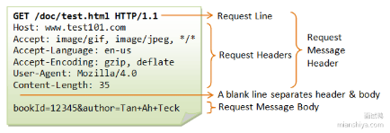

响应报文
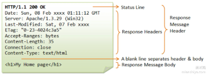

响应包含了：
- **状态行(Status Line)**: 包含 HTTP 的版本 (如 HTTP/1.1)、状态码 (如 200) 和状态描述 (如 OK)
- **响应头(Response Headers)**: 包含服务器返回的各种键值对，用用于描述响应的元信息。
常见的响应头:
- Date: 服务器时间戳，指示响应生成的时间。
- Server: 服务器的应用程序信息 (如 Apache/1.3.29)
- Last-Modified: 资源的最后修改时间。
- ETag: 资源的唯一标识，用于缓存验证。
- Content-Type: 响应内容的 MIME 类型 (如 text/html)
- Content-Length: 响应内容的字节长度
- Connection: 指示连接是否保持打开 (如 close 或 keep-alive)
- Accept-Ranges: 指示服务器支持的部分内容请求 (如 bytes)
- **空行 (Blank Line)**: 用于分隔请求头和请求体
- **响应体(Response Body)**: 包含服务器返回的实际内容 (如 HTML 文档、图片、JSON数据等)

#### 🔍 常见的请求方法，请求头类型，请求体类型有哪些？

> ###### 请求方法

- GET: 请求指定的资源，通常用于获取数据，不包含请求体。
- POST: 向服务器提交数据，通常用于表单提交，数据在请求体中。
- PUT: 用于更新资源，数据也在请求体中。
- DELETE: 请求删除指定资源。

- HEAD: 获取报文首部，主要用于确认URL的有效性和资源更新日期时间等。
- PATCH：对资源进行部分修改，PUT也可以用于修改，但只能完全替代原始资源，PATCH允许部分修改
- OPTIONS：查询支持的方法，查询指定URL能够支持的方法，会返回ALLOW：GET，POST，HEAD，OPTIONS这种
- CONNECT：使用SSL（Secure Socket Layer，安全套接层）和TLS（Transport Layer Security，传输层安全）协议把通信内容加密后经网络隧道传输
- TRACE：追踪路径，服务器会将通信路径返回给客户端

> ###### 请求头

- **通用头部(General Headers)**：适用于请求和响应，如`Cache-Control`, `Connection`
- **请求头部(Request Headers)**：特定于请求的头部，如
`Host`: 指定请求的主机名及端口，HTTP/1.1 中必须包含。
`User-Agent`: 标识客户端信息，通常用于服务器端的统计和个性化务。
`Accept`: 指定客户端可接受的媒体类型，服务器可以根据此头部返回合适的内容。
`Authorization`: 用于身份验证，包含凭证信息，如 `Basic` 或 `Bearer token`。
- **实体头部(Entity Headers)**：描述请求体的头部，如`Content-Type`, `Content-Length`

> ###### 请求体类型

- **表单数据(Form Data)**：`application/x-www-form-urlencoded`，用于提交表单数据，键值对形式
- **多部份数据(Multipart Data)**：`multipart/form-data`，用于上传文件或复杂表单数据，内容按边界分割
- **JSON数据**：`application/json`，用于提交JSON格式数据
- **XML数据**：`application/xml`，用于提交XML格式的数据
- **文本数据**：`text/plain`，用于提交纯文本数据

> ###### 性能与安全

- **缓存机制**：通过 Cache-Control 和 ETag 等头部，客户端和服务器可可以有效管理缓存，减少不必要的请求。
- **压缩**：Content-Encoding 头部可以指定压缩方式，如 gzip, 以减少数据传输量
- **安全性**：Authorization 和 Cookie 等头部涉及身份验证和会话管理里，应注意保护敏感信息，防止中间人攻击等安全威胁。

#### 🧠 关于首部字段的汇总，包括通用，请求，响应，实体等

**通用首部字段**
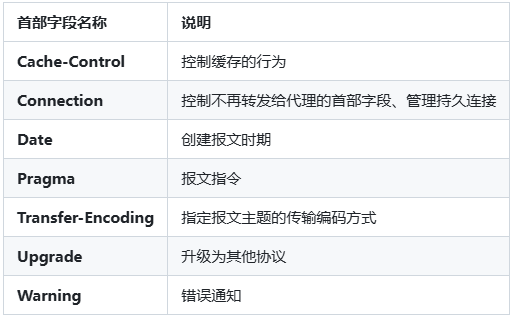

**请求首部字段**
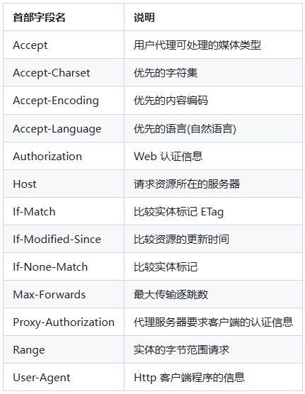

**响应首部字段**
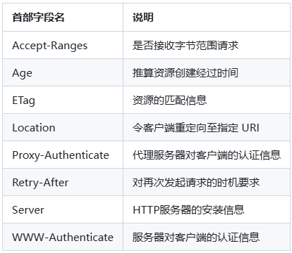

**实体首部字段**
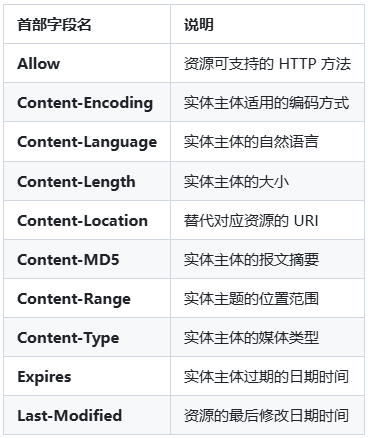

#### 👂 一些HTTP请求中具体的应用

> ###### Cookie

HTTP 协议无状态，为求简单以处理大量事务。HTTP/1.1 用 Cookie 保存状态信息。Cookie是服务器发至用户浏览器并保存在本地的数据块，后续向同一服务器请求时携带，用于告知服务端请求是否来自同一浏览器。但每次请求携带 Cookie 有额外性能开销 (尤其在移动环境)。

Cookie 曾用于客户端数据存储，因无其他合适办法而作为唯一手段，现随现代浏览器支持多种存储方式而被淘汰。新浏览器 API 允许开发者直接将数据存储到本地，如用 WebstorageAPI 或 IndexedDB。

用途
- 会话状态管理 (用户登录状态、购物车、游戏分数或者其他需要记录的信息)
- 个性化设置 (自定义设置、主体)
- 浏览器行为跟踪 (跟踪分析用户行为)

> ###### Session

Session 可以存储在服务器上的文件、数据库或者内存中。也可以将 Session 存储在 Redis 这种内存型数据库中，效率会更高。

使用 Session 维护用户登录状态:
1. 用户登录提交含用户名和密码的表单于 HTTP 请求报文中。
2. 服务器验证，若正确则将用户信息存 Redis,Key 为 Session ID.
3. 服务器响应报文的 Set-Cookie 首部含此 ID, 客户端收到后存 Cookie 值于浏览器。
4. 之后客户端对同一服务器请求时包含该 Cookie 值，服务器提取 Session ID, 从 Redis取用户信息进行业务操作。

结合token，Cookie和Session的基于OAuth2.0实现用户登陆的案例。
GitHub 提供 OAuth 2.0 认证，允许第三方应用通过 token 访问用户资源。

登录流程：用户通过 GitHub 授权页面登录，生成 access token 和 refresh token。Access token 用于 API 调用，refresh token 存储在客户端的数据库或安全存储中（其他应用中存储在HttpOnly cookie中）。
Session 管理：GitHub 的 Web 界面使用 session cookie 存储 session ID，结合服务器端的 session 数据库管理用户会话。
Refresh Token 流程：第三方应用（如 CI/CD 工具）使用 refresh token 调用 GitHub 的 OAuth token 端点，获取新的 access token。GitHub 的 refresh token 有较长的生命周（例如数月），但支持手动吊销。
应用场景：GitHub 的 OAuth 用于 Jenkins、CircleCI 等工具的自动化集成，结合 session cookie 用于 Web 界面登录。

> ###### Cache-Control

HTTP/1.1 通过Cache-Control首部字段来控制缓存

禁止进行缓存：`no-store`
强制确认缓存：`no-cache` —— 规定缓存服务器需要先向源服务器验证缓存资源的有效性，只有当缓存资源有效才能使用该缓存对客户端请求进行响应
私有缓存和共有缓存：`private`/`public` —— 规定资源为私有缓存，存于用户浏览器，仅供单独用户使用/规定资源可作为公共缓存，存于代理服务器供多用户使用
缓存过期机制：`max-age=1000000` —— 缓存资源在缓存服务器中的保存时间
`Expires: Wed, 04 Jul 2012 08:26:05 GMT` —— 用于告知缓存服务器该资源什么时候会过期

> ###### 短连接与长连接

长连接只要建立一次TCP连接就能进行多次HTTP通信
- 从HTTP/1.1 开始默认是`长连接`的，如果要断开连接，需要由客户端或者服务器端提出断开，使用`Connection: close`
- 在HTTP/1.1 之前默认是`短连接`的，如果需要使用长连接，则使用`Connection: Keep-Alive`

> ###### 内容编码

将实体主体进行压缩
常用的内容编码有:`gzip、compress、deflate、identity`
浏览器发 `Accept-Encoding` 首部，含支持压缩算法及优先级。服务器从中选一种，压缩响应消息主体，发 `Content-Encoding` 首部告知浏览器所选算法。

## 🚀 HTTP 中GET和POST的区别是什么？

#### 💡 从定义，参数传递，安全性，幂等性等方面GET和POST请求的区别是什么？

**从 HTTP 的定义来看**:
- GET: 用于获取资源，通常用于请求数据而不改变服务器状态。
- POST: 用于提交数据到服务器，通常会改变服务器的状态或产生副作用 (如创建或更新资源)。
由于 HTTP 和浏览器等规定，它们在应用过程中会出现一些区别:

**参数传递方式**:
- GET: 参数通过 URL 拼接传递，暴露在请求 URL 中，具有可见性生，长度有限 (取决于浏览器和服务器)。
- POST: 参数放在请求体中，通常不可见且长度理论上没有限制，更适合传递大量数据 (但是注意，POST 也可以在 URL 上放参数！)。

**安全性**:
- GET: 参数可见，数据容易暴露在浏览器历史记录、日志和缓存中户，不适合传递敏感信息。
- POST: 数据放在请求体中，相对安全，但需要 HTTPS 才能保证数据加密传输。

**幂等性**:
- GET: 幕等 (重复请求不会改变服务器状态)。
- POST: 非募等 (多次请求可能导致重复创建资源或执行多次相同操作)。

#### 🔍 GET和POST还有哪些方面的特点？

> ###### 数据传输方式与限制

- **URL 长度限制**：GET 请求中的参数通过 URL 传递，受 URL 长度限制。不同浏览器和服务器对 URL 长度限制不同，一般为 2048 字节左右，因此不适合大数居传输
- **POST 请求体限制**：POST 请求的数据放在请求体中，理论上无长度限制，适合传输较多的数据。但实际中服务器对请求体长度有配置限制，如 Nginx 默认限制为 1MB, 可根据需求调整。

> ###### 数据安全性差异

- **GET 请求暴露数据**：由于 GET 请求的参数出现在 URL 中，可能被浏览器缓存、日志记录或历史记录保存，增加了信息泄露的风险，不适合传输敏感信息，如用户名、密码等。
- **POST 请求相对安全**：POST 请求数据位于请求体中，尽管这并不提供加密保护，但比 URL 中传递更隐蔽。配合 HTTPS 加密传输可进一步确保数据安全

> ###### 缓存机制不同

- GET 请求可缓存：GET 请求可以被浏览器和 CDN 缓存，当请求同一个 URL 时可以直接返回缓存内容，减少服务器负载。适用于不频繁变动的资源，比如图片、静态页面。
- POST 请求默认不缓存：大部分浏览器和缓存服务器不缓存 POST 请求，主要因为 POST 请求通常会对服务器数据产生影响 (如创建、修改数据), 需要确保请求每次都传递到服务器

> ###### 幂等性和安全性原则

- GET 的幂等性：GET 请求是幂等的，重复多次请求对服务器资源没有影响。即使客户端多次请求同一 URL, 服务器的资源状态不会变化。
- POST 的非幂等性：POST 请求不是幕等的，重复的 POST 请求可能导致重复的数据创建或操作。例如，重复提交表单可能导致服务器多次生成同样的数据记录 (除非业务代码做了特殊处理)。
- 安全性原则：在 HTTP 方法的安全性定义中，GET 是安全的，因为它只获取数据，不对服务器状态产生影响，而 POST 可能会更改服务器数据，因此不是安全的操作。

> ###### RESTFUL API 设计中的角色分工

Restful风格的接口是一种资源的设计风格，REST(Representational State Transfer)是一种无状态的架构风格，以HTTP协议为基础，通过定义资源和标准的操作方法来组织接口，使客户端和服务器之间的交互更加简单、清晰和高效。通俗来说，就是要求不要在URL上表现出动作，而是用HTTP的动词来代表，URL只做资源。

- GET: 用于查询或检索资源数据。例如，`GET /users/123`用于获取 ID 为 123 的用户信息。
- POST: 用于创建资源或执行某些动作。例如，`POST /users` 可以用于创建新用户，表单提交、上传文件通常用 POST 实现。
- PUT 和 PATCH: 用于更新资源，其中 PUT 替换整个资源，PATCH 部分更新资源。
- DELETE: 用于删除资源，如 DELETE /users/123 删除用户。

> ###### GET和POST在网络层的具体差异

- **TCP 连接行为**：GET 请求默认是无状态、快速响应的请求，通常可以**复用已有的 TCP 连接**，不需要建立新的连接 (尤其在 HTTP/2 中)。POST 请求因数据量较大只可能涉及多个数据包的传输，在某些情况下会**使用新的 TCP 连接**。
- **请求数据的拆分和传输**：在大多数情况下，GET 请求的请求行和请求行和请求求头 (包括 URL 参数) 可以一次性发送完成。而 POST 请求的数据放在请求体中，如果数搜索大，可能需要分段传输。尤其在 HTTPS 加密情况下，POST 请求的数据会被拆分为多个加密数据包，可能导致传输开销稍高。

> ###### 浏览器行为和编码影响

- **GET请求的重定向**：浏览器在重定向后会自动保留GET方法，但会将POST转换为GET，避免数据丢失或意外的二次请求。
- **字符编码问题**：GET请求的URL编码通常为百分比编码(将非 ASCII 字符或特殊字符转换为 %HH 格式)，而POST请求支持更广泛的内容类型，如`application/x-www-form-urlencoded`,`multipart/form-data` 和 `application/json` 等，可以根据需要选择择合适的编码格式。

## 🚀 HTTP 1.0和2.0有什么区别？HTTP2.0和3.0有什么区别？

#### 💡 HTTP 1.0，1.1，2版本迭代都有什么增加？

**HTTP/0.9 (1990) 所定义的**
- URL作为统一资源标识符，HTML作为超文本标记语言，HTTP为超文本传输协议
- 只有GET请求，只需要从服务器获取文档

**HTTP/1.0 (1996) 版本主要增加以下几点:**
- 增加了 HEAD、POST 等新方法。
- 增加了响应状态码。
- 引入了头部，即请求头和响应头。
- 在请求中加入了 HTTP 版本号。
- 引入了 Content-Type, 使得传输的数据不再限于文本。

**HTTP/1.1 (1997-1999) 版本主要增加以下几点:**
- 新增了连接管理即 keepalive, 允许持久连接。
- 支持 pipeline, 无需等待前面的请求响应，即可发送第二次请求。
- 允许响应数据分块 (chunked), 即响应的时候不标明 Content-Length, 客户端就无法断开连接，直到收到服务端的EOF, 利于传输大文件。
- 新增缓存的控制和管理。
- 加入了 Host 头，用在你一台机子部署了多个主机，然后多个域名解析又是同一个 IP, 此时加入了 Host 头就可以判断你到底是要访问哪个主机。

**HTTP/2 版本主要增加以下几点:**
- 是二进制协议，不再是纯文本
不再以HTTP/1.1里面的纯文本形式的报文，而是采用了二进制格式，头信息和数据体都是二进制，并且统一成为帧(Frame)，包括头信息帧，数据帧
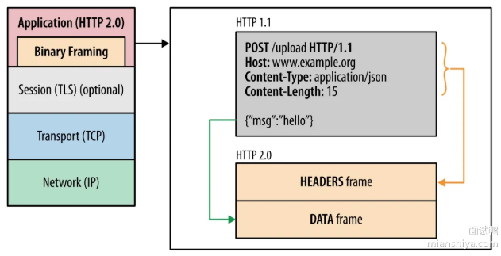

帧的结构：
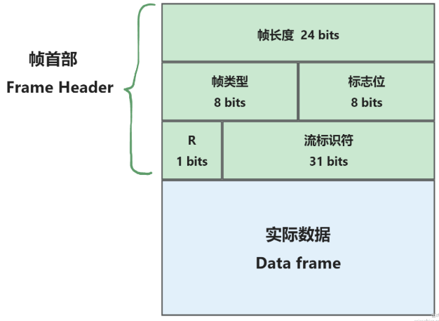

帧头部结构(Frame Header)很小，只有9个字节，帧开头的前三个字节标识帧数据的长度，帧类型一共10种，一般分为**数据帧**和**控制帧**。
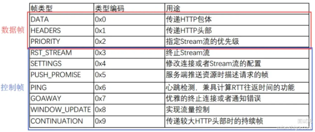

标志位8个字节，携带简单的控制信息，如`END_HEADERS`（头数据结束标志）, `END_STREAM`（单方向数据发送结束，后续不再有数据帧）, `PRIORITY`（流的优先级）

最后帧数据通过HPACK算法压缩

示意图如下：
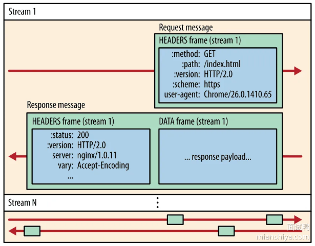
一个TCP包含多个Stream，Stream里包含一个或多个Message，Message对应HTTP/1中请求或者响应，Message中包含一条或者多个Frame，Frame是HTTP/2最小单位，以二进制压缩格式存放HTTP/1中的内容。

不同Stream的帧是可以乱序发送的，同一Stream内部的帧必须是严格有序的。

- 支持一个 TCP 连接发起多请求，移除了 pipeline。
- 利用 HPACK 压缩头部，减少数据传输量。
客户端和服务端同时维护一张头信息表，所有字段都会存入这个表并生成一个索引号，以后发送索引号提升速度。
通过静态编码表，动态编码表，Huffman编码表共同完成
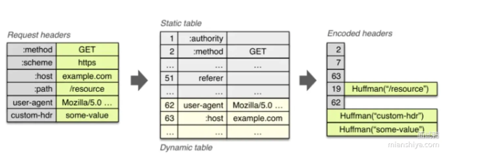

- 允许服务端主动推送数据。

#### 🔍 HTTP 2.0 和 3.0 有什么区别

TCP是面向可靠的、有序的传输协议，因此会有失败重传和按序机制，而HTTP/2是所有流共享一个TCP连接

1) 基于的传输层协议不同：
- HTTP/2: 基于 TCP, 使用二进制分帧层 (Binary Framing Layer) 实现多路复用。
- HTTP/3: 基于 UDP, 使用 QUIC 协议 (Quick UDP Internet Connections), 提供类似 TCP 的可靠性和多路复用。
2) 性能和可靠性区别:
- HTTP/2: 解决了 HTTP/1.x 中的队头阻塞问题，但仍然受制于 TCP 的队头阻塞，尤其在高延迟或丢包情况下。
- HTTP/3: 通过 QUIC 协议，避免了 TCP 队头阻塞，即使在网络不稳稳定的情况下也能提供更好的性能。
3) 从安全性角度来看:
- HTTP/2: 可以使用 TLS 加密 (HTTPS), 但加密并非强制要求。
- HTTP/3: 默认使用 QUIC 自带的 TLS1.3 加密，安全性更高，且加密是强制的
4) 从连接建立速度:
HTTP/2: 需要 TCP 三次握手和 TLS 握手，连接建立相对较慢。
HTTP/3: QUIC 集成了连接建立和加密握手，连接建立速度更快，尤其在初次连接时。

> ###### QUIC技术优势

QUIC (Quick UDP Internet Connections) 是一种由 Google 开发的基于 UDP 的传输层协议，旨在改进 HTTP/2 的性
能。QUIC 的设计目标是减少连接延迟，提高传输效率和安全性。以下是 QUIC 的一些技术优势和细节:

1) 低延迟连接建立:
QUIC 使用 0-RTT (ZeroRound TripTime) 技术，可以在**首次握手时减少延迟**。对于已经建立过连接的客户端，可以直接发送数据，无需等待服务器的响应。
2) 内置加密:
QUIC 协议**默认**采用 TLS 1.3 进行**端到端加密**，从而提高了数据传输的的安全性，并简化了协议设计，不再需要像 TCP 那样进行额外的加密层配置。
3) 减少了队头阻塞 (Head-of-LineBlocking):
与 TCP 不同，QUIC 在每个连接内使用**多个独立的流**，这意味着一个流上的丢包不会阻塞其他流的数据传输，从而显著减少队头阻塞问题，提高传输效率。
4) 更快的拥塞控制:
QUIC 可以更快速地调整拥塞控制算法，因为它能够访问更多的上下文信息 (如链路的 RTT、丢包率等), 且能够在应用层进行定制优化。
5) 连接迁移:
QUIC 支持连接迁移，当客户端的 IP 地址或网络环境变化时 (例如从 Wi-Fi 切换到蜂窝网络), 连接依然可以保持，不会像 TCP 那样中断。
6) 更高的带宽利用率:
QUIC 通过改进的流量控制机制，可以更好地利用可用带宽，从而提高高传输速度和效率

## 🚀 TCP是用来解决什么问题的？

#### 💡 回答重点？

TCP (Transmission Control Protocol) 通过提供**可靠传输、流量控制、拥塞控制和连接管理**，解决了数据在不可靠的 IP 网络上的传输问题:

1) **可靠性传输**：TCP 确保数据包在网络传输过程中不丢失、不重复，并且按顺序到达。通过确认(ACK)、重传机制以及序列号，TCP 能够保证数据在不可靠的 IP 网络上可靠传输。
2) **流量控制**：TCP 通过**滑动窗口机制**调节发送方的数据发送速率防止接收方因为处理能力有限而被数据流淹没。
3) **拥塞控制**：TCP 通过**拥塞避免算法** (如慢启动、拥塞避免、快速重传和快速恢复) 来防止网络过载，确保网络资源的公平使用和稳定性。
4) **连接管理**：TCP 是面向连接的协议，采用三次握手 (建立连接) 和四次挥手 (断开连接) 机制来管理会话，确保通信的可靠性和状态的同步。

#### 🔍 扩展一下TCP实现可靠性传输，流量控制，拥塞控制和连接管理的机制？

1) 数据包重排序与重传机制:
TCP 的序列号机制确保数据包按照正确的顺序组装。接收方通过序列号识别数据包的顺序，如果检测到丢失或乱序的包，会请求重传，保证数据完整性。
2) 滑动窗口与流量控制:
滑动窗口用于动态调整可以发送的数据量。接收方通过发送窗口大小通告，指示发送方可以发送的最大数据量。这种机制不仅避免了接收方的溢出，还提高了数据传输效率。
3) 拥塞控制算法: 拥塞窗口(CWND)由发送方动态计算，发送方实际发送窗口的最大值为 min(RWND, CWND)，同时受接收方处理能力和网络拥塞状态限制。TCP 的拥塞控制算法是核心的网络稳定性保证。经典算法包括以下几个步骤
慢启动：先以小的窗口传输数据，以指数的形式逐步增加发送窗口，直到检测到网络的拥塞点。
拥塞避免：当达到网络容量后，逐渐增加窗口以避免拥塞。
快速重传和快速恢复：在检测到包丢失时，立即进行重传并调整发送窗口，快速恢复正常传输状态。
4) TCP 三次握手与四次挥手:
三次握手：建立连接时，双方通过三次信息交换 (SYN,SYN-ACK,AACK) 来确保双方都准备好进行数据传输，并协商参数 (如初始序列号)。
四次挥手：断开连接时，通过四次消息交换来确保数据传输完成且资源可以安全释放，防止未传输的数据丢失。
5) TCP 的适应性与演变:
随着互联网的发展，TCP 也经历了多次改进，如 TCPReno、TCPNewReno、TCP Vegas 等，它们在拥塞控制和流量管理上有不同的策略，以适应不同的网络环境。
6) TCP 的局限性:
虽然 TCP 解决了可靠传输的问题，但在高延迟、高带宽的网络 (如卫星通信、现代数据中心) 中可能会受到性能瓶颈，进而催生了如 QUIC 等新协议的出现。

#### 🔣 TCP为什么可靠？

TCP 之所以被称为可靠的协议，主要是因为它提供了以下功能:
1. 数据完整性：使用校验和确保数据在传输中没有被破坏。
2. 数据顺序：保证数据按顺序到达接收方，且接收方能够重新排序弃乱序到达的数据。
3. 流量控制：通过滑动窗口机制避免接收方溢出。

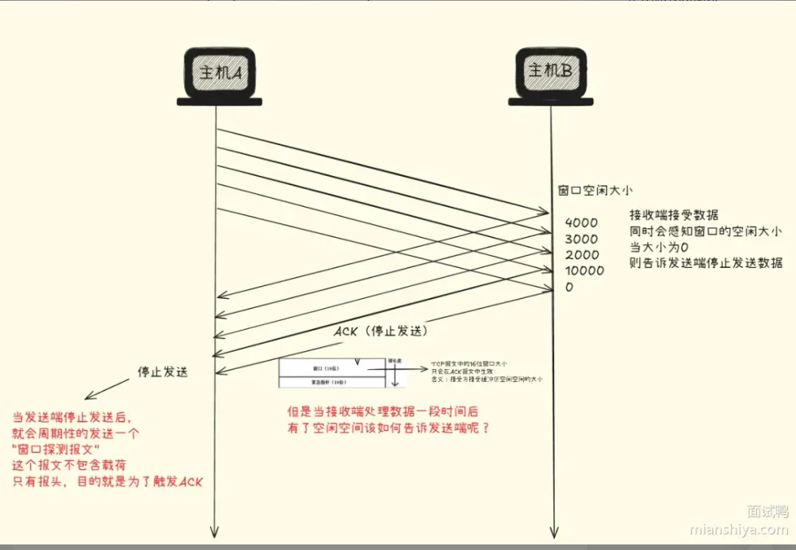

4. 拥塞控制：通过动态调整发送速率避免网络拥塞。

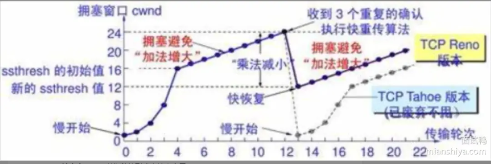

5. 重传机制：确保丢失的数据会被重新传输。
6. 延迟应答：接收方收到数据不立即返回ACK，而是隔一段时间再返回，一般是200ms
7. 捎带应答：在满足业务逻辑的情况下，将两个或几个数据包的内容合并在一起。
8. 可靠的连接建立和关闭：通过三次握手和四次挥手确保连接的正确建立和断开。
9. 防止数据重复：通过序列号和确认机制防止重复数据的接收。

#### 🧠 详细说一下TCP拥塞控制的步骤？

- 慢启动：发送方在连接建立初期，缓慢地增加数据发送速率。初始的拥塞窗口 (cwnd) 通常为一个 MSS (最大报文段大小), 然后在每次收到 ACK 后成倍增加 cwnd, 直到达到慢启动阈值 (ssthresh) 或检测到网络拥塞。
- 拥塞避免：当 cwnd 达到 ssthresh 后，TCP 进入拥塞避免阶段，拥塞窗口的增长速度从指数变为线性增长，即每个 RTT (往返时间) 增加一个 MSS。这一阶段旨在避免激烈的拥塞反应，保持网络稳定性。
- 快速重传：发送方在收到三个重复的 ACK 后，立即重传被认为丢失的报文段没，而无需等待超时。这减少了重传的延迟，迅速应对数据丢失。
- 快速恢复：在快速重传后，TCP 不进入慢启动，而是减小 cwnd 到当前的一半，并设置 ssthresh 为当前新的 cwnd 的值，然后开始线性增加 cwnd, 以快速恢复到丢包前的传输速率。

## 🚀 TCP 和 UDP 有什么区别？

#### 💡 总结一下TCP和UDP的区别？

TCP(Transmission Control Protocol)提供了**可靠、面向连接**的传输，适用于需要数据完整性和顺序的场景。
UDP(User Datagram Protocol)则提供了**更轻量、面向报文**的传输，适用于实时性要求高的场景。

区别总结：
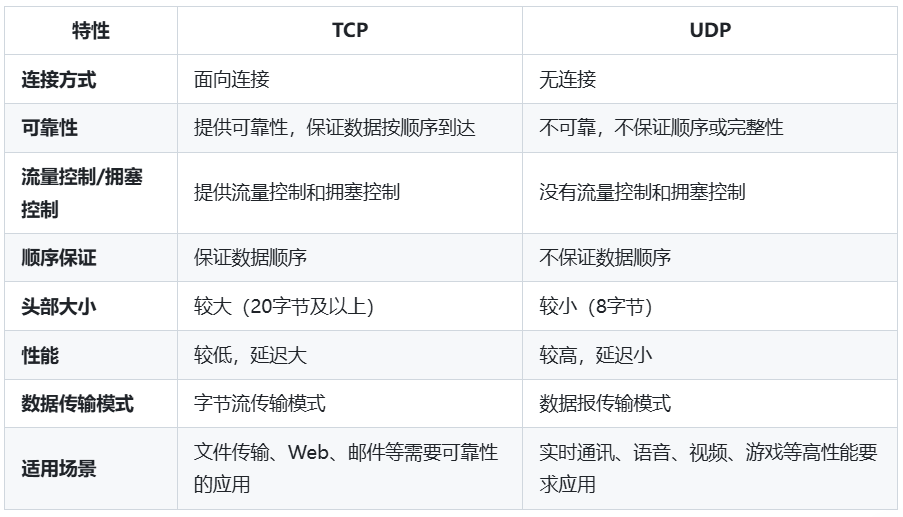

#### 🔍 TCP和UDP的报文结构是什么样的？

TCP报文结构：
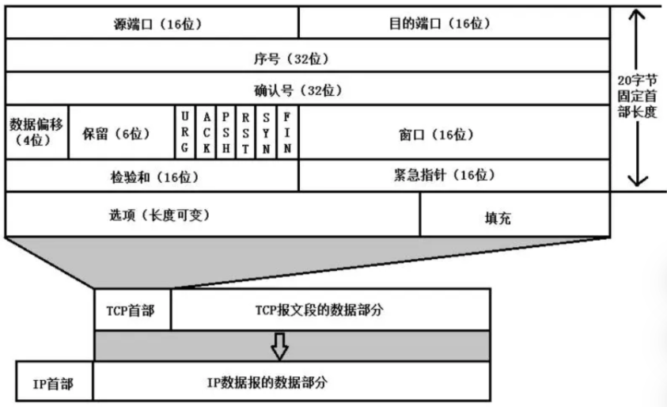
TCP首部：
源端口和目的端口 —— 标识发送端和接收端的应用程序
序列号 —— 对TCP报文段中的字节流进行编号，方便接收方队数据进行排序和重组
确认号 —— 接收方使用确认号告知发送方自己期望接收的下一个字节序号，用于发送方判断哪些数据已被成功接收
数据偏移 —— 表示首部长度，用于确定首部结束和数据开始的位置
保留 —— 为扩展功能预留
控制位 —— URG：紧急指针有效标志位。ACK：确认号有效标志位，当 ACK = 1 时，确认号字段才有效。PSH：推送标志位，指示接收方尽快将数据交付给应用程序。RST：重置连接标志位，用于复位一个连接。SYN：同步序号标志位，用于建立连接，在连接建立时用来同步序号。FIN：结束标志位，用于释放连接，表示发送方没有数据要发送了。
窗口 —— 用于流量控制，接收方通过该字段告知发送方自己当前接收缓冲区的空闲空间大小，发送方根据这个值来调整自己的发送速率。
校验和 —— 对 TCP 首部和数据部分进行校验，用于检测报文在传输过程中是否出现错误。
紧急指针 —— 当 URG 标志位为 1 时有效，它指向紧急数据的末尾，帮助接收方快速定位紧急数据。
选项（长度可变）—— 用于实现一些可选的功能，如最大报文段长度（MSS）、窗口扩大因子等。
填充 —— 为了保证 TCP 首部是 32 位的整数倍，通过填充字段来补齐。

UDP报文结构：
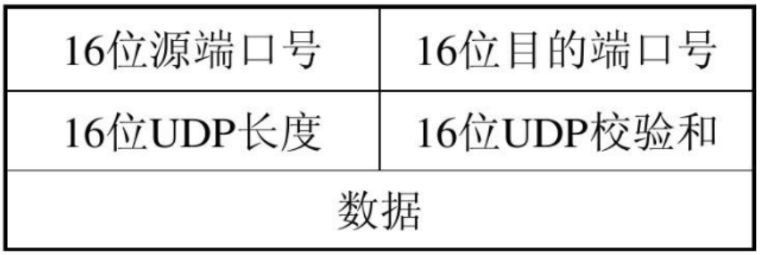
UDP：
源端口号和目的端口号 —— 和TCP类似
UDP长度 —— 记录 UDP 首部和数据部分的总长度，通过这个字段可以确定 UDP 报文的边界。
UDP校验和 —— 对 UDP 首部和数据进行校验，检测报文在传输过程中是否出错，但 UDP 的校验和是可选的。

#### 🔍 TCP的粘包和拆包能说说吗？

1) 粘包与拆包 (也称半包) 现象:
- 粘包：指的是在 TCP 传输中，发送方的多个数据包在接收方方被合并成一个包接收，导致多条消息数据粘在一起，接收方无法正确区分这些消息的边界。
- 拆包：指的是发送方的一个数据包在接收方被分成了多个包接收，导致一条完整的消息被拆成多个部分，接收方无法一次性接收到完整的数据。

2) 原因:
- 粘包：主要由于 TCP 是面向字节流的协议，它不关心数据边界，数据在发送方可能被一次性发送，接收方在读取时可能会将多个消息拼接在一起。
- 拆包：可能由于网络传输中的 MTU (最大传输单元) 限制或发送缓冲区大小限制，一个大包被分成了多个小包传输。

3) 解决方法:
- 使用**定长**消息：每个消息都有固定的长度，接收方按照固定长度**读取**数据。
- 添加消息**分隔符**：在每个消息之间添加特定的分隔符 (如换行符), 接收方可以通过分隔符来区分消息。(业界常用，如Redis就使用换行符来分隔)
- 使用消息头，**固定长度字段+内容**：在消息的头部添加一个长度字段，指示消息的长度，接收方根据这个长度来读取相应长度的数据。

为减少网络中小包的数量，TCP引入了Nagle算法，将小数据缓冲起来直到缓冲区满了或者及收到了接收方的确认后再发送，可能导致粘包现象。因此在需要实时传输小数据包的场景中可以禁用Nagle算法减少粘包的可能性。

## 🚀 说说TCP的三次握手？

#### 💡 简单描述一下TCP三次握手？

1) 客户端首先发送一个SYN(同步序列编号)消息给服务器
2) 服务器收到后回复一个SYN-ACK(同步序列编号-确认)消息
3) 最后客户端再发送一个ACK(确认)消息确认服务器已经收到SYN-ACK(消息)，
从而完成三次握手，建立起一个可靠的TCP连接，如图所示。

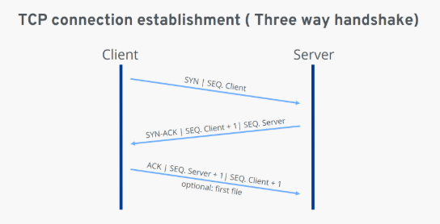

#### 🔍 为什么要三次握手？

1. **避免历史错误连接的建立，减少通信双方不必要的资源消耗**

网络情况比较复杂，发送方第一次发送请求后，可能由于网络原因被阻塞住了，此时发送方可能又会再次发送请求。**若握手只有两次**，那么接收方应对发送方的请求只能拒绝或者接受，但它**无法识别当前请求是旧的请求还是新的请求**。如果网络阻塞时间较长，发送方可能多次发送请求，且接收方还可能全部接受这些请求(以为都是有效的)，这就造成了不必要的资源浪费。

要避免这种情况发生，发送方需要知晓接收方到底接收了哪个连接，如果是老连接则需告知接收方不对，也就是RST通知。如果对，那就返回ACK告知发送方正确，因此需要三次握手。多的这一次，其核心要义就是发送方验证接收方接收的连接是否是正确的，避免了历史重复连接的问题。

2. **帮助通信双方同步初始化序列号**

由于网络本身的不稳定性可能导致：数据丢失，数据重复传输，数据乱序

而 TCP 是一个可靠传输协议，它需要保证数据不丢失且有序的传输输。基于上述的问题，TCP 引入了序列号，它使得:
- 接收方可以根据序列号去重
- 接收方可以根据序列号排序
- 发送方针对为接收到 ACK 的序列号对应的数据包，可以重传

序列号是有序的，因此在通信的初始化阶段，双方就需要同步序列号，不然数据后面就都对不上了。

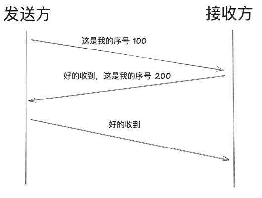

因此，三次握手的完整步骤是：
- 在第一次握手的时候，客户端会随机生成初始化序号，放到 TCP 报文头部的序号字段中，同时把 SYN 标志设置为 1, 这样就表示 SYN 报文。接着把这个 SYN 报文发送给服务端，之后客户端处于 `SYNSENT` 状态。
- 服务端收到 SYN 报文后，首先服务端也会随机生成初始化序号，放到 TCP 报文头部的序号字段中，然后对客户端的初始化序号 + 1 作为确认号，放到 TCP 报文头部的确认应答字段中，并将 SYN 和 ACK 标志设置为 1, 这样就表示 `SYN-ACK` 报文，后把该报文发给客户端，之后服务端处于 `SYNRCVD` 状态。
- 客户端收到服务端 SYN-ACK 报文后，客户端会回一个 ACK 确认报文，该报文的确认号是服务端的初始化序号 + 1, 并且 ACK 标志会设置为 1。之后客户端处于 `ESTABLISHED`状态。
- 服务端收到 ACK 确认报文后，服务端也进入处于 `ESTABLISHE` 状态。

**结合socket操作版：**
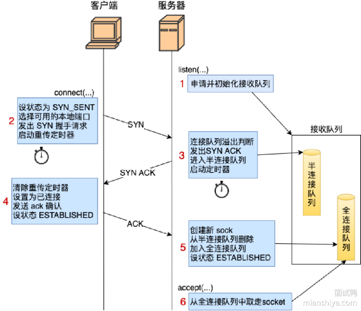

- 服务端会先通过 listen 初始化全连接队列以及半连接队列，其通过 Hash 表初始化半连接队列，通过链表初始化全连接队列
- 客户端调用 connect 函数，发起 connect 请求，然后选择一个可用的本地端口，然后发出 SYN 握手请求，这里需要启动重传定时器，如果超时没有收到 ACK 则启动重传机制，然后客户端设置为 SYNSENT 状态。
- 服务端收到 SYN 请求之后，会先进行半连接队列的溢出判断，如果不溢出，则根据客户端传来的 SYN 序列号，将上对应的数据偏移位，设置为对应的 ACK 然后将 SYN 请求放入半连接队列，启动定时器，设置为 SYNRCVD 状态。
- 客户端收到来自服务端的 SYNACK 请求之后，会先清除重传定时器，然后将 SYN 请求设置为已连接状态，然后根据服务端序列号发送 ACK 确认，然后客户端设置为
ESTABLISHED.
- 服务端收到 ACK 之后，内核会先创建新 Socket, 然后将请求从半连接队列删除，加入到全连接队列，然后状态设置为 ESTABLISHED, 然后后面服务端使用 accept 调用从全连接队列取走 socket, 其实到这里三次握手的连接才正式确定建立连接

## 🚀 说说TCP的四次挥手？

#### 💡 简单描述一下TCP四次挥手？

TCP 的四次挥手是用于安全关闭一个已建立的连接的过程，它确保双方都能完成数据传输并安全地释放连接资源。

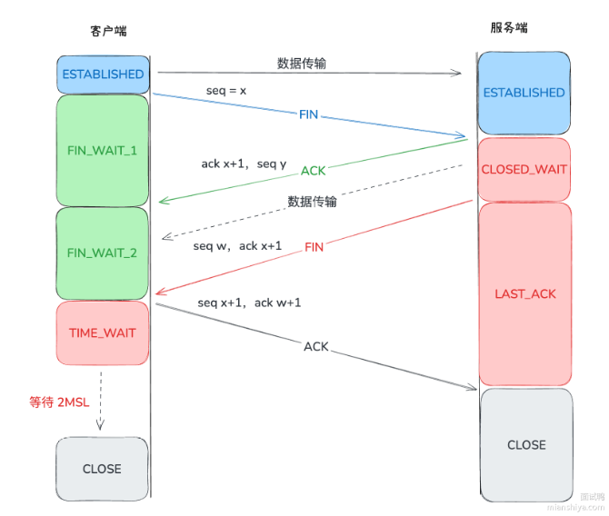

简述步骤:
1) 第一次挥手 (FIN - ACK): 客户端主动关闭连接，发送 FIN 包，进入 `FIN_WAIT_1` 状态。服务器收到 FIN 后，表示不再接收数据，但仍可能继续发送数据。
2) 第二次挥手 (ACK): 服务器发送 ACK 包，确认已收到 FIN。此时服务器进入 `CLOSE_WAIT` 状态，客户端进入 `FIN_WAIT_2` 状态。
3) 第三次挥手 (FIN→ACK): 服务器完成所有数据传输后，发送送 FIN 包，进入 LAST ACK 状态。客户端收到 FIN 后，准备关闭连接。
4) 第四次挥手 (ACK): 客户端发送最后一个 ACK 包，进入 TIMEVWAIT 状态，等待可能迟到的FIN 包。服务器收到 ACK 后，关闭连接，进入 CLOSED 状态。客户端在 TIMEWAIT 计时结束后(2MSL), 正式关闭连接。

#### 🔍 为什么挥手需要四次？

主要是为了**确保数据的完整性**。TCP 是一个全双工协议，也就是说双方都要关闭，每一方都向对方发送 FIN 和回应 ACK。

客户端发起连接断开，代表客户端没数据要发送的，但是服务端可能还有数据没有返回给客户端。所以一个 FIN+ACK 代表一方结束数据的传输，因此需要两对 FIN + ACK, 加起来就是四次通信。

挥手不一定要四次，有时候可以变成三次挥手。如果客户端发送FIN给服务端的时候，服务端已经没有数据要发给客户端了，那服务端就可以将ACK和FIN一起发给客户端，这样也就变成了三次挥手。

## 🚀 HTTP 和 HTTPS 有什么区别？

#### 💡 两者在数据传输、端口、性能、SEO影响上有什么区别？

1) **数据传输安全性**:
- HTTP: 数据以明文传输，容易被窃听、篡改。
- HTTPS: 通过 SSL/TLS 协议对数据进行加密传输，提供数据机密性和完整性保障。

2) **端口号**:
HTTP: 默认使用端口 80。
HTTPS: 默认使用端口 443。

3) **性能**:
HTTP: 无加密过程，连接建立速度稍快。
HTTPS: 基于 HTTP 上又加了 SSL (Secure Sockets Layer) 或 TLS (Transport Layer Security) 协议来实现的加密传输，加解密过程增加了计算开销，握手时间较长，但现代硬件和协议优化已使性能差距减小。

4) **SEO 影响**:
HTTP: 搜索引擎一般会降低未加密站点的排名。
HTTPS: 搜索引擎更倾向于优先展示 HTTPS 网站。

#### 🔍 HTTPS的握手过程

HTTPS 使用TLS协议进行握手，因此这里主要关注TLS的握手过程。TLS握手根据密钥交互算法的不同可以分为 RSA算法 和 ECDHE算法 两种。

> ###### RSA 算法流程

一共需要四次握手:
1. 客户端问候 (ClientHello)
2. 服务器问候 (ServerHello)
3. 客户端密钥交换 (ClientKeyExchange)+ 开始使用加密 (Change CipherSpec) + 客户端完成 (Client Finished)
4. 服务器发送开始使用加密 (ChangeCipherSpec) + 服务器完成 (ServerFinished)

**1. 客户端问候** (ClientHello)
客户端向服务器发送一个 ClientHello 消息，包含: `TLS 版本`，`加密算法套件 (Cipher Suites)列表`，`随机数`。

**2. 服务器问候** (ServerHello)
服务器接收到 ClientHello 后，会认证 TLS 版本号是否支持，从列表中选择一个加密算法套件，保证客户端的随机数，再生成一个随机数。所以 ServerHello 的消息包含:
`确认的 TLS 版本`，`确认的加密算法套件 (Cipher Suite)`，`随机数`。
除此之外，服务器还需向客户端发送自己的数字证书，内含公钥，用于证明其身份，这个步骤是服务器证书 (Server Certificate)。最后，服务器会发送服务器完成 (ServerHelloDone), 表示握手的初步阶段结束。

**3. 客户端密钥交换 + 开始使用加密 + 客户端完成**(Client Key Exchange + Change Cipher Spec + Client Finished)
客户端通过 CA (证书认证机构) 验证服务端传递过来的服务器证书可信后，再次生成一个随机数 (pre-master), 通过证书得到的公钥，加密通过客户端密钥交换 (Client Key Exchange) 发送给服务端。

紧接着再发送开始使用加密 (Change CipherSpec) 给服务器端。因为此时不论是客户端还是服务端都拿到了三个随机数(第一次客户端给的、第二次服务端给的、第三次客户端的 pre-master)。

因此这三个随机数就可以作为对称加密的密钥，用户后续传输的加解客密。这个步骤后，后续的传输数据都是加密的。

发送完 (Change Cipher Spec) 后，客户端再发送客户端完成 (Client Finished), 这个 Finished 会带上 Encrypted Handshake Message, 这个 message 就是之前发送的所有数据的摘要，并且还用生成的对称加密密钥加密了，传递给服务器端验证，预防握手过程中的握手信息被修改。

**4. 服务器发送开始使用加密 + 服务器完成** (Change Cipher Spec + Server Finished)
同理，服务器也一样发送，代表后续要用加密数据传输了，且发送握手摘要给客户端验证，一切正常的化，RSA TLS握手就结束了。

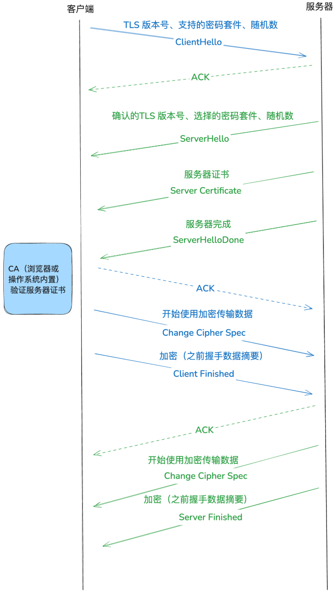

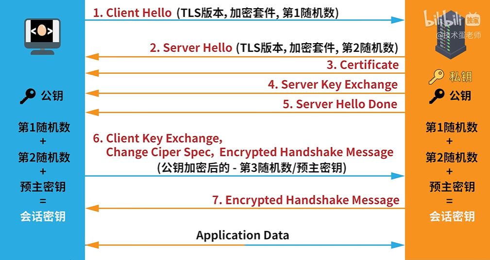

> ###### ECDHSE 算法流程

一共需要四次握手，和RSA主要区别于第二步
1. 客户端问候 (ClientHello)
2. 服务器问候 + 服务器密钥交换 (ClientKeyExchange + ServerHello)
3. 客户端密钥交换 + 开始使用加密 + 客户端完成 (Client Key Exchange + Change CipherSpec + Client Finished)
4. 服务器发送开始使用加密 + 服务器完成 (Server Finished + Change CipherSpec)

**1. 客户端问候** (ClientHello)
客户端向服务器发送一个 ClientHello 消息，包含: `TLS 版本`，`加密算法套件 (Cipher Suites)列表`，`随机数`。

2) **服务器问候 + 服务器密钥交换** (ClientKeyExchange + ServerHello)
服务器接收到 ClientHello 后，会认证 TLS 版本号是否支持，选择一个加密算法套件，保证客户端的随机数，再生成一个随机数。所以 ServerHello 的消息包含:
`确认的 TLS 版本`，`确认的加密算法套件 (Cipher Suite), 这里会选 ECDHE 相关的套件`，`随机数`。
同样，服务器也会向客户端发送自己的数字证书，内含公钥，用于证明其身份，这个步骤是服务器证书 (Server Certificate)

ECDHE 实际上是基于椭圆曲线特性的算法，此时服务器需要确认选择的椭圆曲线以及一个随机数作为服务器椭圆曲线私钥，基于椭圆曲线和私钥算出椭圆曲线公钥。为了防止公钥被修改，服务器通过 RSA 给公钥签名，最终利用 (Server KeyExchange) 发送给客户端。【椭圆曲线点这方面的知识仅做了解即可】
小结下 Server Key Exchange 消息的内容，包含:
`椭圆曲线 (如果客户端末指定)`，`服务器的椭圆曲线公钥 (用于 Diffie-Hellman 密钥交换)`，`签名：服务器使用其私钥对相关参数进行签名 (包括椭圆曲线参数和公钥), 以确保这些参数没有被篡改`。

最后，服务器会发送服务器完成 (ServerHelloDone), 表示握手的初步阶段结束。

**3. 客户端密钥交换 + 开始使用加密 + 客户端完成**(Client Key Exchange + Change Cipher Spec + Client Finished)
客户端通过 CA (证书认证机构) 验证服务端传递过来的服务器证书可信后，生成一个随机数作为客户端椭圆曲线私钥, 基于椭圆曲线和私钥算出椭圆曲线公钥，将这个公钥通过客户端密钥交换 (Client Key Exchange)发送给服务端。

此时客户端和服务端拥有：客户端随机数 + 服务端随机数 + 共享密钥(对方公钥+自己私钥计算得到)，这三个元素生成最终的会话密钥。

紧接着再发送开始使用加密 (Change CipherSpec) 给服务器端。这个步骤后，后续传输数据都是加密的。

发送完 (Change Cipher Spec) 后，客户端再发送客户端完成 (Client Finished), 这个 Finished 会带上 Encrypted Handshake Message, 这个 message 就是之前发送的所有数据的摘要，并且还用生成的对称加密密钥加密了，传递给服务器端验证，预防握手过程中的握手信息被修改。

**4. 服务器发送开始使用加密 + 服务器完成** (Change Cipher Spec + Server Finished)
同理，服务器也一样发送，代表后续要用加密数据传输了，且发送握手摘要给客户端验证，一切正常的化，ECDHE TLS握手就结束了。

> ###### RSA 和ECDHE的区别

可以从三个角度看：
- 安全性：ECDHE 提供前向安全性，而 RSA 不具备。如果服务器的私钥泄露，基于 ECDHE 的握手不会影响之前的会话，而基于 RSA 的握手会导致之前的通信被解密。
- 计算复杂度：ECDHE 由于涉及椭圆曲线数学运算，相比 RSA 的的操作更复杂，但提供更高的安全性
- 使用场景：现代 HTTPS 实践中，ECDHE 已成为首选，因为它够提供前向安全性，同时结合 RSA 或 ECDSA 用于签名和认证。
- 数据发送：RSA的TLS需要等四次握手完全结束后，客户端再发送数据。ECDHE在客户端得到完整密钥后，可以直接开始发送数据。

#### 🔍 SSL/TLS协议的演进

HTTPS 使用的加密协议从最初的 SSL (Secure Sockets Layer) 演变为 TLS (Transport Layer Security)。目前广泛使用的是 TLS 1.2 和 TLS1.3。TLS 1.3 引入了更快的握手机制 (0-RTT), 进一步降低了延迟 (QUIC 内嵌使用这个协议)。
简单了解下 SSL/TLS 协议的演进之路:
1) SSL 1.0:
状态：从未公开发布。
原因：存在严重的安全漏洞，未达到发布标准。
2) SSL 2.0 (1995 年发布):
特性：是第一个公开发布的 SSL 版本，提供了基本的加密和认证功能
问题：存在多种安全问题，如容易受到截断攻击、缺乏握手完整性保护等。SSL2.0 被认为不安全。
3) SSL 3.0 (1996 年发布):
特性：对 SSL2.0 进行了显著改进，包括引入消息完整性校验、握手的改进以及更强的加密算法。
问题：尽管较 SSL 2.0 更加安全，但 SSL3.0 仍然存在漏洞，特别是后来被发现的 POODLE 攻击 (Padding Oracle On Downgraded Legacy Encryption), 导致 SSL 3.0 被废弃。
4) TLS 1.0 (1999 年发布):
特性：TLS (Transport Layer Security) 是 SSL 3.0 的演进版。TLS 1.0 改进了加密算法、密钥生成、消息认证码 (MAC) 机制，并增加了对握手的保护。
问题：随着时间推移，TLS 1.0 被发现存在对称密钥的选择偏差、密明流恢复攻击等问题，且部分加密算法过时。
5) TLS 1.1 (2006 年发布):
特性：引入了对 CBC (Cipher Block Chaining) 模式攻击的保护，改进了消息认证码 (MAC) 算法，并提供了更多加密算法的支持。
问题：尽管修复了部分安全问题，但随着加密技术的发展，TLS 1.1 仍然不够安全，且效率较低。
6) TLS 1.2 (2008 年发布):
特性：支持更强的加密算法 (如 AES-GCM), 引入更灵活的握手机制，允许使用哈希算法 (如 SHA-256) 进行握手完整性校验，并提供了更好的安全性和性能。
问题：尽管 TLS 1.2 被广泛采用，但随着计算能力的提高，安全社区逐渐意识到加密协议需要进一步优化以应对未来的威胁。
7) TLS 1.3 (2018 年发布):
特性：显著简化了握手过程，减少了加密套件的数量，移除了不安全的加密算法 (如 RSA 密钥交换), 采用了 0-RTT 握手以减少连接建立的延迟，并增强了前向保密性 (Forward Secrecy)。
原因：TLS1.3 的发布主要是为了提高协议的安全性和性能，以应对现代计算环境中的安全需求。

## 🚀 TCP/IP 四层模型是什么？

#### 💡 什么是TCP/IP 四层模型？每一层的内容和字段是什么？

TCP/IP 四层模型是一个分层网络通信模型，它将网络通信过程分为四个层次，这四层分别是：`网络接口层`、`互联网层`、`传输层`和`应用层`。
**网络接口层**
负责在计算机和网络硬件之间传输数据，负责在物理网络上发送和接收数据帧，包括以太网、Wi-Fi 等协议
可以看作数据链路层和物理层的合体，数据链路层将网络层的IP数据包组装成帧，在相邻节点之间传送。物理层实现相邻计算机节点之间比特流透明传送，屏蔽传输介质和物理设备差异。

**互联网层** 
(网络层) 通过 IP 协议提供数据包的路由和转发
封装传输层报文或用户数据包为IP数据包传送，网络层负责选择合适的路由使分组找到目的主机。

**传输层**
负责在两个主机之间提供端到端的通信服务，常见的协议有 TCP 和 UDP

**应用层**
通过各种协议提供网络应用程序的功能，如 HTTP、FTP、SSMTP 等协议
应用层位于传输层之上，主要提供两个终端设备上的应用程序之间信息交换的服务，它定义了信息交换的格式，消息会交给下一层传输层来传输，我们把应用层交互的数据单元称为报文。

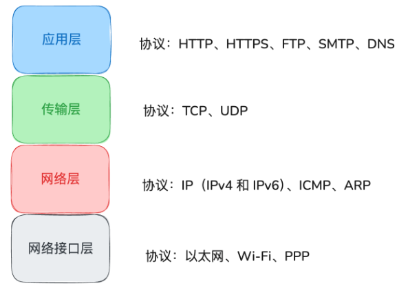

> ###### 应用层 (常见协议：HTTP超文本传输协议, SMTP简单邮件传输协议, POP3/IMAP邮件接收协议, FTP文件传输协议, Telnet远程登陆协议, SSH同加密和认证机制实现安全的访问和文件传输, DNS域名管理系统)

**包头信息主要字段**:
HTTP：`Host`(目标主机)、`User-Agent` (客户端类型)、`Content-Length` (内容长度) 等。
DNS：`Transaction ID`(事务 ID)、`Flags` (标识符)、`Query/Response`(查询 / 响应标识) 等。

**数据单位**：数据 (Data)

> ###### 传输层

**包头信息主要字段**:
TCP: `Source Port`(目的端口)、`Sequence Number`(源端口)、`Destination Port`(序列号)、`Acknowledgment Number`(确认号)、`Flags`(控制标志) 等。
UDP: `Source Port`(源端口)、`Destination Port`(目的端口)、`Length`(数据包长度)、`Checksum`(校验和)等。

**数据单位**：数据包 (Segment)

> ###### 网络层

**包头信息主要字段**:
IP: `Source IP Address`(源 IP 地址)、`Destination IP Address`(目的 IP 地址)、`TTL` (生存时间)、`Protocol`(上层协议类型) 等。

**数据单位**：数据包 (Segment)

> ###### 网络接口层

**包头信息主要字段**:
以太网:
`Source MAC Address`(源 MAC 地址)、`Destination MAC Address`(目的 MAC 地址)、`Type` (上层协议类型) 等。

**数据单位**：帧 (Frame)

每一层数据包格式：
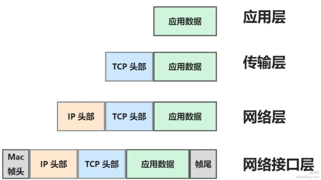

> ###### 在数据传输过程中发送方和接收方的行为有哪些？

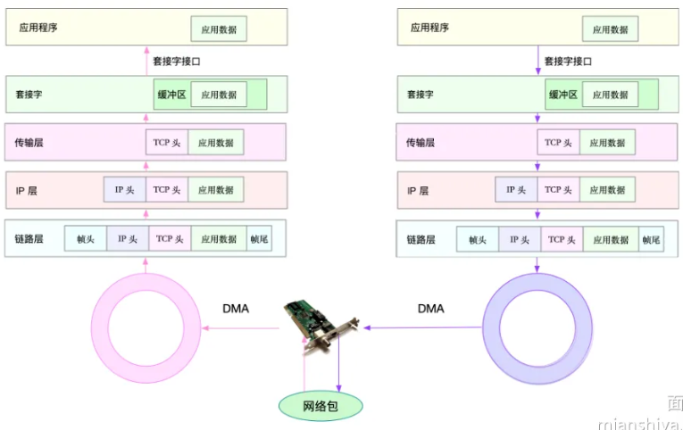
发送方：
1. 应用层调用 Socket API 将数据包放入 Socket发送缓冲区。
2. 网络协议栈从发送缓冲区取出数据包，按 TCP/IP 栈从上到下处理。
3. 传输层增加 TCP 头。
4. 网络层增加 IP 头、路由查找、按 MTU(最大传输单元) 分片。
5. 数据链路层进行物理地址寻址、添加帧头帧尾后放发包队列。
6. 驱动程序通过 DMA(Direct Memory Access) 从发包队列读出网络帧并由网卡发送。

接收方：
1. 网卡通过 DMA 将网络帧放收包队列，通过硬中断告知中断处理程序。
2. 网卡中断处理程序为网络帧分配 sk_buff 并拷贝，通过软中断通知内核。
3. 内核协议栈从缓冲区取出网络帧，从下到上处理。
4. 数据链路层检查报文合法性、去帧头帧尾交网络层。
5. 网络层取出 IP 头判断走向，确认发往本机则去 IP 头交传输层。
6. 传输层取出 TCP 或 UDP 头，根据四元组找 Socket 并拷贝数据到接收缓存。
7. 应用层用 Socket 接口读取新接收的数据。

#### 🔍 这样分层有什么优点？

- **简化设计与实现**：通过将网络功能分解为不同的层，每一层只负责特特定的任务，从而简化了设计和实现的复杂性。
- **模块化**：每一层可以独立发展和优化，不同层次之间通过标准接口进行通信，便于各层的更新和替换。
- **互操作性**：明确定义每个层次之间的接口和协议，不同厂商或组织开发的网络设备和软件可以相互兼容，使得不同的网络设备和系统能够在不同的层次上进行无缝互操作，提升了网路的兼容性。
- **故障隔离**：每个层次都有自己的错误检测、纠错和恢复机制，且分层结构能够帮助网络工程师定位问题所在的层次，从而更快地进行故障排除。

#### 🧠 TCP/IP四层模型和OSI七层模型的如何对比呢？

- **OSI 七层模型**是另一个著名的网络模型，它将网络通信过程分为七个层次：物理层、数据链路层、网络层、传输层、会话层、表示层和应用层。
- **简化与实用性**：TCP/IP 四层模型是对 OSI 七层模型的简化，省略了**会话层和表示层**，将**数据链路层和物理层合并为网络接口层**。这种简化更符合实际应用中的网络协议栈实现。
- **应用层的差异**：在 OSI 模型中，应用层、表示层和会话层是分开的，而在 TCP/IP 模型中，它们被合并成了单一的应用层。这种设计简化了上层协议的开发和实现。

## 🚀 Cookie, Session, Token之间有什么区别？

#### 💡 三者分别是什么？应用场景有什么区别？

**Cookie**:
Cookie 是存储在用户浏览器端的一个小型数据文件，用于跟踪和保存用户的状态信息。主要用于保持用户登录状态、跟踪用户行为、存储用户偏好等。存储在浏览器端。

**Session**:
Session 是服务器端保存用户状态的机制，每个用户会话都有个唯一的 Session ID。主要用于跟踪用户在服务器上的状态信息，例如登录状态和购物物车内容存储在服务器端，然后对应的 SessionID 通过 Cookie 保存在客户端浏览器中。

**Token**:
Token 本质是一种加密的字符串，用于身份验证和授权，可以包含用户信息和权限，用于验证用户身份或授权访问资源。认证后，后端服务会返回 Token, 存储在客户端 (浏览器或移动应用中), 后续客户端访问服务端需要带上这个 Token。

**使用场景区别**:
Cookie: 主要用于客户端状态的简单存储和追踪。
Session: 用于服务器端的复杂状态管理，特别是在需要存储大量会证活数据时
Token: 用于无状态的认证和授权，特别是在分布式和跨域环环境下。

简单来说，Cookie 和 Session 更适合用于单次会话的认证和状态管理，而 Token 更适合用于跨会话的认证和状态管理。

#### 🔍 进一步介绍

**Cookie的主要用途**:
- 会话管理：保存用户的会话状态，如登录状态。
- 个性化设置：存储用户的偏好设置和配置。
- 跟踪和分析：记录用户的行为，用于分析和广告跟踪 (经常会有网站弹出来让你允许存储 cookie)。
**Cookie的特性**:
- 生命周期：Cookie 可以设置过期时间，过期后自动删除。可以是会话 Cookie (当浏览器关闭时删除)或持久 Cookie (根据设置的过期时间删除)。
- 安全性：Cookie 可以使用 Secure 和 Httponly 标志来提高安全性。Secure标志表示仅在 HTTPS 连接下发送，Httponly 标志表示 JavaScript 无法访问。
- 大小限制：浏览器对每个 Cookie 的大小有限制 (通常为 4KB), 同时对每个域名的 Cookie 数量也有限制。

**Session的主要用途**:
- 会话管理：用于在用户与服务器的交互过程中保持状态，如登录状态、购物车内容等。
- 数据存储：在用户的会话中保存较大的数据，如用户配置、临时数据等
**Session的特性**:
- 生命周期：Session 在用户与服务器的交互期间保持有效，一般会庄用户关闭浏览器或达到超时设置后失效。
- 存储位置：数据存储在服务器上，而不是客户端，增加了数据的安全全性。
- 标识符：服务器会生成一个唯一的 Session ID, 通过 Cookie 或 URL 参数将其传递给客户端，客户端在后续请求中将其发送给服务器。

Token一般是一段字符串，常见的Token类型包括JSON Web Token(JWT)和OAuth2.0 Token
**Token的主要用途**：
- 身份验证：用于验证用户身份，例如在登录后生成 Token, 客户端将其用于后续的请求。
- 授权：用于控制用户对特定资源的访问权限。
- 无状态会话：Token 支持无状态的会话管理，即服务器不需要存储会话状态，而是通过 Token 本身验证和授权。
**Token的特性**：
- 自包含：Token (尤其是 JWT) 通常自包含了用户的身份和权限信息，无需服务器存储会话数据。
- 过期和刷新：Token 通常有过期时间，用户需要重新登录或通过刷新 Token 机制获取新的 Token。
- 安全性：Token 可以进行加密和签名，以保护其内容不被篡改，并验证其来源的合法性。

## 🚀 谈谈对DNS的理解？

#### 💡 DNS是什么？是做什么的？

DNS (Domain Name System, 域名系统) 是一个用于将域名转换为 IP 地址的互联网基础服务。

当用户输入一个域名时，DNS 服务器会查询该域名对应的 IP 地址，并将结果返回给用户。这样，用户就可以通过易记的域名访问网站，而不需要记住复杂的 IP 地址。

除此之外，DNS 还有负载均衡能力，通过将域名解析到多个 IP 地址，DNS 可以帮助分散流量，进行负载均衡，提高服务的可靠性和性能。

#### 👂 互联网中的域名地址系统

互联网中的域名地址，分为多级结构：最顶级是根域，然后是顶级域 (TLD), 如.com、.org, 接着是二级域 (如mianshiya.com), 以及子域 (如www.mianshiya.com)。

DNS 服务器和客户端会缓存 DNS 查询结果，以减少查询时间和降低对 DNS 服务器的负载。缓存的内容会在一定时间后过期，具体取决于 DNS 记录的生存时间 (TTL) 设置。

#### 🔍 DNS的工作流程是什么样的？

DNS 的工作流程可以分为以下几个步骤:
1) 域名解析请求:
用户在浏览器中输入一个域名 (例如ww.baidu.com), 浏览器首先检查本地缓存 (如果有的话) 是否存有该域名的 IP 地址。
2) 递归 DNS 解析:
如果本地缓存中没有所需的 IP 地址，浏览器会向配置的递归 DNS 服务器发送请求。递归 DNS 服务器是互联网服务提供商 (ISP) 或公共 DNS 提供商 (如 GoogleDNS 或CloudflareDNS) 提供的服务。
3) 查询根域名服务器:
递归 DNS 服务器会查询根域名服务器以获取顶级域 (TLD) 的 DNS 服务器地址。根域名服务器负责将请求转发到对应的 TLD 服务器。
4) 查询 TLD 服务器:
根域名服务器将请求转发到对应的 TLD 服务器 (例如，.com、.org 或.net 服务器), 这些服务器负责处理特定顶级域的请求。
5) 查询权威 DNS 服务器:
TLD 服务器将请求转发到域名的权威 DNS 服务器 (例如ns1.mianshiya.com)。权威 DNS 服务器拥有该域名的最终 DNS 记录。
6) 返回 IP 地址:
权威 DNS 服务器返回与域名对应的 IP 地址给递归 DNS 服务器，然后送创日 DNS 服务器将该 IP 地址返回给用户的浏览器。
7) 缓存和访问:
浏览器缓存该 IP 地址以供后续请求使用，并通过 IP 地址连接到目标服务务器以访问网站内容。

DNS 服务器小结:
- **根域名服务器**：最顶层的 DNS 服务器，负责根域和 TLD 的解析 i,
- **TLD 服务器**：处理特定顶级域 (如.com、.org) 的 DNS 查询。
- **权威 DNS 服务器**：存储实际的 DNS 记录并提供最终的解析结果。
- **递归 DNS 服务器**：负责处理用户的 DNS 查询请求并从其他服务务器获取解析结果。

#### 🔣 DNS记录类型

- A 记录：将域名映射到 IPv4 地址。
- AAAA 记录：将域名映射到 IPv6 地址。
- CNAME 记录：将一个域名别名指向另一个域名。
- MX 记录：定义邮件服务器的地址，用于电子邮件的传输。
- TXT 记录：存储任意文本信息，通常用于验证和安全设置。
- NS 记录：定义域名的权威 DNS 服务器。

## 🚀 从网络角度看，用户从输入网址到网页显示，期间发生了什么？

#### 💡 请介绍中间发生各个步骤重点？

1) **浏览器解析 URL**
浏览器会解析 URL, 根据请求信息生成对应的 HTTP 请求报文。
2) **DNS 解析**
请求需要知晓服务器域名对应的 IP 地址才能通信，浏览器会检查本地缓存、操作系统缓存，甚至路由器缓存。如果未命中缓存，浏览器向配置的 DNS 服务器发送查询请求，DNS 服务器递归查询最终返回 IP 地址。
3) **TCP 或者 UDP**
接着浏览器会调用 Socket 库委托协议栈工作，根据指定的情况选择 TCP 或 UDP。如果使用 TCP, 需要通过三次握手建立连接。需要在数据发送前通过三次握手与服务端建立连接。
此时得到了封装了 HTTP 数据的 TCP 数据包。
4) **IP**
在 TCP 数据包的基础上，再封装源地址 IP 和目标地址 IP 等信息，得到网络包。有了 IP 就能在多个网络节点中确定数据包的传输路径，最终能找到目标服务器。
5) **MAC**
得到网络包后，需要在 IP 头部的前面加上 MAC 头部，封装发送方 MAC 地址和接收方目标 MAC 地址。MAC 用来确保子网内设备两点之间的通信寻址。(IP 是多个网络节点传输寻址)
6) **网卡**
这个时候，网络包还是存储在内存中的二进制数据，需要网卡把二进制数据转换为电信号，通过网线进行传输。
7) **交换机**
通过网线会连到交换机，交换机是二层网络设备。工作在 MAC 层，它会根据数据包中的 MAC 头找到另一个设备连接在交换机的哪个端口，然后传输。如果找不到对应的端口，则会向交换机上的所有端口 (除了源端口) 广播。
8) **路由器**
路由器也是进行转发，但它是三层网络设备，包含 IP 层。利用路由器，数数据在不同网络节点之间转发，最后到达服务器。
9) **层层验证**
服务器确认 MAC 地址匹配、IP 地址匹配，如果是 TCP 协议则看看序列号是否匹配，若匹配根据端口找到对应的监听进程，此时服务器上对应的应用就接收到数据了。
10) **服务器处理**
服务器接收到请求后，处理相应的业务逻辑，生成 HTTP 响应。这其间可能涉及到读取数据库、访问文件系统等。最终会生成响应给客户端 (又是一层一层的封装 TCP、IP、MAC 等头部类数据，得到最终传输的数据包), 从网卡到交换机到路由器...
11) **浏览器接收响应并渲染页面**
经过多个路由器转发后，浏览器最终会接收到服务器返回的响应，进行页面渲染展示。

浏览器解析URL -> 浏览器查询浏览器本地Host文件/列表(有的话直接提取记录) -> DNS解析 -> 本机缓存查询 -> 查询DNS服务器(根，顶级，权威，本地) -> 建立TCP连接(3次握手) -> TCP分割数据 -> 发送HTTP请求 -> { HTTP请求数据被封装进TCP数据包，组装TCP头部后交由网络层处理 -> TCP模块委托IP模块将数据封装成网络包发给通信对象 -> 添加MAC头部，其中包含接收和发送方的MAC地址等信息 -> 将数字信息转换为电信号由网卡通过网线发出 -> 电信号通过网线接口进入交换机并被转成数字信号，校验后存入缓冲区，寻找目标MAC地址并记录到映射表中 -> 路由器接收发给自己的以太网包，查询路由表确定转发目标，再由响应端口发送} -> 服务器接收 -> { 从MAC帧提取IP和数据包(验证MAC地址是否匹配网卡) —> 从IP数据包取出TCP包(判断IP地址是否匹配服务器，若是TCP则验证序列号是否正确) -> 还原为HTTP请求报文 } -> 根据端口号转发给相应Web服务器 -> Web服务器将请求转发给后端应用 -> 将处理结果封装成HTTP响应报文 -> {同上文相同，沿原路返回} -> 客户端接收到数据包后，解除封装并提取响应报文

#### 🔍 什么是交换机？

交换机是工作在数据链路层 (第二层) 的网络设备，主要用于在局域网 (LAN) 内连接多个设备，如计算机、打印机、服务器等。

交换机根据 MAC 地址表决定将数据帧转发到哪一个具体端口，从而实现设备之间的通信。

**工作原理:**
- MAC 地址表：交换机会记录每个连接设备的 MAC 地址及其所在在的端口，当一个数据帧到达交换机时，它会查找目的 MAC 地址，并将数据帧发送到对应的端口。若 MAC 地址表中没有找到该地址，则会将数据帧广播到所有端口 (除了源端口), 以找到目的设备。
- 全双工与半双工：现代交换机通常支持全双工通信，即同一时间可以进行双向的数据传输，从而提升网络的传输效率。早期的交换机和集线器则多为半双工，只能在一个方向上传输数据。
- VLAN: 交换机可以通过 VLAN (虚拟局域网) 将一个物理网络剑分为多个逻辑网络，从而提升网络的安全性和管理灵活性。VLAN 使得不同的网络段可以在相同的物理基础设施上独立运行。

**应用场景**:
- 局域网内部通信：交换机用于在公司、学校、家庭等局域网内部，连接不同的设备，确保它们能够有效通信。
- 网络性能优化：通过配置 VLAN 和 QoS (服务质量), 交换机可以优化网络流量，提升重要数据的传输优先级，减少网络延迟。

#### 🔍 什么是路由器？

路由器是工作在网络层 (第三层) 的网络设备，主要用于在不同网络之间转发数据包。路由器通过查找路由表，根据目的 IP 地址上选择最佳路径，将数据包从一个网络传送到另一个网络。

**工作原理**:
- 路由表：路由器维护一个路由表，记录了网络中的不同网段及其对应的下一跳路由器或直接连接的接口。当数据包到达路由器时，它会根据目的 IP 地址查找路由表，决定将数据包转发到哪一个接口。若数据包的目的地不在路由表中，路由器会将数据包发送到默认网关。
- 动态路由协议：为了自动更新路由表，路由器可以使用动态路由协议，如 OSPF (开放最短路径优先)、BGP (边界网关协议)、RIP (路由信息协议) 等。这些协议使得路由器能够动态调整路径圣，以适应网络拓扑的变化。
- NAT (网络地址转换): 路由器通常用于连接家庭或公司网络与互联网网，它会使用 NAT 将内网的私有 IP 地址转换为公有 IP 地址，从而使得多个内网设备能够共享一个公共 IP 访问互联网。

**应用场景**:
- 跨网络通信：路由器用于连接不同的网络段或自治系统，是互联网的核多心设备，确保数据包能够在全球范围内正确传输。
- 家庭与企业网络连接：在家庭或企业中，路由器用于连接内部网络与互联网，通过 NAT 和防火墙功能，提供访问控制和网络安全