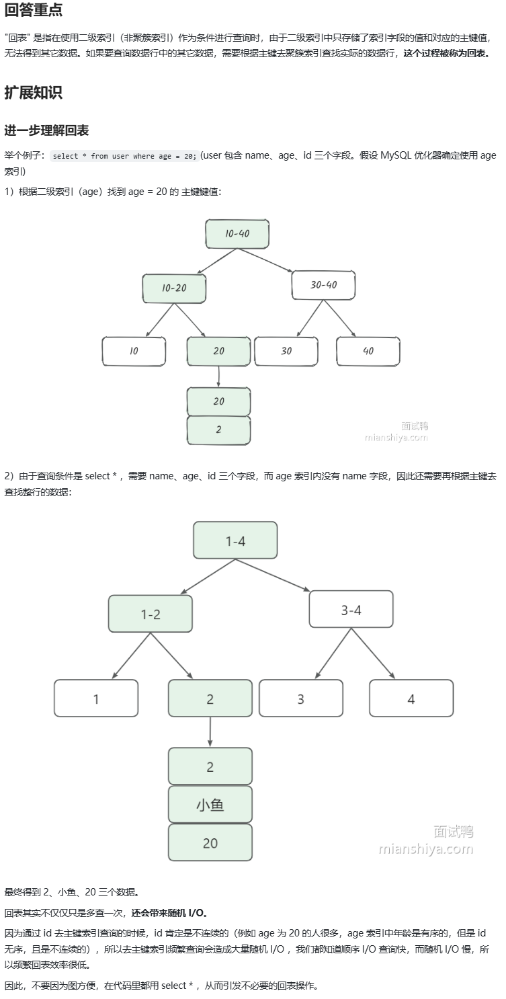

#### Day3. mySql相关

1. MySQL 中的回表是什么？

   

   回表即是在使用二级索引，也就是非聚簇索引作为条件进行查询的时，无法直接获取数据条目而是只获取了索引字段的值和对应的主键值，需要根据主键去聚簇索引查找实际的数据条目这一整个过程。

2. MySQL 中使用索引一定有效吗？如何排查索引效果？

   

3. 在 MySQL 中建索引时需要注意哪些事项？

