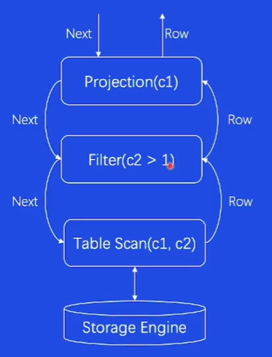

## 关系型数据库相关

#### 1. 核心技术

##### 1.1 SQL引擎

###### SQL执行逻辑

###### SQL引擎解析器——Parser

一般分为词法分析，语法分析，语义分析。

###### SQL引擎优化器——Optimizer

基于规则的优化`RBO`: 比如化简sql语句的查询条件，对查询表的连接顺序优化，对使用索引的选取。

基于代价的优化`CBO`: 根据耗时，IO，CPU，网络，内存等代价，选择代价最低的方案执行。

###### SQL引擎执行器——Executor

火山模型，每个Operator访问下层Operator，逐层向下调用。

向量化计算模型，与火山模型区别在于每个Operator一次访问多条数据。 

编译执行模型，将SQL语句编译成可执行程序，减少函数调用开销。

##### 1.2 存储引擎

MySQL举例：InnoDB

内存部分：数据缓存，日志缓存
磁盘部分：系统表（元数据存放），普通表，Undo表，Redo日志
总的来说，内存中缓存数据，磁盘中存放元数据、普通数据和日志等。

###### 存储引擎——Buffer Pool

LRRU的方式管理内存空间，淘汰不常用的数据

###### 存储引擎——Page

磁盘存储单位

###### 存储引擎——B+Tree

页面中使用二分查找定位到对应的槽，再便利其中的记录

##### 1.3 事务引擎

Atomicity原子性：利用UndoLog实现事务回滚保证原子性。

Isolation隔离性：通过锁实现读写互斥，通过MVCC实现读写并发。

Durability持久性：事务提交前页面写盘；write-ahead logging，事务提交前写入磁盘（redolog）。

#### 2. 企业实践

##### 2.1 大流量问题

问题背景：单节点，单机瓶颈
解决方案：业务数据水平拆分；代理层路由分片；

##### 2.2 流量突增问题

问题背景：流量上涨，集群性能不满足要求
解决方案：扩充DB物理节点；利用影子表进行压测
比如使用binlog进行数据同步，添加服务器，并添加负载均衡。

问题背景：突增流量导致大量建联，导致负载变大延迟上升
解决方案：缓存连接，业务侧、代理侧预热连接池，代理侧支持连接队列

##### 2.3 稳定性可靠性问题

3AZ高可用：三机房部署，读写分离，分库分表，限流，流量调度，实时监控集群运行状态，提前上报集群风险

HA管理：ha监控与应对，下线宕机的服务器
