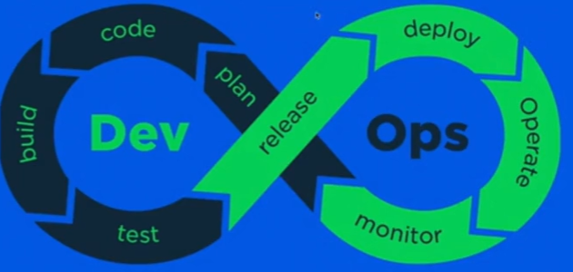

## 后端开发相关

#### 1. 后端开发

##### 1.1 瀑布模型

需求——开发——测试——发布——运维

##### 1.2 敏捷开发

更小的团队，更快地迭代，以人为本和用户沟通

scrum

##### 1.3 SAFe（The Scaled Agile Framework）

管理框架，多个scrum team相互配合

##### 1.4 CNCF

云原生

#### 2. 后端开发阶段

##### 2.1 需求阶段

MVP思想——最小可行性产品

##### 2.2 开发阶段

云原生，容器化，微服务，分支策略，代码规范

##### 2.3 测试阶段

功能、集成、回归环境测试

##### 2.4 发布阶段

蛮力发布，金丝雀发布（滚动发布，每个实例通过金丝雀的方式逐步放大流量，丝滑），蓝绿发布（新老版本不兼容的情况）

##### 2.5 运维阶段

服务监控

#### 3. 流程优化

需求到上线的自动化流程

##### 3.1 DevOps

代码管理，自动化测试，持续集成，持续交付

##### 3.2 全流程自动化

需求发起研发流程、写代码测试环境部署流程，测试出发和报告分析流程，发布流程自动化

减少无意义等待，让有价值的流程时间占比上升（效率竖井）