## 后端架构相关

#### 1. 什么是架构

##### 1.1 理解 

从发展的角度理解架构：
首先是**单体架构**，我的理解是一人可用兼任多职；往后发展一些，就发展出了**垂直应用架构**，也就是把任务以应用单元的方式做了一个细分；加下来是**SOA架构**，将应用的不同功能单元抽象为服务，并在服务之间定义了一种标准化的沟通方式，也就是以服务为中心，降低纵深使服务划分更加清晰；最后是**微服务架构**，将SOA去中心化，服务之间有着更自由的通信方式，拆分地更加细微。

用蛋糕店的例子理解一下，就是这张图：

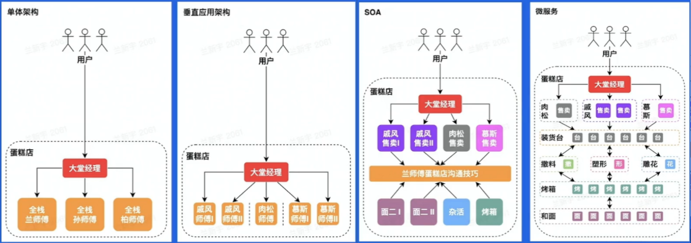

#### 2. 企业级架构理解

##### 2.1 云计算

通过软件自动化管理，提供计算资源的服务网络。(基础：虚拟化技术，编排方案)

架构：
`IaaS`(Infrastructure as a Service)
`PaaS`(Platform as a Service)
`SaaS`(Software as a Service)
`FaaS`(Function as a Service)

##### 2.2 云原生

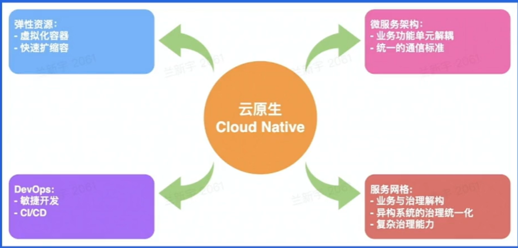

为组织在公有云、自由云、混合云等新型动态环境中，构建和运行可弹性拓展的应用提供可能

###### 弹性计算资源类型

`服务资源调度`（资源量级维度）：微服务、大体量服务（使用量较高，时间较长）
`计算资源调度`：在线资源、离线资源（如数据分析）
`消息队列`：在线队列（削峰、解耦）、离线队列（大数据分析）

###### 弹性存储资源类型

`经典存储`：对象存储、大数据存储
`关系型数据库`：具有强关系属性的数据存储
`元数据`：服务发现
`NoSQL`：缓存、分布式事务等

###### DevOps

结合自动化流程，提高软件的开发、交付效率

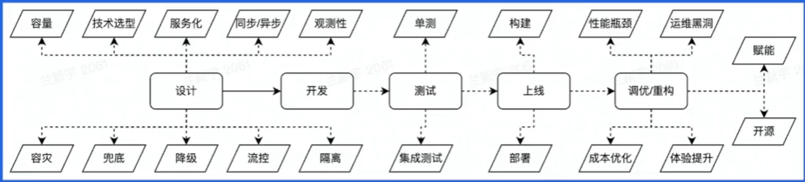

###### 微服务架构

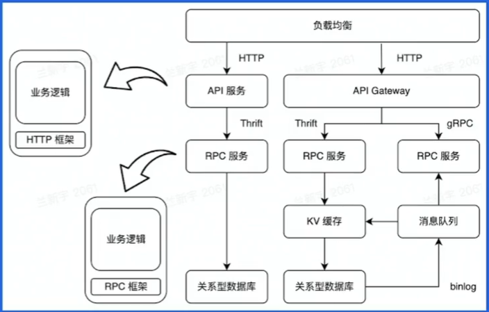

入口—— 负载均衡层（分流） —— API/网关 —— RPC服务 —— 业务逻辑 —— 中间件等 —— 数据存储

###### 服务网格(Service Mesh)

微服务间通讯中间层，高性能网络代理，业务代码与治理解耦

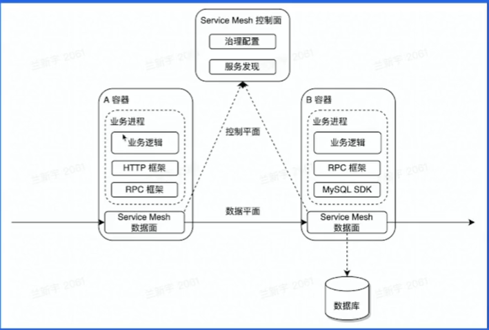

相对于RPC/HTTP框架，异构系统治理统一化，与业务进程解耦，生命周期易管理。

#### 3. 企业级后端架构挑战

##### 3.1 降低资源成本

`离在线资源并池`：由于在线业务IO密集型为主，且有潮汐性和实时性；离线任务则计算密集型占多数，有非实时性。

因此，将两者资源进行并池，可以降低资源成本。

用cgroup或虚拟化方式使离在线业务对cpu核心做隔离，实现cpu资源的隔离。

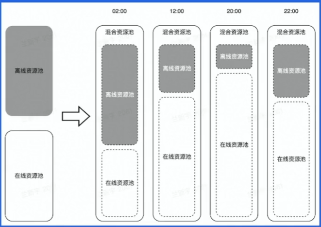

##### 3.2 降低业务成本

`自动扩缩容`：利用在线业务潮汐性自动扩缩容。

可将cpu或内存指标作为扩缩容的依据。

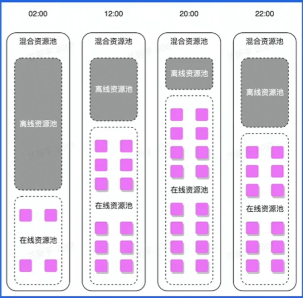

##### 3.3 降低业务成本提高服务可用性

`微服务亲和性部署`：将满足亲和性条件的容器调度到一台宿主机上；微服务中间件与服务网格通过共享内存通信；微服务网格控制面实施灵活动态的流量调度。

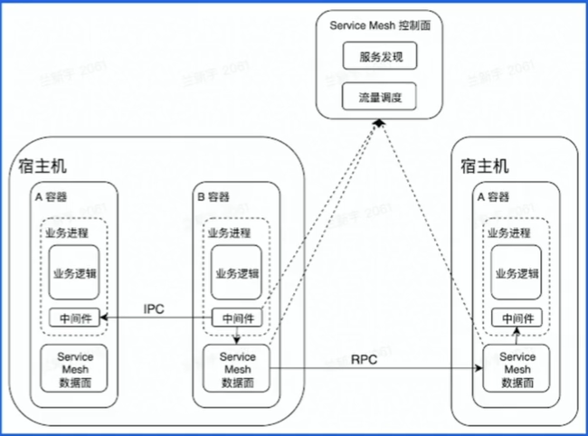

##### 3.4 提高调用容错性，容灾，提高开发效率

`流量治理`：基于微服务中间件、微服务网格的流量治理——熔断、重试、单元化、复杂环境的流量调度

##### 3.5 打平异构环境算例差异，为扩缩容提供正向输入

`CPU水位负载均衡`：IaaS提供资源探针；服务网格动态负载均衡

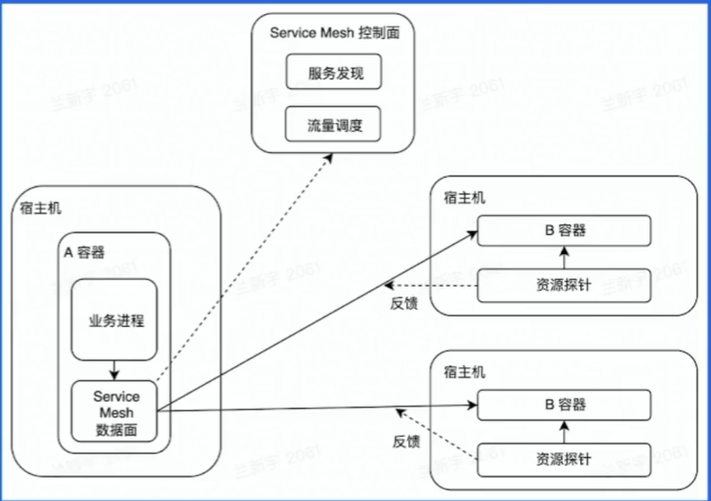

#### 4. 实践

自适应动态权重

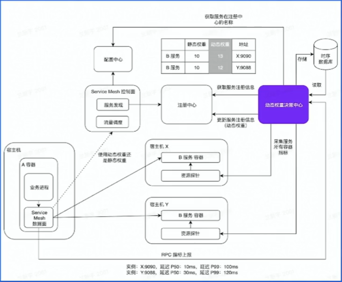

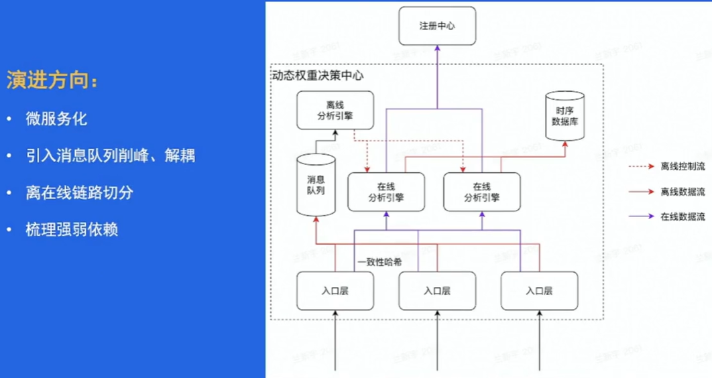