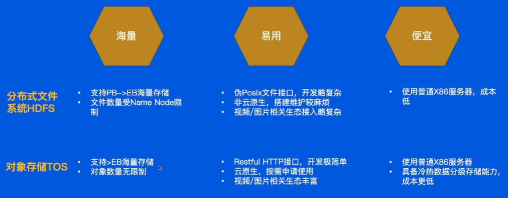
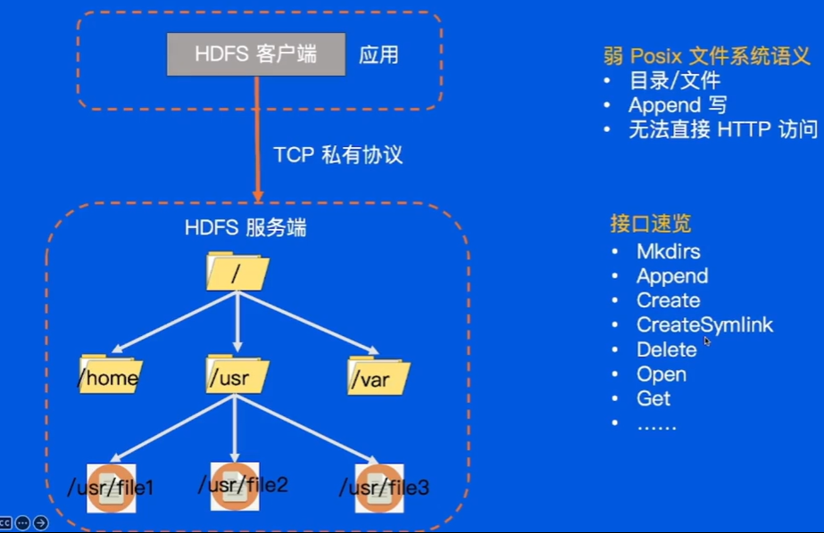
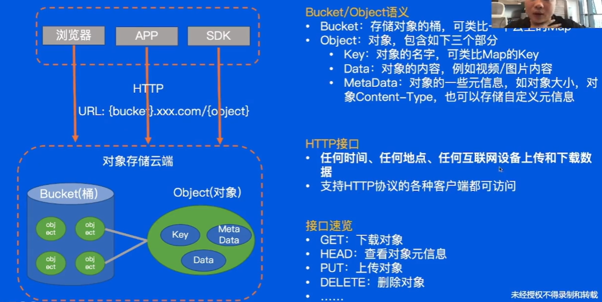
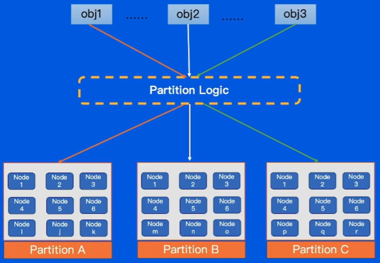
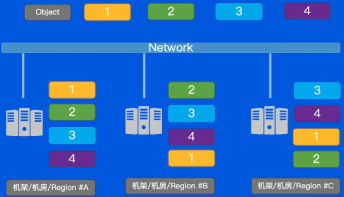
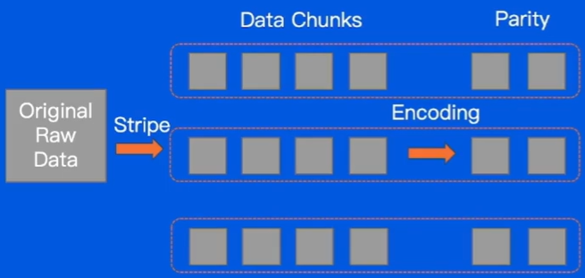
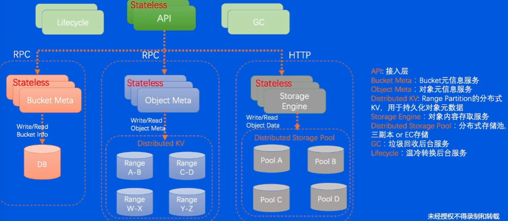

## 对象存储相关

#### 1. 分布式存储

##### 1.1 分布式文件系统HDFS

##### 1.2 对象存储TOS

#### 2. 应用场景下的tos

##### 可扩展性解法Partition

不同数据映射至不同的partion，数据量增加则新增partition

##### 持久度解法Replication

数据复制多个副本，多机架机房region，实现高持久度且多个副本均可提供服务。

##### 成本解法EC——Erasure Coding

##### TOSS对象存储架构

##### 如何做到高可用

集群拆分，减小爆炸半径，同步服务数据等。