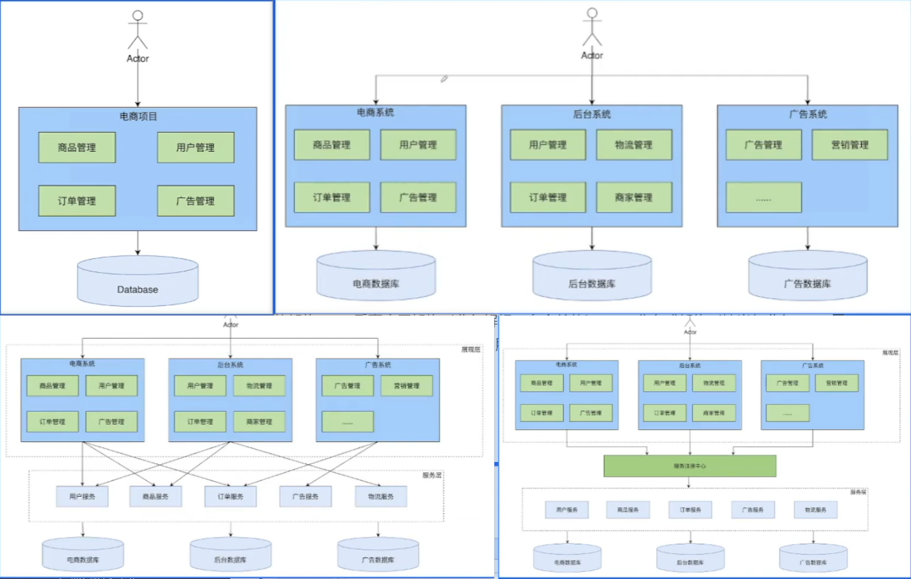
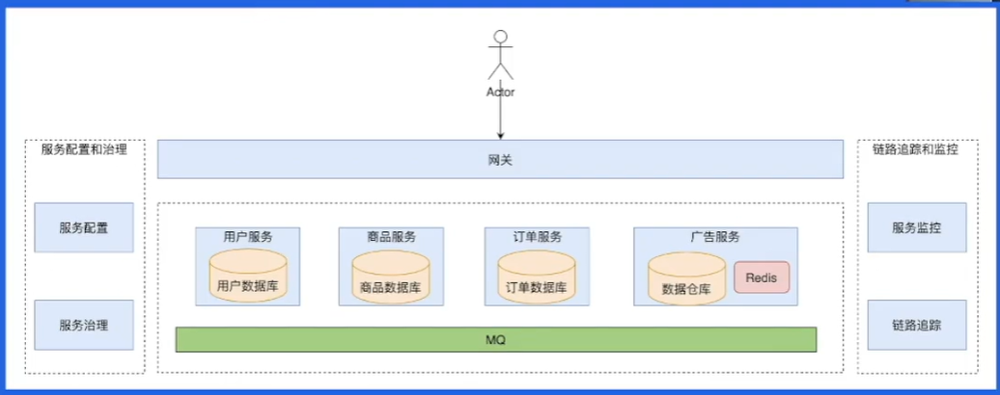
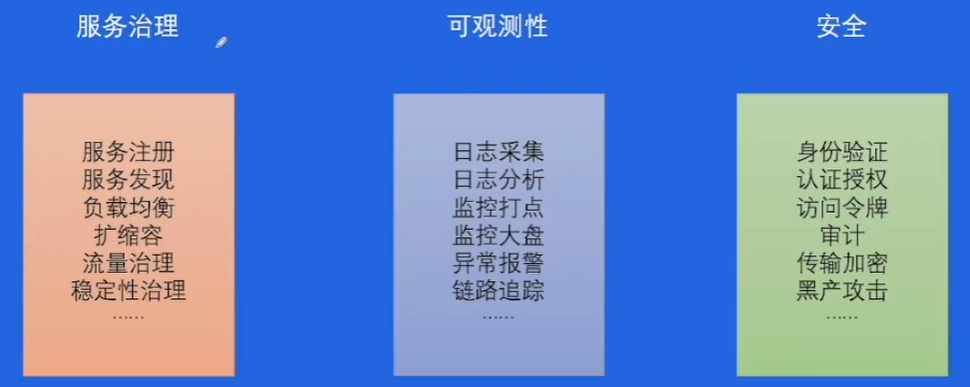
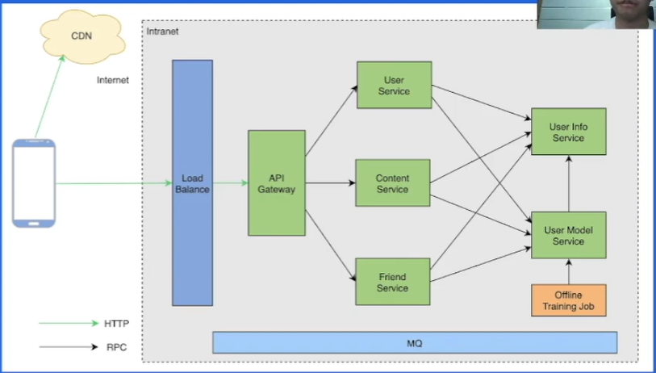
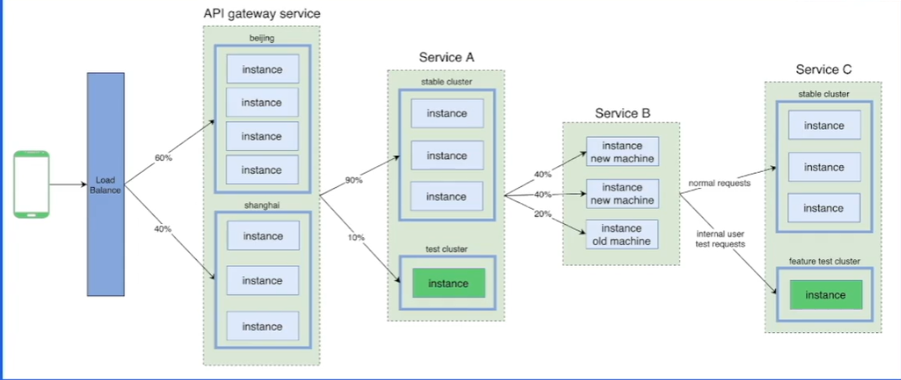
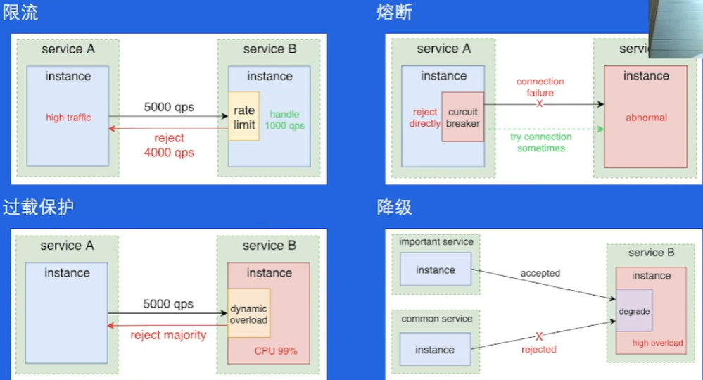

## 微服务相关

#### 1. 微服务架构背景与介绍

##### 1.1 系统架构演变历史

单体架构 —— 垂直应用架构（业务解耦，多个单体） —— 分布式架构（抽出与业务无关的服务层）—— SOA架构（面向服务，有服务中心）—— 微服务架构（自下而上，彻底地服务化）

单体/垂直/分布式/SOA示意图

##### 1.2 微服务架构概览

核心要素：服务治理，可观测性，安全性

#### 2. 微服务架构概念

##### 2.1 基本概念

服务 service：一组具有相同逻辑的运行实体
实例 instance：一个服务中，每个运行实体即为一个实例；一个实例通常对应一个或多个进程。（承载形式：进程，k8s pod，VM）
集群 cluster：通常指服务内部的逻辑划分，包含多个实例。
有状态/无状态服务：服务的实例是否存储了可持久化的数据。

##### 2.2 服务注册及发现

注册中心：用于存储服务名到服务实例的映射

服务实例上线与下线过程：
下线：删除注册中心记录——流量减少逐渐消失——删除实例
上线：启动实例——健康检查——添加注册中心记录——流量恢复

##### 2.3 流量特征

流量进入——负载均衡——gateWay——（RPC）内部服务

#### 3. 微服务核心服务治理功能

##### 3.1 服务发布

一个服务升级运行新的代码的过程

`蓝绿部署`：备份一份服务，升级时切换流量

`灰度发布（金丝雀发布）`：先发布一小部分实例，观察其运行情况，再逐步扩大范围。

##### 3.2 流量治理

基于地区、集群、实例、请求等维度，堆端对端流量的路由路径进行控制。

##### 3.3 负载均衡（Load Balance）

分配请求在每个上下游实例的分布

策略：RoundRobin，Random，Ring Hash，Least Request

##### 3.4 稳定性治理

#### 4. 应用场景服务治理

防止链路重试（链路放大，重试风暴问题）

Hedged requests —— 对可能超时的请求，重新向另一个下游实例发送一个相同的请求，并等待先到达的响应