## 消息队列相关

#### 1. 消息队列概念

##### 1.1 业界消息队列对比

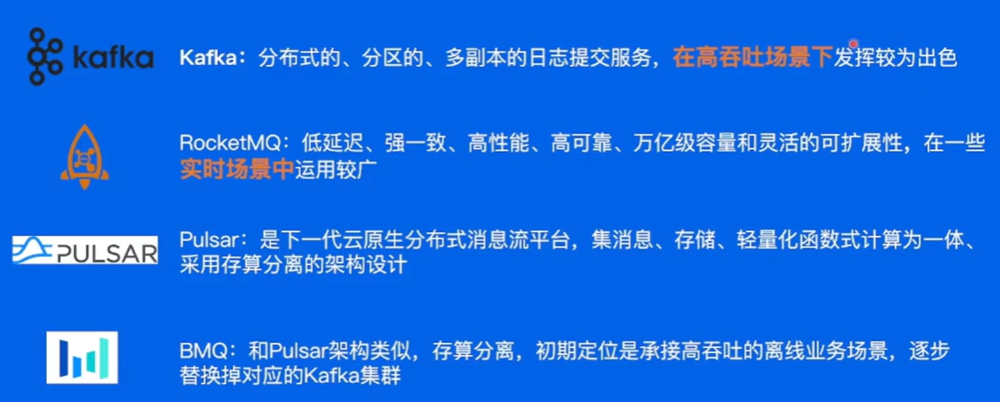

##### 1.2 使用场景

离线消息处理 —— 日志信息，Metrics数据（程序状态采集），用户行为

#### 2. 消息队列产品介绍

##### 2.1 Kafka

###### 基本概念

`分区`：每个`Topic`中有多个分区`partition`，`offset`记录消息位置
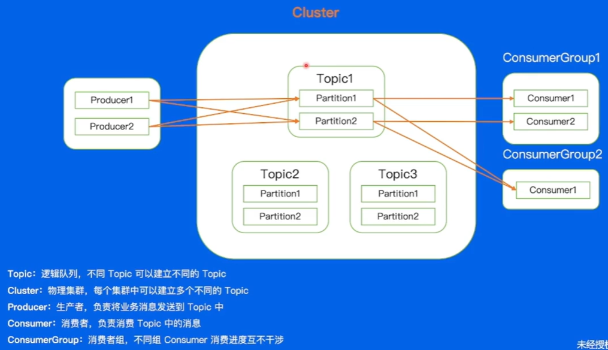

`副本`：每个分区有多个`Replica`，有`leader`和`follower`之分。正常的写入和消费都是从leader中进行，follower定时从leader中同步数据；ISR为同步副本集合，若follewer与leader差距过大则会被剔除。
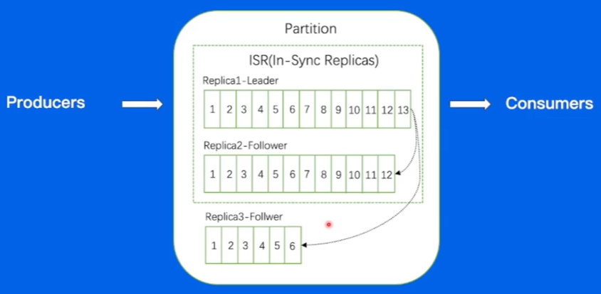

`broker`：kafka集群中的节点，用于管理多个Topic的partition
`controller`：kafka集群中协调分布式操作的核心组件
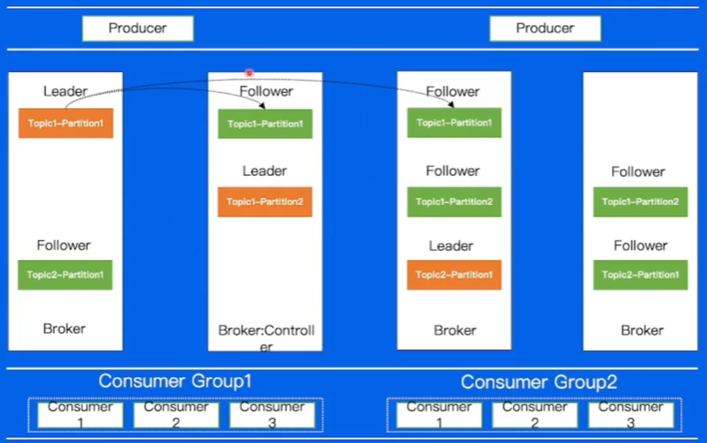

`架构`:zookeeper用于管理集群元数据
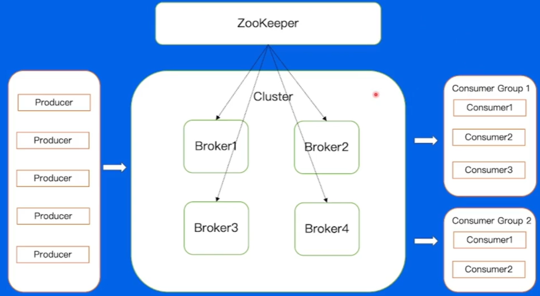

`数据压缩`：数据以批量形式发送到broker，通过压缩减小消息大小（Snappy，Gzip，LZ4，ZSTD压缩算法）

`消息文件结构`:每个partition对应一个log文件，文件中包含多个segment，每个segment包含index文件、data文件和timeindex文件
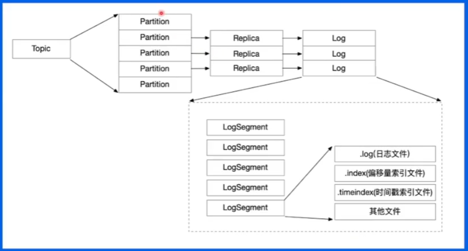

`broker`
`写入`：由于磁头寻道成本较高，因此通过顺序写的方式，减少寻道带来的时间成本。
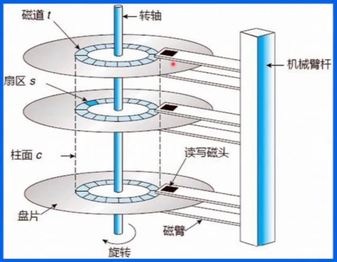
`读取`：通过二分查找的方式，找到segment，再通过二分查找的方式找到offset对应的消息，再通过offset找到recordBatch中的消息内容。若根据时间戳，则通过timeindex文件找到offset。
`数据内存拷贝`：零拷贝——数据从磁盘空间读到内核态后，不用复制到应用空间，而直接将数据发送到网卡并发送给consumer。

`consumer`：
Consumer与partion的分配问题：
`手动分配`Low Level（无法容灾）；
`自动分配`High Level
**step1**：第一轮请求，Consumer向负载最低的broker请求，并获取自己的协调者broker；
**step2**：第二轮请求，Consumer告诉协调者broker，要求加入Group，协调者从所有请求的consumer中选取一个leader，并告知他们已加入以及是否为leader。
**step3**：第三轮请求，Consumer发送SyncGroup请求表示准备好接受分区分配，协调者发送给非leader自己负责的分区信息，给leader完整的分区列表，rebalance过程完成；
**step4**：Consumer一段间隔内给协调者broker发送心跳，若长时间没有心跳则剔除，重新走rebalance完成

###### 问题总结

问题1：运维问题——无论是任何的运维操作，只要涉及节点的变动必然会带来数据复制的高额时间成本。

问题2：partition数据迁移过程也会带来高额的IO负载，导致broker负载不均衡。

问题3：没有自己的缓存完全依赖PageCache

问题4：Controller和Coordinator 与 Broker在同一进程中，大量IO会造成其性能下降。

##### 2.2 BMQ

与kafka相比，添加了独立的controller，coordinator，分布式存储系统（存算分离），元数据存储系统（替换zookeeper），添加了Proxy Cluster（类似于数据库读写分离）
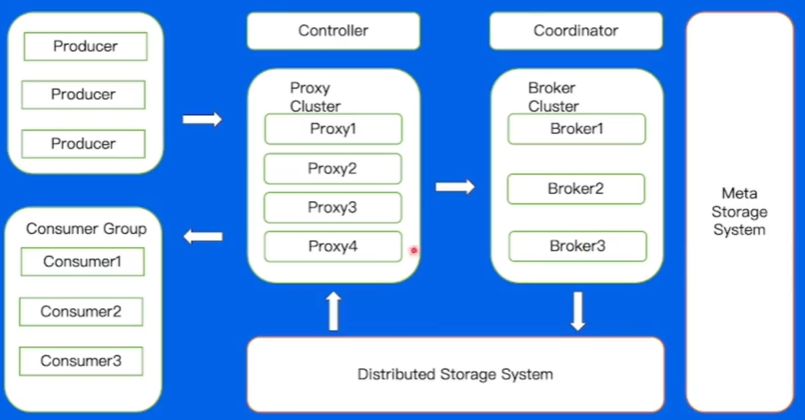

###### 文件结构

底层为hdfs，为负载均衡，每个partition的segement会随机均匀分配在dataNode集群中
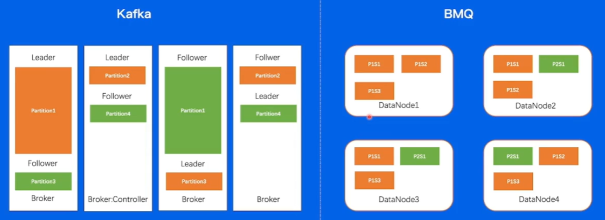

###### Broker-Partition状态机

保证任意分片在同一时刻只能在一个Broker上存活。用于防止脑裂。
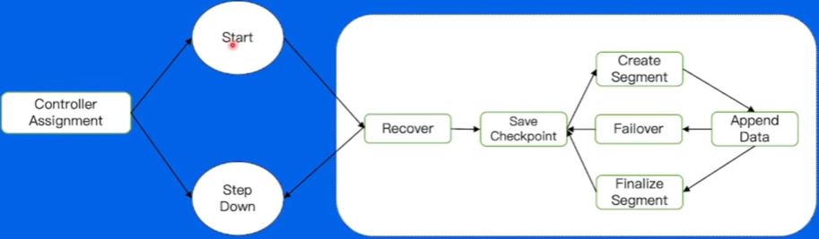

`recover`: 1由于hdfs中一个文件只有一个进程可以写入，recover机制相当于向hdfs获取一个锁让它能够操作partition。2若broker发生宕机等问题，需要recover机制将真实数据与原数据保持一致(`checkpoint`)，再写入hdfs。
`failover`: 发生错误时，保证高可用的机制

###### Broker-写文件流程

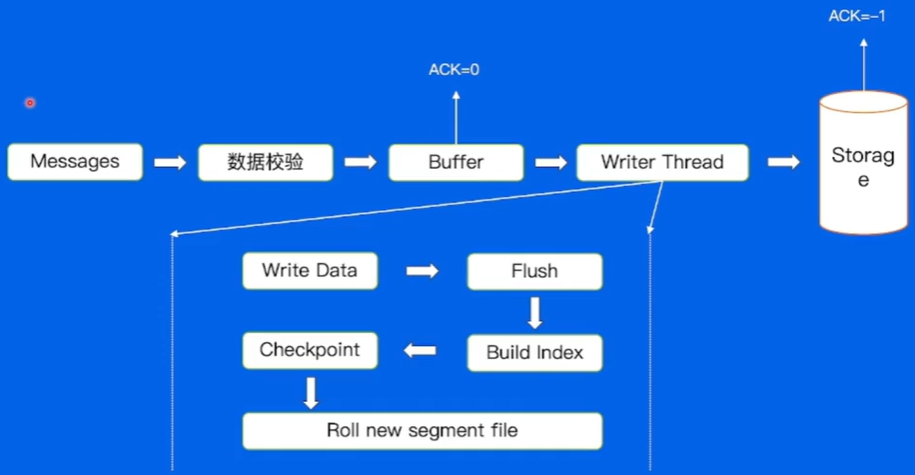

`数据校验`：CRC校验数据，检验参数是否合法。
`writer thread`：异步写入storage。`writeData`写入数据，`Flush`配置每隔一段时间，将数据写入磁盘中，`BuildIndex`建立索引(offset，timestamp等)，`Checkpoint`告诉系统数据已写入，`new segment file`论滚到一定大小后再写入新的segment文件。
`ACK`：消息确认机制。ACK=0写入内存成功后直接返回成功，实现高吞吐；ACK=-1写入磁盘成功后返回成功，实现高可靠。

###### Broker-Failover

DataNode节点挂了，就重新寻找可用的dataNode并重新写入。

###### Proxy

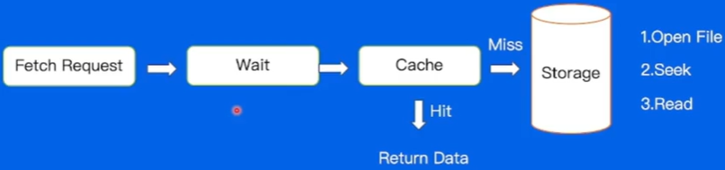

`wait`：若consumer请求频繁会导致服务端负载过高，通过设置等待时间和数据量的配置，实现一个等待的效果，降低IO压力。
`cache`：减少内存IO压力，提高吞吐量。

###### 多机房部署

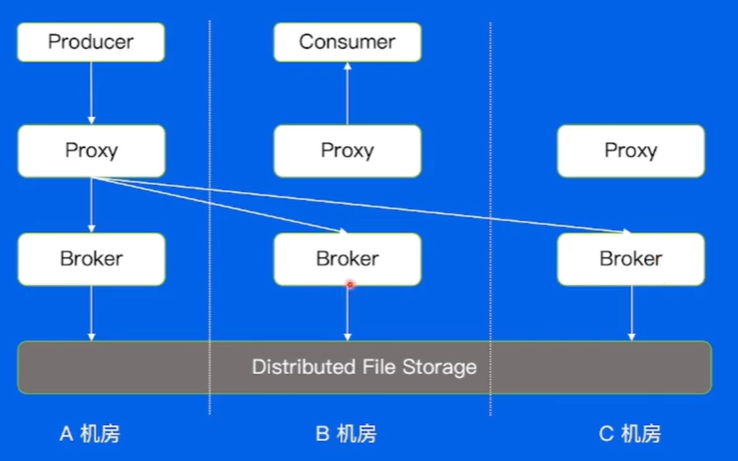
总的来说，Broker是有状态的，因此存在跨机房访问的问题。

###### 高级特性

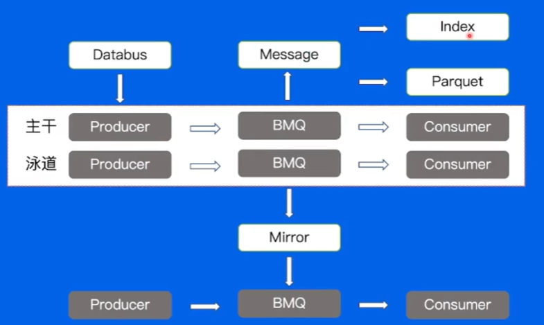

`泳道消息`：一种消息分组的策略，通过对消息的业务属性（类型、优先级、来源等）进行分类，实现更高效的处理和管理。
`DataBus`：简化消息队列客户端复杂度，解耦业务与topic，缓解集群压力提高吞吐。
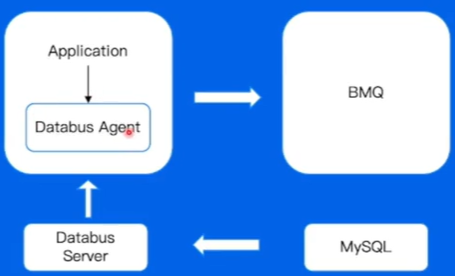

`Mirror`：使用mirror通过最终一致（先写入本地，再通过异步机制传播到其他节点）的方式，解决跨region的读写问题。
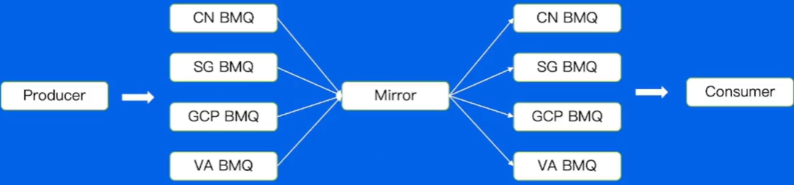

`Index`：类似于数据库查询，多维度查询消息数据
`Parquet`：一种列式存储引擎，可以高效存储和查询大规模数据集，便于大数据分析组件的使用。

##### 2.3 RocketMQ

###### 使用场景

低延迟场景，针对电商业务线，业务涉及广泛如注册，订单，库存，物流等；同时也涉及许多业务峰值时刻，如秒杀活动，周年庆，定期特惠等。

###### 与Kafka对比
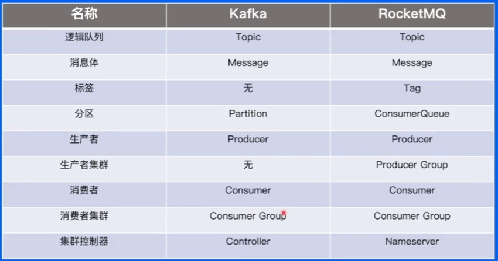

###### 基本架构
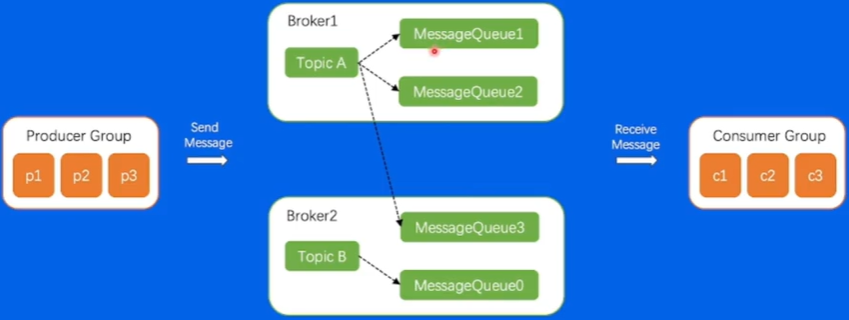

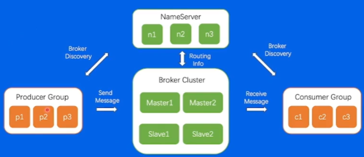

###### 存储模型
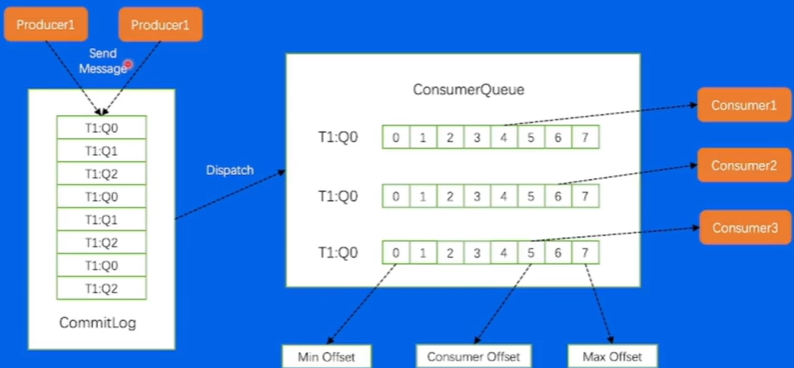

###### 高级特性
`事务场景`：最终一致性，保证消息的可靠性。其中核心是事务的提交和回查，以及服务端的回查机制（两阶段提交机制）。
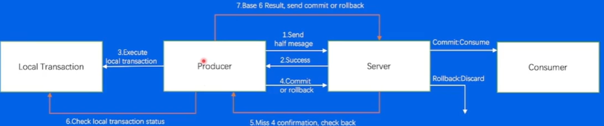

`延迟发送`：ScheduleTopic，ScheduleMessage延迟服务，通过延迟队列实现延迟发送。
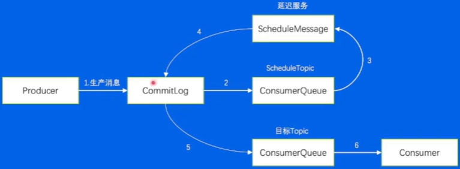

`消息重试`：RetryTopic重试队列。若超过重试次数则将消息送入死信队列，人工介入分析错误消息。
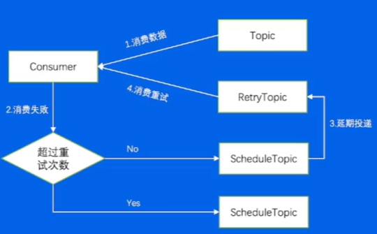