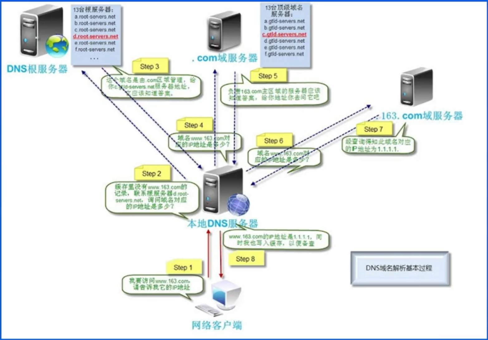
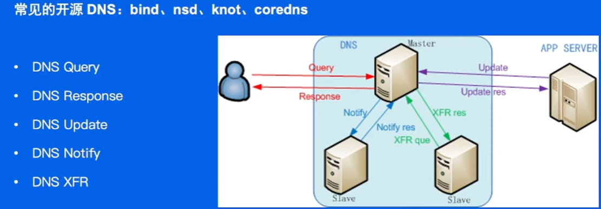
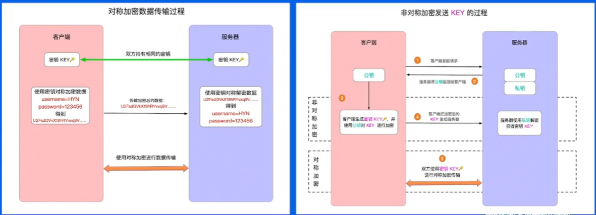
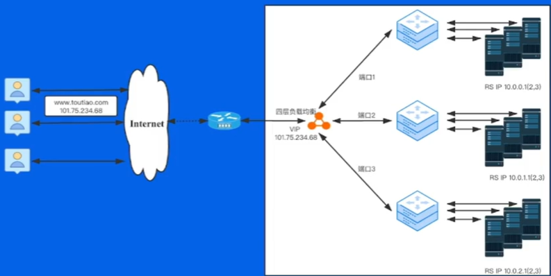
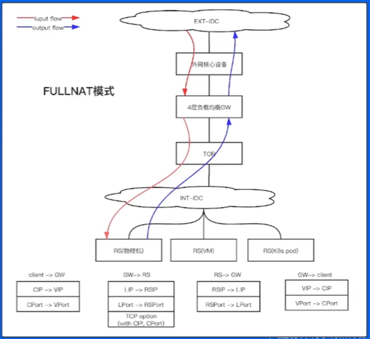
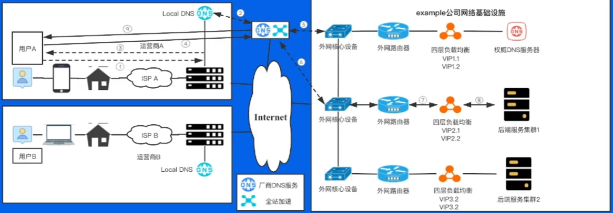
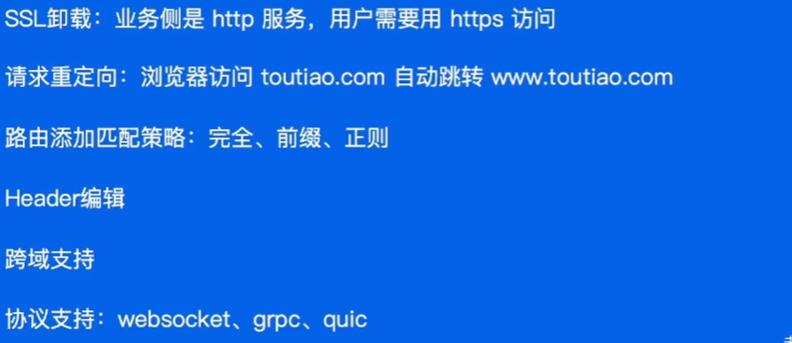
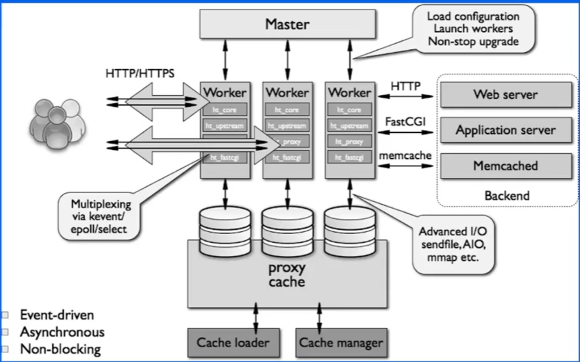

## 网络接入相关

#### 1. 域名系统

##### DNS查询过程

 

##### 权威DNS系统架构

 

#### 2. 接入HTTPS协议

##### 对称加密和非对称加密

##### SSL通信过程
##### 证书链

#### 3. 接入全站加速

#### 4. 四层负载均衡

基于IP+端口，利用某种算法将报文转发给某个后端服务器，实现负载均衡地落到后端服务器上。

##### 常见调度算法与原理

RR轮询、加权RR轮询、最小连接、五元组hash、一致性hash

##### 使用特点

大部分通过dpdk技术实现；纯用户态协议栈；无缓存零拷贝，打野内存；

##### 四层负载均衡网络架构

#### 5. 七层负载均衡

面对七层负载均衡的特殊配置要求

##### nginx

事件驱动模型