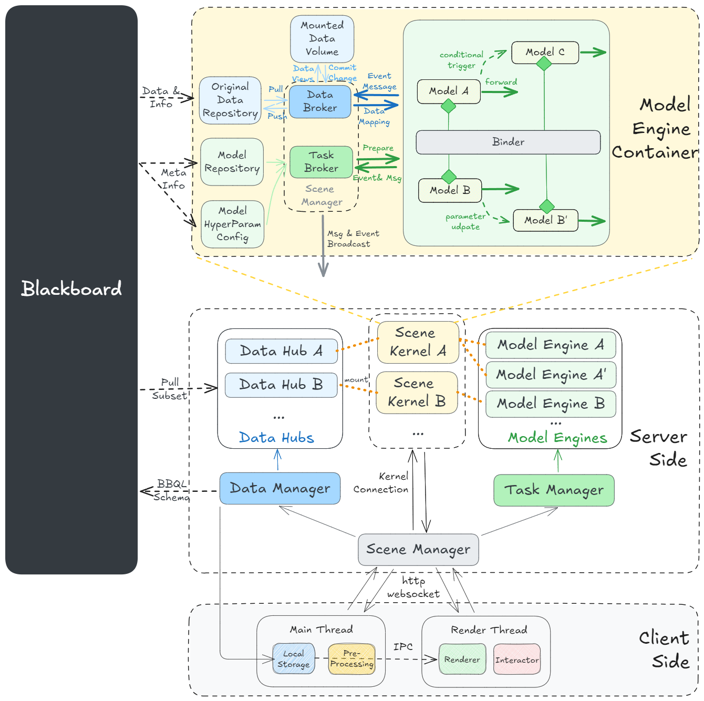
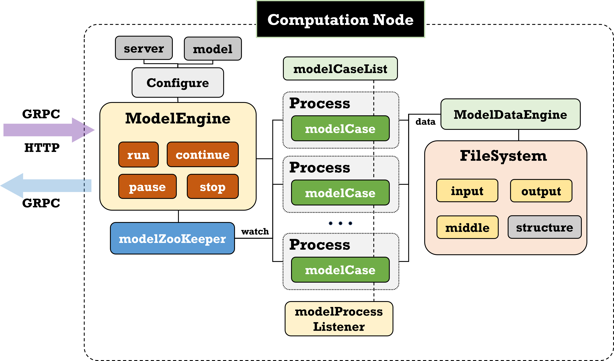
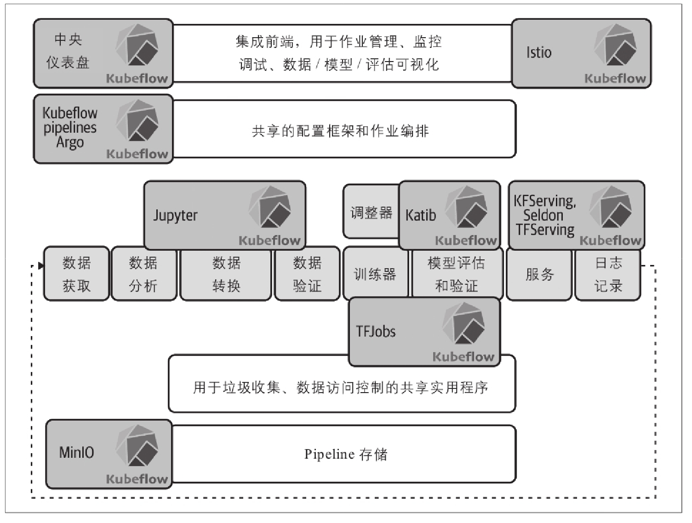

## 模型引擎架构设计(golang 版)

最近接了个导师的活儿，要我们设计开发一个地理模型的耦合平台。

起因是导师接的一个香港环保署的项目，要把好几个输入输出奇奇怪怪的水文模型耦合起来，包括城市洪涝的，城市管网的等等，再把结果一步步渲染在前端。这几个模型都是step by step那种，执行也需要gpu的参与。

饼画的不大不小，要支持地理模型的松紧耦合，要让每个模型都有自己的耦合点可以人为干预往里塞参数和改参数，理想状态是能做成一个通用的大系统，让不同的专家学者在上面注册模型，他们的应用系统就可以挂在这个大系统下运行。组里几个做后端的朋友做了个初步的架构设计，也就是下图了：

核心就是有一个中央的云数据中心，也就是blackboard，所有的数据、模型、耦合节点资源等都以条目的形式部署在数据中心。在模型需要运行时就启动一个模型引擎，从上面把数据拉下来跑，算完再把结果push上去，目前的设想是整个系统部署在集群中，用NFS和数据库共享文件。

我分配到了**模型计算引擎**这个模块，因为go对线程控制调度的优势，也想趁此机会练习一下，我毅然决然选择了这个语言。现在，就在头疼这个架构设计的事情了。之前设计了个单模型引擎的架构是这样的：

但之前的设计只是个单模型运行的demo，没有模型集成也没有数据的交互。在做了个简单的调研，市面上这种类似的产品不多，我也只查到了一些工作流的工具有类似的功能，比如`kubeflow`。

kubeflow里有
**Kubeflow dashboard**：一个聚合了集群内各种工具和服务的用户界面。
**Kubeflow notebook**：类似于jupyter的ide式交互式环境。
**Kubeflow Pipelines**：可编排并自动执行数据预处理、模型训练、评估和部署的端到端流程，并有SDK可以允许用户自定义执行工作流。
**Kubeflow Training Operator**：模型训练工具。
**Kubeflow Serving**：将模型部署成服务使用。
**Kubeflow Metadata**：跟踪管理模型实验运行等元数据。

